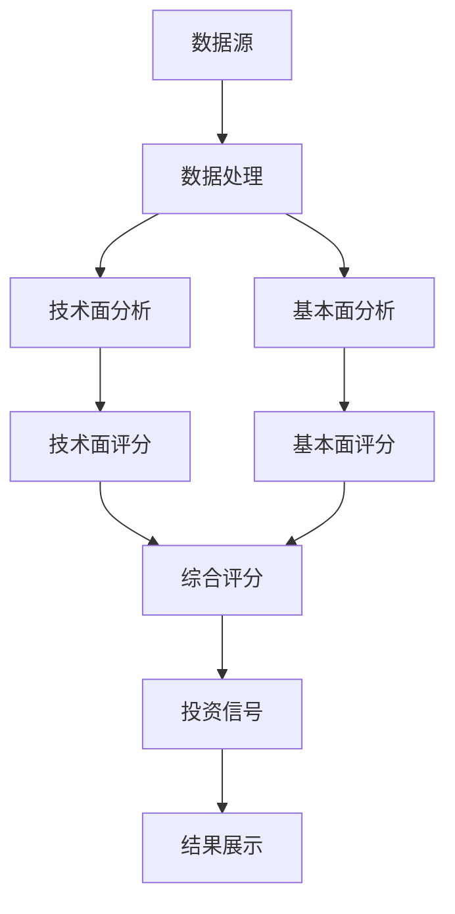

                 


# 威廉·欧奈尔的技术面与基本面结合策略

> 关键词：技术面分析，基本面分析，投资策略，量化分析，投资组合管理

> 摘要：本文详细探讨了威廉·欧奈尔的技术面与基本面结合策略，从技术面分析的基本原理、核心概念、算法实现，到基本面分析的财务指标、估值方法、行业分析，再到两者结合的策略框架、量化模型、系统架构，最后通过项目实战、最佳实践等部分，全面解读了这一策略的理论基础和实践应用。

---

# 第一部分: 技术面与基本面分析概述

## 第1章:抽样分析概述

### 1.1抽样分析的基本概念

#### 1.1.1 技术面分析的定义

技术面分析是一种通过分析金融资产的历史价格走势，预测未来价格变化的投资方法。它主要依赖于价格和成交量等技术指标，帮助投资者识别市场趋势和买卖信号。

$$
\text{技术面分析的核心假设是：价格反映了一切信息。}
$$

---

#### 1.1.2 技术面分析的核心要素

- **价格（Price）**：价格走势是技术面分析的核心，包括开盘价、收盘价、最高价和最低价。
- **成交量（Volume）**：成交量反映了市场的交易活跃度，是验证价格趋势强度的重要指标。
- **时间（Time）**：技术面分析通常关注短期、中期和长期的时间周期。
- **趋势（Trend）**：趋势是价格走势的主要方向，包括上升趋势、下降趋势和盘整趋势。

---

#### 1.1.3 技术面分析的分类

1. **趋势分析**：通过移动平均线、趋势线等工具识别价格趋势。
2. **形态分析**：通过价格形态（如头肩顶、双底等）预测价格走势。
3. **指标分析**：使用RSI、MACD等技术指标辅助决策。

---

### 1.2 技术面分析的基本原理

#### 1.2.1 技术面分析的假设

1. **价格反映一切信息**：市场已经反映了所有已知的信息，包括基本面和市场情绪。
2. **价格走势具有延续性**：价格趋势一旦形成，往往会延续一段时间。
3. **历史重复**：价格走势往往会在相似的形态下重复出现。

---

#### 1.2.2 技术面分析的主要方法

- **图表分析**：通过K线图、线形图等工具观察价格走势。
- **指标分析**：使用RSI、MACD等指标辅助判断超买超卖、趋势强度等。
- **形态分析**：识别价格形态，预测价格反转或突破。

---

#### 1.2.3 技术面分析的优势与局限性

**优势**：
- 及时性：技术面分析可以快速捕捉市场情绪变化。
- 客观性：技术指标和图表分析相对客观。

**局限性**：
- 忽略基本面因素：技术面分析无法反映公司的基本面信息。
- 易受市场操纵影响：短期价格波动可能受操纵影响。

---

### 1.3 技术面分析与基本面分析的结合

#### 1.3.1 两种分析方法的对比

| **对比维度** | **技术面分析** | **基本面分析** |
|--------------|-----------------|----------------|
| 分析内容     | 价格走势、成交量 | 公司财务、行业前景 |
| 分析周期     | 短期、中期       | 长期             |
| 适用场景     | 短期交易         | 长期投资         |

---

#### 1.3.2 两种分析方法的结合意义

- **互补性**：技术面分析提供短期市场信号，基本面分析提供长期投资依据。
- **准确性**：结合两种分析方法，可以提高投资决策的准确性和稳定性。

---

#### 1.3.3 两种分析方法的结合策略

1. **技术面筛选**：通过技术面分析筛选出具有潜在上涨趋势的资产。
2. **基本面验证**：对筛选出的资产进行基本面分析，确认其具有良好的财务状况和行业前景。
3. **组合投资**：根据技术面和基本面的综合评估，构建投资组合，并动态调整。

---

## 第2章: 技术面分析的核心概念

### 2.1 技术面分析的核心要素

#### 2.1.1 K线图的构成

K线图由开盘价、收盘价、最高价和最低价组成，反映了市场的供需关系。

$$
\text{收盘价 > 开盘价：阳线；收盘价 < 开盘价：阴线。}
$$

---

#### 2.1.2 技术指标的分类

1. **动量指标**：如RSI、MACD。
2. **波动性指标**：如布林带。
3. **成交量指标**：如OBV。

---

#### 2.1.3 趋势线与支撑阻力

- **趋势线**：用于识别价格的主要趋势。
- **支撑线**：价格下跌时的支撑位。
- **阻力线**：价格上涨时的阻力位。

---

### 2.2 技术面分析的数学模型

#### 2.2.1 移动平均线的计算公式

$$
\text{SMA}(n) = \frac{\sum_{i=1}^{n} P_i}{n}
$$

其中，$P_i$ 是第 $i$ 个交易日的价格，$n$ 是计算周期。

---

#### 2.2.2 相对强弱指数(RSI)的计算公式

$$
\text{RSI}(n) = \frac{100}{1 + \text{SMA}(n, \text{上涨幅度}) / \text{SMA}(n, \text{下跌幅度})}
$$

---

#### 2.2.3 布林带的计算公式

$$
\text{中轨} = \text{SMA}(n)
$$
$$
\text{上轨} = \text{中轨} + \text{标准差}(n) \times \text{系数}
$$
$$
\text{下轨} = \text{中轨} - \text{标准差}(n) \times \text{系数}
$$

---

### 2.3 技术面分析的算法实现

#### 2.3.1 常见技术指标的Python实现

```python
import pandas as pd
import numpy as np

def calculate_sma(prices, n):
    return prices.rolling(n).mean()

def calculate_rsi(prices, n=14):
    delta = prices.diff()
    up = delta.where(delta > 0, 0)
    down = delta.where(delta < 0, 0)
    avg_up = up.rolling(n).mean()
    avg_down = down.rolling(n).mean()
    rsi = 100 * (avg_up / (avg_up + avg_down))
    return rsi
```

---

## 第3章: 基本面分析的核心概念

### 3.1 基本面分析的定义

基本面分析是通过分析公司的财务状况、行业前景和宏观经济环境等因素，评估资产的内在价值。

---

#### 3.1.1 基本面分析的原理

$$
\text{内在价值 = 资产的实际价值，不依赖于市场价格。}
$$

---

#### 3.1.2 基本面分析的主要指标

1. **市盈率（PE）**：市盈率 = 股价 / 每股收益。
2. **市净率（PB）**：市净率 = 股价 / 每股净资产。
3. **股息率**：股息率 = 每股股息 / 股价。

---

#### 3.1.3 基本面分析的分类

1. **公司基本面**：包括财务报表分析、管理层能力等。
2. **行业基本面**：包括行业发展趋势、竞争格局等。
3. **宏观经济基本面**：包括GDP增长率、利率、通货膨胀等。

---

### 3.2 基本面分析的数学模型

#### 3.2.1 市盈率(PE)的计算公式

$$
\text{PE} = \frac{\text{股价}}{\text{每股收益}}
$$

---

#### 3.2.2 市净率(PB)的计算公式

$$
\text{PB} = \frac{\text{股价}}{\text{每股净资产}}
$$

---

#### 3.2.3 股息率的计算公式

$$
\text{股息率} = \frac{\text{每股股息}}{\text{股价}} \times 100\%
$$

---

### 3.3 基本面分析的算法实现

#### 3.3.1 基本面指标的Python实现

```python
import pandas as pd

def calculate_pe(stock_prices, earnings_per_share):
    return stock_prices / earnings_per_share

def calculate_pb(stock_prices, book_value_per_share):
    return stock_prices / book_value_per_share
```

---

## 第4章: 技术面与基本面结合的策略

### 4.1 技术面与基本面结合的理论基础

#### 4.1.1 技术面与基本面结合的必要性

技术面分析提供短期市场信号，基本面分析提供长期投资依据，两者结合可以互补优势。

---

#### 4.1.2 技术面与基本面结合的可行性

通过量化分析，可以将技术面和基本面指标结合起来，构建多因子投资模型。

---

#### 4.1.3 技术面与基本面结合的策略框架

1. **筛选标的**：通过技术面分析筛选出具有潜在上涨趋势的资产。
2. **基本面验证**：对筛选出的资产进行基本面分析，确认其具有良好的财务状况和行业前景。
3. **组合投资**：根据技术面和基本面的综合评估，构建投资组合，并动态调整。

---

### 4.2 技术面与基本面结合的实践方法

#### 4.2.1

$$
\text{综合评分} = 0.5 \times \text{技术面评分} + 0.5 \times \text{基本面评分}
$$

---

## 第5章: 技术面与基本面结合的算法实现

### 5.1 技术面与基本面结合的量化分析

#### 5.1.1 综合评分模型

$$
\text{综合评分} = \alpha \times \text{技术面评分} + \beta \times \text{基本面评分}
$$

其中，$\alpha$ 和 $\beta$ 是权重系数，可以根据实际需求调整。

---

#### 5.1.2 技术面与基本面结合的Python实现

```python
import pandas as pd

def calculate_technical_score(prices, n=14):
    # 计算RSI
    delta = prices.diff()
    up = delta.where(delta > 0, 0)
    down = delta.where(delta < 0, 0)
    avg_up = up.rolling(n).mean()
    avg_down = down.rolling(n).mean()
    rsi = 100 * (avg_up / (avg_up + avg_down))
    
    # 计算移动平均线
    sma = prices.rolling(n).mean()
    
    # 综合技术面评分
    technical_score = (rsi + sma) / 2
    return technical_score

def calculate_fundamental_score(stock_prices, pe, pb):
    # 计算综合基本面评分
    fundamental_score = (pe + pb) / 2
    return fundamental_score

def combine_technical_and_fundamental(stock_prices, pe, pb, n=14):
    technical_score = calculate_technical_score(stock_prices, n)
    fundamental_score = calculate_fundamental_score(stock_prices, pe, pb)
    
    # 综合评分
    combined_score = (technical_score + fundamental_score) / 2
    return combined_score
```

---

## 第6章: 系统架构与项目实战

### 6.1 系统架构设计

#### 6.1.1 系统功能设计

- **数据获取**：获取股票价格、财务数据等。
- **指标计算**：计算技术面和基本面指标。
- **策略执行**：根据综合评分模型生成投资信号。
- **结果展示**：展示分析结果和投资建议。

---

#### 6.1.2 系统架构图



---

## 第7章: 项目实战

### 7.1 环境安装

- **Python**：安装Python 3.x
- **库的安装**：安装pandas、numpy、matplotlib等库。

---

### 7.2 核心实现

#### 7.2.1 技术面指标计算

```python
import pandas as pd
import numpy as np

def calculate_technical_indicators(prices):
    # 计算移动平均线
    sma_50 = prices.rolling(50).mean()
    # 计算RSI
    delta = prices.diff()
    up = delta.where(delta > 0, 0)
    down = delta.where(delta < 0, 0)
    avg_up = up.rolling(14).mean()
    avg_down = down.rolling(14).mean()
    rsi = 100 * (avg_up / (avg_up + avg_down))
    return pd.DataFrame({
        'SMA_50': sma_50,
        'RSI_14': rsi
    })
```

---

## 第8章: 最佳实践与总结

### 8.1 最佳实践

- **纪律性**：严格按照策略执行，避免情绪化交易。
- **持续学习**：关注市场变化，不断优化策略。

---

### 8.2 小结

技术面与基本面结合策略通过量化分析，将技术面和基本面指标结合起来，能够有效捕捉市场机会，控制投资风险。

---

### 8.3 注意事项

- **数据质量**：确保数据来源可靠，避免数据偏差。
- **模型优化**：根据市场变化，不断优化策略模型。

---

### 8.4 拓展阅读

- 《投资学》：了解更多投资理论。
- 《Python金融数据分析》：掌握更多金融数据分析方法。

---

# 作者

作者：AI天才研究院/AI Genius Institute & 禅与计算机程序设计艺术 /Zen And The Art of Computer Programming

