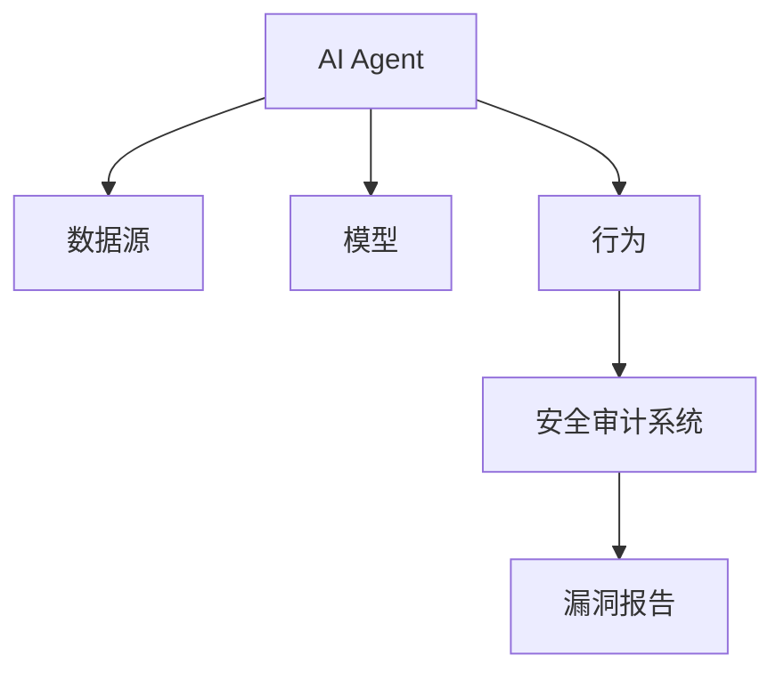
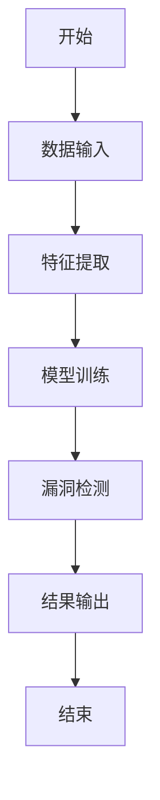
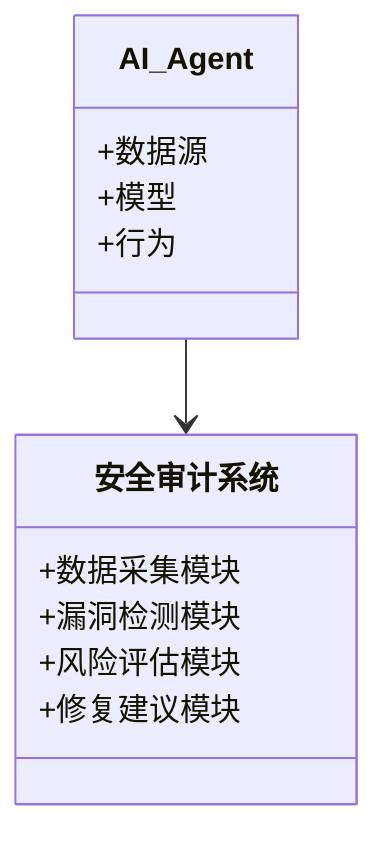
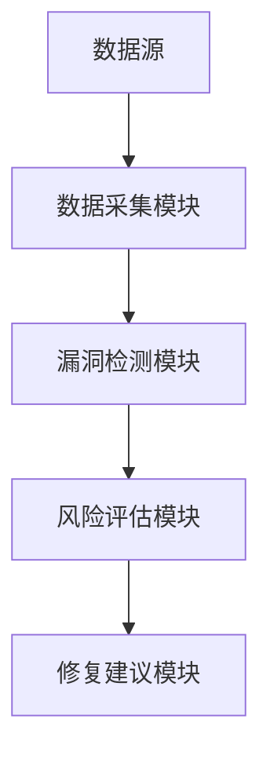
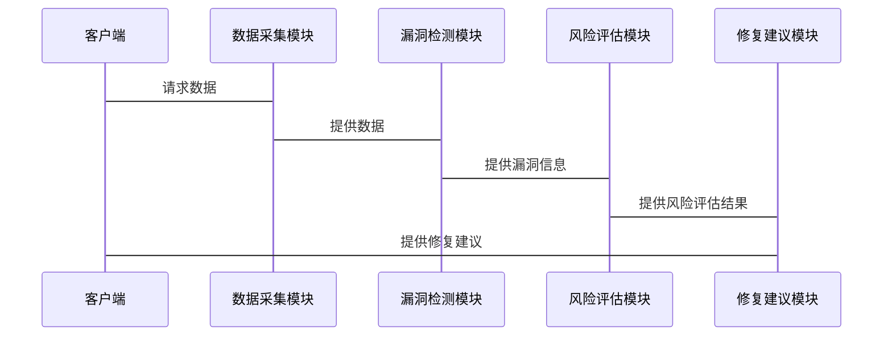

                 


# 安全审计：定期检查AI Agent的安全漏洞

## 关键词：AI Agent, 安全审计, 安全漏洞, 定期检查, 系统安全, 风险管理, 技术实现

## 摘要：  
随着人工智能技术的快速发展，AI Agent（智能代理）在各个领域的应用越来越广泛。然而，AI Agent的安全性问题也随之凸显，例如数据泄露、模型被攻击、滥用等。为了确保AI Agent的安全性和可靠性，定期进行安全审计至关重要。本文从AI Agent的基本概念出发，详细分析了安全审计的核心概念、算法原理、系统架构设计、项目实战案例，并提供了最佳实践和注意事项。通过本文的阐述，读者可以全面了解如何定期检查AI Agent的安全漏洞，从而保障系统的安全性和稳定性。

---

## 第一部分: AI Agent安全审计概述

### 第1章: AI Agent安全审计的背景与意义

#### 1.1 AI Agent的基本概念
##### 1.1.1 AI Agent的定义与特点
AI Agent（智能代理）是指能够感知环境、自主决策并执行任务的智能实体。其特点包括：  
1. **自主性**：能够在没有外部干预的情况下自主运行。  
2. **反应性**：能够实时感知环境并做出相应的反应。  
3. **目标导向性**：所有行为均以实现特定目标为导向。  
4. **学习能力**：通过数据和经验不断优化自身性能。  

##### 1.1.2 AI Agent在实际应用中的重要性  
AI Agent广泛应用于自动驾驶、智能客服、推荐系统、医疗诊断等领域。例如，在自动驾驶中，AI Agent需要实时处理传感器数据并做出驾驶决策；在智能客服中，AI Agent需要理解用户需求并提供解决方案。  

##### 1.1.3 AI Agent的安全性问题  
AI Agent的安全性问题主要体现在以下方面：  
1. **数据泄露**：AI Agent可能因数据处理不当而导致敏感信息泄露。  
2. **模型攻击**：攻击者可能通过投毒数据或攻击模型来破坏AI Agent的行为。  
3. **滥用风险**：AI Agent可能被恶意利用，例如用于诈骗或传播虚假信息。  

#### 1.2 安全审计的基本概念
##### 1.2.1 安全审计的定义与作用  
安全审计是指通过系统化的检查和评估，发现、分析和修复系统中的安全漏洞，确保系统的安全性、合规性和稳定性。其作用包括：  
1. **漏洞发现**：识别系统中的潜在安全漏洞。  
2. **风险评估**：评估漏洞可能导致的安全风险。  
3. **问题修复**：提供漏洞修复的建议和方法。  

##### 1.2.2 安全审计在AI Agent中的必要性  
AI Agent作为复杂的智能系统，其安全审计尤为重要。首先，AI Agent的决策依赖于数据和模型，数据泄露或模型被攻击可能导致严重后果；其次，AI Agent的自主性和目标导向性使其成为攻击者的潜在目标；最后，定期安全审计是确保AI Agent长期安全运行的基础。  

##### 1.2.3 安全审计的范围与边界  
AI Agent的安全审计范围包括：  
1. **数据层**：检查数据的来源、存储和传输是否安全。  
2. **模型层**：评估模型的鲁棒性，防止模型被攻击。  
3. **行为层**：监控AI Agent的行为是否符合预期目标。  
4. **系统层**：检查系统的整体架构是否安全。  

#### 1.3 定期安全审计的背景与意义
##### 1.3.1 AI Agent安全风险的动态变化  
随着AI技术的不断进步和应用场景的扩展，AI Agent面临的安全风险也在不断变化。例如，新的攻击手段层出不穷，数据隐私保护要求也在提高。  

##### 1.3.2 定期安全审计的必要性  
定期安全审计可以确保AI Agent的安全性始终符合当前的安全标准和需求。通过定期审计，可以及时发现新出现的安全漏洞，并采取相应的防护措施。  

##### 1.3.3 安全审计对AI Agent可持续发展的保障作用  
安全审计不仅是对当前系统的检查，更是对系统未来发展的保障。通过定期审计，可以发现潜在的安全隐患，提前采取措施，避免因安全问题导致的系统崩溃或声誉损失。  

---

## 第二部分: AI Agent安全审计的核心概念与联系

### 第2章: AI Agent与安全审计的关系

#### 2.1 AI Agent的安全漏洞分析
##### 2.1.1 数据层漏洞  
数据层漏洞主要表现为数据泄露、数据篡改等问题。例如，AI Agent在处理用户数据时，可能因加密不足而导致数据被窃取。  

##### 2.1.2 模型层漏洞  
模型层漏洞主要表现为模型被攻击、模型鲁棒性不足等问题。例如，攻击者可以通过精心设计的输入数据来干扰AI Agent的决策过程。  

##### 2.1.3 行为层漏洞  
行为层漏洞主要表现为AI Agent的行为偏离预期目标。例如，AI Agent可能因训练数据偏差而做出歧视性决策。  

#### 2.2 安全审计对AI Agent行为的监控与评估
##### 2.2.1 数据层安全审计  
数据层安全审计包括数据来源的合法性、数据存储的加密性、数据传输的完整性等方面的检查。  

##### 2.2.2 模型层安全审计  
模型层安全审计包括模型的鲁棒性测试、模型的可解释性评估、模型的抗攻击能力测试等。  

##### 2.2.3 行为层安全审计  
行为层安全审计包括对AI Agent行为的实时监控、行为日志的分析、行为偏离的预警等。  

#### 2.3 AI Agent安全审计的系统架构
##### 2.3.1 系统架构设计  
AI Agent安全审计的系统架构通常包括以下几个部分：  
1. **数据采集模块**：负责采集AI Agent的相关数据。  
2. **漏洞检测模块**：负责检测数据和模型中的安全漏洞。  
3. **风险评估模块**：负责评估漏洞可能导致的安全风险。  
4. **修复建议模块**：负责提供漏洞修复的建议。  

##### 2.3.2 实体关系图


---

## 第三部分: AI Agent安全审计的算法原理

### 第3章: AI Agent安全审计的算法原理

#### 3.1 漏洞检测算法
##### 3.1.1 算法流程图


##### 3.1.2 算法实现代码
```python
def detect_vulnerability(data):
    # 特征提取
    features = extract_features(data)
    
    # 模型训练
    model = train_model(features)
    
    # 漏洞检测
    vulnerabilities = model.predict(features)
    
    return vulnerabilities
```

##### 3.1.3 数学模型与公式
漏洞检测算法可以基于概率模型，例如：
$$ P(\text{漏洞存在}) = \frac{\text{攻击特征出现的次数}}{\text{总样本数}} $$

---

## 第四部分: AI Agent安全审计的系统架构设计

### 第4章: AI Agent安全审计的系统架构

#### 4.1 问题场景介绍
AI Agent在运行过程中可能面临多种安全威胁，例如数据泄露、模型攻击等。为了应对这些威胁，需要设计一个完善的系统架构来实现安全审计。

#### 4.2 系统功能设计
##### 4.2.1 功能模块划分
1. **数据采集模块**：负责采集AI Agent的相关数据。  
2. **漏洞检测模块**：负责检测数据和模型中的安全漏洞。  
3. **风险评估模块**：负责评估漏洞可能导致的安全风险。  
4. **修复建议模块**：负责提供漏洞修复的建议。  

##### 4.2.2 领域模型


#### 4.3 系统架构设计
##### 4.3.1 系统架构图


##### 4.3.2 系统接口设计
1. **数据采集接口**：定义数据采集的格式和协议。  
2. **漏洞检测接口**：定义漏洞检测的输入和输出。  
3. **风险评估接口**：定义风险评估的输入和输出。  

##### 4.3.3 系统交互图


---

## 第五部分: AI Agent安全审计的项目实战

### 第5章: AI Agent安全审计的项目实战

#### 5.1 环境安装
##### 5.1.1 安装Python环境
```bash
python --version
pip install --upgrade pip
```

##### 5.1.2 安装依赖库
```bash
pip install numpy pandas scikit-learn
```

#### 5.2 系统核心实现源代码
##### 5.2.1 数据采集模块
```python
import pandas as pd

def collect_data():
    # 从数据库中采集数据
    data = pd.read_sql('SELECT * FROM user_data', 'sqlite://')
    return data
```

##### 5.2.2 漏洞检测模块
```python
from sklearn import svm

def detect_vulnerability(data):
    # 特征提取
    features = data[['age', 'income', 'gender']]
    # 模型训练
    model = svm.SVC()
    model.fit(features, data['label'])
    # 检测漏洞
    vulnerabilities = model.predict(features)
    return vulnerabilities
```

##### 5.2.3 风险评估模块
```python
import numpy as np

def assess_risk(vulnerabilities):
    # 风险评分
    risk_scores = np.mean(vulnerabilities)
    return risk_scores
```

##### 5.2.4 修复建议模块
```python
def provide_recommendations(vulnerabilities):
    # 提供修复建议
    recommendations = []
    for v in vulnerabilities:
        if v == 1:
            recommendations.append("修复数据层漏洞")
        else:
            recommendations.append("修复模型层漏洞")
    return recommendations
```

#### 5.3 案例分析
##### 5.3.1 案例背景
假设我们有一个AI Agent用于智能客服，我们需要对其进行全面的安全审计。  

##### 5.3.2 数据采集与处理
```python
data = collect_data()
print(data.head())
```

##### 5.3.3 漏洞检测与修复
vulnerabilities = detect_vulnerability(data)
print(vulnerabilities)

recommendations = provide_recommendations(vulnerabilities)
print(recommendations)
```

#### 5.4 代码应用解读与分析
通过上述代码，我们可以实现AI Agent的安全审计功能。数据采集模块负责采集数据，漏洞检测模块负责检测漏洞，风险评估模块负责评估风险，修复建议模块负责提供修复建议。  

---

## 第六部分: 最佳实践与总结

### 第6章: 最佳实践

#### 6.1 小结
通过本文的阐述，我们可以看到，定期检查AI Agent的安全漏洞是保障系统安全性的关键。通过安全审计，可以及时发现并修复潜在的安全问题，从而避免因安全漏洞导致的严重后果。

#### 6.2 注意事项
1. **定期审计**：建议每季度进行一次全面的安全审计。  
2. **数据保护**：确保数据的保密性、完整性和可用性。  
3. **模型优化**：定期更新模型，提高模型的鲁棒性和可解释性。  

#### 6.3 拓展阅读
1. 《人工智能安全：AI系统的风险管理与防护》  
2. 《数据隐私保护：从理论到实践》  
3. 《系统安全工程：基于AI的安全审计方法》  

---

## 作者：AI天才研究院/AI Genius Institute & 禅与计算机程序设计艺术/Zen And The Art of Computer Programming

