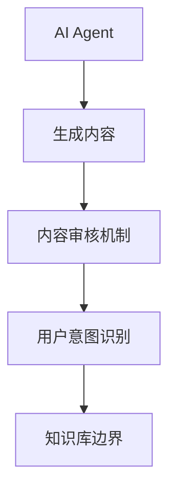

                 


# 防止AI Agent产生有害内容的安全性考虑

> 关键词：AI Agent, 有害内容, 安全性考虑, 内容审核, 生成式AI, 伦理安全

> 摘要：随着生成式AI技术的快速发展，AI Agent在各个领域的应用越来越广泛。然而，AI Agent生成的内容也可能带来恶意攻击、误导性信息和隐私泄露等安全问题。本文将从AI Agent的核心机制、有害内容的类型、安全性评估指标与方法、内容审核算法的实现、系统架构设计、项目实战、安全性保障策略以及未来展望等多方面展开深入探讨，分析如何防止AI Agent生成有害内容，并提出具体的解决方案。

---

## 第一部分: AI Agent与有害内容的背景与核心概念

### 第1章: AI Agent与有害内容的背景介绍

#### 1.1 问题背景与定义
- 1.1.1 AI Agent的定义与核心功能  
  AI Agent是一种智能体，能够通过环境信息进行感知、推理和决策，执行特定任务。  
- 1.1.2 有害内容的定义与分类  
  有害内容包括恶意攻击、误导性信息、隐私泄露等，可能对用户和社会造成负面影响。  
- 1.1.3 安全性考虑的重要性  
  确保AI Agent生成的内容安全可靠，是技术应用的前提条件。

#### 1.2 AI Agent的生成机制
- 1.2.1 基于大语言模型的生成原理  
  Transformer模型通过自注意力机制，生成与上下文相关的文本。  
- 1.2.2 生成式AI的潜在风险  
  模型可能生成有害内容，如虚假信息或攻击性言论。  
- 1.2.3 有害内容的典型案例分析  
  分析社交媒体上的虚假新闻、网络诈骗等案例。

### 第2章: AI Agent的安全性挑战

#### 2.1 有害内容的类型与影响
- 2.1.1 恶意攻击  
  如网络钓鱼、病毒传播等，通过AI生成的内容进行攻击。  
- 2.1.2 误导性信息  
  如虚假新闻、错误信息，误导用户决策。  
- 2.1.3 隐私泄露  
  AI可能生成包含敏感信息的内容，导致隐私泄露。

#### 2.2 安全性考虑的核心要素
- 2.2.1 内容审核机制  
  通过关键词过滤、语义分析等技术，识别有害内容。  
- 2.2.2 用户意图识别  
  理解用户的真正需求，避免生成不符合预期的内容。  
- 2.2.3 知识库的边界与外延  
  知识库的内容范围需明确，避免生成不准确或有害信息。

---

## 第二部分: AI Agent安全性考虑的核心概念与联系

### 第3章: AI Agent生成机制的原理分析

#### 3.1 生成式AI的核心原理
- 3.1.1 基于Transformer的生成模型  
  Transformer模型通过自注意力机制，生成与输入相关的内容。  
- 3.1.2 概率生成机制  
  基于概率分布生成文本，可能存在不确定性和风险。  
- 3.1.3 梯度下降优化算法  
  使用交叉熵损失函数，优化模型生成高质量文本。

#### 3.2 有害内容生成的数学模型
- 3.2.1 概率生成模型的数学表达  
  使用概率分布模型，如GPT系列模型。  
- 3.2.2 损失函数与优化目标  
  交叉熵损失函数用于衡量生成内容与真实内容的差异。  
- 3.2.3 生成过程的数学推导  
  通过计算自注意力权重，生成文本的每个字符。

### 第4章: AI Agent安全性考虑的核心概念对比

#### 4.1 核心概念属性特征对比
- 4.1.1 对比表格：生成式AI与传统AI的差异  
  | 特性         | 生成式AI         | 传统AI          |  
  |--------------|------------------|-----------------|  
  | 生成内容     | 创新型内容       | 固定规则处理    |  
  | 应用场景     | 文本生成、对话    | 数据处理、分类  |  
- 4.1.2 对比表格：有害内容与无害内容  
  | 类型         | 恶意攻击         | 误导性信息       | 隐私泄露         |  
  |--------------|------------------|-----------------|------------------|  
  | 示例         | 网络钓鱼         | 虚假新闻         | 泄露个人信息       |  

#### 4.2 实体关系图：AI Agent安全性考虑的核心要素


---

## 第三部分: AI Agent安全性考虑的系统分析与架构设计

### 第5章: 系统分析与架构设计方案

#### 5.1 问题场景介绍
- 5.1.1 用户需求  
  用户希望AI Agent生成安全可靠的内容。  
- 5.1.2 系统目标  
  设计一个内容审核机制，确保生成内容无害。

#### 5.2 系统功能设计
- 5.2.1 领域模型设计  
  ```mermaid
  classDiagram
      class AI-Agent {
          - input: string
          - output: string
          - knowledge_base: KnowledgeBase
          - content_audit: ContentAudit
      }
      class KnowledgeBase {
          - data: List<string>
          - update(input): void
      }
      class ContentAudit {
          - audit(input): bool
      }
      AI-Agent --> KnowledgeBase
      AI-Agent --> ContentAudit
  ```

#### 5.3 系统架构设计
- 5.3.1 系统架构图  
  ```mermaid
  graph TD
      A[AI-Agent] --> B[Knowledge Base]
      A --> C[Content Audit]
      C --> D[User Feedback]
  ```

#### 5.4 系统接口设计
- 5.4.1 输入接口  
  ```plaintext
  function generate_content(input: string) -> string
  ```
- 5.4.2 输出接口  
  ```plaintext
  function audit_content(input: string) -> bool
  ```

#### 5.5 系统交互设计
- 5.5.1 交互流程图  
  ```mermaid
  sequenceDiagram
      User -> AI-Agent: 发送输入请求
      AI-Agent -> Knowledge Base: 查询知识库
      AI-Agent -> Content Audit: 审核内容
      AI-Agent -> User: 返回生成内容
  ```

---

## 第四部分: 项目实战与安全性保障策略

### 第6章: 项目实战

#### 6.1 环境安装
- 6.1.1 安装Python环境  
  ```bash
  python --version
  ```
- 6.1.2 安装依赖库  
  ```bash
  pip install transformers torch
  ```

#### 6.2 系统核心实现
- 6.2.1 内容审核模块实现  
  ```python
  def content_audit(text):
      # 关键词过滤
      for keyword in keywords:
          if keyword in text:
              return False
      # 语义分析
      result = semantic_analysis(text)
      return result
  ```

- 6.2.2 用户意图识别模块实现  
  ```python
  def user_intent(input_text):
      # 使用预训练模型进行意图分类
      model = load_model('intent_classifier')
      return model.predict(input_text)
  ```

#### 6.3 代码实现与解读
- 6.3.1 内容审核模块代码  
  ```python
  import re

  def content_audit(text):
      # 关键词过滤
      keywords = ['攻击', '诈骗', '虚假']
      for keyword in keywords:
          if re.search(keyword, text):
              return False
      # 语义分析
      positive_words = ['帮助', '支持']
      count = sum(1 for word in text.split() if word in positive_words)
      if count < len(text.split()) * 0.5:
          return False
      return True
  ```

- 6.3.2 系统整体架构代码  
  ```python
  class AI-Agent:
      def __init__(self):
          self.knowledge_base = KnowledgeBase()
          self.content_audit = ContentAudit()

      def generate_safe_content(self, input_text):
          if self.content_audit.audit(input_text):
              return self.knowledge_base.generate(input_text)
          else:
              return "内容审核未通过"
  ```

#### 6.4 实际案例分析与详细讲解
- 6.4.1 案例一：网络诈骗识别  
  ```plaintext
  输入文本：您中奖了，请点击链接领取奖金。
  内容审核：识别关键词“诈骗”，返回False。
  ```

- 6.4.2 案例二：虚假新闻识别  
  ```plaintext
  输入文本：政府宣布明天起全国放假。
  内容审核：语义分析判断内容真实性，返回False。
  ```

#### 6.5 项目小结
- 6.5.1 项目实现的关键点  
  - 内容审核模块的实现，包括关键词过滤和语义分析。  
  - 用户意图识别模块的设计，提升内容生成的安全性。  
- 6.5.2 项目优化方向  
  - 引入更先进的NLP模型，提升审核精度。  
  - 增强用户反馈机制，优化系统性能。

---

## 第五部分: 最佳实践与未来展望

### 第7章: 最佳实践与注意事项

#### 7.1 最佳实践
- 7.1.1 小结  
  内容审核是AI Agent安全性保障的核心环节。  
- 7.1.2 注意事项  
  - 定期更新知识库，保持审核规则的有效性。  
  - 加强用户教育，提升用户的安全意识。  

#### 7.2 未来展望
- 7.2.1 AI Agent的未来发展趋势  
  更加智能化和个性化，内容生成更贴近人类思维。  
- 7.2.2 安全性考虑的新方向  
  区块链技术在内容审核中的应用，确保审核过程的透明性和不可篡改性。

---

## 作者

作者：AI天才研究院/AI Genius Institute  
 & 禅与计算机程序设计艺术 /Zen And The Art of Computer Programming

