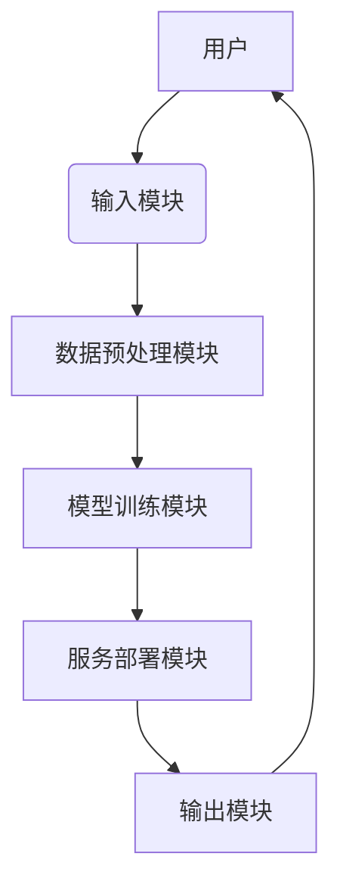

                 


# 定制化AI Agent：满足特定行业需求

---

## 关键词：
定制化AI Agent，人工智能，行业需求，NLP，机器学习，知识图谱，系统架构

---

## 摘要：
随着人工智能技术的快速发展，定制化AI Agent（智能代理）正在成为满足特定行业需求的重要工具。本文将从AI Agent的基本概念出发，详细探讨定制化AI Agent的核心原理、技术基础、系统架构以及实际应用场景。通过分析不同行业的具体需求，本文揭示了定制化AI Agent如何通过自然语言处理、机器学习和知识图谱等技术实现精准服务。同时，本文还结合实际案例，展示了如何设计和实现一个定制化AI Agent系统，并总结了在实际应用中需要注意的关键点和未来发展方向。

---

# 正文

## 第一部分：定制化AI Agent的基本概念与背景

### 第1章：AI Agent的基本概念与背景

#### 1.1 什么是AI Agent
AI Agent（智能代理）是指能够感知环境、自主决策并执行任务的智能系统。它可以理解用户需求、提供解决方案，并通过与环境的交互不断优化自身的行为。

#### 1.2 定制化AI Agent的必要性
传统的AI系统通常基于通用模型，难以满足特定行业的需求。定制化AI Agent能够根据具体场景进行优化，提供更精准的服务，从而在医疗、金融、教育等领域发挥更大的作用。

#### 1.3 定制化AI Agent的应用场景
定制化AI Agent广泛应用于多个行业：
- 医疗：辅助医生进行诊断和治疗方案推荐。
- 金融：提供个性化的投资建议和风险管理。
- 教育：为学生定制学习计划和教学内容。
- 零售：优化客户体验和个性化推荐。

---

## 第2章：定制化AI Agent的核心概念与原理

### 2.1 定制化AI Agent的核心概念
定制化AI Agent通过结合行业知识和用户需求，实现高度个性化的服务。其核心概念包括：
- 数据驱动：利用行业数据进行模型训练，确保服务的准确性。
- 算法适配：选择适合特定场景的算法，优化模型性能。
- 知识图谱：构建行业知识库，支持智能决策。

### 2.2 定制化AI Agent的原理
定制化AI Agent的工作流程包括：
1. 数据采集：收集行业相关数据。
2. 模型训练：基于数据训练定制化模型。
3. 服务部署：将模型部署到实际应用场景中。
4. 持续优化：根据反馈不断优化模型。

---

## 第3章：定制化AI Agent的技术基础

### 3.1 自然语言处理（NLP）
NLP技术是定制化AI Agent的核心，用于理解用户的意图和生成自然的回复。常用的NLP技术包括：
- 词袋模型（Bag-of-Words）
- 词嵌入（Word Embedding）
- 智能对话系统（如基于Transformer的模型）

### 3.2 机器学习算法
定制化AI Agent通常使用监督学习、无监督学习和强化学习等算法。例如：
- 监督学习：用于分类任务。
- 无监督学习：用于聚类分析。
- 强化学习：用于优化决策过程。

### 3.3 知识图谱构建
知识图谱是定制化AI Agent的重要支持，用于存储和管理行业知识。构建知识图谱的过程包括：
1. 数据清洗：去除噪声数据。
2. 实体识别：提取关键实体。
3. 关系抽取：建立实体之间的关系。
4. 知识融合：整合多源数据。

---

## 第4章：定制化AI Agent的系统架构与实现

### 4.1 系统架构设计
以下是定制化AI Agent的系统架构设计：



### 4.2 系统功能设计
系统功能包括：
- 数据采集与处理
- 模型训练与优化
- 服务部署与管理
- 用户交互与反馈

### 4.3 实现案例：医疗领域

#### 4.3.1 数据预处理
```python
import pandas as pd

# 加载数据
data = pd.read_csv('medical_data.csv')

# 清洗数据
data.dropna(inplace=True)
data = data[~data['age'].isnull()]
```

#### 4.3.2 模型训练
```python
from sklearn.model

