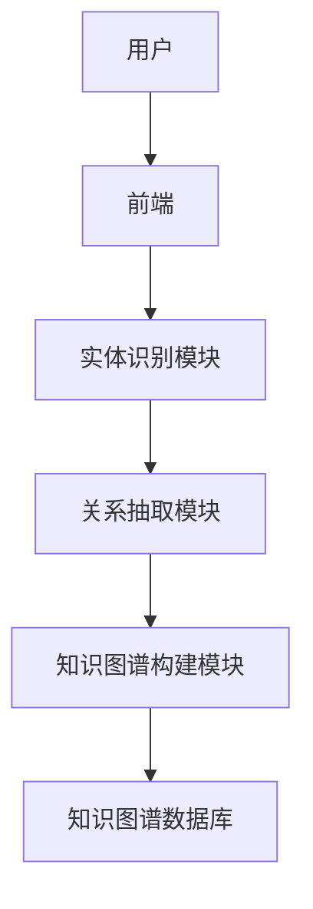
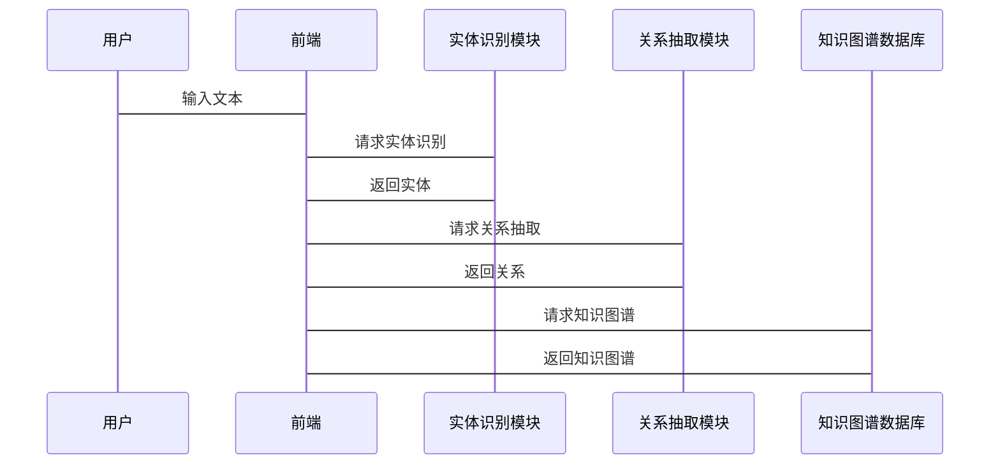

                 


# 实体识别与关系抽取：增强AI Agent的理解深度

> 关键词：实体识别，关系抽取，自然语言处理，AI Agent，知识图谱，信息抽取，深度学习

> 摘要：实体识别（NER）和关系抽取（RE）是自然语言处理（NLP）中的关键技术，它们在AI Agent的信息理解和知识构建中起着关键作用。本文从基础概念出发，详细分析了实体识别与关系抽取的核心算法原理，探讨了它们在AI Agent中的应用场景，并通过实际案例展示了如何通过这些技术提升AI Agent的理解能力。文章还结合了数学模型和系统架构设计，帮助读者全面掌握这些技术。

---

## 第一部分：实体识别与关系抽取的基础

### 第1章：实体识别与关系抽取的背景与概念

#### 1.1 实体识别与关系抽取的定义
- **1.1.1 实体识别的定义与作用**
  - 实体识别（NER, Named Entity Recognition）：识别文本中的命名实体，如人名、地名、组织名等。
  - 实体识别的作用：为信息抽取和知识图谱构建提供基础。

- **1.1.2 关系抽取的定义与作用**
  - 关系抽取（RE, Relation Extraction）：识别文本中实体之间的关系，如“属于”、“位于”、“属于”等。
  - 关系抽取的作用：帮助AI Agent理解实体之间的联系。

- **1.1.3 实体识别与关系抽取的联系与区别**
  - 实体识别是关系抽取的基础。
  - 关系抽取依赖于实体识别的结果。

#### 1.2 实体识别与关系抽取的背景
- **1.2.1 当前AI技术的发展背景**
  - 自然语言处理（NLP）的快速发展为实体识别和关系抽取提供了技术基础。
  - 大数据和深度学习的兴起推动了这些技术的进步。

- **1.2.2 实体识别与关系抽取在自然语言处理中的地位**
  - 实体识别是NLP的核心任务之一。
  - 关系抽取是NLP中更具挑战性的任务，广泛应用于信息抽取、问答系统和知识图谱构建等领域。

- **1.2.3 实体识别与关系抽取的应用场景**
  - 信息抽取：从文本中提取结构化信息。
  - 智能问答：帮助AI Agent理解问题中的实体和关系。
  - 知识图谱构建：构建语义网络。

#### 1.3 实体识别与关系抽取的技术发展
- **1.3.1 传统NLP方法在实体识别中的应用**
  - 基于规则的方法：利用词典和句法规则进行实体识别。
  - 统计方法：如HMM（隐马尔可夫模型）和CRF（条件随机场）。

- **1.3.2 基于深度学习的实体识别技术**
  - 使用RNN、LSTM和Transformer等模型进行实体识别。
  - 增强了模型的上下文理解和泛化能力。

- **1.3.3 关系抽取技术的演进与现状**
  - 从基于规则到基于深度学习的关系抽取。
  - 当前研究热点：关系抽取的可解释性、多关系类型抽取和跨语言关系抽取。

#### 1.4 实体识别与关系抽取的应用价值
- **1.4.1 在信息抽取中的应用价值**
  - 从文本中提取关键信息，帮助AI Agent快速理解文本内容。
  - 例如：新闻中的事件抽取、社交媒体上的信息提取。

- **1.4.2 在智能问答系统中的应用价值**
  - 帮助问答系统理解用户的问题，提取关键实体和关系。
  - 提高问答系统的准确性和智能化水平。

- **1.4.3 在知识图谱构建中的应用价值**
  - 实体识别和关系抽取是构建知识图谱的核心步骤。
  - 帮助AI Agent构建语义网络，实现知识的深度理解和推理。

---

## 第二部分：实体识别与关系抽取的核心概念与联系

### 第2章：实体识别与关系抽取的核心概念与联系

#### 2.1 实体识别的核心概念
- **2.1.1 实体的定义与分类**
  - 实体：文本中的命名实体，如人名、地名、组织名、时间、日期等。
  - 实体分类：常见实体类型包括PER（人名）、LOC（地名）、ORG（组织名）、TIME（时间）、DATE（日期）等。

- **2.1.2 实体识别的特征与属性**
  - 实体识别需要考虑上下文信息。
  - 实体识别需要结合词性和句法结构。

- **2.1.3 实体识别的关键技术点**
  - 基于深度学习的实体识别模型。
  - 实体识别的歧义性处理。

#### 2.2 关系抽取的核心概念
- **2.2.1 关系的定义与分类**
  - 关系：实体之间的语义联系，如“属于”、“位于”、“属于”等。
  - 关系类型：常见关系类型包括“属于”、“位于”、“属于”、“因果”等。

- **2.2.2 关系抽取的特征与属性**
  - 关系抽取需要考虑实体的位置和上下文信息。
  - 关系抽取需要结合句法结构和语义信息。

- **2.2.3 关系抽取的关键技术点**
  - 基于深度学习的关系抽取模型。
  - 多关系类型抽取的挑战。

#### 2.3 实体识别与关系抽取的联系
- **2.3.1 实体识别为关系抽取提供基础**
  - 实体识别是关系抽取的前提。
  - 实体识别的准确性直接影响关系抽取的效果。

- **2.3.2 关系抽取增强实体识别的语境理解**
  - 关系抽取可以帮助实体识别理解实体的上下文关系。
  - 例如：在句子“张三是公司的CEO”中，关系抽取可以确定“CEO”与“公司”的关系。

- **2.3.3 实体识别与关系抽取的联合学习**
  - 联合学习可以同时优化实体识别和关系抽取。
  - 例如：使用端到端的模型同时进行实体识别和关系抽取。

---

## 第三部分：实体识别与关系抽取的算法原理

### 第3章：实体识别与关系抽取的算法原理

#### 3.1 实体识别的算法原理
- **3.1.1 基于规则的实体识别算法**
  - 使用词典和句法规则进行实体识别。
  - 优点：简单易实现。
  - 缺点：难以处理复杂和模糊的语境。

- **3.1.2 基于统计的实体识别算法**
  - 使用HMM（隐马尔可夫模型）和CRF（条件随机场）进行实体识别。
  - 优点：能够利用上下文信息。
  - 缺点：需要大量标注数据。

- **3.1.3 基于深度学习的实体识别算法**
  - 使用RNN、LSTM和Transformer模型进行实体识别。
  - 优点：能够处理长距离依赖关系，具有强大的泛化能力。
  - 缺点：需要大量标注数据和计算资源。

#### 3.2 关系抽取的算法原理
- **3.2.1 基于规则的关系抽取算法**
  - 使用句法规则和语义规则进行关系抽取。
  - 优点：简单易实现。
  - 缺点：难以处理复杂和模糊的语境。

- **3.2.2 基于统计的关系抽取算法**
  - 使用CRF和HMM进行关系抽取。
  - 优点：能够利用上下文信息。
  - 缺点：需要大量标注数据。

- **3.2.3 基于深度学习的关系抽取算法**
  - 使用RNN、LSTM和Transformer模型进行关系抽取。
  - 优点：能够处理长距离依赖关系，具有强大的泛化能力。
  - 缺点：需要大量标注数据和计算资源。

#### 3.3 实体识别与关系抽取的联合学习
- **3.3.1 联合学习的基本原理**
  - 联合学习同时优化实体识别和关系抽取。
  - 例如：使用端到端的模型同时进行实体识别和关系抽取。

- **3.3.2 联合学习的优势与挑战**
  - 优势：能够同时优化实体识别和关系抽取。
  - 挑战：需要处理复杂的联合优化问题，计算资源需求较高。

---

## 第四部分：实体识别与关系抽取的数学模型与公式

### 第4章：实体识别与关系抽取的数学模型与公式

#### 4.1 实体识别的数学模型
- **4.1.1 基于CRF的实体识别模型**
  - 条件随机场（CRF）用于序列标注任务。
  - 公式：$P(y|x) = \frac{1}{Z(x)} \exp(\sum_{i=1}^n \sum_{k} U_k(x_i, y_{i-1}, y_i)))$
  - 其中，$U_k$ 是转移特征的权重，$Z(x)$ 是归一化因子。

- **4.1.2 基于LSTM的实体识别模型**
  - LSTM用于捕捉长距离依赖关系。
  - 公式：$\text{LSTM}(x_i, y_i) = \text{LSTM}(x_i, y_i)$

- **4.1.3 基于Transformer的实体识别模型**
  - Transformer用于捕捉全局依赖关系。
  - 公式：$\text{Transformer}(x_i, y_i) = \text{Transformer}(x_i, y_i)$

#### 4.2 关系抽取的数学模型
- **4.2.1 基于CRF的关系抽取模型**
  - CRF用于关系抽取的序列标注任务。
  - 公式：同上。

- **4.2.2 基于LSTM的关系抽取模型**
  - LSTM用于捕捉长距离依赖关系。
  - 公式：同上。

- **4.2.3 基于Transformer的关系抽取模型**
  - Transformer用于捕捉全局依赖关系。
  - 公式：同上。

---

## 第五部分：实体识别与关系抽取的系统架构设计

### 第5章：实体识别与关系抽取的系统架构设计

#### 5.1 系统分析与设计
- **5.1.1 问题场景介绍**
  - 需求：构建一个能够进行实体识别和关系抽取的系统。
  - 限制：需要处理多种语言和复杂语境。

- **5.1.2 系统功能设计**
  - 实体识别模块：识别文本中的实体。
  - 关系抽取模块：识别实体之间的关系。
  - 知识图谱构建模块：将实体和关系整合到知识图谱中。

- **5.1.3 系统架构设计**
  - 前端：用户界面，接收输入并显示结果。
  - 后端：实体识别模块和关系抽取模块。
  - 数据库：存储知识图谱。

- **5.1.4 系统接口设计**
  - API接口：提供实体识别和关系抽取的功能。

#### 5.2 系统架构图


#### 5.3 系统交互图


---

## 第六部分：实体识别与关系抽取的项目实战

### 第6章：实体识别与关系抽取的项目实战

#### 6.1 项目介绍
- **项目名称**：基于深度学习的实体识别与关系抽取系统。
- **项目目标**：构建一个能够进行实体识别和关系抽取的系统。
- **项目工具**：Python、TensorFlow、Keras、spaCy。

#### 6.2 核心实现
- **环境配置**
  ```bash
  pip install tensorflow keras spacy
  python -m spacy download en_core_web_sm
  ```

- **数据预处理**
  ```python
  import spacy

  nlp = spacy.load("en_core_web_sm")
  doc = nlp("John is a student at Oxford University.")
  for token in doc:
      print(token.text, token.pos_)
  ```

- **模型训练**
  ```python
  import tensorflow as tf
  from tensorflow.keras import layers

  model = tf.keras.Sequential()
  model.add(layers.Embedding(input_dim=10000, output_dim=50))
  model.add(layers.LSTM(64))
  model.add(layers.Dense(1, activation='sigmoid'))
  model.compile(optimizer='adam', loss='binary_crossentropy', metrics=['accuracy'])
  model.fit(x_train, y_train, epochs=10, batch_size=32)
  ```

- **结果分析**
  ```python
  y_pred = model.predict(x_test)
  print(y_pred)
  ```

#### 6.3 项目小结
- **项目总结**
  - 实体识别和关系抽取是构建智能系统的核心技术。
  - 深度学习模型在这些任务中表现出色。

- **项目建议**
  - 使用预训练模型（如BERT）提高性能。
  - 结合规则和深度学习模型提高准确率。

---

## 第七部分：总结与展望

### 第7章：总结与展望

#### 7.1 总结
- 实体识别和关系抽取是自然语言处理中的关键技术。
- 这些技术在AI Agent的信息理解和知识构建中起着关键作用。
- 深度学习模型在这些任务中表现出色，但仍面临挑战。

#### 7.2 展望
- **技术发展**
  - 更加高效的模型（如Transformer）的应用。
  - 多语言实体识别和关系抽取的研究。

- **应用领域**
  - 在智能问答系统中的应用。
  - 在知识图谱构建中的应用。
  - 在跨语言信息处理中的应用。

---

## 作者

作者：AI天才研究院/AI Genius Institute & 禅与计算机程序设计艺术 /Zen And The Art of Computer Programming

---

以上是《实体识别与关系抽取：增强AI Agent的理解深度》的完整目录和文章内容。

