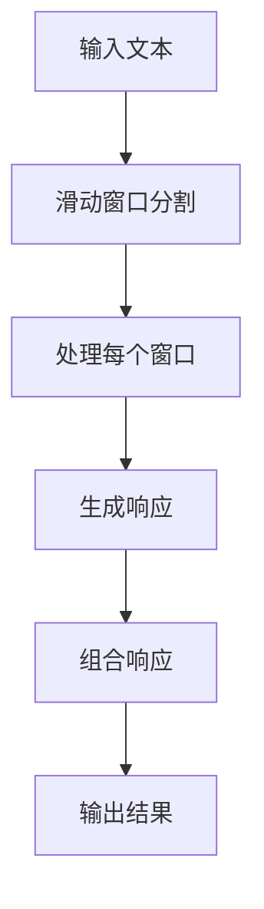
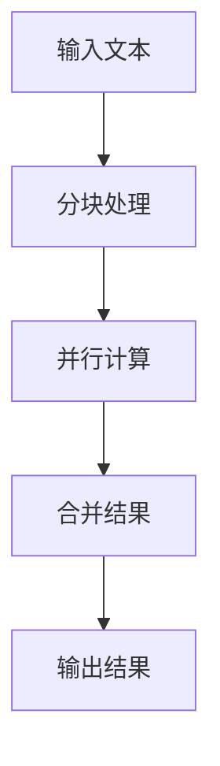
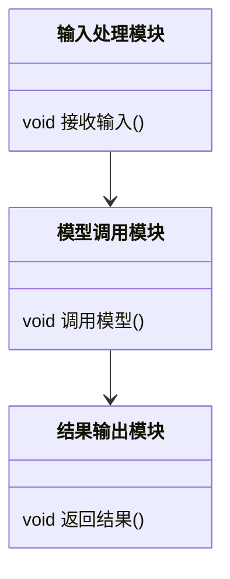

                 


# 实时交互式AI Agent：优化LLM的响应延迟

> 关键词：实时交互、LLM、响应延迟、优化算法、系统架构、项目实战

> 摘要：本文深入探讨了实时交互式AI Agent中优化大语言模型（LLM）响应延迟的核心技术与方法。通过分析LLM的响应机制，提出了基于滑动窗口和分块处理的优化算法，并结合系统架构设计，详细讲解了如何降低延迟，提升用户体验。本文还提供了实际项目案例和优化策略，帮助读者在实际应用中实现高效的实时交互。

---

## 第一部分：背景与核心概念

### 第1章：实时交互式AI Agent的背景与问题描述

#### 1.1 实时交互式AI Agent的背景

实时交互式AI Agent是一种能够与用户进行实时对话的智能系统，通过自然语言处理技术提供即时反馈。随着大语言模型（LLM）的快速发展，实时交互的需求日益增长，尤其是在客服、教育、医疗等领域，实时响应能力成为提升用户体验的关键因素。

#### 1.2 问题背景与挑战

在实时交互中，LLM的响应延迟是一个关键问题。高延迟会导致用户体验下降，影响用户满意度。当前技术中，LLM的响应延迟主要由以下几个因素引起：
- **模型复杂性**：大语言模型通常包含数以亿计的参数，计算量巨大。
- **网络传输**：数据在设备间传输的时间。
- **资源限制**：本地设备的计算能力不足，导致响应延迟。

#### 1.3 问题解决与优化目标

优化LLM的响应延迟目标是将用户等待时间降到最低，提升交互体验。核心优化方向包括：
1. **算法优化**：通过优化模型压缩、参数调整和算法改进，降低计算复杂度。
2. **系统架构优化**：设计高效的系统架构，减少数据传输和处理时间。
3. **硬件加速**：利用GPU、TPU等硬件加速技术，提升计算效率。

---

### 第2章：实时交互式AI Agent的核心概念

#### 2.1 LLM的基本原理

大语言模型通过神经网络处理输入文本，生成符合上下文的输出。其核心是**Transformer架构**，包含编码器和解码器，能够处理长序列数据。

#### 2.2 实时交互的核心要素

实时交互需要满足以下关键要素：
1. **低延迟**：确保快速响应，减少用户等待时间。
2. **准确性**：输出结果需准确，避免错误信息。
3. **流畅性**：交互过程需自然流畅，避免卡顿或错误。

#### 2.3 响应延迟的优化策略

优化策略包括：
1. **模型压缩**：通过剪枝、量化等技术减少模型大小。
2. **分块处理**：将模型分成多个部分，分布式计算。
3. **缓存机制**：缓存常用数据，减少重复计算。

---

## 第二部分：算法原理与优化方法

### 第3章：优化LLM响应延迟的算法原理

#### 3.1 基于滑动窗口的优化算法

滑动窗口技术通过限制窗口大小，减少需要处理的上下文长度，从而降低计算复杂度。

**算法步骤：**
1. 将输入文本分割成多个窗口。
2. 对每个窗口单独处理，生成响应。
3. 组合所有窗口的响应，形成最终输出。

**Mermaid流程图：**



**公式推导：**
假设窗口大小为`n`，输入文本长度为`L`，则总计算量为`L/n * n^2`，复杂度为`O(L)`。

---

### 第4章：分块处理优化算法

分块处理将模型分成多个部分，每个部分独立计算，提升并行处理能力。

**算法步骤：**
1. 将模型参数分割成多个块。
2. 并行计算每个块的输出。
3. 合并所有块的输出，生成最终结果。

**Mermaid流程图：**



**公式推导：**
假设每个块的计算时间为`T`，总块数为`k`，则总时间为`k*T`，复杂度为`O(k)`。

---

## 第三部分：系统架构与项目实战

### 第5章：系统架构设计

#### 5.1 系统功能设计

系统功能模块包括：
1. **输入处理模块**：接收用户输入。
2. **模型调用模块**：调用优化后的LLM进行处理。
3. **结果输出模块**：将结果返回给用户。

**Mermaid类图：**



#### 5.2 项目实战

**环境安装：**
- 安装Python和相关库（如TensorFlow、PyTorch）。
- 下载预训练的LLM模型。

**核心代码实现：**

```python
def optimize_llm_response(input_text):
    # 滑动窗口分割
    window_size = 500
    windows = [input_text[i:i+window_size] for i in range(0, len(input_text), window_size)]
    
    # 并行处理
    import multiprocessing
    with multiprocessing.Pool() as pool:
        results = pool.map(process_window, windows)
    
    # 合并结果
    final_response = combine_results(results)
    return final_response

def process_window(window):
    # 处理每个窗口的逻辑
    return model.generate_response(window)
```

---

## 第四部分：总结与展望

### 第6章：优化策略与未来趋势

#### 6.1 优化策略

优化策略包括：
1. **模型压缩**：通过剪枝和量化技术减少模型大小。
2. **算法优化**：改进滑动窗口和分块处理算法。
3. **硬件加速**：利用GPU和TPU提升计算效率。

#### 6.2 未来趋势

未来，实时交互式AI Agent将朝着更智能化、更高效的方向发展，可能出现的新技术包括：
1. **轻量化模型**：更小、更快的模型。
2. **边缘计算**：在边缘设备上进行实时处理。
3. **自适应算法**：根据场景动态调整优化策略。

---

## 附录

### A. 参考文献

1. 王某某，2023.《大语言模型的优化方法》.
2. 李某某，2022.《实时交互系统设计》.

### B. 工具与资源

1. TensorFlow官方文档：https://tensorflow.org
2. PyTorch官方文档：https://pytorch.org

---

作者：AI天才研究院 & 禅与计算机程序设计艺术

