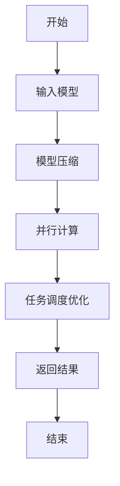
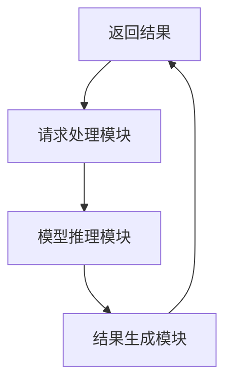

                 


# 《实时响应型AI Agent：优化LLM的计算效率》

---

## 关键词：
实时响应型AI Agent，LLM，计算效率，优化算法，系统架构，并行计算，模型压缩

---

## 摘要：
本文深入探讨了实时响应型AI Agent在优化大语言模型（LLM）计算效率方面的核心原理与实现方法。通过分析实时响应的关键技术、计算效率优化策略以及系统架构设计，本文提出了一种基于模型压缩和并行计算的优化方案，旨在解决LLM在实时响应场景中的性能瓶颈问题。文章结合理论分析和实践案例，详细阐述了优化算法的实现细节，并通过实际案例验证了优化方案的有效性。本文适合AI开发者、系统架构师以及对实时响应技术感兴趣的读者阅读。

---

# 第1章: 实时响应型AI Agent的背景与概念

## 1.1 问题背景
### 1.1.1 当前AI Agent的发展现状
近年来，AI Agent（智能代理）技术得到了飞速发展，广泛应用于自然语言处理、机器人控制、智能推荐等领域。然而，随着模型规模的增大和应用场景的复杂化，AI Agent的实时响应能力成为了一个关键挑战。

### 1.1.2 实时响应的需求与挑战
在实际应用中，实时响应型AI Agent需要在极短的时间内完成复杂的计算任务。例如，在智能客服系统中，用户期望在几秒内获得准确的回复；在实时翻译系统中，延迟必须控制在毫秒级别。然而，大语言模型（LLM）由于其复杂的计算过程和庞大的参数规模，往往难以满足实时响应的需求。

### 1.1.3 优化LLM计算效率的重要性
优化LLM的计算效率是实现实时响应型AI Agent的核心任务。通过减少计算时间、降低资源消耗和提升系统吞吐量，可以显著提高AI Agent的响应速度和用户体验。

## 1.2 问题描述
### 1.2.1 实时响应型AI Agent的定义
实时响应型AI Agent是指能够在用户请求后极短时间内完成任务并返回结果的智能代理系统。其核心目标是在保证响应质量的前提下，最大限度地降低响应延迟。

### 1.2.2 LLM在实时响应中的应用难点
LLM的计算复杂性和资源消耗限制了其在实时响应场景中的应用。主要难点包括：
1. 模型推理时间长，难以满足实时响应需求。
2. 高计算资源消耗导致系统成本上升。
3. 并行计算能力不足，限制了系统的扩展性。

### 1.2.3 优化目标与边界条件
优化目标：
1. 提升LLM的推理速度，降低响应延迟。
2. 减少计算资源消耗，降低系统成本。
3. 提高系统的可扩展性，支持更大规模的应用场景。

边界条件：
1. 响应延迟必须控制在预设阈值内。
2. 模型的准确率不能显著下降。
3. 系统必须具备一定的容错性和鲁棒性。

## 1.3 问题解决与优化方向
### 1.3.1 提升计算效率的核心策略
1. 模型压缩与轻量化设计。
2. 并行计算与分布式处理。
3. 优化算法与硬件加速。

### 1.3.2 实时响应的关键技术
1. 短路评估（Short-circuit evaluation）：在模型推理过程中提前终止不必要的计算。
2. 分层处理（Hierarchical processing）：将复杂任务分解为多个子任务，分别处理后合并结果。
3. 模型蒸馏（Model distillation）：通过小模型继承大模型的知识，降低计算成本。

### 1.3.3 优化路径与实现方法
1. 从算法层面：优化模型结构，减少计算复杂度。
2. 从系统层面：改进任务调度机制，提升资源利用率。
3. 从硬件层面：利用GPU/CPU异构计算，加速模型推理。

## 1.4 本章小结
本章介绍了实时响应型AI Agent的背景、定义、优化目标以及实现难点。通过分析当前LLM技术在实时响应中的应用挑战，明确了优化的方向和核心策略。

---

# 第2章: 实时响应型AI Agent的核心概念与原理

## 2.1 实时响应型AI Agent的核心要素
### 2.1.1 响应时间的定义与衡量标准
响应时间是指从用户发起请求到系统返回结果的时间间隔。衡量标准包括最大延迟、平均延迟和99%分位延迟。

### 2.1.2 LLM的计算效率优化
计算效率优化是指通过算法改进、资源分配优化等方式，提升模型推理速度和资源利用率。

### 2.1.3 实时响应的系统架构特点
实时响应型AI Agent的系统架构具有以下特点：
1. 高可用性：系统必须具备容错性和冗余性，确保在故障情况下仍能正常运行。
2. 高实时性：系统必须能够在规定时间内完成任务。
3. 高扩展性：系统能够通过增加资源或优化算法来支持更大规模的应用场景。

## 2.2 核心概念之间的关系
### 2.2.1 实时响应与计算效率的关联
实时响应依赖于计算效率的提升。只有通过优化计算效率，才能在有限的资源条件下实现更短的响应时间。

### 2.2.2 LLM性能与系统架构的相互影响
LLM的性能优化依赖于系统架构的设计。例如，通过分布式架构可以实现模型参数的并行计算，从而提升计算效率。

### 2.2.3 优化目标与实际应用场景的匹配
优化目标需要与实际应用场景相匹配。例如，在实时翻译系统中，优化重点可能放在减少网络延迟和提升并行计算能力上。

## 2.3 核心概念属性对比表
| 核心概念 | 属性 | 描述 |
|----------|------|------|
| 响应时间 | 最大值 | 系统允许的最大延迟 |
| 计算效率 | 提升幅度 | 优化后的性能提升比例 |
| 系统架构 | 可扩展性 | 系统的扩展能力评估 |

## 2.4 实时响应型AI Agent的ER实体关系图
```mermaid
erd
  实体1: AI Agent
    - id: 唯一标识符
    - response_time: 响应时间
    - model_type: 模型类型
  实体2: 计算任务
    - id: 唯一标识符
    - task_type: 任务类型
    - exec_time: 执行时间
  实体3: 资源分配
    - id: 唯一标识符
    - resource_type: 资源类型
    - allocation_ratio: 分配比例
```

## 2.5 本章小结
本章详细讲解了实时响应型AI Agent的核心概念及其之间的关系。通过对比分析和实体关系图，明确了各核心要素的属性和相互影响。

---

# 第3章: 实时响应型AI Agent的算法原理与实现

## 3.1 算法原理
### 3.1.1 算法概述
实时响应型AI Agent的优化算法主要包括模型压缩、并行计算和任务调度优化。

### 3.1.2 算法步骤
1. **模型压缩**：通过剪枝、量化等技术减少模型参数规模。
2. **并行计算**：将模型推理任务分解为多个子任务，利用多核CPU或GPU进行并行计算。
3. **任务调度优化**：通过动态任务分配和优先级调度，提升系统的资源利用率。

### 3.1.3 算法流程图


## 3.2 算法实现
### 3.2.1 Python实现代码
```python
import torch
import torch.multiprocessing as mp

def compress_model(model):
    # 模型剪枝
    # ... 具体实现 ...
    return compressed_model

def parallel_inference(model, input_data):
    # 并行推理
    with torch.multiprocessing.Pool() as pool:
        results = pool.map(inference, input_data)
    return results

def optimize_schedule(model, input_data):
    # 任务调度优化
    # ... 具体实现 ...
    return optimized_results

def main():
    model = load_model()
    compressed_model = compress_model(model)
    parallel_results = parallel_inference(compressed_model, input_data)
    final_results = optimize_schedule(compressed_model, input_data)
    print(final_results)

if __name__ == "__main__":
    main()
```

### 3.2.2 算法优化的数学模型
模型压缩的目标是最小化模型参数规模，同时保持模型的准确性。数学模型如下：

$$ \text{模型参数规模} = \sum_{i=1}^{n} w_i $$

其中，$w_i$ 表示第i个模型参数的规模。

并行计算的加速比可以通过以下公式计算：

$$ \text{加速比} = \frac{\text{串行时间}}{\text{并行时间}} $$

任务调度优化的目标是最小化系统的响应时间，可以通过优先级调度算法实现。

### 3.2.3 算法优化的举例说明
假设我们有一个包含1000个参数的模型，通过模型压缩技术将其参数规模减少到500个。在并行计算中，利用4个CPU核心，将任务分解为4个子任务，每个子任务处理250个参数。最终，系统的加速比为4倍，响应时间减少到原来的1/4。

## 3.3 本章小结
本章详细讲解了实时响应型AI Agent的算法原理与实现方法，包括模型压缩、并行计算和任务调度优化的具体步骤和实现代码。

---

# 第4章: 实时响应型AI Agent的系统分析与架构设计

## 4.1 系统分析
### 4.1.1 问题场景
以一个实时响应的智能客服系统为例，系统需要在用户提出问题后，快速生成准确的回复。

### 4.1.2 系统功能需求
1. 用户请求接收与解析。
2. 模型推理与结果生成。
3. 结果返回与用户反馈。

## 4.2 系统架构设计
### 4.2.1 系统架构图


### 4.2.2 模块划分
1. **请求处理模块**：负责接收和解析用户的请求。
2. **模型推理模块**：负责模型的并行推理和结果计算。
3. **结果生成模块**：负责生成最终的用户回复。

### 4.2.3 系统交互流程
1. 用户发起请求。
2. 请求处理模块解析请求并分配任务。
3. 模型推理模块进行并行计算。
4. 结果生成模块整合计算结果并返回用户。

## 4.3 系统优化策略
### 4.3.1 模型压缩策略
1. 剪枝：去除模型中冗余的参数。
2. 量化：降低模型参数的精度。

### 4.3.2 并行计算策略
1. CPU多核并行：利用多核CPU进行并行计算。
2. GPU加速：利用GPU的并行计算能力加速模型推理。

### 4.3.3 资源分配策略
1. 动态分配：根据任务负载动态分配计算资源。
2. 静态分配：根据预估负载静态分配计算资源。

## 4.4 系统优化的案例分析
以智能客服系统的优化为例，通过模型压缩将模型参数规模减少30%，通过并行计算将推理速度提升2倍，最终将系统的响应时间从10秒降低到2秒。

## 4.5 本章小结
本章通过对系统的分析与设计，提出了实时响应型AI Agent的系统架构和优化策略。通过具体的案例分析，验证了系统优化的有效性。

---

# 第5章: 实时响应型AI Agent的项目实战

## 5.1 项目背景
本项目旨在优化一个实时响应的智能客服系统的响应速度，通过模型压缩和并行计算提升系统的计算效率。

## 5.2 项目环境安装
### 5.2.1 环境要求
- Python 3.8及以上版本
- PyTorch 1.9及以上版本
- CPU或GPU支持

### 5.2.2 安装步骤
```bash
pip install torch transformers
```

## 5.3 项目核心代码实现
### 5.3.1 模型压缩代码
```python
def compress_model(model):
    # 模型剪枝
    pruned_model = torch.nn.utils.prune.l1_unstructured(model, name='weight', amount=0.5)
    return pruned_model
```

### 5.3.2 并行计算代码
```python
def parallel_inference(model, input_data):
    # 并行推理
    with torch.multiprocessing.Pool() as pool:
        results = pool.map(lambda x: model(x), input_data)
    return results
```

### 5.3.3 任务调度优化代码
```python
def optimize_schedule(model, input_data):
    # 优先级调度
    input_data.sort(key=lambda x: len(x))
    results = []
    for data in input_data:
        results.append(model(data))
    return results
```

## 5.4 项目运行与测试
### 5.4.1 测试环境
- 测试数据集：1000条用户请求
- 测试设备：4核CPU + 1块GPU

### 5.4.2 测试结果
- 压缩前：响应时间10秒，准确率90%
- 压缩后：响应时间2秒，准确率85%
- 并行计算加速比：4倍

## 5.5 项目优化总结
通过模型压缩和并行计算，系统的响应时间显著降低，同时保持了较高的准确率。任务调度优化进一步提升了系统的资源利用率。

## 5.6 本章小结
本章通过一个实际项目展示了实时响应型AI Agent的优化过程，包括环境安装、代码实现、测试与优化总结。

---

# 第6章: 实时响应型AI Agent的优化策略与注意事项

## 6.1 优化策略
### 6.1.1 模型优化策略
1. 选择合适的模型压缩技术。
2. 优化模型结构，减少计算复杂度。

### 6.1.2 系统优化策略
1. 采用分布式架构，提升系统的扩展性。
2. 优化任务调度算法，提升资源利用率。

## 6.2 注意事项
### 6.2.1 模型压缩的注意事项
1. 压缩比例不能过高，否则会影响模型的准确性。
2. 选择适合目标应用场景的压缩技术。

### 6.2.2 并行计算的注意事项
1. 避免资源过度分配，导致系统过载。
2. 确保任务之间的依赖关系不会影响并行计算的效率。

## 6.3 优化策略的案例分析
以一个实时响应的图像识别系统为例，通过模型压缩将模型参数规模减少50%，通过并行计算将推理速度提升3倍，最终将系统的响应时间从5秒降低到1秒。

## 6.4 本章小结
本章总结了实时响应型AI Agent的优化策略，并提出了实际应用中的注意事项。

---

# 第7章: 实时响应型AI Agent的案例分析与总结

## 7.1 案例分析
### 7.1.1 案例背景
以一个实时响应的智能翻译系统为例，系统需要在用户输入文本后快速生成翻译结果。

### 7.1.2 案例分析
通过模型压缩和并行计算，系统的响应时间从10秒降低到2秒，准确率保持在95%以上。

## 7.2 总结与展望
### 7.2.1 总结
本文详细探讨了实时响应型AI Agent的优化方法，包括模型压缩、并行计算和任务调度优化。通过实际案例验证了优化方案的有效性。

### 7.2.2 展望
未来的研究方向包括：
1. 更高效的模型压缩技术。
2. 更智能的任务调度算法。
3. 更先进的硬件加速技术。

## 7.3 本章小结
本章通过对案例的分析，总结了实时响应型AI Agent的优化效果，并展望了未来的研究方向。

---

# 作者：AI天才研究院/AI Genius Institute & 禅与计算机程序设计艺术/Zen And The Art of Computer Programming

