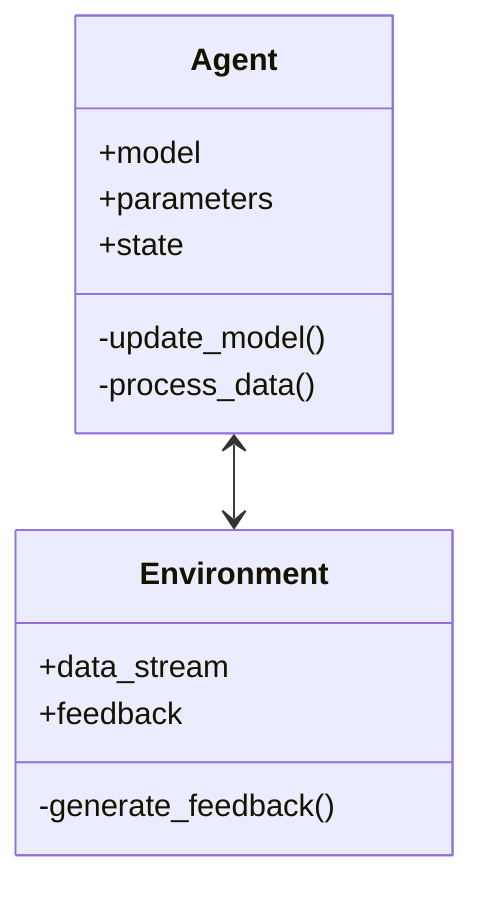
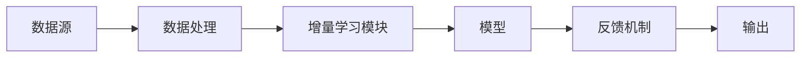
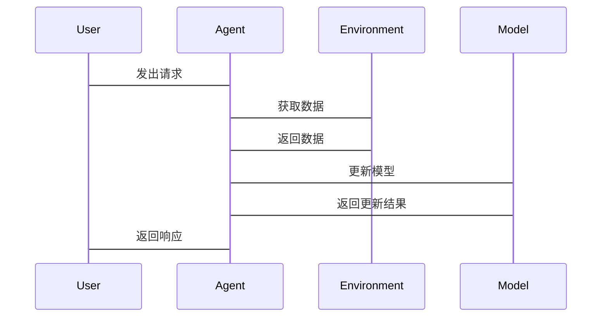

                 


# 实时学习AI Agent：LLM的在线增量学习

> 关键词：实时学习AI Agent, LLM在线增量学习, 在线学习, 增量学习, LLM, 实时系统

> 摘要：本文探讨了实时学习AI Agent在LLM（大型语言模型）中的在线增量学习方法。通过分析实时学习的核心概念、算法原理、系统架构和项目实战，本文详细阐述了如何实现LLM的在线增量学习，以适应动态变化的实时环境。文章还提供了实际案例和最佳实践，帮助读者更好地理解和应用这些技术。

---

# 第一部分: 实时学习AI Agent背景介绍

## 第1章: 实时学习AI Agent概述

### 1.1 问题背景

#### 1.1.1 当前AI Agent的发展现状
AI Agent（智能体）的发展近年来取得了显著进展，尤其是在自然语言处理（NLP）领域，大型语言模型（LLM）如GPT-3、GPT-4等已经成为主流。然而，现有的AI Agent大多依赖于离线训练的数据集，难以适应实时环境中的动态变化。

#### 1.1.2 在线增量学习的必要性
在实时环境中，数据是不断变化的，新的信息和反馈需要及时处理。传统的离线学习方法无法满足这种需求，因此在线增量学习成为必要。通过实时更新模型，AI Agent可以在动态环境中保持高效和准确。

#### 1.1.3 实时学习的核心问题
实时学习的核心问题是如何在数据流中高效地更新模型，同时保持模型的稳定性和准确性。LLM的在线增量学习需要解决数据稀疏性、计算效率和模型收敛性等挑战。

### 1.2 问题描述

#### 1.2.1 实时学习的定义与特点
实时学习是一种动态学习方法，能够在数据流中实时更新模型。其特点包括：
- **实时性**：数据流是连续的，模型需要实时更新。
- **增量性**：每次仅处理单个数据点或小批量数据。
- **在线性**：模型在处理数据的同时更新自身。

#### 1.2.2 LLM在线增量学习的挑战
- **数据稀疏性**：在线增量学习的数据量通常较小，可能不足以训练大型模型。
- **计算效率**：在线更新需要高效的计算资源。
- **模型收敛性**：在线更新可能导致模型不稳定，需要平衡更新频率和模型性能。

#### 1.2.3 实时学习与传统离线学习的区别
- **数据来源**：实时学习处理动态数据流，而离线学习依赖于静态数据集。
- **更新频率**：实时学习可以实时更新模型，而离线学习通常批量更新。
- **适应性**：实时学习能够快速适应新数据，而离线学习适应性较弱。

### 1.3 问题解决

#### 1.3.1 实时学习的关键技术
- **在线优化**：使用高效的优化算法，如在线梯度下降。
- **增量训练**：逐步更新模型参数，避免一次性训练带来的计算开销。
- **模型自适应**：通过反馈机制调整模型行为。

#### 1.3.2 LLM增量学习的实现路径
- **局部更新**：仅更新模型的部分参数，减少计算量。
- **知识蒸馏**：通过教师模型指导学生模型的更新。
- **在线增强学习**：结合强化学习，通过反馈优化模型行为。

#### 1.3.3 实时学习的边界与外延
- **边界**：实时学习仅处理实时数据流，不涉及历史数据的重新训练。
- **外延**：实时学习可以与其他技术结合，如边缘计算和分布式系统。

### 1.4 核心概念组成

#### 1.4.1 实时学习的核心要素
- **数据流**：实时环境中的数据输入。
- **模型更新**：根据数据流更新模型参数。
- **反馈机制**：用于指导模型更新的实时反馈。

#### 1.4.2 LLM在线增量学习的组件
- **数据处理模块**：接收和处理实时数据流。
- **增量学习模块**：负责模型参数的更新。
- **反馈机制**：提供实时反馈以指导学习过程。

#### 1.4.3 实时学习系统的架构特点
- **实时性**：系统能够快速响应数据流的变化。
- **高效性**：模型更新过程高效，适合在线处理。
- **动态性**：能够适应实时环境中的动态变化。

### 1.5 本章小结

通过本章的介绍，我们了解了实时学习AI Agent的基本概念、核心问题以及其实现路径。实时学习的关键在于高效地处理实时数据流，并在动态环境中保持模型的准确性和稳定性。

---

## 第2章: 实时学习AI Agent的核心概念与联系

### 2.1 核心概念原理

#### 2.1.1 实时学习的基本原理
实时学习的核心是通过数据流不断更新模型。模型在接收每个数据点后，立即调整其参数以适应新数据。这种实时更新机制使得模型能够快速响应环境的变化。

#### 2.1.2 LLM在线增量学习的机制
LLM的在线增量学习通过逐步更新模型参数来适应新数据。每次更新仅涉及模型的一部分，以减少计算开销并保持模型的稳定性。

#### 2.1.3 实时学习与反馈机制的关系
实时学习依赖于反馈机制来指导模型更新。反馈机制可以是用户的输入、系统的响应或其他外部信号，用于调整模型的行为以适应实时需求。

### 2.2 核心概念对比表

| 对比维度          | 实时学习                          | 离线学习                          |
|-------------------|-----------------------------------|-----------------------------------|
| 数据来源          | 实时数据流                       | 静态数据集                       |
| 更新频率          | 实时更新                         | 批量更新                         |
| 适应性            | 高度动态适应                     | 较低适应性                       |
| 适合场景          | 实时环境、动态环境               | 离线分析、研究场景               |

### 2.3 实时学习的ER实体关系图

```mermaid
erDiagram
    actor User {
        <属性>
        id
        request
        response
    }
    class Agent {
        <属性>
        model
        parameters
        state
    }
    class Environment {
        <属性>
        data_stream
        feedback
    }
    User -> Agent: 发出请求
    Agent -> Environment: 与环境交互
    Environment -> Agent: 返回反馈
```

---

## 第3章: 实时学习AI Agent的算法原理

### 3.1 增量学习算法概述

#### 3.1.1 在线增量学习的基本概念
在线增量学习是一种动态学习方法，模型在接收到每个数据点后立即更新。这种方法适用于数据流环境，能够快速响应新数据的变化。

#### 3.1.2 增量学习的主要算法
- **在线梯度下降**：逐个数据点更新模型参数。
- **部分更新方法**：仅更新模型的一部分参数，减少计算量。

#### 3.1.3 LLM增量学习的数学模型

##### 3.1.3.1 损失函数
$$ L = \frac{1}{2} \| y - \hat{y} \|^2 $$
其中，$y$ 是真实值，$\hat{y}$ 是模型预测值。

##### 3.1.3.2 参数更新
$$ \theta_{new} = \theta_{old} - \eta \cdot \frac{\partial L}{\partial \theta_{old}} $$
其中，$\eta$ 是学习率，$\frac{\partial L}{\partial \theta_{old}}$ 是损失函数对旧参数的梯度。

---

#### 3.1.4 LLM增量学习的流程

```mermaid
graph TD
    A[开始] -> B[接收实时数据]
    B -> C[计算损失函数]
    C -> D[计算梯度]
    D -> E[更新模型参数]
    E -> F[结束]
```

---

### 3.2 算法实现与优化

#### 3.2.1 算法实现
```python
def online_incremental_learning(data_stream, model, learning_rate):
    for data in data_stream:
        loss = calculate_loss(data, model)
        gradient = compute_gradient(loss, model)
        model.update_parameters(gradient, learning_rate)
```

#### 3.2.2 算法优化
- **自适应学习率**：根据梯度变化自动调整学习率。
- **动量优化**：结合动量项加速收敛。

---

## 第4章: 实时学习AI Agent的系统分析与架构设计

### 4.1 系统分析

#### 4.1.1 问题场景介绍
实时学习AI Agent需要在动态环境中运行，处理实时数据流并实时更新模型。常见的应用场景包括实时聊天机器人、在线推荐系统和实时监控系统。

#### 4.1.2 系统功能设计

##### 4.1.2.1 功能模块
- **数据处理模块**：接收和预处理实时数据。
- **增量学习模块**：负责模型的实时更新。
- **反馈机制模块**：根据反馈调整模型行为。

##### 4.1.2.2 领域模型


---

### 4.2 系统架构设计

#### 4.2.1 系统架构图


#### 4.2.2 系统接口设计
- **数据接口**：接收实时数据流。
- **模型接口**：提供模型更新和预测接口。
- **反馈接口**：接收实时反馈并调整模型行为。

#### 4.2.3 系统交互流程图


---

## 第5章: 实时学习AI Agent的项目实战

### 5.1 环境安装

#### 5.1.1 环境要求
- Python 3.8+
- PyTorch 1.9+
- Transformers库

#### 5.1.2 安装依赖
```bash
pip install torch transformers
```

---

### 5.2 系统核心实现

#### 5.2.1 核心代码实现
```python
import torch
from transformers import AutoTokenizer, AutoModelForCausalLM

class RealTimeLearningAgent:
    def __init__(self, model_name):
        self.tokenizer = AutoTokenizer.from_pretrained(model_name)
        self.model = AutoModelForCausalLM.from_pretrained(model_name)
        self.model.train()

    def update_model(self, batch_input, batch_target):
        inputs = self.tokenizer(batch_input, return_tensors="pt")
        targets = self.tokenizer(batch_target, return_tensors="pt")

        outputs = self.model(**inputs)
        loss = outputs.loss
        loss.backward()
        self.optimizer.step()
        self.optimizer.zero_grad()

    def process_data(self, data_stream):
        for data in data_stream:
            self.update_model(data['input'], data['target'])
            yield self.model.generate(inputs=data['input'], max_length=50)
```

#### 5.2.2 代码解读
- **初始化**：加载预训练模型和分词器。
- **更新模型**：接收批次输入和目标，计算损失并更新模型参数。
- **处理数据**：实时处理数据流，逐步更新模型。

---

### 5.3 实际案例分析

#### 5.3.1 应用场景
实时聊天机器人，用户输入实时更新模型，提供更准确的回复。

#### 5.3.2 案例分析
```python
agent = RealTimeLearningAgent("gpt2")
data_stream = [
    {"input": "你好", "target": "你好！"},
    {"input": "今天天气怎么样？", "target": "今天天气很好！"}
]
for response in agent.process_data(data_stream):
    print(response)
```

---

## 第6章: 实时学习AI Agent的最佳实践

### 6.1 小结
实时学习AI Agent的核心在于高效处理实时数据流并实时更新模型。通过在线增量学习，模型能够快速适应动态环境，提供更智能的服务。

### 6.2 注意事项
- **数据质量**：实时数据可能包含噪声，需进行数据清洗。
- **模型稳定性**：频繁更新可能导致模型不稳定性，需平衡更新频率。
- **计算资源**：在线增量学习需要高效的计算资源。

### 6.3 扩展阅读
- 《在线学习的理论与算法》
- 《深度学习中的增量学习方法》
- 《实时系统中的模型更新技术》

---

# 作者：AI天才研究院/AI Genius Institute & 禅与计算机程序设计艺术 /Zen And The Art of Computer Programming

---

以上是《实时学习AI Agent：LLM的在线增量学习》的技术博客文章目录和部分正文内容，涵盖背景介绍、核心概念、算法原理、系统架构、项目实战和最佳实践等部分。文章通过逐步分析和详细讲解，帮助读者全面理解实时学习AI Agent的实现与应用。

