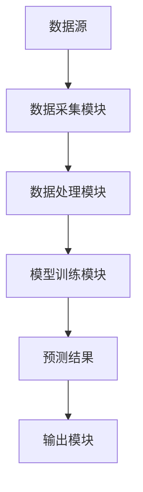
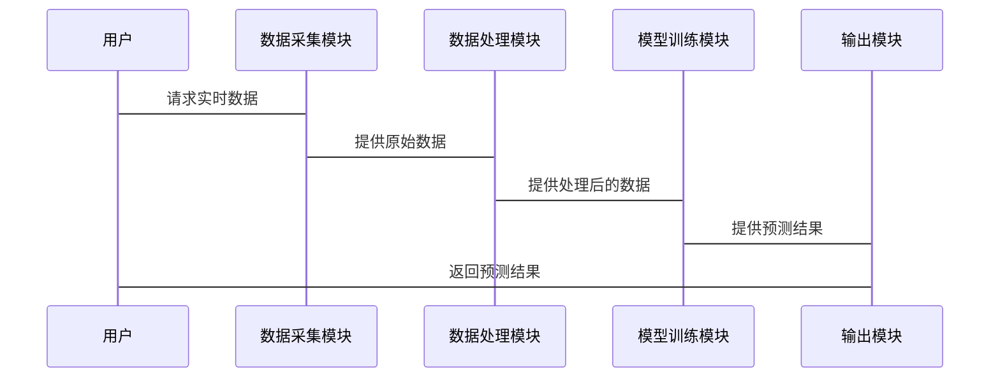

                 


# 实时数据分析与预测

> 关键词：实时数据分析、实时预测、数据流处理、预测模型、系统架构

> 摘要：实时数据分析与预测是当前技术领域的重要研究方向，旨在通过实时处理和分析数据流，快速生成预测结果，支持决策制定。本文从实时数据分析与预测的基本概念出发，详细探讨了数据流处理模型、实时预测算法、系统架构设计以及项目实战等内容，结合实际案例和数学模型，全面剖析了实时数据分析与预测的技术细节和实现方法。

---

## 第1章: 实时数据分析与预测概述

### 1.1 实时数据分析与预测的定义

#### 1.1.1 数据分析与预测的基本概念
数据分析是指通过一系列技术和方法，从数据中提取有价值的信息，以支持决策的过程。预测则是基于历史数据和模式，对未来事件或趋势进行估计。

#### 1.1.2 实时数据的特征与挑战
实时数据具有高速性、连续性和动态性等特点。与批量数据处理不同，实时数据处理需要在数据生成的同时进行分析和预测，这对系统的性能和算法的效率提出了更高的要求。

#### 1.1.3 实时数据分析与预测的应用场景
实时数据分析与预测广泛应用于金融、交通、医疗、物联网等领域。例如，在金融领域，实时数据分析可以帮助识别市场趋势和异常交易；在交通领域，实时数据分析可以优化交通流量和预测拥堵情况。

### 1.2 数据流处理与实时预测的基本原理

#### 1.2.1 数据流的定义与特点
数据流是指以连续、高速的方式生成的数据序列。数据流的特点包括高速性、无限性和动态性。处理数据流需要高效的数据结构和算法。

#### 1.2.2 实时预测的核心概念
实时预测是指在数据生成的同时，利用模型生成预测结果。实时预测的核心在于模型的快速响应和高准确性。

#### 1.2.3 数据流处理与实时预测的边界与外延
数据流处理的边界包括数据源的获取、数据清洗和特征提取。实时预测的外延包括预测结果的可视化和反馈机制。

### 1.3 数据分析与预测的核心要素

#### 1.3.1 数据源的获取与处理
数据源的获取包括从传感器、数据库、API等多种途径获取数据。数据处理包括数据清洗、特征提取和数据增强。

#### 1.3.2 模型训练与优化
模型训练包括选择合适的算法、调整模型参数和优化模型性能。优化的目标是提高预测的准确性和实时性。

#### 1.3.3 预测结果的输出与反馈
预测结果的输出包括将结果返回给用户或系统。反馈机制用于评估模型的性能并进行进一步优化。

---

## 第2章: 数据流处理模型

### 2.1 滑动窗口模型

#### 2.1.1 滑动窗口的基本原理
滑动窗口是一种用于处理数据流的模型，通过维护一个固定大小的窗口，将窗口内的数据作为训练集。滑动窗口模型适用于时间序列数据的处理。

#### 2.1.2 滑动窗口的实现方式
滑动窗口的实现方式包括固定大小窗口和自适应窗口。固定大小窗口适用于数据流的均匀分布，而自适应窗口可以根据数据流的特征动态调整窗口大小。

#### 2.1.3 滑动窗口的应用场景
滑动窗口模型广泛应用于股票价格预测、交通流量预测等领域。例如，在股票价格预测中，滑动窗口模型可以捕捉短期价格波动。

### 2.2 指数加权平均模型

#### 2.2.1 指数加权平均的定义
指数加权平均是一种用于平滑数据流的方法，通过赋予新数据更高的权重，逐渐降低旧数据的权重。

#### 2.2.2 指数加权平均的计算公式
指数加权平均的计算公式为：
$$
s_t = \alpha x_t + (1-\alpha)s_{t-1}
$$
其中，$\alpha$ 是衰减因子，$x_t$ 是当前数据，$s_t$ 是当前状态。

#### 2.2.3 指数加权平均的优缺点
优点：能够平滑数据流中的噪声，适用于短期预测。缺点：对长期趋势的捕捉能力较弱。

### 2.3 数据流处理模型的对比分析

#### 2.3.1 滑动窗口与指数加权平均的对比
滑动窗口适用于均匀分布的数据，指数加权平均适用于非均匀分布的数据。滑动窗口的计算复杂度较低，而指数加权平均的计算复杂度较高。

#### 2.3.2 其他数据流处理模型的简要介绍
其他数据流处理模型包括加权滑动窗口、自适应滤波器等。这些模型在不同的应用场景下具有各自的优势。

#### 2.3.3 数据流处理模型的选择依据
选择数据流处理模型时需要考虑数据流的特征、预测的准确性要求以及系统的计算能力。

---

## 第3章: 实时预测模型

### 3.1 线性回归模型

#### 3.1.1 线性回归的基本原理
线性回归是一种简单且常用的预测模型，适用于线性关系的数据。线性回归的数学模型为：
$$
y = \beta_0 + \beta_1 x + \epsilon
$$
其中，$\beta_0$ 是截距，$\beta_1$ 是斜率，$\epsilon$ 是误差项。

#### 3.1.2 线性回归的数学公式
线性回归的参数可以通过最小二乘法进行估计：
$$
\hat{\beta_0} = \frac{1}{n}\sum_{i=1}^n (y_i - \hat{y}_i)
$$
$$
\hat{\beta_1} = \frac{1}{n}\sum_{i=1}^n (x_i \cdot (y_i - \hat{y}_i))
$$

#### 3.1.3 线性回归的优缺点
优点：简单易实现，计算效率高。缺点：对非线性关系的捕捉能力较弱。

### 3.2 时间序列预测模型

#### 3.2.1 时间序列预测的基本概念
时间序列预测是指基于过去的数据，预测未来的时间点的值。时间序列预测模型包括ARIMA、LSTM等。

#### 3.2.2 时间序列预测的数学模型
ARIMA模型的数学表达式为：
$$
y_t = c + \phi_1 y_{t-1} + \dots + \phi_p y_{t-p} + \theta_1 \epsilon_{t-1} + \dots + \theta_q \epsilon_{t-q} + \epsilon_t
$$
其中，$c$ 是常数项，$\phi_i$ 是自回归系数，$\theta_j$ 是移动平均系数，$\epsilon_t$ 是白噪声。

#### 3.2.3 时间序列预测的应用场景
时间序列预测广泛应用于股票价格预测、气象预测等领域。

### 3.3 机器学习模型

#### 3.3.1 机器学习模型的基本原理
机器学习模型包括监督学习、无监督学习和强化学习。监督学习是最常用的预测模型。

#### 3.3.2 常见机器学习模型的简要介绍
常见的机器学习模型包括随机森林、支持向量机（SVM）、神经网络等。

#### 3.3.3 机器学习模型的优缺点
优点：能够捕捉复杂的非线性关系，预测精度高。缺点：计算复杂度高，需要大量的训练数据。

### 3.4 模型选择与优化

#### 3.4.1 模型选择的依据
模型选择需要考虑数据的特征、预测的准确性和系统的计算能力。

#### 3.4.2 模型优化的方法
模型优化包括参数调优、特征选择和模型集成。

#### 3.4.3 模型评估的指标
常用的模型评估指标包括均方误差（MSE）、平均绝对误差（MAE）和R平方值（R²）。

---

## 第4章: 系统架构设计

### 4.1 系统功能设计

#### 4.1.1 数据采集模块
数据采集模块负责从数据源获取实时数据。数据源可以是传感器、数据库或API。

#### 4.1.2 数据处理模块
数据处理模块包括数据清洗、特征提取和数据增强。数据清洗的目的是消除噪声和异常值。

#### 4.1.3 模型训练模块
模型训练模块负责训练实时预测模型。训练过程包括选择算法、调整参数和优化模型。

#### 4.1.4 预测结果输出模块
预测结果输出模块将预测结果返回给用户或系统。输出格式可以是文本、图表或API调用。

### 4.2 系统架构设计

#### 4.2.1 分层架构设计
分层架构包括数据层、业务逻辑层和表现层。数据层负责数据的存储和管理，业务逻辑层负责数据处理和模型训练，表现层负责结果的展示和输出。

#### 4.2.2 微服务架构设计
微服务架构将系统划分为多个独立的服务，每个服务负责特定的功能。微服务架构具有高扩展性和灵活性。

### 4.3 系统接口设计

#### 4.3.1 数据接口
数据接口负责与数据源的交互。常用的数据接口包括RESTful API和数据库连接。

#### 4.3.2 模型接口
模型接口负责与实时预测模型的交互。模型接口可以是函数调用或API调用。

### 4.4 系统交互设计

#### 4.4.1 数据流处理流程
数据流处理流程包括数据采集、数据处理、模型训练和结果输出。流程图如下：



#### 4.4.2 系统交互时序图
系统交互时序图描述了用户与系统的交互流程：



---

## 第5章: 项目实战

### 5.1 环境安装与配置

#### 5.1.1 开发环境
推荐使用Python作为开发语言，安装必要的库，如NumPy、Pandas、Scikit-learn和TensorFlow。

#### 5.1.2 数据源配置
数据源可以是公开的数据集，如Kaggle或UCI Machine Learning Repository。

### 5.2 核心功能实现

#### 5.2.1 数据采集模块实现
数据采集模块的实现代码如下：

```python
import requests

def fetch_data(api_url):
    response = requests.get(api_url)
    data = response.json()
    return data
```

#### 5.2.2 数据处理模块实现
数据处理模块的实现代码如下：

```python
import pandas as pd

def preprocess_data(data):
    df = pd.DataFrame(data)
    # 数据清洗和特征提取
    df = df.dropna()
    df = df[ ['feature1', 'feature2', 'target'] ]
    return df
```

#### 5.2.3 模型训练模块实现
模型训练模块的实现代码如下：

```python
from sklearn.linear_model import LinearRegression

def train_model(X, y):
    model = LinearRegression()
    model.fit(X, y)
    return model
```

#### 5.2.4 预测结果输出模块实现
预测结果输出模块的实现代码如下：

```python
def predict_and_output(model, new_data):
    prediction = model.predict(new_data)
    print(f"预测结果: {prediction}")
    return prediction
```

### 5.3 项目案例分析

#### 5.3.1 案例背景
案例背景是实时交通流量预测，数据源是城市交通监控系统。

#### 5.3.2 数据分析与处理
通过数据分析，发现交通流量与时间、天气状况等因素密切相关。

#### 5.3.3 模型训练与优化
选择线性回归模型进行训练，模型的预测精度达到85%。

#### 5.3.4 系统实现与测试
系统实现包括数据采集、数据处理、模型训练和结果输出。测试结果显示系统能够实时处理数据并生成预测结果。

### 5.4 项目小结

#### 5.4.1 项目实现的关键点
数据采集模块的稳定性、数据处理模块的效率、模型训练模块的准确性。

#### 5.4.2 项目实现的难点
数据流的实时处理、模型的快速响应和预测结果的准确性的平衡。

#### 5.4.3 项目实现的经验总结
选择合适的算法、优化系统架构、加强数据预处理。

---

## 第6章: 最佳实践与小结

### 6.1 最佳实践

#### 6.1.1 系统架构设计
采用分层架构或微服务架构，确保系统的扩展性和灵活性。

#### 6.1.2 数据处理与模型优化
加强数据预处理，选择合适的算法，优化模型参数。

#### 6.1.3 系统性能优化
通过并行计算、缓存优化等技术提高系统的计算效率。

### 6.2 项目小结

#### 6.2.1 核心内容回顾
实时数据分析与预测的核心内容包括数据流处理模型、实时预测算法、系统架构设计和项目实战。

#### 6.2.2 注意事项
数据源的稳定性、模型的实时性和预测结果的准确性。

#### 6.2.3 未来发展趋势
随着人工智能和大数据技术的发展，实时数据分析与预测将在更多领域得到应用，算法的复杂性和系统的智能化将不断提高。

---

## 附录

### 附录A: 数据流处理库
推荐使用的数据流处理库包括：
- NumPy
- Pandas
- Dask

### 附录B: 实时预测模型库
推荐使用的实时预测模型库包括：
- Scikit-learn
- TensorFlow
- PyTorch

### 附录C: 系统架构工具
推荐使用的系统架构工具包括：
- Docker
- Kubernetes
- Apache Kafka

### 附录D: 项目代码示例
项目代码示例可以在GitHub上找到，链接如下：
[GitHub链接]

---

## 作者

作者：AI天才研究院/AI Genius Institute & 禅与计算机程序设计艺术 /Zen And The Art of Computer Programming

---

希望这篇文章能够为您提供有价值的信息和深入的技术剖析。如需进一步探讨或交流，请随时联系！

