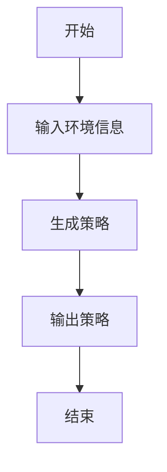
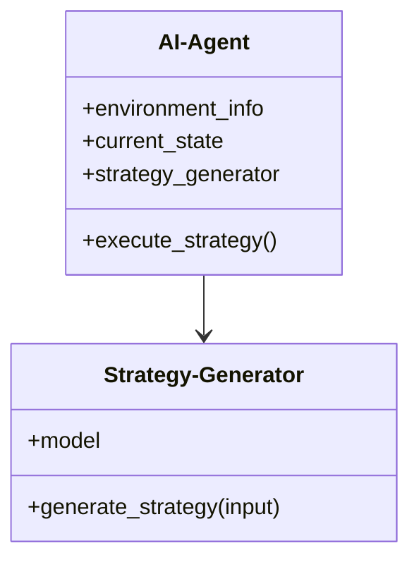

                 


# 实时策略生成AI Agent：LLM在动态决策中的应用

## 关键词

- 实时策略生成
- AI Agent
- LLM
- 动态决策
- 机器学习
- 自然语言处理
- 实时决策系统

## 摘要

随着人工智能技术的飞速发展，实时策略生成AI Agent在动态决策中的应用日益广泛。本文深入探讨了如何利用大语言模型（LLM）实现实时策略生成，重点分析了动态环境下的决策机制、LLM的核心原理及其在实时策略生成中的应用。文章从背景介绍、核心概念、算法原理、系统架构到项目实战，层层递进，为读者提供了全面的技术解析。

---

## 第1章：背景介绍

### 1.1 AI Agent的基本概念

#### 1.1.1 AI Agent的定义与特点

AI Agent（人工智能代理）是一种智能系统，能够感知环境、自主决策并执行任务。其特点包括：

- **自主性**：能够在没有外部干预的情况下独立运行。
- **反应性**：能够实时感知环境变化并做出响应。
- **目标导向**：基于明确的目标进行决策和行动。
- **社会性**：能够与其他Agent或人类进行交互协作。

#### 1.1.2 AI Agent的分类与应用场景

AI Agent可以分为以下几类：

- **简单反射型Agent**：基于固定的规则集进行响应。
- **基于模型的反射型Agent**：利用内部模型进行状态推理和决策。
- **目标驱动型Agent**：以目标为导向进行决策。
- **实用驱动型Agent**：通过优化效用函数进行决策。

应用场景包括自动驾驶、智能助手、游戏AI、机器人控制等。

#### 1.1.3 AI Agent与动态决策的关系

动态决策是指在环境不断变化的情况下，实时调整策略以实现目标的过程。AI Agent通过实时感知环境变化并生成相应策略，成为动态决策的核心实现手段。

### 1.2 LLM的基本概念与特点

#### 1.2.1 LLM的定义与核心原理

大语言模型（LLM）是基于深度学习的自然语言处理模型，具有以下特点：

- **大规模训练数据**：通常使用海量文本数据进行训练。
- **自注意力机制**：通过自注意力机制捕捉长距离依赖关系。
- **生成能力**：能够生成连贯且符合语义的文本。

核心原理包括编码器-解码器结构、自注意力机制和损失函数优化。

#### 1.2.2 LLM的优势与局限性

优势：

- **强大的生成能力**：能够生成高质量的文本。
- **多任务适应性**：适用于多种自然语言处理任务。

局限性：

- **计算资源需求高**：需要大量的计算资源进行训练和推理。
- **生成结果的可控性有限**：难以完全控制生成内容的准确性和相关性。

#### 1.2.3 LLM在动态决策中的潜力

LLM的生成能力和理解能力使其在动态决策中具有巨大潜力，尤其是在需要实时生成策略和响应复杂环境变化的场景中。

### 1.3 动态决策问题的背景与挑战

#### 1.3.1 动态决策的定义与特点

动态决策是指在不确定、变化的环境中，实时调整决策以实现目标的过程。其特点包括：

- **实时性**：需要快速响应环境变化。
- **不确定性**：环境和目标可能随时变化。
- **复杂性**：涉及多个变量和目标的权衡。

#### 1.3.2 动态决策问题的复杂性

动态决策问题的复杂性主要体现在：

- **环境变化**：决策需要根据环境变化实时调整。
- **目标变化**：目标可能随环境变化而改变。
- **信息不完备**：决策过程中信息可能存在缺失。

#### 1.3.3 动态决策中的实时策略生成需求

在动态决策中，实时策略生成是关键需求，要求系统能够在极短时间内生成有效的策略，以应对环境变化。

## 第2章：实时策略生成的原理与机制

### 2.1 实时策略生成的核心概念

#### 2.1.1 实时策略生成的定义

实时策略生成是指在动态环境中，根据当前状态和环境信息，快速生成最优或次优策略的过程。

#### 2.1.2 实时策略生成的关键要素

关键要素包括：

- **当前状态**：系统的当前状态。
- **环境信息**：外部环境的变化信息。
- **决策规则**：生成策略的规则和模型。

#### 2.1.3 实时策略生成的实现流程

实现流程包括：

1. **感知环境**：获取环境信息。
2. **状态评估**：评估当前状态。
3. **策略生成**：基于状态和环境信息生成策略。
4. **策略执行**：将生成的策略执行。
5. **反馈与优化**：根据反馈优化策略生成模型。

### 2.2 LLM在实时策略生成中的作用

#### 2.2.1 LLM作为实时策略生成器的原理

LLM通过自注意力机制和解码器结构，能够根据输入的环境信息生成相应的策略文本。

#### 2.2.2 LLM在动态环境中的适应性

LLM的适应性体现在：

- **灵活性**：能够适应不同环境和任务。
- **可扩展性**：能够处理多种策略生成任务。

#### 2.2.3 LLM与实时策略生成的结合点

结合点包括：

- **输入环境信息**：将环境信息作为输入，生成策略文本。
- **动态调整策略**：根据环境变化动态调整生成策略。

### 2.3 动态决策中的实时策略生成机制

#### 2.3.1 动态环境下的策略调整机制

策略调整机制包括：

- **实时反馈机制**：根据执行结果调整策略。
- **模型更新机制**：根据新数据更新策略生成模型。

#### 2.3.2 策略生成的实时性要求

实时性要求包括：

- **快速响应**：在极短时间内生成策略。
- **高可用性**：保证策略生成的连续性和可靠性。

---

## 第3章：算法原理讲解

### 3.1 LLM的训练过程

#### 3.1.1 监督微调

监督微调是通过对模型进行有监督训练，使其适应特定任务。

#### 3.1.2 强化学习

强化学习通过奖励机制优化策略生成模型。

#### 3.1.3 贪婪搜索

贪心搜索是一种高效的策略生成方法，每次选择当前最优的策略分支。

### 3.2 算法流程图



### 3.3 代码实现

```python
import torch
import torch.nn as nn
import torch.optim as optim

class StrategyGenerator(nn.Module):
    def __init__(self, input_size, output_size):
        super(StrategyGenerator, self).__init__()
        self.fc = nn.Linear(input_size, output_size)
        
    def forward(self, x):
        return self.fc(x)

def train(model, optimizer, criterion, input_data, target_data):
    optimizer.zero_grad()
    outputs = model(input_data)
    loss = criterion(outputs, target_data)
    loss.backward()
    optimizer.step()
    return loss.item()

# 示例训练
input_size = 10
output_size = 5
model = StrategyGenerator(input_size, output_size)
optimizer = optim.Adam(model.parameters(), lr=0.001)
criterion = nn.MSELoss()
```

### 3.4 数学模型与公式

损失函数：

$$ L = \frac{1}{N}\sum_{i=1}^{N}(y_i - \hat{y}_i)^2 $$

优化目标：

$$ \min_{\theta} L $$

---

## 第4章：系统分析与架构设计

### 4.1 项目背景

实时策略生成AI Agent的开发旨在解决动态环境下的决策问题。

### 4.2 系统功能设计

#### 4.2.1 领域模型



#### 4.2.2 系统架构


### 4.3 接口设计与交互流程

接口设计包括：

- **输入接口**：接收环境信息。
- **输出接口**：输出生成的策略。

交互流程：

1. 输入环境信息。
2. 调用策略生成器生成策略。
3. 执行生成的策略。
4. 反馈执行结果。

---

## 第5章：项目实战

### 5.1 环境安装

安装所需的库：

```bash
pip install torch
pip install matplotlib
```

### 5.2 核心代码实现

策略生成器实现：

```python
import torch
import torch.nn as nn
import torch.optim as optim

class StrategyGenerator(nn.Module):
    def __init__(self, input_size, output_size):
        super(StrategyGenerator, self).__init__()
        self.fc = nn.Linear(input_size, output_size)
        
    def forward(self, x):
        return self.fc(x)

def train(model, optimizer, criterion, input_data, target_data):
    optimizer.zero_grad()
    outputs = model(input_data)
    loss = criterion(outputs, target_data)
    loss.backward()
    optimizer.step()
    return loss.item()

# 示例训练
input_size = 10
output_size = 5
model = StrategyGenerator(input_size, output_size)
optimizer = optim.Adam(model.parameters(), lr=0.001)
criterion = nn.MSELoss()
```

### 5.3 案例分析与代码解读

案例分析：

- **输入数据**：环境信息。
- **模型训练**：通过监督学习训练策略生成器。
- **策略生成**：输入环境信息，生成相应的策略。

代码解读：

- **模型定义**：定义策略生成器模型。
- **训练函数**：定义训练过程。
- **训练过程**：输入数据，训练模型。

### 5.4 小结

项目实战部分展示了如何将理论应用于实际，通过代码实现和案例分析，帮助读者理解实时策略生成AI Agent的实现过程。

---

## 第6章：总结与展望

### 6.1 最佳实践

- **模型优化**：通过数据增强和模型优化提高生成效果。
- **环境适应**：增强模型的环境适应能力。
- **实时性优化**：优化模型推理速度，提高实时性。

### 6.2 小结

本文详细介绍了实时策略生成AI Agent的实现过程，从背景介绍到项目实战，全面解析了LLM在动态决策中的应用。

### 6.3 注意事项

- **数据质量**：保证训练数据的质量和多样性。
- **模型选择**：根据任务需求选择合适的模型。
- **计算资源**：确保足够的计算资源进行模型训练和推理。

### 6.4 拓展阅读

推荐阅读相关领域的最新研究论文和书籍，深入了解实时策略生成和动态决策的前沿技术。

---

## 作者：AI天才研究院/AI Genius Institute & 禅与计算机程序设计艺术 /Zen And The Art of Computer Programming

---

以上是《实时策略生成AI Agent：LLM在动态决策中的应用》的技术博客文章的详细目录和内容框架。

