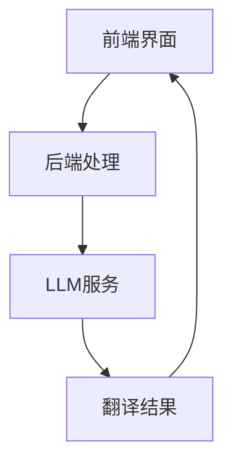
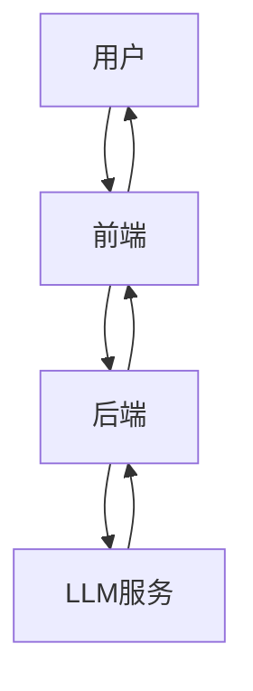
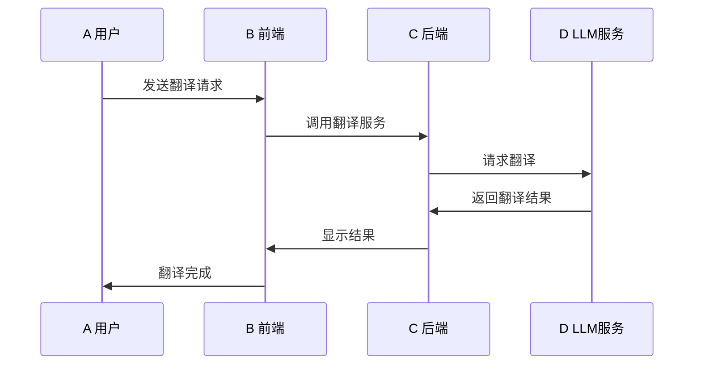

                 


# 实时翻译 AI Agent：LLM 在即时通讯中的语言转换

> 关键词：实时翻译、LLM、AI Agent、语言转换、即时通讯、自然语言处理

> 摘要：本文探讨了实时翻译 AI Agent 的实现及其在即时通讯中的应用，详细分析了基于大语言模型（LLM）的实时翻译技术，从背景、原理到系统架构进行了全面阐述。

---

# 第一部分：实时翻译 AI Agent 背景与概述

## 第1章：实时翻译 AI Agent 的背景与问题背景

### 1.1 实时翻译 AI Agent 的背景

#### 1.1.1 当前实时翻译技术的发展现状
实时翻译技术近年来取得了显著进展，尤其是基于神经网络的机器翻译模型的出现，使得翻译质量得到了显著提升。然而，实时翻译在实际应用中仍然面临诸多挑战，例如延迟、资源消耗和多语言支持等。

#### 1.1.2 LLM 在实时翻译中的应用前景
大语言模型（LLM）的出现为实时翻译提供了新的可能性。LLM不仅能够处理多种语言，还能通过上下文理解语境，从而实现更准确的翻译。这种技术在即时通讯中的应用前景广阔，尤其是在跨语言交流频繁的场景中。

#### 1.1.3 即时通讯中的语言转换需求
在即时通讯应用中，用户常常需要快速进行语言转换，以便与不同语言的用户进行交流。实时翻译 AI Agent 的出现，能够显著提升这种场景下的用户体验，减少沟通障碍。

### 1.2 问题背景与问题描述

#### 1.2.1 实时翻译的核心问题
实时翻译的核心问题在于如何在极短的时间内完成高质量的翻译，同时保持低延迟和高准确性。此外，如何处理不同语言之间的语法和语义差异也是一个重要挑战。

#### 1.2.2 即时通讯中的语言转换挑战
即时通讯中的语言转换需要快速响应，同时还需要处理非正式语言、俚语和上下文理解等问题。这些挑战使得实时翻译的实现更加复杂。

#### 1.2.3 用户需求与技术实现的矛盾
用户对实时翻译的需求日益增长，但技术实现的复杂性和成本限制了实时翻译的广泛应用。如何在技术可行性和用户体验之间找到平衡点，是当前面临的重要问题。

### 1.3 问题解决与技术路线

#### 1.3.1 LLM 在实时翻译中的作用
LLM通过其强大的上下文理解和生成能力，能够显著提升实时翻译的准确性和流畅性。通过结合实时通讯的需求，LLM可以实现快速响应和高质量的翻译。

#### 1.3.2 实时翻译 AI Agent 的技术路线
实时翻译 AI Agent 的技术路线主要包括以下几个步骤：接收输入、调用LLM进行翻译、返回结果。其中，LLM的选择和优化是关键。

#### 1.3.3 边界与外延
实时翻译 AI Agent 的边界在于其翻译能力的局限性和响应时间的限制。外延则包括与其他即时通讯功能的集成，例如语音识别和多模态交互。

### 1.4 核心概念与联系

#### 1.4.1 实时翻译 AI Agent 的核心概念
实时翻译 AI Agent 是一种基于LLM的智能系统，能够实时完成语言转换，满足用户在即时通讯中的需求。

#### 1.4.2 LLM 与实时翻译的关系
LLM为实时翻译提供了强大的技术支持，尤其是其自然语言理解能力和生成能力，使得实时翻译更加准确和流畅。

#### 1.4.3 实时翻译的流程与架构
实时翻译的流程包括输入处理、翻译引擎调用和结果返回。其架构通常包括前端界面、后端处理和LLM服务三个部分。

---

## 第2章：实时翻译 AI Agent 的核心概念

### 2.1 实时翻译 AI Agent 的定义与特点

#### 2.1.1 实时翻译 AI Agent 的定义
实时翻译 AI Agent 是一种基于LLM的智能系统，能够实时完成语言转换，满足用户在即时通讯中的需求。

#### 2.1.2 实时翻译的核心特征
实时翻译的核心特征包括快速响应、高准确性、低延迟和多语言支持。

#### 2.1.3 AI Agent 的智能性与实时性
AI Agent 的智能性体现在其自然语言理解和生成能力，而实时性则体现在其快速响应和实时处理能力。

### 2.2 实时翻译 AI Agent 的工作原理

#### 2.2.1 语言理解与转换的流程
实时翻译 AI Agent 的工作流程包括接收输入、语言理解、翻译生成和结果返回。

#### 2.2.2 LLM 在实时翻译中的角色
LLM在实时翻译中扮演核心角色，负责理解和生成语言，确保翻译的准确性和流畅性。

#### 2.2.3 实时翻译的优化机制
实时翻译的优化机制包括模型选择、缓存优化和动态调整等，以提升翻译质量和响应速度。

### 2.3 实时翻译 AI Agent 的技术实现

#### 2.3.1 基于 LLM 的语言模型选择
选择合适的LLM是实时翻译技术实现的关键，需要考虑模型的大小、性能和响应速度。

#### 2.3.2 实时翻译的算法实现
实时翻译的算法实现包括输入处理、模型调用和结果返回。其中，模型调用是关键步骤，需要优化以减少延迟。

#### 2.3.3 多语言支持与切换机制
多语言支持是实时翻译的重要功能，需要实现多种语言的识别和转换，并支持动态切换。

### 2.4 实时翻译 AI Agent 的系统架构

#### 2.4.1 系统模块划分
实时翻译 AI Agent 的系统架构通常包括前端界面、后端处理和LLM服务三个模块。

#### 2.4.2 系统功能设计
系统功能设计包括用户输入处理、翻译引擎调用、结果展示和错误处理等。

#### 2.4.3 系统架构图（Mermaid）



---

## 第3章：实时翻译 AI Agent 的算法原理

### 3.1 LLM 的基本原理

#### 3.1.1 Transformer 模型的结构
Transformer模型由编码器和解码器组成，编码器负责将输入序列编码为上下文向量，解码器负责根据编码向量生成目标序列。

#### 3.1.2 编码器与解码器的工作流程
编码器将输入序列转换为上下文向量，解码器根据这些向量生成目标序列。编码器和解码器内部都包含多头自注意力机制和前馈网络。

#### 3.1.3 多头自注意力机制
多头自注意力机制通过并行处理多个注意力头，提升模型对输入序列的理解能力。

### 3.2 实时翻译的算法实现

#### 3.2.1 基于 Transformer 的实时翻译流程
实时翻译的流程包括输入处理、编码器编码、解码器解码和结果生成。

#### 3.2.2 实时翻译的优化算法
实时翻译的优化算法包括模型剪枝、量化和并行计算等，以减少计算量和提升响应速度。

#### 3.2.3 实时翻译的数学模型

##### 3.2.3.1 编码器的数学表达
编码器的输入为序列 \( x_1, x_2, ..., x_n \)，经过多头自注意力机制和前馈网络后，得到上下文向量 \( z_1, z_2, ..., z_n \)。

##### 3.2.3.2 解码器的数学表达
解码器在解码过程中，根据编码器生成的上下文向量，逐步生成目标序列 \( y_1, y_2, ..., y_m \)。

---

## 第4章：实时翻译 AI Agent 的系统分析与架构设计

### 4.1 问题场景介绍

#### 4.1.1 实时翻译 AI Agent 的应用场景
实时翻译 AI Agent 可应用于即时通讯、跨语言客服、在线教育等领域。

#### 4.1.2 项目介绍
本项目旨在开发一个基于LLM的实时翻译 AI Agent，实现多种语言的实时转换。

### 4.2 系统功能设计

#### 4.2.1 领域模型设计
领域模型设计包括用户输入、翻译请求、翻译结果等核心实体。

#### 4.2.2 系统架构设计（Mermaid）



#### 4.2.3 系统接口设计
系统接口设计包括用户输入接口、翻译引擎接口和结果展示接口。

#### 4.2.4 系统交互设计（Mermaid）



---

## 第5章：实时翻译 AI Agent 的项目实战

### 5.1 环境安装

#### 5.1.1 安装 Python 和必要的库
```bash
pip install python
pip install transformers
pip install torch
```

#### 5.1.2 安装 LLM 模型
```bash
pip install llama
```

### 5.2 系统核心实现

#### 5.2.1 实时翻译的核心代码
```python
def translate(input_text, source_lang, target_lang):
    # 调用 LLM 模型进行翻译
    model = Llama()
    translated = model.translate(input_text, source_lang, target_lang)
    return translated
```

#### 5.2.2 翻译结果的处理
```python
def process_translation(translated_text):
    # 处理翻译结果
    return translated_text
```

### 5.3 代码应用解读与分析

#### 5.3.1 代码结构分析
实时翻译的核心代码包括输入处理、模型调用和结果处理三个部分。

#### 5.3.2 代码实现细节
代码实现细节包括模型的选择、参数的配置和结果的处理。

#### 5.3.3 代码优化建议
代码优化建议包括减少模型加载时间、优化翻译流程和提高错误处理能力。

### 5.4 实际案例分析

#### 5.4.1 案例介绍
案例介绍包括案例背景、数据来源和目标。

#### 5.4.2 案例实现与结果展示
案例实现与结果展示包括代码实现、测试结果和性能分析。

#### 5.4.3 案例分析与总结
案例分析与总结包括案例的成功经验、存在的问题和改进建议。

### 5.5 项目小结

#### 5.5.1 项目总结
项目总结包括项目目标的实现情况、技术应用的成效和项目的创新点。

#### 5.5.2 项目经验与教训
项目经验与教训包括项目实施中的经验教训和对未来项目的启示。

#### 5.5.3 项目注意事项
项目注意事项包括项目实施中的注意事项和未来优化的方向。

---

## 第6章：实时翻译 AI Agent 的最佳实践

### 6.1 最佳实践 Tips

#### 6.1.1 模型选择建议
模型选择建议包括选择适合场景的模型、优化模型性能和降低成本。

#### 6.1.2 系统优化建议
系统优化建议包括优化翻译流程、减少延迟和提高系统稳定性。

#### 6.1.3 实际应用中的注意事项
实际应用中的注意事项包括处理敏感信息、遵守法律法规和保护用户隐私。

### 6.2 小结

#### 6.2.1 核心概念回顾
核心概念回顾包括实时翻译 AI Agent 的定义、工作原理和系统架构。

#### 6.2.2 技术实现总结
技术实现总结包括模型选择、算法优化和系统架构设计。

#### 6.2.3 应用前景展望
应用前景展望包括实时翻译技术的未来发展、跨语言交流的进一步普及和人工智能技术的持续进步。

### 6.3 注意事项

#### 6.3.1 用户隐私保护
用户隐私保护是实时翻译 AI Agent 实施中的重要考虑因素，需要确保用户数据的安全性和隐私性。

#### 6.3.2 系统稳定性与可靠性
系统稳定性与可靠性是实时翻译 AI Agent 成功运行的关键，需要确保系统的高可用性和快速响应。

#### 6.3.3 模型的持续优化
模型的持续优化是实时翻译技术进步的重要推动力，需要不断更新和优化模型以提升翻译质量。

### 6.4 拓展阅读

#### 6.4.1 实时翻译技术的最新进展
实时翻译技术的最新进展包括新型模型的出现、算法优化和应用场景的拓展。

#### 6.4.2 AI 在即时通讯中的其他应用
AI 在即时通讯中的其他应用包括智能客服、语音识别和情感分析。

#### 6.4.3 多语言处理技术的研究热点
多语言处理技术的研究热点包括多语言模型的开发、跨语言理解与生成和多语言任务的优化。

---

## 作者：AI天才研究院/AI Genius Institute & 禅与计算机程序设计艺术 /Zen And The Art of Computer Programming

---

感谢您的耐心阅读，希望本文能为您提供有价值的信息和启发！

