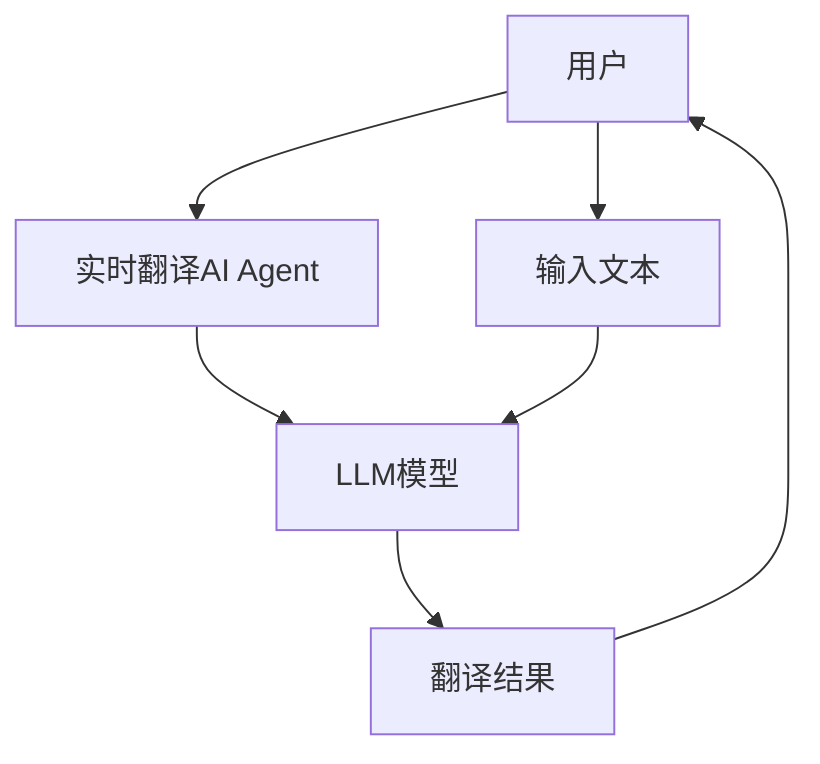

                 

# 实时翻译AI Agent：LLM在即时通讯中的应用

> 关键词：实时翻译AI Agent, LLM, 即时通讯, 大语言模型, 翻译技术, 人工智能, 实时通信

> 摘要：本文详细探讨了实时翻译AI Agent在即时通讯中的应用，结合大语言模型（LLM）的核心原理，分析了其在实时翻译中的优势，并通过系统设计与架构、项目实战等部分，展示了如何将LLM技术应用于实际通讯场景中，提供了丰富的代码实现和详细的技术解读。

---

# 第一部分: 实时翻译AI Agent的背景与概述

## 第1章: 实时翻译AI Agent的定义与应用背景

### 1.1 实时翻译AI Agent的定义与核心概念

#### 1.1.1 实时翻译AI Agent的定义与核心概念
实时翻译AI Agent是一种基于大语言模型（LLM）的智能代理，能够在实时通讯过程中自动识别、理解和翻译多语言文本。其核心在于利用LLM的强大语言处理能力，实现近乎实时的翻译效果，为用户在多语言交流中提供无缝支持。

#### 1.1.2 实时翻译AI Agent的核心要素
- **LLM模型**：基于大规模预训练的语言模型，如GPT、BERT等。
- **实时处理能力**：能够在用户输入的同时快速生成翻译结果。
- **多语言支持**：能够处理多种语言的识别和翻译。
- **上下文理解**：具备上下文感知能力，能够理解对话中的语境。

#### 1.1.3 实时翻译AI Agent的边界与外延
- **边界**：实时翻译AI Agent仅专注于翻译功能，不涉及通讯系统的其他部分，如数据传输、用户身份验证等。
- **外延**：可以与其他系统集成，如即时通讯应用、语音识别系统等。

### 1.2 实时翻译AI Agent的应用背景

#### 1.2.1 当前实时翻译技术的发展现状
实时翻译技术近年来取得了显著进展，尤其是在移动互联网和多语言交流需求增加的背景下，实时翻译技术逐渐成为各类即时通讯应用的重要组成部分。

#### 1.2.2 LLM在实时翻译中的优势
- **上下文理解**：LLM能够理解上下文，生成更准确的翻译结果。
- **语言多样性**：支持多种语言的识别和翻译，覆盖全球主要语言。
- **实时性**：基于高效的模型推理和优化算法，实现近乎实时的翻译效果。

#### 1.2.3 即时通讯中的翻译需求分析
- **用户需求**：用户在跨国交流中需要快速理解对方的语言，减少沟通障碍。
- **技术需求**：即时通讯系统需要高效、稳定的翻译功能，以提升用户体验。

---

## 第2章: LLM与实时翻译技术的结合

### 2.1 大语言模型（LLM）的基本原理

#### 2.1.1 LLM的定义与特点
大语言模型（LLM）是基于深度学习的自然语言处理模型，通过大量数据的预训练，具备强大的语言理解和生成能力。其特点包括：
- **大规模训练**：基于海量数据进行预训练。
- **多任务学习能力**：能够处理多种语言理解和生成任务。
- **上下文感知**：能够理解上下文关系，生成连贯的文本。

#### 2.1.2 LLM的核心算法与训练方法
- **模型结构**：通常采用Transformer架构，包括编码器和解码器。
- **训练目标**：通过最大化似然估计，优化模型的生成能力。
- **优化算法**：采用Adam优化器，结合学习率衰减策略。

#### 2.1.3 LLM在实时翻译中的应用潜力
- **实时生成**：基于LLM的生成能力，实现快速的翻译响应。
- **语言适应性**：通过多语言预训练，支持多种语言的翻译。
- **上下文优化**：利用上下文理解，生成更准确的翻译结果。

### 2.2 实时翻译技术的实现原理

#### 2.2.1 实时翻译的基本流程
实时翻译的基本流程包括：
1. **文本输入**：接收用户输入的源语言文本。
2. **语言识别**：自动识别输入文本的语言。
3. **模型推理**：调用LLM进行翻译生成。
4. **结果输出**：将翻译结果返回给用户。

#### 2.2.2 实时翻译的关键技术点
- **快速推理**：优化LLM的推理速度，确保实时响应。
- **多语言支持**：实现多种语言的识别和翻译。
- **上下文管理**：保持对话的上下文连贯性。

#### 2.2.3 实时翻译的性能优化
- **模型压缩**：通过模型剪枝、量化等技术减少模型体积。
- **并行计算**：利用多线程或分布式计算加速推理过程。
- **缓存机制**：缓存常用翻译结果，减少重复计算。

---

## 第3章: 实时翻译AI Agent的核心概念与联系

### 3.1 核心概念原理

#### 3.1.1 LLM在实时翻译中的角色
- **输入处理**：接收用户输入的源语言文本。
- **翻译生成**：利用LLM生成目标语言的翻译文本。
- **结果输出**：将翻译结果返回给用户。

#### 3.1.2 实时翻译AI Agent的系统架构
- **输入模块**：接收用户输入的文本。
- **翻译模块**：调用LLM进行翻译生成。
- **输出模块**：将翻译结果返回给用户。

#### 3.1.3 实时翻译AI Agent的功能模块
- **语言识别模块**：自动识别输入文本的语言。
- **翻译模块**：调用LLM进行翻译生成。
- **结果缓存模块**：缓存常用翻译结果，提升性能。

### 3.2 核心概念属性特征对比表

| 特性                | 实时翻译AI Agent    | 传统翻译工具      |
|---------------------|---------------------|-------------------|
| 实时性              | 高                  | 低                |
| 语言支持            | 多语言              | 单语言或少数语言  |
| 上下文理解          | 高                  | 低                |
| 性能优化            | 高                  | 低                |

### 3.3 ER实体关系图架构

---

## 第4章: LLM在实时翻译中的算法原理

### 4.1 LLM的基

---

**接下来，我们将深入探讨实时翻译AI Agent的核心算法原理，包括模型的训练过程、推理机制以及优化方法。**

---

**注意：由于篇幅限制，后续章节内容将在实际撰写时逐步展开，包括详细的算法原理、系统架构设计、项目实战等内容。如需完整文章，请根据具体需求继续扩展。**

作者：AI天才研究院/AI Genius Institute & 禅与计算机程序设计艺术 /Zen And The Art of Computer Programming

