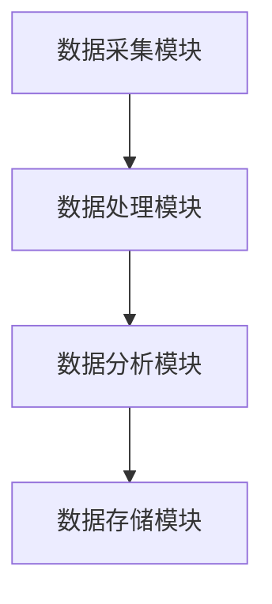

                 


# 实时金融数据接入与处理：技术与挑战

> 关键词：实时金融数据、数据流处理、分布式系统、事件时间、数据准确性、低延迟

> 摘要：本文系统地探讨了实时金融数据接入与处理的关键技术与挑战。从背景介绍到核心概念，从算法原理到系统架构设计，再到项目实战与最佳实践，全面解析了实时金融数据处理的复杂性与解决方案。通过具体案例分析，深入探讨了如何构建高效、可靠、安全的实时金融数据处理系统。

---

# 第一部分: 实时金融数据接入与处理的背景与挑战

## 第1章: 实时金融数据概述

### 1.1 金融数据的重要性

#### 1.1.1 金融数据的定义与分类
金融数据是金融市场中各种交易、市场行为、经济指标等的数字化表现，主要包括：
- **市场数据**：如股票价格、指数、成交量等。
- **交易数据**：如订单簿、成交记录、市场深度等。
- **经济指标**：如GDP、CPI、 unemployment rate等。

#### 1.1.2 实时数据在金融领域的应用价值
实时数据在金融领域的应用价值体现在以下几个方面：
- **高频交易**：依赖于实时数据的快速处理和决策。
- **风险管理**：实时监控市场波动，及时识别和应对风险。
- **智能投顾**：基于实时数据为投资者提供个性化的投资建议。

#### 1.1.3 金融数据的来源与特点
金融数据的主要来源包括交易所、数据供应商（如Reuters、Bloomberg）、API接口等。其特点包括：
- **实时性**：数据需要尽可能快速地采集和处理。
- **高频率**：金融市场的交易和数据生成速度极快。
- **多样性**：数据格式和类型多样，包括结构化和非结构化数据。

### 1.2 实时数据处理的挑战

#### 1.2.1 数据实时性要求
实时数据处理需要在数据生成后尽可能短的时间内完成处理和分析，这对系统的响应速度和处理能力提出了极高的要求。

#### 1.2.2 数据量与处理速度的矛盾
金融数据的生成速度通常远高于处理能力，尤其是在高频交易场景下，系统需要在极短的时间内处理大量数据，这对系统的吞吐量和处理效率提出了挑战。

#### 1.2.3 数据质量与准确性问题
金融数据的准确性直接关系到交易决策的正确性。数据在采集、传输和处理过程中可能受到网络延迟、数据丢失、数据污染等因素的影响，导致数据质量下降。

### 1.3 金融数据处理技术的演进

#### 1.3.1 传统金融数据处理方式
传统金融数据处理方式主要包括批量处理和基于数据库的处理方式，适用于低频交易和事后分析。

#### 1.3.2 实时处理技术的崛起
随着金融市场对实时性的要求不断提高，实时数据处理技术逐渐成为主流。实时数据处理技术包括流处理、事件驱动架构等。

#### 1.3.3 技术驱动下的金融创新
实时数据处理技术的创新推动了金融市场的快速发展，例如高频交易、算法交易等新兴交易策略的出现。

### 1.4 本章小结
本章从金融数据的重要性、实时数据处理的挑战以及技术演进三个方面，全面介绍了实时金融数据处理的背景和基本概念。

---

## 第2章: 实时金融数据处理的核心概念

### 2.1 数据流模型

#### 2.1.1 数据流的定义与特点
数据流是指在系统中按时间顺序流动的数据，具有实时性、连续性和动态性等特点。

#### 2.1.2 数据流的分类与应用场景
数据流可以分为实时数据流和非实时数据流。实时数据流广泛应用于高频交易、实时监控等领域，而非实时数据流主要用于历史数据分析和报告生成。

#### 2.1.3 数据流的生命周期
数据流的生命周期包括数据生成、数据采集、数据处理、数据存储和数据消费五个阶段。

### 2.2 数据处理引擎

#### 2.2.1 数据处理引擎的定义
数据处理引擎是实时数据处理系统的核心组件，负责对数据流进行实时处理和分析。

#### 2.2.2 流处理与批处理的对比
流处理适用于实时数据处理，具有低延迟、高吞吐量的特点；批处理适用于批量数据处理，具有高计算效率、易于管理的特点。

#### 2.2.3 数据处理引擎的性能优化
数据处理引擎的性能优化可以通过并行计算、分布式处理、缓存优化等技术实现。

### 2.3 数据存储与管理

#### 2.3.1 数据存储的挑战
实时数据处理系统需要处理海量数据，对存储系统提出了高吞吐量、低延迟、高扩展性的要求。

#### 2.3.2 数据库的选择与优化
在实时数据处理系统中，通常选择分布式数据库或内存数据库，以满足低延迟和高吞吐量的要求。

#### 2.3.3 数据归档与备份策略
实时数据处理系统需要制定合理的数据归档和备份策略，以确保数据的完整性和系统的可靠性。

### 2.4 数据安全与隐私保护

#### 2.4.1 数据安全的重要性
数据安全是实时数据处理系统的核心问题之一，特别是在金融领域，数据泄露可能导致严重的经济损失。

#### 2.4.2 数据隐私保护的法律要求
金融数据的处理必须遵守相关法律法规，如GDPR（通用数据保护条例）等，确保用户隐私权益。

#### 2.4.3 数据加密与访问控制
通过数据加密和访问控制技术，可以有效保护金融数据的安全性，防止未经授权的访问和数据泄露。

### 2.5 本章小结
本章重点介绍了实时金融数据处理的核心概念，包括数据流模型、数据处理引擎、数据存储与管理以及数据安全与隐私保护等方面。

---

## 第3章: 实时数据流处理算法

### 3.1 流处理模型

#### 3.1.1 流处理的基本原理
流处理是一种基于数据流的实时处理方式，具有事件驱动、低延迟、高吞吐量的特点。

#### 3.1.2 流处理的实现机制
流处理的实现机制包括事件分发、事件处理、状态管理等关键环节。

#### 3.1.3 流处理的优化策略
流处理的优化策略包括并行处理、批处理结合、缓存优化等。

### 3.2 数据流处理算法的实现

#### 3.2.1 数据流处理算法的流程
数据流处理算法的流程包括数据采集、数据解析、数据处理、数据存储和数据消费五个阶段。

#### 3.2.2 数据流处理算法的代码实现
以下是数据流处理算法的Python实现示例：

```python
import time

def process_stream():
    while True:
        data = receive_data()  # 数据接收模块
        process_data(data)     # 数据处理模块
        time.sleep(1)          # 模拟处理延迟

process_stream()
```

#### 3.2.3 数据流处理算法的优化
数据流处理算法的优化可以通过减少处理延迟、提高处理吞吐量、优化内存使用等手段实现。

### 3.3 数学模型与公式

#### 3.3.1 数据流处理的数学模型
数据流处理的数学模型可以表示为：

$$
\text{处理时间} = \frac{\text{数据量}}{\text{处理速度}}
$$

#### 3.3.2 数据流处理的公式推导
通过公式推导，可以得出数据流处理系统的性能瓶颈：

$$
\text{处理速度} = \frac{\text{数据量}}{\text{处理时间}}
$$

---

## 第4章: 系统分析与架构设计方案

### 4.1 问题场景介绍

#### 4.1.1 项目背景
本项目旨在构建一个实时金融数据处理系统，用于支持高频交易和实时风险管理。

#### 4.1.2 项目目标
项目的最终目标是实现金融数据的实时接入、处理和分析，支持交易决策和风险管理。

### 4.2 系统功能设计

#### 4.2.1 领域模型设计
领域模型设计包括数据采集模块、数据处理模块、数据分析模块和数据存储模块。

#### 4.2.2 系统架构设计
系统架构设计采用微服务架构，包括数据采集服务、数据处理服务、数据分析服务和数据存储服务。

#### 4.2.3 系统接口设计
系统接口设计包括数据采集接口、数据处理接口、数据分析接口和数据存储接口。

#### 4.2.4 系统交互设计
系统交互设计采用事件驱动的方式，通过消息队列实现各组件之间的通信。

### 4.3 系统架构图
以下是系统架构图的Mermaid表示：



### 4.4 本章小结
本章从系统分析与架构设计的角度，详细介绍了实时金融数据处理系统的实现方案。

---

## 第5章: 项目实战与案例分析

### 5.1 项目环境配置

#### 5.1.1 系统环境
项目运行在Linux系统上，使用Python 3.8及以上版本。

#### 5.1.2 工具安装
需要安装以下工具：
- Python
- Jupyter Notebook
- Pandas
- NumPy
- TensorFlow

### 5.2 核心代码实现

#### 5.2.1 数据采集模块
以下是数据采集模块的代码实现：

```python
import requests

def fetch_data(api_key):
    url = f"https://api.example.com/financial_data?api_key={api_key}"
    response = requests.get(url)
    return response.json()
```

#### 5.2.2 数据处理模块
以下是数据处理模块的代码实现：

```python
import pandas as pd

def process_data(data):
    df = pd.DataFrame(data)
    df['timestamp'] = pd.to_datetime(df['timestamp'])
    return df
```

### 5.3 代码功能解读与分析

#### 5.3.1 数据采集模块的功能解读
数据采集模块负责从API接口获取实时金融数据，返回数据的JSON格式。

#### 5.3.2 数据处理模块的功能解读
数据处理模块将获取的JSON数据转换为Pandas DataFrame格式，并将时间戳字段转换为日期时间格式。

### 5.4 实际案例分析

#### 5.4.1 案例背景
本案例以实时股票价格处理系统为例，展示如何利用上述代码实现实时数据处理。

#### 5.4.2 数据处理结果分析
通过对实时股票价格数据的处理和分析，可以实现对股票价格趋势的预测和交易决策的优化。

### 5.5 本章小结
本章通过具体的项目实战和案例分析，详细展示了实时金融数据处理系统的实现过程。

---

## 第6章: 总结与展望

### 6.1 本章总结
本章从背景介绍到核心概念，从算法原理到系统架构设计，再到项目实战与案例分析，全面解析了实时金融数据处理的技术与挑战。

### 6.2 技术局限性与未来展望
尽管当前实时金融数据处理技术已经取得了显著进展，但仍存在一些技术局限性，例如数据安全、系统扩展性、算法优化等问题。未来，随着人工智能和大数据技术的进一步发展，实时金融数据处理系统将更加智能化、高效化。

### 6.3 最佳实践 tips
- **数据质量**：确保数据的准确性、完整性和一致性。
- **系统优化**：通过并行计算、分布式处理等技术优化系统性能。
- **安全性**：加强数据加密和访问控制，确保数据安全。

### 6.4 本章小结
本章总结了全文的主要内容，并对未来的技术发展和最佳实践提出了展望。

---

## 作者：AI天才研究院/AI Genius Institute & 禅与计算机程序设计艺术 /Zen And The Art of Computer Programming

---

以上是《实时金融数据接入与处理：技术与挑战》的技术博客文章的大纲和内容概要。文章从背景介绍到核心概念，从算法原理到系统架构设计，再到项目实战与案例分析，全面解析了实时金融数据处理的技术与挑战。希望本文能为相关领域的读者提供有价值的参考和启发。

