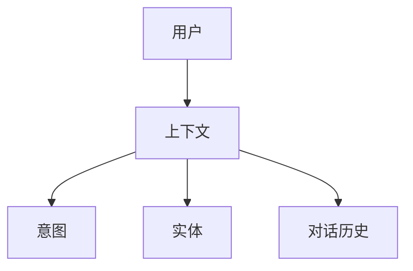
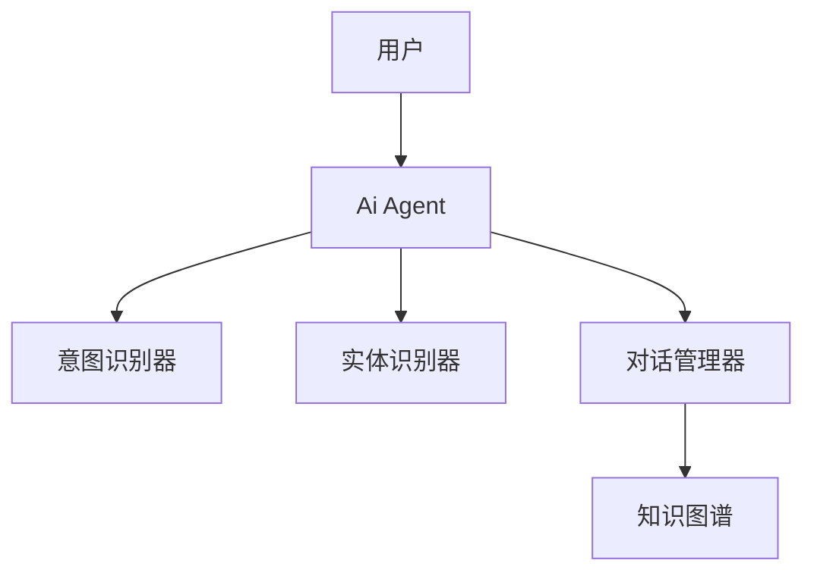

                 


# 实现AI Agent的上下文理解与管理

> 关键词：AI Agent, 上下文理解, 知识图谱, 对话系统, 自然语言处理, 机器学习

> 摘要：本文详细探讨了AI Agent实现上下文理解与管理的核心原理、算法设计、系统架构及实际应用。通过分析上下文理解的关键技术，结合知识图谱、对话管理和语义表示等方法，本文提出了一个系统的实现框架，并通过具体案例展示了如何在实际项目中应用这些技术，以实现高效智能的AI Agent交互。

---

## 第一部分: AI Agent的上下文理解与管理背景

### 第1章: 上下文理解与管理概述

#### 1.1 问题背景与定义
- **什么是上下文？**  
  上下文是指在特定场景中，与当前任务相关的所有信息、历史记录和知识。在AI Agent中，上下文理解是指系统能够识别和理解用户输入中的隐含信息，以便更好地响应用户需求。

- **上下文在AI Agent中的重要性**  
  AI Agent需要通过上下文理解用户的意图和需求，从而提供更精准的服务。例如，在智能音箱中，用户可能说“明天北京的天气怎么样”，AI Agent需要结合当前时间、用户位置等上下文信息来准确回答。

- **问题描述**  
  AI Agent面临的上下文理解挑战包括：信息不完整、意图模糊、历史记录复杂等。例如，用户可能在多个对话轮次中提到不同信息，AI Agent需要将这些信息整合到上下文中。

- **解决思路**  
  通过自然语言处理（NLP）技术，结合知识图谱和对话管理，构建一个能够理解上下文的AI Agent系统。

#### 1.2 核心概念与联系
- **语义理解**  
  语义理解是通过分析文本的深层含义，识别用户的意图和实体。例如，用户说“我需要一个附近的咖啡馆”，AI Agent需要识别“附近的”作为位置限制，以及“咖啡馆”作为目标服务。

- **知识图谱**  
  知识图谱是一种结构化的知识表示方式，能够帮助AI Agent理解上下文中的实体关系。例如，将“附近的”与“咖啡馆”关联起来，AI Agent可以更好地理解用户的需求。

- **对话管理**  
  对话管理是通过维护对话历史，跟踪用户的意图变化，优化后续的对话流程。例如，用户在对话中提到“下雨了”，AI Agent可以根据历史记录调整回复内容。

- **ER实体关系图**  
  下面是一个简单的ER实体关系图，展示了上下文理解中的核心实体及其关系：



---

## 第二部分: 核心概念与联系

### 第2章: 上下文理解的核心原理

#### 2.1 语义理解的基本原理
- **词义歧义**  
  词语在不同的上下文中可能有不同的含义。例如，“银行”可以指金融机构，也可以指河流的堤岸。

- **上下文消解**  
  通过结合上下文信息，AI Agent可以消除词义歧义。例如，当用户提到“存钱”，AI Agent可以根据上下文判断是否是指银行存款。

- **知识库支持**  
  使用知识图谱等外部知识库，AI Agent可以更准确地理解上下文中的实体关系。例如，知道“银行”和“存款”之间的关联。

#### 2.2 知识表示的原理
- **符号表示**  
  使用符号（如关键词、标签）表示实体和关系。例如，“银行”可以用符号`:Bank`表示。

- **向量表示**  
  使用词嵌入（如Word2Vec、BERT）将词语转化为向量，捕捉词语的语义信息。例如，向量表示可以用于计算词语的相关性。

- **知识图谱构建**  
  通过爬取和分析数据，构建知识图谱，存储实体和关系。例如，构建一个包含地理位置、服务类型的知识图谱，帮助AI Agent理解用户需求。

#### 2.3 对话管理的原理
- **状态跟踪**  
  AI Agent需要跟踪对话的状态，包括当前意图、用户需求等。例如，用户在对话中提到“预约”，AI Agent需要记录用户的预约需求。

- **意图识别**  
  通过NLP技术，AI Agent识别用户的意图。例如，用户说“我要订火车票”，AI Agent识别到用户的意图是“订票”。

- **对话历史维护**  
  AI Agent维护对话历史，以便在后续对话中参考。例如，用户提到“周五”，AI Agent需要记住这个时间点。

---

## 第三部分: 算法原理与实现

### 第3章: 基于向量的语义表示

#### 3.1 Word2Vec模型
- **Word2Vec原理**  
  Word2Vec通过将词语映射到向量空间，捕捉词语的语义信息。例如，“king”和“queen”向量相似，表示它们语义相近。

- **训练过程**  
  使用_skip-gram_或_CBOW_模型训练词嵌入。例如，输入词语“king”，模型预测其上下文词语（如“man”）。

- **应用场景**  
  Word2Vec可以用于上下文理解中的意图识别和实体识别。例如，通过向量相似度判断用户意图。

#### 3.2 BERT模型
- **BERT原理**  
  BERT通过预训练，学习上下文的语义表示。例如，BERT可以理解“我今天没空”的上下文含义。

- **微调任务**  
  在特定任务上微调BERT，例如意图识别和实体识别。例如，微调BERT进行对话意图分类。

- **优势**  
  BERT能够捕捉长距离依赖关系，适合复杂上下文理解任务。

#### 3.3 对比与选择
- **Word2Vec vs BERT**  
  Word2Vec适用于小规模任务，BERT适用于大规模复杂任务。

- **选择建议**  
  根据任务需求选择模型。例如，对于简单意图识别，Word2Vec足够；对于复杂对话理解，选择BERT。

---

## 第四部分: 系统分析与架构设计

### 第4章: 系统架构设计

#### 4.1 问题场景介绍
- **场景描述**  
  AI Agent需要处理多个对话轮次，理解用户的上下文信息，提供准确服务。

- **系统介绍**  
  本文设计了一个基于知识图谱和对话管理的AI Agent系统，实现上下文理解与管理。

#### 4.2 系统功能设计
- **领域模型**  
  定义系统的核心功能模块，例如意图识别、实体识别、对话管理。

- **功能模块说明**  
  - 意图识别：识别用户意图。
  - 实体识别：识别文本中的实体。
  - 对话管理：维护对话历史和上下文。

#### 4.3 系统架构图


---

## 第五部分: 项目实战

### 第5章: 实际项目案例

#### 5.1 环境安装
- **安装Python库**  
  使用spaCy、transformers等库进行NLP处理。

- **安装框架**  
  使用Rasa框架构建对话系统。

#### 5.2 核心代码实现
```python
from transformers import pipeline

# 初始化意图识别器
intent_classifier = pipeline("text-classification", model="bert-base")

# 初始化实体识别器
ner = pipeline("ner", model="bert-base")

# 对话管理器
class DialogManager:
    def __init__(self):
        self.dialog_history = []
    
    def process_input(self, user_input):
        intent = intent_classifier(user_input)
        entities = ner(user_input)
        self.dialog_history.append((intent, entities))
        return intent, entities
```

#### 5.3 案例分析
- **案例描述**  
  用户与AI Agent对话，AI Agent需要理解上下文并提供服务。

- **代码解读**  
  使用上述代码，AI Agent可以处理用户输入，识别意图和实体，维护对话历史。

---

## 第六部分: 最佳实践与小结

### 第6章: 最佳实践

#### 6.1 注意事项
- **数据质量**  
  数据质量直接影响上下文理解的准确性。

- **模型选择**  
  根据任务需求选择合适的模型，避免过度复杂化。

#### 6.2 小结
- **总结**  
  本文详细介绍了AI Agent上下文理解与管理的核心技术，包括语义理解、知识图谱和对话管理。

- **未来方向**  
  未来研究可以关注多模态上下文理解、动态知识更新等方向。

---

## 作者：AI天才研究院 & 禅与计算机程序设计艺术

---

本文详细探讨了AI Agent实现上下文理解与管理的核心原理、算法设计、系统架构及实际应用。通过分析上下文理解的关键技术，结合知识图谱、对话管理和语义表示等方法，本文提出了一个系统的实现框架，并通过具体案例展示了如何在实际项目中应用这些技术，以实现高效智能的AI Agent交互。

