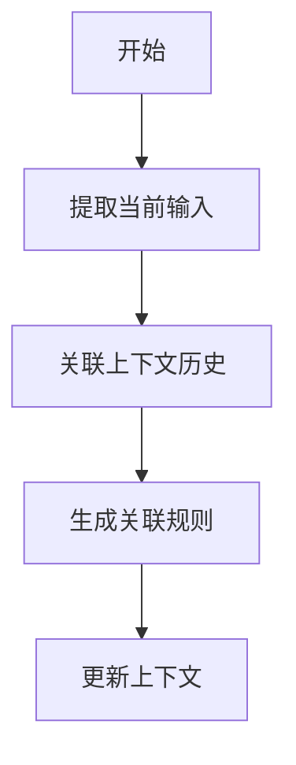
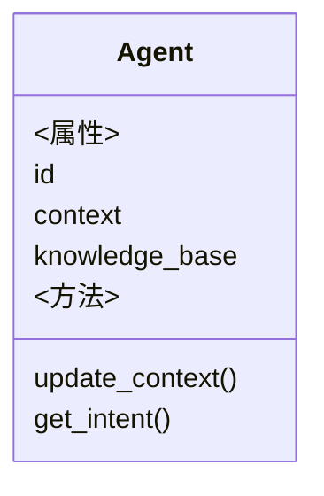
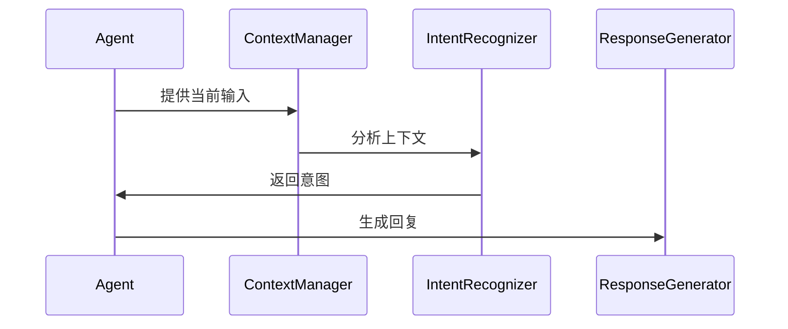

                 


# 实现AI Agent的上下文管理：保持对话连贯性

## 关键词：
AI Agent、上下文管理、对话连贯性、记忆机制、意图识别、系统架构

## 摘要：
本文详细探讨了AI Agent中上下文管理的核心原理、算法实现、系统架构设计以及实际应用场景。通过分析上下文管理的重要性，结合记忆机制和意图识别技术，本文提出了一个完整的上下文管理系统解决方案，并通过实际案例展示了如何在AI Agent中实现对话的连贯性。

---

# 第一部分: AI Agent上下文管理背景与核心概念

## 第1章: 上下文管理在AI Agent中的重要性

### 1.1 问题背景与描述
#### 1.1.1 对话连贯性的定义与重要性
对话连贯性是指在连续的对话过程中，AI Agent能够根据上下文信息保持逻辑一致性和语义连贯性。它是实现自然人机交互的核心能力，直接影响用户体验和任务完成度。

#### 1.1.2 上下文管理的核心问题
- 如何存储和管理对话历史信息？
- 如何关联当前输入与上下文信息？
- 如何根据上下文信息生成连贯的回复？

#### 1.1.3 AI Agent中的上下文管理挑战
- 上下文信息的多样性和复杂性
- 对话历史的存储与检索效率
- 动态上下文的实时更新与关联

### 1.2 问题解决与边界
#### 1.2.1 上下文管理的解决方案
- 基于记忆机制的上下文管理
- 基于意图识别的上下文关联

#### 1.2.2 上下文管理的边界与外延
- 上下文管理的边界：仅关注对话相关的信息
- 上下文管理的外延：与知识库、推理引擎的结合

#### 1.2.3 核心概念与关键要素
- 上下文：对话中的历史信息、当前输入和相关实体
- 记忆机制：存储和管理上下文信息的策略
- 意图识别：根据上下文信息推断用户意图

## 第2章: 上下文管理的核心概念与联系

### 2.1 核心概念原理
#### 2.1.1 上下文的定义与属性
- 上下文是对话中的历史信息和当前输入的集合
- 上下文属性包括时间、参与者、实体、意图等

#### 2.1.2 上下文管理的流程与机制
- 信息提取：从输入中提取实体和意图
- 关联上下文：根据上下文属性建立关联
- 更新上下文：根据对话进展实时更新

### 2.2 概念对比与ER实体关系图
#### 2.2.1 不同上下文管理方法的对比分析
| 方法 | 优点 | 缺点 |
|------|------|------|
| 基于规则 | 简单易实现 | 无法处理复杂场景 |
| 基于记忆 | 强大的存储能力 | 需要高效的检索机制 |
| 基于意图识别 | 高准确性 | 需要依赖意图识别模型 |

#### 2.2.2 ER实体关系图的构建与分析
```mermaid
er
actor(Agent) --> association(Manages) --> entity(Context)
```

---

# 第二部分: 上下文管理的算法原理

## 第3章: 上下文管理的关键算法

### 3.1 记忆机制与意图识别
#### 3.1.1 基于记忆的上下文管理算法
- 记忆机制的核心是存储和检索上下文信息
- 基于记忆的算法通过关联规则挖掘实现上下文的动态更新

#### 3.1.2 意图识别的数学模型
$$ P(\text{intent} | \text{context}) = \frac{P(\text{context} | \text{intent}) \cdot P(\text{intent})}{P(\text{context})} $$

### 3.2 上下文更新与关联规则
#### 3.2.1 上下文更新算法


## 第4章: 算法实现与代码解析

### 4.1 算法实现
#### 4.1.1 记忆机制的Python实现
```python
class ContextManager:
    def __init__(self):
        self.memory = {}
    
    def update_context(self, key, value):
        self.memory[key] = value
    
    def get_context(self, key):
        return self.memory.get(key, None)
```

---

# 第三部分: 上下文管理的系统分析与架构设计

## 第5章: 系统分析与架构设计

### 5.1 问题场景介绍
- 一个典型的对话场景：用户与AI Agent的交互

### 5.2 系统功能设计
#### 5.2.1 领域模型


#### 5.2.2 系统架构设计


### 5.3 接口与交互设计
#### 5.3.1 接口设计
- `update_context(key, value)`
- `get_context(key)`

#### 5.3.2 交互流程


---

# 第四部分: 项目实战

## 第6章: 项目实战

### 6.1 环境安装
- 安装Python和相关库：`pip install python-mermaid`

### 6.2 核心代码实现
```python
class Agent:
    def __init__(self):
        self.context_manager = ContextManager()
    
    def handle_input(self, input_str):
        # 提取上下文
        context = self.context_manager.get_context('current_context')
        # 更新上下文
        self.context_manager.update_context('intent', 'greeting')
        # 生成回复
        response = "Hello! How can I help you today?"
        return response
```

### 6.3 案例分析与解读
- 实际案例：用户与AI Agent的对话流程
- 代码分析：上下文的提取与更新

### 6.4 项目总结
- 项目实现的关键点
- 上下文管理在实际应用中的效果

---

# 第五部分: 最佳实践与总结

## 第7章: 最佳实践与小结

### 7.1 最佳实践 tips
- 定期清理无用的上下文信息
- 使用高效的意图识别模型
- 结合知识库提升上下文管理能力

### 7.2 小结
- 上下文管理是实现AI Agent对话连贯性的关键
- 通过记忆机制和意图识别可以有效管理上下文
- 系统架构设计和代码实现是落地的核心

### 7.3 注意事项
- 注意上下文信息的存储效率
- 确保意图识别的准确性
- 定期优化上下文管理算法

### 7.4 拓展阅读
- 《自然语言处理实战》
- 《机器学习中的上下文管理》
- 《AI Agent的设计与实现》

---

# 作者：AI天才研究院/AI Genius Institute & 禅与计算机程序设计艺术 /Zen And The Art of Computer Programming

---

**本文由AI天才研究院倾心撰写，转载请注明出处。**

