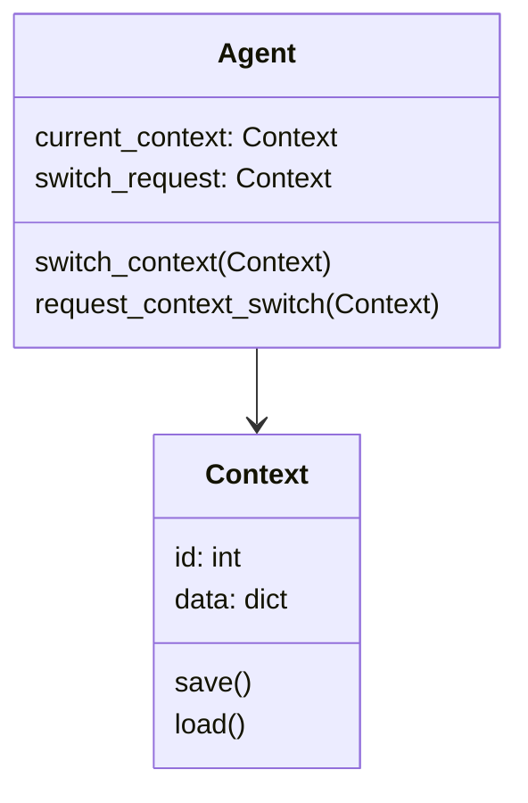
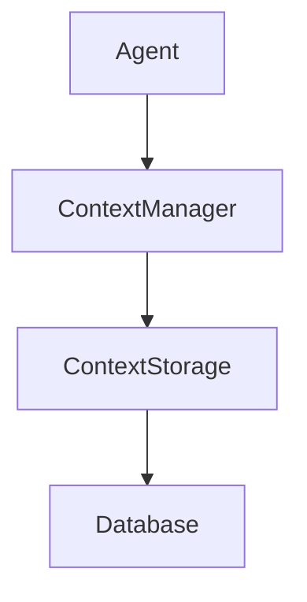

                 


# 实现AI Agent的动态上下文切换机制

## 关键词：AI Agent，动态上下文切换，状态管理，系统架构，算法原理

## 摘要：  
AI Agent的动态上下文切换机制是实现智能化系统的核心技术之一。本文详细探讨了动态上下文切换的原理、算法实现、系统架构设计及实际应用案例。通过分析问题背景、核心概念、算法原理、系统架构和项目实战，本文为读者提供了一个全面的理解框架，帮助其掌握AI Agent动态上下文切换机制的设计与实现方法。

---

# 第1章: 动态上下文切换机制的背景与问题背景

## 1.1 问题背景与问题描述

### 1.1.1 AI Agent的基本概念与功能  
AI Agent（智能体）是一种能够感知环境、自主决策并执行任务的实体。它广泛应用于自然语言处理、推荐系统、机器人控制等领域。AI Agent的核心功能包括感知、推理、决策和执行。

### 1.1.2 动态上下文切换的核心问题  
在实际应用中，AI Agent需要在不同任务或场景之间切换，每次切换都需要加载新的上下文（Context），包括任务目标、环境信息、历史数据等。动态上下文切换机制的核心问题是：如何高效、准确地管理上下文切换，以确保AI Agent在不同任务之间的切换无缝且高效。

### 1.1.3 问题的边界与外延  
动态上下文切换的边界包括：上下文的加载与卸载、切换的触发条件、切换的性能优化。外延则涉及与上下文相关的任务调度、状态管理、异常处理等问题。

---

## 1.2 动态上下文切换机制的核心要素

### 1.2.1 上下文的定义与特征  
上下文是一个包含任务相关信息的集合，包括任务目标、环境状态、历史数据等。动态上下文切换的关键在于如何管理和切换这些上下文。

### 1.2.2 切换的触发条件与流程  
切换触发条件包括任务完成、新任务到达、环境变化等。切换流程包括：检测触发条件、加载新上下文、保存旧上下文、执行切换。

### 1.2.3 切换的性能与效率  
动态上下文切换的性能直接影响系统的响应速度和用户体验。优化切换性能是实现高效动态上下文切换的核心目标。

---

## 1.3 本章小结  
本章从问题背景、核心概念和实现要素三个方面介绍了动态上下文切换机制。通过理解这些内容，读者可以掌握动态上下文切换的基本概念和实现目标。

---

# 第2章: 动态上下文切换机制的核心原理

## 2.1 核心原理概述

### 2.1.1 上下文管理的算法原理  
动态上下文切换的核心是上下文管理，包括上下文的存储、加载和卸载。算法原理包括上下文的生命周期管理和切换逻辑。

### 2.1.2 切换机制的实现方式  
切换机制包括基于时间的切换、基于事件的切换和基于状态的切换。每种切换方式都有其优缺点和适用场景。

### 2.1.3 动态上下文切换的数学模型  
动态上下文切换的数学模型包括状态转移矩阵和切换时间计算公式，用于描述上下文切换的动态过程。

---

## 2.2 核心概念的属性特征对比

### 2.2.1 上下文与任务的关系  
上下文是任务的支撑，任务的执行依赖于上下文的正确加载和切换。

### 2.2.2 切换机制与性能的关系  
切换机制的设计直接影响系统的性能，包括响应时间、资源消耗等。

### 2.2.3 实体关系图（ER图）  
以下是上下文切换的ER图：

```mermaid
erd
    title 动态上下文切换机制的实体关系图
    Context
    Agent
    Task
    switch(Agent, Context)
    contains(Agent, Task)
```

---

## 2.3 本章小结  
本章从算法原理和核心概念两个方面深入探讨了动态上下文切换机制的实现原理，通过对比和ER图的分析，帮助读者理解其实现方式和关键要素。

---

# 第3章: 动态上下文切换算法的实现

## 3.1 算法原理概述

### 3.1.1 切换条件判断流程  
切换条件判断流程包括检测触发条件、验证切换合法性、触发切换操作。

### 3.1.2 上下文加载与卸载过程  
上下文加载包括加载新上下文和保存旧上下文，卸载过程包括释放资源和清除数据。

### 3.1.3 切换过程中的状态管理  
状态管理包括切换前的状态保存、切换后的状态恢复和异常处理。

---

## 3.2 算法实现的数学模型

### 3.2.1 上下文切换的数学表达式  
上下文切换的数学表达式：

$$ C_{switch} = f(C_{current}, C_{target}) $$

### 3.2.2 状态转移矩阵  
状态转移矩阵：

$$ S_{next} = M \cdot S_{current} $$

### 3.2.3 切换时间的计算公式  
切换时间的计算公式：

$$ T_{switch} = \sum_{i=1}^{n} t_i $$

---

## 3.3 算法实现的Python代码

以下是动态上下文切换算法的Python代码实现：

```python
class Context:
    def __init__(self, id, data):
        self.id = id
        self.data = data

class Agent:
    def __init__(self):
        self.current_context = None
        self.switch_request = None

    def switch_context(self, target_context):
        # 切换上下文
        if self.current_context:
            # 保存旧上下文
            self.current_context.save()
        # 加载新上下文
        self.current_context = target_context
        self.switch_request = None

        return True

    def request_context_switch(self, target_context):
        # 请求切换上下文
        self.switch_request = target_context
        return True
```

---

## 3.4 本章小结  
本章详细讲解了动态上下文切换算法的实现原理，通过数学模型和Python代码的实现，帮助读者理解其实现方式和关键步骤。

---

# 第4章: 系统分析与架构设计

## 4.1 问题场景介绍

### 4.1.1 AI Agent的典型应用场景  
AI Agent的典型应用场景包括智能助手、推荐系统、自动化控制等。

### 4.1.2 动态上下文切换的业务流程  
动态上下文切换的业务流程包括任务请求、上下文加载、任务执行、上下文切换等。

### 4.1.3 系统的输入输出分析  
系统的输入包括任务请求和上下文切换请求，输出包括任务执行结果和上下文切换结果。

---

## 4.2 系统功能设计

### 4.2.1 领域模型类图  
以下是领域模型类图：



---

## 4.3 系统架构设计

### 4.3.1 系统架构图  
以下是系统架构图：



---

## 4.4 本章小结  
本章通过系统分析和架构设计，帮助读者理解动态上下文切换机制在实际系统中的实现方式和关键架构要素。

---

# 第5章: 项目实战

## 5.1 环境安装与配置

### 5.1.1 环境要求  
Python 3.8及以上版本，安装必要的库（如Mermaid、Graphviz）。

### 5.1.2 代码安装  
安装必要的依赖项，例如：

```bash
pip install mermaid
pip install graphviz
```

---

## 5.2 核心代码实现

### 5.2.1 动态上下文切换的Python实现  
以下是动态上下文切换的核心代码实现：

```python
class ContextManager:
    def __init__(self):
        self.contexts = {}

    def load_context(self, context_id):
        # 加载上下文
        if context_id in self.contexts:
            return self.contexts[context_id]
        else:
            return None

    def save_context(self, context):
        # 保存上下文
        self.contexts[context.id] = context

class Agent:
    def __init__(self, context_manager):
        self.context_manager = context_manager
        self.current_context = None
        self.switch_request = None

    def handle_context_switch(self):
        # 处理上下文切换
        if self.switch_request:
            new_context = self.context_manager.load_context(self.switch_request.id)
            if new_context:
                self.current_context = new_context
                self.switch_request = None
            else:
                print("Failed to load context")
```

---

## 5.3 案例分析与代码解读

### 5.3.1 案例分析  
以智能助手为例，当用户切换任务时，智能助手需要切换上下文。

### 5.3.2 代码解读  
通过代码解读，分析动态上下文切换的实现逻辑，包括上下文加载、切换请求处理等。

---

## 5.4 项目小结  
本章通过项目实战，帮助读者理解动态上下文切换机制的实现步骤和实际应用案例。

---

# 第6章: 最佳实践与注意事项

## 6.1 最佳实践 tips

### 6.1.1 上下文管理  
建议使用上下文管理器来管理上下文的加载和卸载。

### 6.1.2 性能优化  
优化上下文切换的性能，减少切换时间。

### 6.1.3 异常处理  
在切换过程中，需要处理可能的异常情况。

---

## 6.2 小结  
动态上下文切换机制是AI Agent实现的重要组成部分，通过本文的讲解和实战，读者可以掌握其实现方法和优化技巧。

---

## 6.3 注意事项

### 6.3.1 上下文切换的触发条件  
确保上下文切换的触发条件清晰明确。

### 6.3.2 切换过程中的状态管理  
确保切换过程中的状态管理正确无误。

### 6.3.3 性能优化  
在实现过程中，要注意性能优化，避免因上下文切换导致的系统性能下降。

---

## 6.4 拓展阅读  
建议读者阅读以下文献，以进一步深入理解动态上下文切换机制：
1. 《AI Agent的设计与实现》
2. 《动态上下文切换的算法优化》
3. 《系统架构设计的经典案例》

---

# 作者：AI天才研究院/AI Genius Institute & 禅与计算机程序设计艺术 /Zen And The Art of Computer Programming

---

通过本文的详细讲解，读者可以全面理解AI Agent动态上下文切换机制的实现方法，并能够将其应用到实际项目中。

