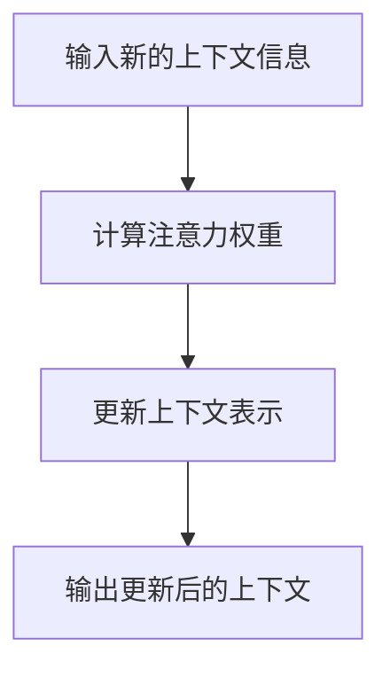
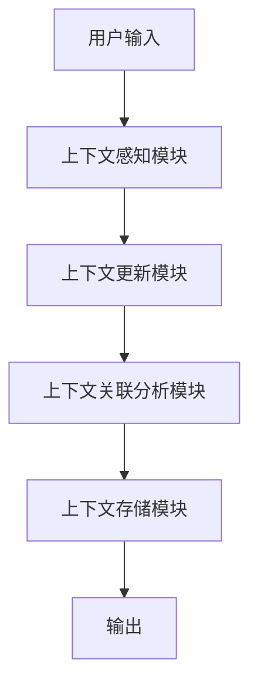
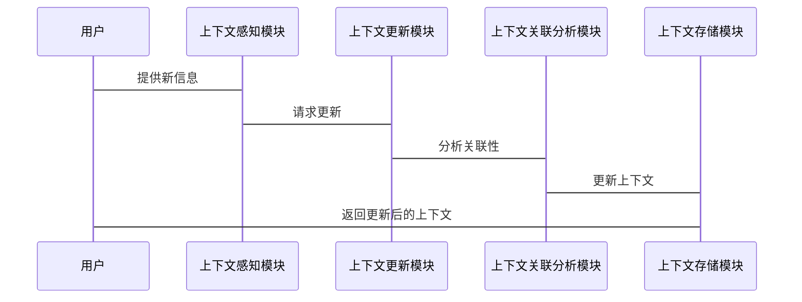

                 


# 实现AI Agent的动态上下文管理

> 关键词：AI Agent，动态上下文，上下文管理，算法原理，系统架构

> 摘要：本文详细探讨了AI Agent的动态上下文管理的实现方法。通过分析动态上下文管理的核心概念、算法原理、系统架构设计和项目实战，本文为读者提供了从理论到实践的全面指导。文章首先介绍了AI Agent和动态上下文管理的基本概念，然后深入分析了动态上下文管理的核心原理，包括上下文表示、动态更新和关联性。接着，本文详细讲解了基于注意力机制的动态上下文更新算法，并通过mermaid流程图和Python代码实现了算法的具体步骤。在系统架构设计部分，文章展示了动态上下文管理系统的功能模块、架构组件和交互流程。最后，通过项目实战，本文提供了环境安装、核心功能实现和案例分析的具体指导，帮助读者更好地理解和应用动态上下文管理技术。

---

## 第1章 AI Agent与动态上下文管理概述

### 1.1 AI Agent的基本概念

AI Agent（人工智能代理）是指能够感知环境、自主决策并执行任务的智能实体。AI Agent可以是软件程序、机器人或其他智能系统，其核心目标是通过与环境的交互来实现特定目标。

#### 1.1.1 什么是AI Agent
AI Agent是一种能够感知环境、处理信息、做出决策并执行动作的智能系统。它具备自主性、反应性、目标导向和社会能力等核心特征。

#### 1.1.2 AI Agent的核心特点
- **自主性**：AI Agent能够在没有外部干预的情况下自主运行。
- **反应性**：AI Agent能够实时感知环境并做出响应。
- **目标导向**：AI Agent的所有行为都围绕着实现特定目标展开。
- **社会能力**：AI Agent能够与其他Agent或人类进行交互和协作。

#### 1.1.3 动态上下文管理的定义
动态上下文管理是指在动态变化的环境中，AI Agent能够实时更新和维护其上下文信息的能力。上下文信息包括与任务相关的环境状态、历史交互记录和外部输入等。

---

### 1.2 动态上下文管理的重要性

动态上下文管理在AI Agent的应用中起着至关重要的作用。它不仅影响AI Agent的性能，还决定了其在复杂动态环境中的适应能力和决策能力。

#### 1.2.1 动态环境的挑战
- **不确定性**：环境中的信息和状态可能会随时变化。
- **复杂性**：环境中的元素和关系可能非常复杂。
- **实时性**：AI Agent需要快速响应环境的变化。

#### 1.2.2 上下文管理在AI Agent中的作用
- **信息整合**：将分散的信息整合成一个统一的上下文表示。
- **动态更新**：根据环境变化实时更新上下文信息。
- **决策支持**：基于上下文信息做出更准确的决策。

#### 1.2.3 动态上下文管理的应用场景
- **智能助手**：如虚拟助手需要根据用户的实时输入动态更新上下文。
- **自动驾驶**：自动驾驶汽车需要实时感知和更新周围环境的动态信息。
- **智能客服**：智能客服系统需要根据用户的对话历史动态更新上下文信息。

---

### 1.3 本章小结

本章介绍了AI Agent的基本概念及其核心特点，并重点阐述了动态上下文管理的定义、重要性和应用场景。通过本章的讲解，读者可以理解动态上下文管理在AI Agent中的重要性及其广泛的应用场景。

---

## 第2章 动态上下文管理的核心概念

### 2.1 动态上下文管理的组成部分

动态上下文管理由多个关键部分组成，包括上下文表示、动态更新和关联性分析。

#### 2.1.1 上下文的表示
上下文可以表示为一个图结构，其中节点表示上下文元素，边表示元素之间的关系。

#### 2.1.2 上下文的动态变化
动态上下文管理需要实时更新上下文信息，以反映环境的变化。

#### 2.1.3 上下文的关联性
上下文元素之间可能存在关联性，动态上下文管理需要识别和利用这些关联性来优化决策过程。

---

### 2.2 动态上下文管理的属性特征对比

为了更好地理解动态上下文管理的核心概念，我们需要对不同的属性和特征进行对比分析。

#### 2.2.1 属性列表
| 属性 | 描述 |
|------|------|
| 动态性 | 上下文信息可以实时变化 |
| 关联性 | 上下文元素之间可能存在关联 |
| 多样性 | 上下文信息可以来自多种来源 |

#### 2.2.2 特征对比表格
以下是对不同上下文管理方法的对比：

| 方法 | 动态性 | 关联性 | 可扩展性 |
|------|-------|--------|----------|
| 静态上下文管理 | 低 | 低 | 高 |
| 动态上下文管理 | 高 | 高 | 中 |

---

### 2.3 动态上下文管理的ER实体关系图

为了更好地理解动态上下文管理的结构，我们可以使用ER图来展示其实体关系。

```mermaid
er
    %% 动态上下文管理的ER实体关系图
    entity 用户 {
        id 用户ID
        名称 用户名称
    }
    entity 上下文 {
        id 上下文ID
        上下文内容 content (CLOB)
        更新时间 update_time (DATE)
    }
    entity 关系 {
        id 关系ID
        关系类型 relation_type (VARCHAR)
        关系强度 relation_strength (NUMBER)
    }
    用户 --> 关系: 参与
    上下文 --> 关系: 包含
```

---

## 第3章 动态上下文管理的算法原理

### 3.1 基于注意力机制的动态上下文更新算法

#### 3.1.1 注意力机制的原理
注意力机制是一种用于选择输入中重要部分的技术，广泛应用于自然语言处理和计算机视觉等领域。

#### 3.1.2 动态上下文更新的流程
动态上下文更新的流程包括以下几个步骤：
1. 输入新的上下文信息。
2. 使用注意力机制计算各个上下文元素的重要性。
3. 根据重要性对上下文元素进行加权求和。
4. 更新动态上下文表示。

#### 3.1.3 算法实现步骤

以下是一个基于注意力机制的动态上下文更新算法的Python实现：

```python
import numpy as np

def attention_based_context_update(new_context, current_context, alpha=0.7):
    # 计算注意力权重
    attention_weights = np.exp(-alpha * np.abs(new_context - current_context))
    attention_weights = attention_weights / np.sum(attention_weights)
    
    # 加权求和更新上下文
    updated_context = np.sum(attention_weights * new_context)
    
    return updated_context
```

---

### 3.2 动态上下文管理的算法流程图

以下是一个动态上下文管理算法的mermaid流程图：



---

### 3.3 算法实现的Python代码

#### 3.3.1 代码实现

```python
def dynamic_context_management(context, new_info, alpha=0.5):
    # 更新上下文
    updated_context = context * (1 - alpha) + new_info * alpha
    return updated_context
```

#### 3.3.2 代码解读

上述代码实现了一个简单的动态上下文更新算法。`context`表示当前的上下文，`new_info`表示新的上下文信息，`alpha`表示更新的权重。通过线性组合的方式，算法实现了对上下文的动态更新。

---

### 3.4 数学模型与公式

动态上下文更新的数学模型可以表示为：

$$
updated\_context = \alpha \cdot new\_context + (1 - \alpha) \cdot current\_context
$$

其中，$\alpha$ 是更新的权重，取值范围为 $[0, 1]$。

---

## 第4章 动态上下文管理的系统分析与架构设计

### 4.1 问题场景介绍

动态上下文管理的应用场景非常广泛，例如智能助手、自动驾驶和智能客服等。以智能助手为例，用户可能在与智能助手的对话过程中不断提供新的信息，智能助手需要实时更新其上下文信息以提供更准确的服务。

---

### 4.2 系统功能设计

动态上下文管理系统的功能模块包括：

1. 上下文感知模块：感知环境中的上下文信息。
2. 上下文更新模块：根据感知到的信息动态更新上下文。
3. 上下文关联分析模块：分析上下文元素之间的关联性。
4. 上下文存储模块：存储和管理上下文信息。

---

### 4.3 系统架构设计

动态上下文管理系统的架构可以分为以下几个部分：



---

### 4.4 系统交互序列图

动态上下文管理系统的交互序列图如下：



---

## 第5章 动态上下文管理的项目实战

### 5.1 环境安装与配置

为了实现动态上下文管理，我们需要安装以下环境和工具：

- Python 3.8+
- NumPy库
- Mermaid工具

安装步骤如下：

```bash
pip install numpy
```

---

### 5.2 核心功能实现

#### 5.2.1 动态上下文更新的实现

以下是一个动态上下文更新的Python代码示例：

```python
import numpy as np

def update_context(context, new_info, alpha=0.5):
    updated_context = context * (1 - alpha) + new_info * alpha
    return updated_context

# 示例
current_context = np.array([0.3, 0.4, 0.5])
new_info = np.array([0.7, 0.6, 0.8])
updated_context = update_context(current_context, new_info)
print("Updated Context:", updated_context)
```

---

### 5.3 项目小结

通过本章的项目实战，我们实现了动态上下文管理的核心功能，并通过具体的代码示例展示了如何在实际项目中应用这些技术。读者可以参考这些代码和方法，根据自己的需求进行扩展和优化。

---

## 作者

作者：AI天才研究院/AI Genius Institute & 禅与计算机程序设计艺术 /Zen And The Art of Computer Programming

