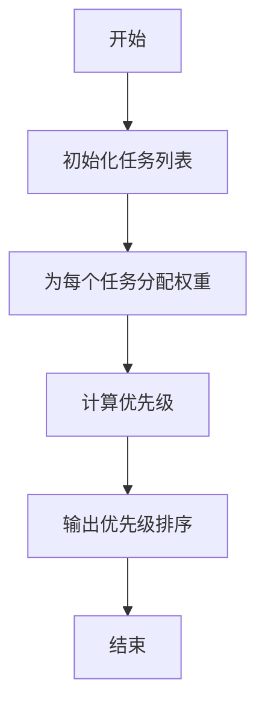
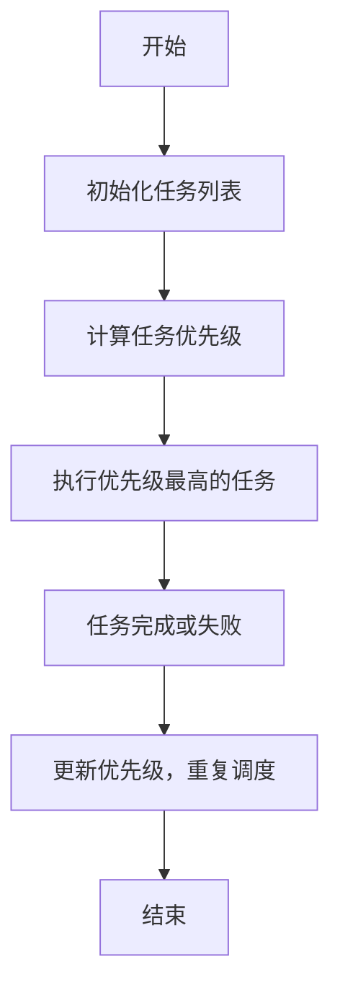
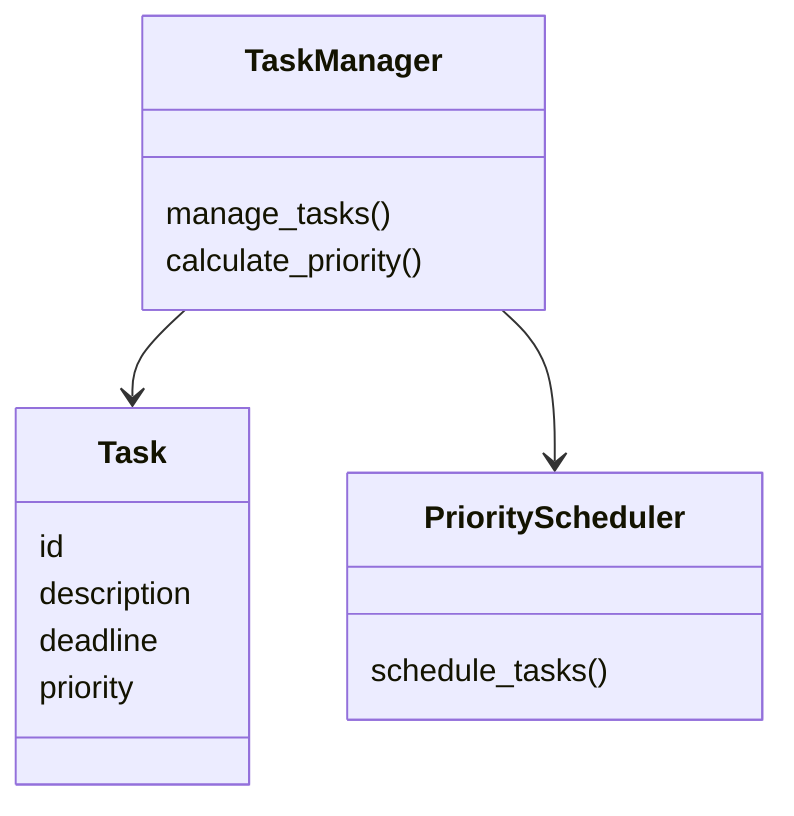

                 


# 实现AI Agent的动态任务优先级调度

> 关键词：AI Agent, 动态任务优先级调度, 调度算法, 系统架构, 项目实战

> 摘要：本文详细探讨了AI Agent在动态环境下的任务优先级调度问题，从核心概念、算法原理到系统架构和项目实战，全面解析了实现动态任务优先级调度的关键技术。文章结合理论与实践，通过具体算法实现和系统设计，展示了如何在实际应用中优化任务调度，提升AI Agent的效率和性能。

---

# 第一部分: AI Agent的动态任务优先级调度基础

## 第1章: AI Agent与动态任务优先级调度概述

### 1.1 AI Agent的基本概念

#### 1.1.1 AI Agent的定义与特点
AI Agent（智能代理）是指能够感知环境、自主决策并执行任务的智能实体。它具备以下特点：
- **自主性**：能够在没有外部干预的情况下自主运行。
- **反应性**：能够根据环境变化动态调整行为。
- **目标导向性**：以实现特定目标为导向。
- **学习能力**：通过经验改进性能。

#### 1.1.2 动态任务优先级调度的背景与意义
在AI Agent的应用场景中，任务优先级的动态调度至关重要。例如，在自动驾驶、机器人调度、智能助手等领域，任务优先级的实时调整能够提高效率、减少资源浪费。

#### 1.1.3 问题背景与问题描述
动态任务优先级调度的核心问题是：在任务数量和优先级不断变化的环境中，如何高效地调整任务执行顺序，以满足实时需求。这种动态性要求调度算法具备灵活性和高效性。

#### 1.1.4 问题解决方法概述
通过分析任务特性（如紧急程度、资源需求、时间约束等），结合实时反馈机制，动态调整任务优先级。

#### 1.1.5 边界与外延
- **边界**：任务优先级的调整仅在系统内部完成，不考虑外部不可控因素。
- **外延**：动态任务优先级调度可以与其他技术（如多智能体协作、分布式计算）结合，进一步提升系统性能。

#### 1.1.6 核心要素与概念结构
动态任务优先级调度的核心要素包括：
- **任务分解**：将复杂任务分解为子任务。
- **优先级计算**：基于任务特性计算优先级。
- **调度策略**：选择最优的执行顺序。
- **反馈机制**：根据执行结果调整优先级。

---

## 第2章: 动态任务优先级调度的核心概念

### 2.1 动态任务优先级调度的原理

#### 2.1.1 任务分解与优先级计算
任务分解是将复杂任务拆解为多个子任务，并为每个子任务分配优先级。优先级计算基于任务的关键指标，如紧急程度、资源需求、时间窗口等。

#### 2.1.2 调度策略与优化目标
调度策略决定了任务的执行顺序。常见的优化目标包括：
- 最小化任务完成时间。
- 最大化资源利用率。
- 优化任务优先级的动态调整。

#### 2.1.3 动态调整机制
动态调整机制通过实时反馈和环境变化，不断优化任务优先级。例如，在资源紧张时，优先执行高价值任务。

### 2.2 不同调度算法的对比分析

#### 2.2.1 调度算法特征对比表格
| 算法名称         | 基于权重 | 基于时间 | 基于资源 |
|------------------|----------|----------|----------|
| 优先级计算方式   | 累加权重  | 时间排序  | 资源分配  |
| 适用场景         | 通用场景 | 实时调度  | 资源受限 |
| 优缺点           | 简单高效 | 实时性强 | 公平性好 |
| 示例领域         | 任务管理 | 医疗急救 | 云计算 |

#### 2.2.2 实体关系图（ER图）
```mermaid
erd
entity AI Agent {
    id
    task_list (one-to-many)
    priority (one-to-one)
}
entity Task {
    id
    description
    deadline
    priority_level
}
```

---

## 第3章: 动态任务优先级调度算法的实现

### 3.1 基于权重的优先级计算算法

#### 3.1.1 算法流程图（Mermaid）


#### 3.1.2 Python代码实现
```python
def calculate_priority(tasks):
    # 定义任务权重：紧急程度（0.4）+ 资源需求（0.3）+ 时间窗口（0.3）
    weights = {'urgency': 0.4, 'resource': 0.3, 'time_window': 0.3}
    priorities = []
    for task in tasks:
        priority = 0
        priority += task['urgency'] * weights['urgency']
        priority += task['resource'] * weights['resource']
        priority += task['time_window'] * weights['time_window']
        priorities.append(priority)
    return priorities
```

#### 3.1.3 数学模型与公式
$$ P_i = \sum_{j=1}^{n} w_j \cdot t_j $$

其中：
- \( P_i \) 表示任务 \( i \) 的优先级。
- \( w_j \) 表示权重因子。
- \( t_j \) 表示任务属性。

---

### 3.2 动态加权A*算法

#### 3.2.1 算法流程图（Mermaid）


#### 3.2.2 Python代码实现
```python
import heapq

def dynamic_weighted_a_star(tasks, weights):
    heap = []
    for task in tasks:
        # 优先级计算
        priority = sum([task[attr] * weights[attr] for attr in weights])
        heapq.heappush(heap, (-priority, task))
    while heap:
        current_priority, current_task = heapq.heappop(heap)
        # 执行任务
        if current_task['execute']:
            print(f"执行任务：{current_task['description']}")
        # 更新优先级
        for attr in weights:
            current_task[attr] *= 0.9  # 动态调整权重
            priority = sum([current_task[attr] * weights[attr] for attr in weights])
            heapq.heappush(heap, (-priority, current_task))
```

#### 3.2.3 数学模型与公式
$$ f(P) = g(P) + h(P) $$

其中：
- \( f(P) \) 表示任务 \( P \) 的总优先级。
- \( g(P) \) 表示路径成本。
- \( h(P) \) 表示启发式评估。

---

## 第4章: 系统分析与架构设计

### 4.1 问题场景介绍
在一个多任务调度系统中，AI Agent需要实时调整任务优先级，以应对环境变化和资源约束。

### 4.2 系统功能设计

#### 4.2.1 领域模型（Mermaid 类图）


#### 4.2.2 系统架构设计（Mermaid 架构图）


---

## 第5章: 项目实战

### 5.1 环境安装与配置
- 安装Python和相关库（如heapq、mermaid）。
- 配置开发环境（如PyCharm、VS Code）。

### 5.2 系统核心实现

#### 5.2.1 任务管理模块
```python
class TaskManager:
    def __init__(self):
        self.tasks = []

    def add_task(self, task):
        self.tasks.append(task)

    def remove_task(self, task_id):
        for task in self.tasks:
            if task['id'] == task_id:
                self.tasks.remove(task)
                break
```

#### 5.2.2 优先级计算模块
```python
class PriorityScheduler:
    def __init__(self):
        pass

    def calculate_priority(self, tasks, weights):
        priorities = []
        for task in tasks:
            priority = sum([task[attr] * weights[attr] for attr in weights])
            priorities.append(priority)
        return priorities
```

### 5.3 实际案例分析
假设一个任务调度场景，包含三个任务，权重分别为：
- 紧急程度：0.4
- 资源需求：0.3
- 时间窗口：0.3

任务详情：
- 任务1：紧急程度0.8，资源需求0.6，时间窗口0.5
- 任务2：紧急程度0.6，资源需求0.8，时间窗口0.7
- 任务3：紧急程度0.5，资源需求0.5，时间窗口0.8

优先级计算：
- 任务1：0.8×0.4 + 0.6×0.3 + 0.5×0.3 = 0.32 + 0.18 + 0.15 = 0.65
- 任务2：0.6×0.4 + 0.8×0.3 + 0.7×0.3 = 0.24 + 0.24 + 0.21 = 0.69
- 任务3：0.5×0.4 + 0.5×0.3 + 0.8×0.3 = 0.2 + 0.15 + 0.24 = 0.59

优先级排序：任务2 > 任务1 > 任务3

---

## 第6章: 总结与展望

### 6.1 最佳实践 tips
- 定期监控任务执行情况，及时调整优先级。
- 根据实际需求选择合适的调度算法。

### 6.2 小结
动态任务优先级调度是AI Agent实现高效任务管理的关键技术。通过合理的算法设计和系统架构，可以显著提升系统的动态适应能力和执行效率。

### 6.3 注意事项
- 调度算法的选择应根据具体场景和需求灵活调整。
- 确保任务优先级的动态调整不会导致系统过载或资源浪费。

### 6.4 拓展阅读
- 《Multi-Agent Systems》
- 《Real-Time Systems》

---

# 作者：AI天才研究院/AI Genius Institute & 禅与计算机程序设计艺术 /Zen And The Art of Computer Programming

