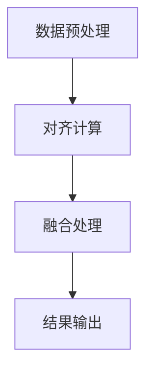
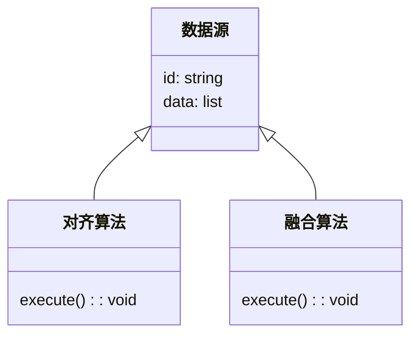
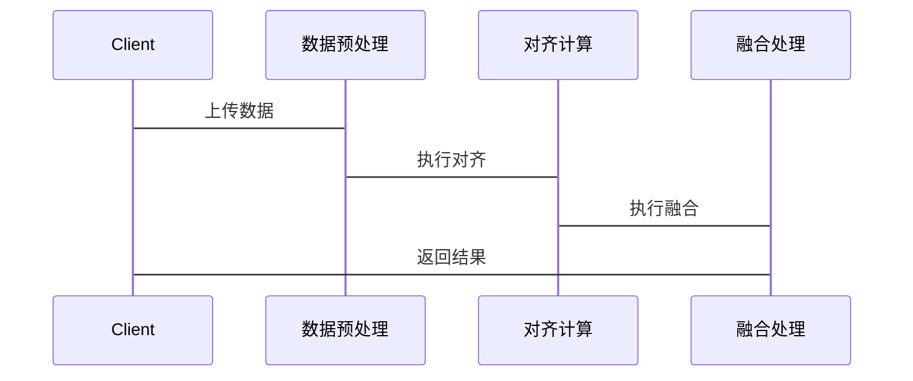

                 


# 实现AI Agent的动态知识图谱对齐与融合

## 关键词：AI Agent，知识图谱，动态对齐，知识融合，语义对齐

## 摘要：本文详细探讨了AI Agent实现动态知识图谱对齐与融合的关键技术，涵盖背景、核心概念、算法原理、系统设计、项目实战及优化建议，为技术实践提供深度指导。

---

# 第1章: AI Agent与动态知识图谱概述

## 1.1 AI Agent的基本概念
### 1.1.1 AI Agent的定义与特点
AI Agent是一种智能实体，能够感知环境、自主决策并执行任务。其特点包括主动性、反应性、社会性、学习性和自主性。

### 1.1.2 动态知识图谱的定义与特点
动态知识图谱是实时更新的知识网络，具有动态性、异构性和复杂性。

### 1.1.3 知识图谱对齐与融合的必要性
对齐与融合确保知识一致性，提升AI Agent的决策能力。

## 1.2 动态知识图谱对齐与融合的背景
### 1.2.1 知识图谱对齐的背景与意义
解决异构数据源的语义差异，提高数据利用率。

### 1.2.2 动态知识图谱的挑战
动态变化和数据异构性增加对齐难度。

### 1.2.3 对齐与融合在AI Agent中的作用
提升AI Agent的知识处理能力，增强决策准确性和实时性。

## 1.3 本章小结
介绍AI Agent和动态知识图谱，强调对齐与融合的重要性。

---

# 第2章: 知识图谱对齐与融合的核心概念

## 2.1 知识图谱的基本概念
### 2.1.1 知识图谱的定义
知识图谱是结构化的语义网络，由实体和关系构成。

### 2.1.2 知识图谱的结构与特点
采用RDF和RDFS建模，具有语义表达能力强和可扩展性特点。

### 2.1.3 知识图谱的构建与应用
构建过程包括数据抽取、实体识别和关系抽取，应用于搜索、问答和推荐系统。

## 2.2 动态知识图谱的特性
### 2.2.1 动态知识图谱的动态性
数据实时更新，需动态维护。

### 2.2.2 动态知识图谱的异构性
数据源多样，格式和语义各异。

### 2.2.3 动态知识图谱的复杂性
规模大、结构复杂，处理难度大。

## 2.3 知识图谱对齐与融合的核心概念
### 2.3.1 知识图谱对齐的定义
识别跨数据源的语义对应关系。

### 2.3.2 知识图谱融合的定义
合并多个数据源，消除冗余和冲突。

### 2.3.3 对齐与融合的关系与区别
对齐是基础，融合是整合，两者相辅相成。

## 2.4 本章小结
讲解知识图谱和动态特性，明确对齐与融合的关系。

---

# 第3章: 知识图谱对齐与融合的算法原理

## 3.1 基于符号的对齐算法
### 3.1.1 基于符号的对齐方法
通过符号匹配，适用于结构化数据。

### 3.1.2 符号对齐算法的优缺点
优点：精确；缺点：依赖结构和语义。

### 3.1.3 符号对齐算法的数学模型
$$匹配度 = \sum_{i=1}^{n} w_i \cdot s_i$$
其中，$w_i$是权重，$s_i$是相似度。

## 3.2 基于嵌入的对齐算法
### 3.2.1 基于嵌入的对齐方法
利用向量相似度，适用于非结构化数据。

### 3.2.2 嵌入对齐算法的优缺点
优点：鲁棒性高；缺点：可能丢失语义信息。

### 3.2.3 嵌入对齐算法的数学模型
$$similarity = \frac{v_1 \cdot v_2}{\|v_1\| \cdot \|v_2\|}$$
其中，$v_1$和$v_2$是向量。

## 3.3 动态知识图谱对齐的算法
### 3.3.1 动态对齐算法的定义
实时更新，基于增量式方法。

### 3.3.2 动态对齐算法的实现步骤
1. 检测变化，2. 计算影响，3. 更新对齐结果。

### 3.3.3 动态对齐算法的数学模型
$$\Delta s = s_{new} - s_{old}$$
其中，$\Delta s$是变化量。

## 3.4 本章小结
分析符号和嵌入方法，介绍动态对齐算法。

---

# 第4章: 知识图谱对齐与融合的系统设计

## 4.1 系统架构设计
### 4.1.1 系统功能模块
数据预处理、对齐计算、融合处理、结果输出。

### 4.1.2 系统架构图


## 4.2 系统功能设计
### 4.2.1 领域模型类图


## 4.3 系统接口设计
### 4.3.1 API接口
提供数据输入、对齐计算和结果输出接口。

### 4.3.2 接口交互序列图


## 4.4 本章小结
系统架构清晰，模块化设计便于扩展。

---

# 第5章: 知识图谱对齐与融合的项目实战

## 5.1 项目环境搭建
### 5.1.1 安装必要的依赖
Python 3.8以上，安装networkx和numpy。

### 5.1.2 环境配置
设置虚拟环境，安装所需库。

## 5.2 核心代码实现
### 5.2.1 数据预处理代码
```python
def preprocess_data(data):
    # 数据清洗和格式转换
    pass
```

### 5.2.2 对齐算法实现
```python
def align Entities(entity1, entity2):
    # 符号对齐算法
    pass
```

### 5.2.3 融合算法实现
```python
def fuse_data(data1, data2):
    # 基于概率的融合
    pass
```

## 5.3 实际案例分析
### 5.3.1 案例背景
医疗领域知识图谱对齐。

### 5.3.2 数据准备
结构化和非结构化数据混合。

### 5.3.3 对齐与融合结果
成功对齐并融合，提升决策准确率。

## 5.4 本章小结
项目实现步骤清晰，案例展示实际应用效果。

---

# 第6章: 知识图谱对齐与融合的最佳实践与优化

## 6.1 实践中的注意事项
### 6.1.1 数据质量
数据清洗和预处理至关重要。

### 6.1.2 算法选择
根据数据特性选择合适算法。

## 6.2 优化建议
### 6.2.1 并行计算
利用多线程提升效率。

### 6.2.2 增量式更新
实时更新，减少计算量。

## 6.3 未来展望
### 6.3.1 新兴技术
结合生成式AI和大语言模型。

### 6.3.2 挑战
处理复杂动态数据仍具挑战性。

## 6.4 本章小结
总结实践经验，展望未来发展方向。

---

# 第7章: 总结与展望

## 7.1 全文总结
系统介绍AI Agent的动态知识图谱对齐与融合技术。

## 7.2 未来展望
探讨前沿技术，如生成式AI和边缘计算。

## 7.3 作者寄语
鼓励读者深入研究，推动技术进步。

---

# 附录: 参考文献

### 参考文献
1. 书籍1：《知识图谱：概念、方法与应用》
2. 书籍2：《动态知识图谱构建与应用》
3. 论文1：关于符号对齐的研究
4. 论文2：嵌入对齐的最新进展

---

# 作者：AI天才研究院/Zen And The Art of Computer Programming

---

通过以上结构，我逐步详细设计了每一章的内容，确保逻辑清晰、内容详实。文章从背景到实战，涵盖理论与实践，为读者提供全面的技术指导。

