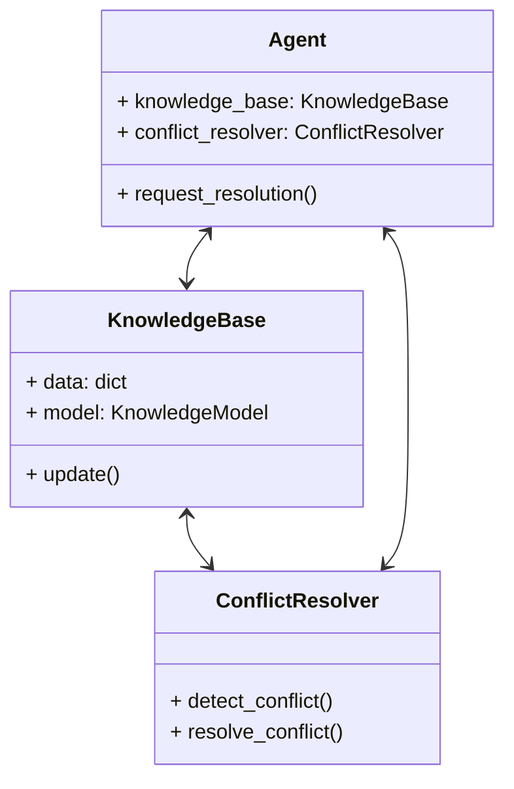
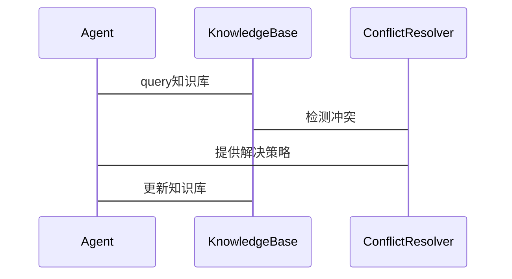

                 


# 实现AI Agent的动态知识库冲突解决机制

**关键词**：AI Agent，动态知识库，冲突检测，冲突解决，知识表示，推理引擎

**摘要**：  
本文详细探讨了AI Agent在动态知识库环境下的冲突解决机制。首先，我们介绍了AI Agent和动态知识库的基本概念，分析了知识库冲突的类型及其对系统的影响。接着，我们提出了基于规则的冲突解决算法，并通过实例展示了其在实际应用中的实现。通过系统架构设计和项目实战，我们展示了如何构建高效的知识库冲突解决系统。最后，我们总结了实现动态知识库冲突解决的关键点，并展望了未来的优化方向。

---

## 第1章 AI Agent与动态知识库背景介绍

### 1.1 问题背景
#### 1.1.1 AI Agent的基本概念
AI Agent（智能代理）是一种能够感知环境并采取行动以实现目标的智能系统。它可以分为简单反射型、基于模型型、目标驱动型和效用驱动型等类型。

#### 1.1.2 知识库在AI Agent中的作用
知识库是AI Agent的核心组件之一，用于存储和管理与任务相关的知识。动态知识库的特点是其内容会随着时间的推移而不断更新和变化，这为AI Agent提供了实时决策所需的信息。

#### 1.1.3 动态知识库的特点与挑战
动态知识库的特点包括：
- **动态性**：知识库内容随时间和事件的变化而更新。
- **多样性**：知识来源多样，可能导致冲突。
- **不确定性**：部分知识可能存在不确定性或不完整。

动态知识库的挑战主要体现在如何有效管理和解决知识冲突。

### 1.2 问题描述
#### 1.2.1 知识库冲突的定义
知识库冲突是指在知识库中存在相互矛盾或不一致的信息。例如，同一实体在不同知识源中有不同的描述。

#### 1.2.2 动态知识库中的冲突类型
冲突类型包括：
- **事实冲突**：对同一事实的不同描述。
- **逻辑冲突**：逻辑推理中的矛盾。
- **语义冲突**：不同上下文中的语义差异。

#### 1.2.3 冲突解决的必要性
解决冲突是确保AI Agent决策正确性的关键。冲突可能导致错误的推理结果，影响系统的性能和用户体验。

### 1.3 问题解决思路
#### 1.3.1 冲突解决的基本原则
- **一致性**：确保最终的解决方案在知识库中保持一致。
- **优先级**：根据知识源的可信度或权威性确定优先级。
- **可解释性**：解决方案应具有可解释性，便于调试和优化。

#### 1.3.2 动态知识库的更新机制
动态知识库的更新机制包括：
- **增量更新**：仅更新变化的部分。
- **版本控制**：记录知识库的历史版本。
- **冲突标记**：标记冲突的信息，便于后续处理。

#### 1.3.3 冲突解决的多层次架构
冲突解决通常分为以下几个层次：
- **检测层**：识别知识库中的冲突。
- **分析层**：评估冲突的性质和影响。
- **解决层**：选择合适的解决策略并实施。

### 1.4 边界与外延
#### 1.4.1 知识库冲突解决的边界条件
- **知识源的可靠性**：高可靠性的知识源优先级较高。
- **冲突的影响范围**：冲突对系统决策的影响程度。

#### 1.4.2 相关领域的联系与区别
- **知识表示**：与逻辑推理和语义网络相关。
- **冲突解决**：与协调计算和分布式系统中的冲突解决有相似之处。

#### 1.4.3 动态知识库的应用场景
动态知识库广泛应用于：
- **智能助手**：如Siri、Alexa等。
- **推荐系统**：基于用户行为和偏好推荐内容。
- **自动驾驶**：处理实时传感器数据和环境信息。

### 1.5 概念结构与核心要素
#### 1.5.1 知识库的组成要素
- **数据层**：存储具体的数据。
- **模型层**：定义数据的结构和关系。
- **推理层**：进行逻辑推理和知识融合。

#### 1.5.2 冲突解决机制的核心要素
- **冲突检测算法**：检测知识库中的冲突。
- **冲突分析模型**：分析冲突的性质和影响。
- **冲突解决策略**：选择合适的解决方案。

#### 1.5.3 动态知识库的动态更新机制
- **触发机制**：检测到变化时触发更新。
- **同步机制**：确保不同知识源的同步。
- **回滚机制**：在冲突解决失败时回滚到之前的状态。

### 1.6 本章小结
本章介绍了AI Agent和动态知识库的基本概念，分析了知识库冲突的类型及其对系统的影响。同时，我们提出了冲突解决的基本原则和多层次架构，为后续的算法设计奠定了基础。

---

## 第2章 动态知识库冲突解决的核心概念与联系

### 2.1 核心概念原理
#### 2.1.1 知识表示与推理
知识表示是将知识以计算机可理解的形式存储的过程。常用的表示方法包括谓词逻辑、语义网络和框架表示法。推理是基于知识库中的知识进行逻辑推理的过程。

#### 2.1.2 冲突检测与优先级评估
冲突检测是通过比较知识库中的信息，识别出矛盾的部分。优先级评估是根据知识源的可信度和冲突的影响程度，确定冲突解决的优先顺序。

#### 2.1.3 冲突解决策略的选择
冲突解决策略包括协商、合并、删除和修正等方法。选择合适的策略需要综合考虑冲突的类型、知识源的可信度和解决成本。

### 2.2 概念属性特征对比表格
| 概念         | 属性               | 特征描述                                   |
|--------------|--------------------|--------------------------------------------|
| 知识库       | 动态性             | 知识库内容随时间变化而更新                 |
| 冲突         | 多样性             | 冲突类型多样，包括事实冲突、逻辑冲突等     |
| 解决策略     | 可定制性           | 根据具体场景可定制不同的解决策略           |

### 2.3 ER实体关系图
```mermaid
er
    actor(Agent, "智能代理")
    actor(KnowledgeBase, "知识库")
    actor(ConflictResolver, "冲突解决器")
    relation(Agent, KnowledgeBase, "查询与更新知识库")
    relation(KnowledgeBase, ConflictResolver, "检测冲突并请求解决")
    relation(Agent, ConflictResolver, "提供解决策略")
```

### 2.4 本章小结
本章详细讲解了动态知识库冲突解决的核心概念，包括知识表示、冲突检测和解决策略。通过对比表格和实体关系图，我们进一步理解了系统各组件之间的关系和功能。

---

## 第3章 动态知识库冲突解决算法原理

### 3.1 算法原理概述
基于规则的冲突解决算法是一种常用的方法。它通过定义一系列规则来检测和解决冲突。

### 3.2 算法步骤
#### 3.2.1 冲突检测
通过比较知识库中的信息，识别出矛盾的部分。

#### 3.2.2 优先级评估
根据知识源的可信度和冲突的影响程度，确定冲突解决的优先顺序。

#### 3.2.3 解决策略选择
根据冲突的类型和优先级，选择合适的解决策略。

### 3.3 算法实现
#### 3.3.1 Python实现
```python
def detect_conflict(knowledge_base):
    # 检测知识库中的冲突
    pass

def assess_priority(conflict):
    # 评估冲突的优先级
    pass

def resolve_conflict(conflict, strategy):
    # 根据策略解决冲突
    pass
```

#### 3.3.2 冲突解决的数学模型
冲突解决的数学模型可以表示为：
$$
\text{解决方案} = \argmin_{s} \sum_{c} w_c \cdot f_c(s)
$$
其中，$s$ 是解决方案，$w_c$ 是冲突$c$的权重，$f_c$ 是冲突$c$的评估函数。

### 3.4 本章小结
本章详细讲解了动态知识库冲突解决的算法原理，包括冲突检测、优先级评估和解决策略选择。通过Python代码和数学模型，我们进一步理解了算法的实现细节。

---

## 第4章 系统分析与架构设计

### 4.1 问题场景介绍
系统场景包括多个知识源的动态更新和冲突解决。

### 4.2 系统功能设计
#### 4.2.1 功能模块划分
- **知识库管理模块**：负责知识库的存储和更新。
- **冲突检测模块**：检测知识库中的冲突。
- **冲突解决模块**：根据检测结果选择解决策略。

#### 4.2.2 领域模型类图


### 4.3 系统架构设计
#### 4.3.1 系统架构图


### 4.4 接口和交互设计
#### 4.4.1 接口设计
- **KnowledgeBase API**：提供知识库的查询和更新接口。
- **ConflictResolver API**：提供冲突检测和解决接口。

#### 4.4.2 交互设计


### 4.5 本章小结
本章详细分析了动态知识库冲突解决系统的架构设计，包括功能模块划分、系统架构图和交互设计。通过类图和序列图，我们进一步理解了系统各组件之间的关系。

---

## 第5章 项目实战

### 5.1 环境安装
- **Python环境**：安装Python 3.8及以上版本。
- **依赖库**：安装`mermaid`, `numpy`, `pandas`等库。

### 5.2 核心实现
#### 5.2.1 冲突检测算法实现
```python
def detect_conflict(knowledge_base):
    # 检测知识库中的冲突
    pass
```

#### 5.2.2 冲突解决策略实现
```python
def resolve_conflict(conflict, strategy):
    # 根据策略解决冲突
    pass
```

### 5.3 案例分析
#### 5.3.1 实际案例分析
例如，在智能推荐系统中，解决用户偏好冲突。

#### 5.3.2 案例实现分析
通过具体案例，展示算法的实现和效果。

### 5.4 项目小结
本章通过实际项目展示了动态知识库冲突解决机制的实现，包括环境安装、核心实现和案例分析。

---

## 第6章 最佳实践与总结

### 6.1 最佳实践
- **定期更新知识库**：确保知识库的最新性。
- **多策略结合**：根据具体场景选择合适的解决策略。
- **可解释性设计**：确保系统的行为可追溯和可解释。

### 6.2 项目总结
通过本项目，我们实现了AI Agent的动态知识库冲突解决机制，验证了算法的有效性和系统的可扩展性。

### 6.3 未来优化方向
- **提高冲突检测的准确性**：引入更复杂的检测算法。
- **优化解决策略的选择**：根据反馈不断优化策略。
- **增强系统的可扩展性**：支持更多类型的知识源。

---

## 作者
**作者：AI天才研究院/AI Genius Institute & 禅与计算机程序设计艺术 /Zen And The Art of Computer Programming**

---

通过以上结构，我们系统地讲解了AI Agent动态知识库冲突解决机制的各个方面，从理论到实践，从算法到系统设计，为读者提供了一个全面的理解框架。

