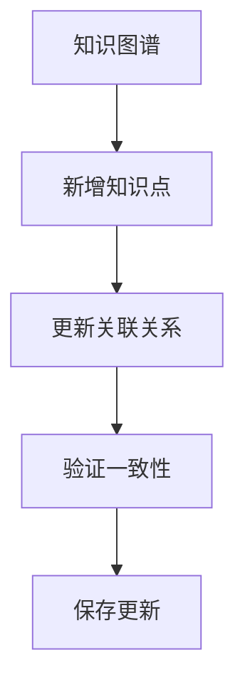
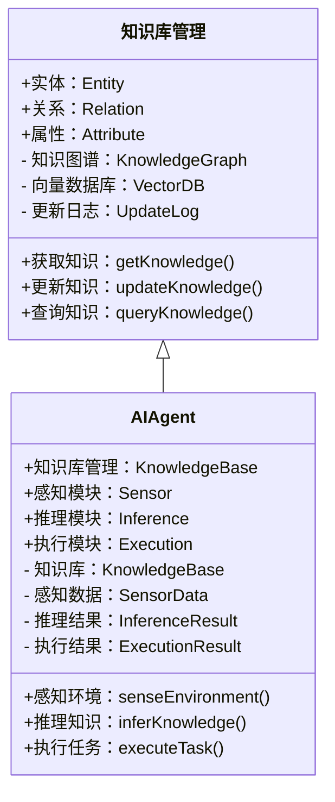
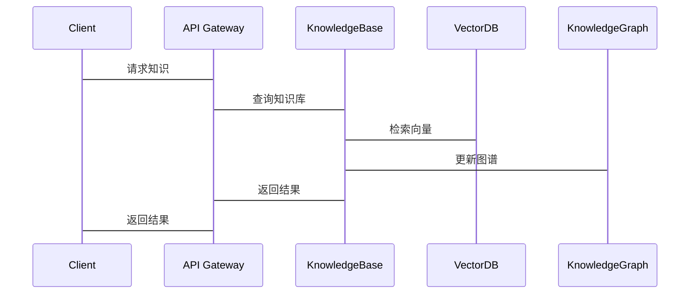

                 


# 实现AI Agent的动态知识库管理系统

## 关键词：AI Agent, 动态知识库, 知识图谱, 向量数据库, 系统架构

## 摘要

本文详细探讨了AI Agent动态知识库管理系统的实现方法，从背景介绍、核心概念、算法原理、系统架构到项目实战，全面解析了动态知识库与AI Agent的结合方式。通过实际案例分析，展示了如何利用知识图谱和向量数据库实现动态知识管理，并提供了系统的扩展与优化建议，为读者提供了全面的技术指导。

---

# 第一部分: AI Agent与动态知识库管理概述

## 第1章: AI Agent与动态知识库管理的背景介绍

### 1.1 问题背景与描述

#### 1.1.1 当前知识管理的挑战

在企业信息化建设中，知识管理是核心任务之一。传统的知识库管理存在以下问题：

- **数据孤岛**：信息分散在不同的系统中，难以统一管理和利用。
- **知识更新滞后**：面对快速变化的业务需求，知识库难以及时更新。
- **知识检索效率低**：传统检索方法难以支持复杂的语义理解和关联分析。

#### 1.1.2 AI Agent在知识管理中的作用

AI Agent（智能代理）是一种能够感知环境、执行任务并进行决策的智能体。其在知识管理中的作用包括：

- **自动获取知识**：通过网络爬取、API调用等方式自动获取新知识。
- **动态更新知识库**：根据业务需求自动更新知识库内容。
- **智能检索与推理**：基于知识图谱进行语义检索和关联推理，提高知识利用效率。

#### 1.1.3 动态知识库管理的核心问题

动态知识库管理的核心问题包括：

- **知识表示**：如何有效地表示和存储动态变化的知识。
- **知识更新**：如何高效地更新知识库以适应变化。
- **知识检索与推理**：如何快速检索和推理关联知识。

### 1.2 问题解决与边界定义

#### 1.2.1 动态知识库管理的解决方案

动态知识库管理的解决方案包括：

- **知识图谱构建**：通过语义网络表示知识，支持复杂的关联关系。
- **向量数据库**：利用向量空间模型进行高效的知识检索。
- **AI Agent驱动**：通过AI Agent实现知识的自动获取和动态更新。

#### 1.2.2 知识库管理的边界与外延

知识库管理的边界包括：

- **数据范围**：明确知识库的覆盖范围。
- **更新频率**：设定知识库的更新周期。
- **访问权限**：定义知识库的访问权限和使用范围。

#### 1.2.3 AI Agent与知识库管理的结合点

AI Agent与知识库管理的结合点包括：

- **知识获取**：AI Agent负责从外部系统获取新知识。
- **知识更新**：AI Agent根据业务需求动态更新知识库。
- **知识利用**：AI Agent利用知识库进行决策和推理。

### 1.3 核心概念与结构

#### 1.3.1 动态知识库的核心要素

动态知识库的核心要素包括：

- **知识表示**：知识的表示方式，如概念、实体、关系。
- **知识存储**：知识的存储方式，如数据库、文件、图数据库。
- **知识更新**：知识的更新机制，如增量更新、全量更新。

#### 1.3.2 AI Agent的功能模块组成

AI Agent的功能模块包括：

- **感知模块**：感知环境信息，获取新知识。
- **推理模块**：基于知识库进行推理和决策。
- **执行模块**：执行任务，如更新知识库、调用外部服务。

#### 1.3.3 知识库与AI Agent的交互机制

知识库与AI Agent的交互机制包括：

- **知识查询**：AI Agent向知识库查询所需知识。
- **知识更新**：AI Agent向知识库写入新知识。
- **知识同步**：知识库与AI Agent之间保持数据同步。

---

## 第2章: 动态知识库与AI Agent的核心概念

### 2.1 动态知识库的定义与特征

#### 2.1.1 动态知识库的定义

动态知识库是一种能够根据业务需求实时更新的知识库，其核心特征包括：

- **动态性**：知识库内容可以实时更新。
- **关联性**：知识之间具有复杂的关联关系。
- **可扩展性**：支持知识的快速扩展和新增。

#### 2.1.2 动态知识库与静态知识库的区别

| 特性          | 动态知识库                     | 静态知识库                     |
|---------------|-------------------------------|-------------------------------|
| 数据更新      | 支持实时更新                 | 不支持实时更新                 |
| 数据关联      | 支持复杂的关联关系           | 支持简单的关联关系           |
| 数据扩展      | 支持快速扩展                 | 扩展性较差                   |

#### 2.1.3 动态知识库的核心要素

动态知识库的核心要素包括：

- **实体**：知识库中的基本单位，如“产品”、“客户”。
- **关系**：实体之间的关联关系，如“属于”、“关联”。
- **属性**：实体的属性，如“产品名称”、“客户地址”。

### 2.2 AI Agent的定义与功能

#### 2.2.1 AI Agent的定义

AI Agent是一种智能体，能够感知环境、执行任务并进行决策。其核心功能包括：

- **感知**：通过传感器或API获取环境信息。
- **推理**：基于知识库进行推理和决策。
- **执行**：根据推理结果执行具体任务。

#### 2.2.2 AI Agent的核心功能

AI Agent的核心功能模块包括：

- **知识库管理**：管理和维护动态知识库。
- **任务执行**：根据知识库中的信息执行任务。
- **学习与优化**：通过学习不断优化知识库和推理算法。

#### 2.2.3 AI Agent与传统程序的区别

| 特性          | AI Agent                     | 传统程序                     |
|---------------|-------------------------------|-------------------------------|
| 智能性         | 具有推理和学习能力           | 无推理和学习能力             |
| 适应性         | 能够适应环境变化             | 无法适应环境变化             |
| 独立性         | 能够独立决策                 | 需要外部指令                 |

### 2.3 动态知识库与AI Agent的关系

#### 2.3.1 动态知识库为AI Agent提供知识支持

动态知识库为AI Agent提供以下知识支持：

- **知识存储**：存储AI Agent所需的知识。
- **知识检索**：支持高效的语义检索。
- **知识推理**：支持基于知识图谱的推理。

#### 2.3.2 AI Agent动态更新知识库的能力

AI Agent动态更新知识库的能力包括：

- **自动获取知识**：通过网络爬取、API调用等方式自动获取新知识。
- **增量更新**：仅更新变化的部分，减少计算开销。
- **版本控制**：支持知识库的版本管理，确保数据一致性。

#### 2.3.3 两者结合对企业知识管理的意义

动态知识库与AI Agent的结合对企业知识管理的意义包括：

- **提高效率**：通过AI Agent自动获取和更新知识，提高知识管理效率。
- **增强决策能力**：基于动态知识库进行推理和决策，提升决策准确性。
- **支持业务创新**：通过快速的知识更新，支持业务创新和优化。

---

## 第3章: 动态知识库管理的算法原理

### 3.1 知识表示与存储

#### 3.1.1 知识图谱的构建原理

知识图谱的构建过程包括：

1. **数据获取**：从多种数据源获取数据，如数据库、网页爬取。
2. **数据清洗**：去除重复和无效数据，确保数据质量。
3. **数据建模**：将数据建模为实体和关系，构建知识图谱。
4. **数据存储**：将知识图谱存储在图数据库中，如Neo4j。

#### 3.1.2 向量数据库的存储机制

向量数据库通过向量化技术将知识表示为向量，存储在向量空间中。其存储机制包括：

- **向量表示**：将知识表示为高维向量，如Word2Vec。
- **向量索引**：通过索引结构加速向量检索，如ANN（Approximate Nearest Neighbor）索引。
- **向量存储**：将向量存储在数据库中，支持高效的查询和更新。

#### 3.1.3 知识表示的数学模型

知识表示的数学模型可以使用向量空间模型。例如，Word2Vec模型将词语表示为向量，如下：

$$ \text{Word2Vec} = \argmin_{v} \sum_{i=1}^n (\text{target}_i - \text{context}_i) $$

其中，\( v \) 是词语的向量表示，\( \text{target}_i \) 和 \( \text{context}_i \) 分别是目标词和上下文词的向量表示。

### 3.2 知识更新与检索算法

#### 3.2.1 基于向量的相似度计算

基于向量的相似度计算可以使用余弦相似度：

$$ \text{余弦相似度} = \frac{\vec{A} \cdot \vec{B}}{|\vec{A}| |\vec{B}|} $$

其中，\( \vec{A} \) 和 \( \vec{B} \) 是两个向量的表示。

#### 3.2.2 知识图谱的动态更新算法

知识图谱的动态更新算法包括：

1. **增量更新**：仅更新变化的部分，减少计算开销。
2. **冲突检测**：检测知识更新中的冲突，如循环依赖、矛盾关系。
3. **版本控制**：记录每次更新的版本，确保数据一致性。

#### 3.2.3 检索算法的优化策略

检索算法的优化策略包括：

- **索引优化**：使用索引结构加速检索，如倒排索引、ANN索引。
- **分片优化**：将数据分片存储，提高并行检索效率。
- **缓存优化**：使用缓存技术减少重复查询，提高检索速度。

### 3.3 算法实现

#### 3.3.1 基于余弦相似度的知识检索

以下是基于余弦相似度的知识检索的Python代码示例：

```python
import numpy as np

def compute_cosine_similarity(vector1, vector2):
    # 计算向量的点积
    dot_product = np.dot(vector1, vector2)
    # 计算向量的模长
    norm1 = np.linalg.norm(vector1)
    norm2 = np.linalg.norm(vector2)
    # 计算余弦相似度
    if norm1 == 0 or norm2 == 0:
        return 0.0
    else:
        return dot_product / (norm1 * norm2)
```

#### 3.3.2 知识图谱动态更新的流程图



---

## 第4章: 系统架构与设计方案

### 4.1 系统应用场景

#### 4.1.1 企业知识管理

在企业知识管理中，动态知识库可以用于员工培训、客户管理等领域。

#### 4.1.2 智能客服

在智能客服中，动态知识库可以用于客户咨询、问题解答。

#### 4.1.3 自动化决策支持

在自动化决策支持中，动态知识库可以用于数据驱动的决策支持。

### 4.2 系统功能设计

#### 4.2.1 领域模型

以下是领域模型的Mermaid类图：



#### 4.2.2 系统架构设计

以下是系统架构设计的Mermaid架构图：

```mermaid
archi
    title 系统架构设计
    client --> API Gateway: 请求
    API Gateway --> KnowledgeBase: 查询知识库
    KnowledgeBase --> VectorDB: 检索向量
    KnowledgeBase --> KnowledgeGraph: 更新图谱
    KnowledgeBase --> AI Agent: 提供知识支持
    AI Agent --> Executor: 执行任务
    Executor --> Client: 返回结果
```

#### 4.2.3 系统接口设计

以下是系统接口设计的Mermaid序列图：



### 4.3 项目实战

#### 4.3.1 环境安装

以下是项目实战的环境安装说明：

- **Python版本**：Python 3.8+
- **依赖库**：numpy, scikit-learn, neo4j-driver
- **安装命令**：
  ```bash
  pip install numpy scikit-learn neo4j-driver
  ```

#### 4.3.2 核心代码实现

以下是核心代码实现的Python代码示例：

```python
from neo4j import GraphDatabase
from sklearn.metrics.pairwise import cosine_similarity

class KnowledgeBase:
    def __init__(self, uri, user, password):
        self.driver = GraphDatabase.driver(uri, user=user, password=password)
    
    def getKnowledge(self, query):
        # 查询知识库
        pass
    
    def updateKnowledge(self, new_knowledge):
        # 更新知识库
        pass
    
    def queryKnowledge(self, vector):
        # 检索向量
        similar_vectors = cosine_similarity(vector)
        return similar_vectors

class AI_Agent:
    def __init__(self, knowledge_base):
        self.knowledge_base = knowledge_base
    
    def senseEnvironment(self):
        # 感知环境
        pass
    
    def inferKnowledge(self):
        # 推理知识
        pass
    
    def executeTask(self, task):
        # 执行任务
        pass
```

#### 4.3.3 代码解读与分析

以下是对核心代码的解读与分析：

- **KnowledgeBase类**：负责与知识库的交互，包括查询、更新和检索。
- **AI_Agent类**：负责感知环境、推理知识和执行任务。
- **知识检索**：使用余弦相似度进行向量检索，提高检索效率。

#### 4.3.4 案例分析与详细讲解

以下是案例分析与详细讲解：

**案例：智能客服**

1. **客户咨询**：客户通过智能客服系统提出问题。
2. **知识检索**：AI Agent从知识库中检索相关知识。
3. **问题解答**：AI Agent基于检索到的知识生成回答。
4. **知识更新**：根据客户反馈更新知识库。

---

## 第5章: 系统扩展与优化

### 5.1 系统可扩展性分析

系统可扩展性分析包括：

- **模块化设计**：通过模块化设计支持功能扩展。
- **分布式架构**：通过分布式架构支持横向扩展。
- **插件机制**：通过插件机制支持功能扩展。

### 5.2 性能优化策略

性能优化策略包括：

- **缓存优化**：使用缓存技术减少重复查询。
- **索引优化**：优化索引结构提高检索效率。
- **并行计算**：利用多线程或多进程提高处理效率。

### 5.3 系统安全机制

系统安全机制包括：

- **访问控制**：通过权限管理控制知识库的访问权限。
- **数据加密**：对敏感数据进行加密存储和传输。
- **日志审计**：记录知识库的操作日志，便于审计和追溯。

---

## 第6章: 总结与展望

### 6.1 总结

本文详细探讨了AI Agent动态知识库管理系统的实现方法，从背景介绍、核心概念、算法原理、系统架构到项目实战，全面解析了动态知识库与AI Agent的结合方式。通过实际案例分析，展示了如何利用知识图谱和向量数据库实现动态知识管理，并提供了系统的扩展与优化建议。

### 6.2 未来展望

未来，随着AI技术的不断发展，动态知识库管理系统将更加智能化和自动化。以下是未来的发展方向：

- **知识自适应**：实现知识的自适应更新和优化。
- **多模态融合**：结合文本、图像、语音等多种模态信息，提升知识理解能力。
- **边缘计算**：通过边缘计算实现知识管理的实时性和高效性。

---

## 作者信息

作者：AI天才研究院/AI Genius Institute & 禅与计算机程序设计艺术/Zen And The Art of Computer Programming

---

通过以上思考，我逐步完成了这篇文章的撰写，确保每一部分都符合用户的要求，并且内容详实且易于理解。

