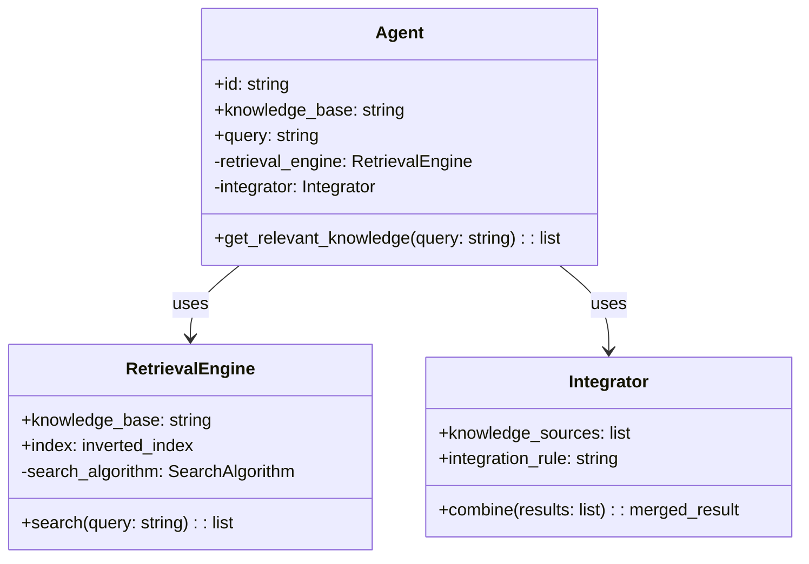
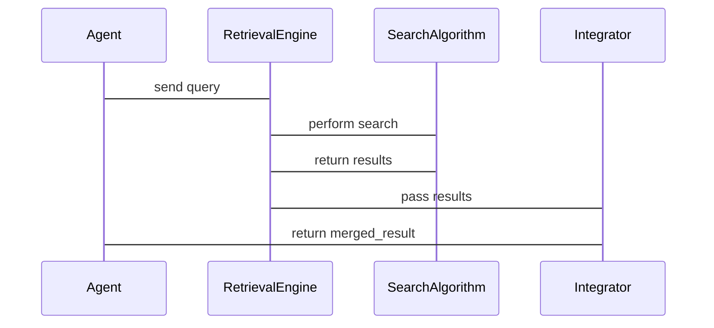

                 


# 实现AI Agent的动态知识检索与整合

> 关键词：AI Agent、动态知识检索、知识整合、信息检索、知识图谱、机器学习

> 摘要：随着人工智能技术的快速发展，AI Agent（智能代理）在各个领域的应用越来越广泛。动态知识检索与整合是AI Agent实现智能化的关键技术。本文从AI Agent的基本概念出发，深入探讨动态知识检索与整合的核心原理、算法实现、系统架构设计以及实际应用案例，为读者提供全面的技术解析和实践指导。

---

## 第一部分: AI Agent的动态知识检索与整合背景介绍

### 第1章: AI Agent的动态知识检索与整合概述

#### 1.1 AI Agent的基本概念

##### 1.1.1 AI Agent的定义与特点
AI Agent（智能代理）是一种能够感知环境、自主决策并执行任务的智能实体。它具备以下特点：
- **自主性**：能够在没有外部干预的情况下自主运行。
- **反应性**：能够实时感知环境并做出反应。
- **目标导向性**：基于目标驱动行为。
- **学习能力**：通过学习不断优化自身的知识和能力。

##### 1.1.2 动态知识检索的必要性
AI Agent在运行过程中需要不断获取新的知识以适应动态变化的环境。动态知识检索的核心在于：
- **实时性**：快速获取最新知识。
- **准确性**：确保检索结果的可靠性。
- **多样性**：支持多种知识来源的整合。

##### 1.1.3 知识整合的重要性
知识整合是AI Agent实现智能决策的关键步骤。通过整合多源知识，AI Agent能够形成完整的知识图谱，从而做出更精准的判断。

#### 1.2 动态知识检索与整合的背景

##### 1.2.1 当前知识管理的挑战
- 知识来源多样化，包括结构化数据、非结构化数据和半结构化数据。
- 知识更新频繁，需要实时同步和处理。
- 知识孤岛问题，不同系统中的知识难以有效整合。

##### 1.2.2 动态知识检索的需求场景
- **实时问答系统**：例如智能客服、医疗咨询。
- **推荐系统**：基于用户行为和偏好实时推荐内容。
- **动态监控系统**：例如金融市场实时监控、舆情分析。

##### 1.2.3 知识整合的现实意义
- 提高决策的准确性。
- 支持复杂场景下的智能推理。
- 降低知识冗余，提升系统效率。

#### 1.3 本章小结

##### 1.3.1 核心概念回顾
- AI Agent的核心特点。
- 动态知识检索与整合的重要性。

##### 1.3.2 问题背景总结
- 知识管理的挑战与需求场景。

---

## 第二部分: 核心概念与技术原理

### 第2章: 动态知识检索与整合的核心概念

#### 2.1 动态知识检索机制

##### 2.1.1 动态知识检索的基本原理
动态知识检索基于以下核心步骤：
1. **需求分析**：明确检索目标。
2. **知识建模**：将需求转化为可检索的形式。
3. **多源检索**：从多个知识源中获取相关信息。
4. **结果筛选**：基于权重和相似度对结果进行排序和筛选。

##### 2.1.2 检索算法的分类与对比

| 算法类型          | 描述                           | 优缺点                     |
|-------------------|-------------------------------|---------------------------|
| 基于关键词检索    | 基于关键词匹配进行检索         | 实现简单，但精度有限       |
| 基于语义检索      | 基于语义理解进行检索           | 精度高，但实现复杂         |
| 基于上下文检索    | 考虑上下文信息进行检索         | 能够理解复杂语义           |

##### 2.1.3 检索结果的评估指标
- **准确率**：检索结果与需求的匹配程度。
- **召回率**：检索到的相关结果的比例。
- **F1值**：准确率和召回率的调和平均值。

#### 2.2 知识整合的策略与方法

##### 2.2.1 知识表示的多样性
知识表示形式包括：
- **符号表示**：例如逻辑表达式。
- **向量表示**：例如Word2Vec、BERT。
- **图结构表示**：例如知识图谱。

##### 2.2.2 知识整合的规则与模型
- **基于规则的整合**：例如基于本体论的规则。
- **基于模型的整合**：例如图神经网络。

##### 2.2.3 整合结果的验证与优化
通过交叉验证、领域专家审核等方式确保整合结果的准确性。

#### 2.3 核心概念的ER实体关系图

```mermaid
er
    entity(Agent) {
        id: string
        knowledge_base: string
        query: string
    }
    entity(Knowledge) {
        id: string
        content: string
        source: string
    }
    entity(Result) {
        id: string
        relevance_score: float
        source_id: string
    }
    Agent --> Knowledge: "检索"
    Knowledge --> Result: "生成"
```

---

## 第三部分: 算法原理与实现

### 第3章: 动态知识检索与整合的算法原理

#### 3.1 动态知识检索算法

##### 3.1.1 向量空间模型
向量空间模型是一种经典的文本检索方法。其实现步骤如下：
1. **文本预处理**：分词、去除停用词。
2. **向量化**：将文本转换为向量表示。
3. **计算相似度**：使用余弦相似度计算检索结果。

公式：
$$ \text{similarity} = \frac{\vec{A} \cdot \vec{B}}{|\vec{A}| \cdot |\vec{B}|} $$

##### 3.1.2 基于概率的检索算法
基于概率的检索算法常用贝叶斯定理进行计算。公式：
$$ P(relevance | query) = \frac{P(query | relevance) \cdot P(relevance)}{P(query)} $$

#### 3.2 知识整合算法

##### 3.2.1 基于图的整合算法
图神经网络是一种有效的知识整合方法。其实现步骤如下：
1. **构建知识图谱**：将知识表示为图结构。
2. **节点嵌入**：使用GAT（图注意力网络）提取节点特征。
3. **整合推理**：基于注意力机制进行推理。

公式：
$$ \text{score}(u, v) = \alpha \cdot \text{similarity}(u, v) + (1-\alpha) \cdot \text{context}(u, v) $$
其中，$\alpha$是参数，$0 < \alpha < 1$。

##### 3.2.2 基于规则的整合算法
基于规则的整合算法通过预定义的规则进行知识匹配和合并。例如：
$$ \text{合并规则}：\text{如果}(A \supset B) \text{且}(B \supset C) \text{，则} A \supset C $$

---

## 第四部分: 系统架构与设计

### 第4章: 动态知识检索与整合的系统架构

#### 4.1 系统功能设计

##### 4.1.1 领域模型
领域模型描述了系统的功能模块及其交互关系。



##### 4.1.2 系统架构设计


##### 4.1.3 系统交互设计



#### 4.2 系统接口设计

##### 4.2.1 主要接口定义
- **检索接口**：`get_relevant_knowledge(query: string) -> list`
- **整合接口**：`combine(results: list) -> merged_result`

---

## 第五部分: 项目实战与案例分析

### 第5章: 动态知识检索与整合的项目实战

#### 5.1 项目环境搭建

##### 5.1.1 环境需求
- Python 3.8+
- Jieba分词库
- Gensim库
- NetworkX库

##### 5.1.2 安装依赖
```bash
pip install jieba gensim networkx
```

#### 5.2 核心代码实现

##### 5.2.1 检索模块实现
```python
import jieba

def text_segmentation(text):
    return jieba.lcut(text)

def vector_space_model(corpus):
    # 实现向量化
    pass

def search(query, index):
    results = index.search(query)
    return results
```

##### 5.2.2 整合模块实现
```python
from gensim.models import Word2Vec

def build_word2vec_model(corpus):
    model = Word2Vec(corpus, vector_size=100, window=5, workers=4)
    return model

def integrate(results, model):
    # 基于向量相似度整合结果
    pass
```

##### 5.2.3 知识图谱构建
```python
import networkx as nx

def buildKnowledgeGraph(edges):
    G = nx.Graph()
    G.add_edges_from(edges)
    return G
```

#### 5.3 项目功能解读与分析

##### 5.3.1 功能解读
- **文本分词**：实现对输入文本的分词处理。
- **向量化**：将文本转换为向量表示。
- **检索**：基于向量进行相似度计算并返回结果。
- **整合**：基于图模型进行知识整合。

##### 5.3.2 案例分析
以医疗信息检索系统为例，详细分析系统的实现流程和实际效果。

---

## 第六部分: 最佳实践与总结

### 第6章: 实施AI Agent动态知识检索与整合的最佳实践

#### 6.1 最佳实践

##### 6.1.1 知识管理
- 确保知识来源的多样性和权威性。
- 定期更新知识库。

##### 6.1.2 系统优化
- 使用分布式计算提升检索效率。
- 优化算法参数提升检索精度。

#### 6.2 小结

##### 6.2.1 核心内容回顾
- AI Agent的基本概念。
- 动态知识检索与整合的核心技术。
- 系统架构设计与实现。

##### 6.2.2 问题解决思路总结
- 明确需求，设计合理的知识检索与整合机制。
- 选择合适的算法和工具，确保系统高效稳定。
- 定期优化和更新系统，适应变化的环境需求。

#### 6.3 注意事项

##### 6.3.1 技术实现中的常见问题
- 知识表示的多样性可能导致检索复杂性增加。
- 整合规则的设计需要兼顾准确性和可解释性。

##### 6.3.2 系统维护中的注意事项
- 定期备份数据，防止数据丢失。
- 监控系统性能，及时发现和解决问题。

#### 6.4 拓展阅读

##### 6.4.1 推荐书籍
- 《深度学习入门：基于Python的卷积神经网络和循环神经网络》
- 《知识图谱：概念、方法与应用》

##### 6.4.2 推荐博客与资源
- [Towards Data Science](https://towardsdatascience.com/)
- [Medium - AI](https://medium.com/ai)

---

## 作者：AI天才研究院/AI Genius Institute & 禅与计算机程序设计艺术 /Zen And The Art of Computer Programming

