                 


# 实现AI Agent的动态知识检索与综合能力

> **关键词**：AI Agent，动态知识检索，综合能力，算法原理，系统架构

> **摘要**：  
本文详细探讨了AI Agent的动态知识检索与综合能力的实现方法。首先介绍了AI Agent的基本概念和动态知识检索的重要性，接着深入分析了动态知识检索的核心算法及其优化策略。然后，从系统架构设计、接口设计等方面详细讲解了AI Agent的实现过程，并通过实际项目案例展示了动态知识检索与综合能力的实现步骤。最后，总结了实现过程中的一些最佳实践和注意事项。

---

## 第1章: AI Agent的基本概念与背景

### 1.1 AI Agent的定义与核心概念

#### 1.1.1 什么是AI Agent  
AI Agent（人工智能代理）是一种能够感知环境、自主决策并执行任务的智能实体。它通过与用户或系统的交互，利用内部知识库和外部数据源，提供智能化的服务或解决方案。

#### 1.1.2 AI Agent的核心特征  
AI Agent的核心特征包括：  
1. **自主性**：能够自主决策和行动，无需外部干预。  
2. **反应性**：能够实时感知环境变化并做出响应。  
3. **学习能力**：通过数据和经验不断优化自身的知识库和决策能力。  
4. **知识整合能力**：能够将分散的知识点整合成完整的知识体系。  

#### 1.1.3 动态知识检索的必要性  
动态知识检索是指在实时环境中，根据需求快速检索和更新知识的能力。随着数据量的爆炸式增长和应用场景的多样化，AI Agent必须具备动态知识检索能力，以应对复杂多变的环境。

---

### 1.2 动态知识检索的背景与问题背景

#### 1.2.1 知识检索的动态性挑战  
传统的知识检索方法通常基于静态的知识库，无法应对实时变化的环境。动态知识检索需要在数据不断更新的情况下，快速找到相关知识，这对算法和系统设计提出了更高的要求。

#### 1.2.2 传统知识检索的局限性  
传统知识检索方法在以下方面存在局限性：  
1. **实时性不足**：无法快速响应动态变化的数据。  
2. **准确性受限**：在复杂场景下，检索结果可能存在误差。  
3. **灵活性不足**：难以适应不同场景的需求。  

#### 1.2.3 动态知识检索的场景与应用  
动态知识检索在以下场景中具有重要应用：  
1. **实时问答系统**：如智能客服、在线聊天机器人。  
2. **智能推荐系统**：根据用户行为实时推荐相关内容。  
3. **实时监控系统**：如金融市场的实时数据分析。  

---

### 1.3 综合能力的重要性

#### 1.3.1 综合能力的定义  
综合能力是指AI Agent能够将动态检索到的知识与其他信息进行整合，形成完整解决方案的能力。这种能力使得AI Agent不仅仅是一个简单的检索工具，而是能够提供深度服务的智能实体。

#### 1.3.2 动态知识检索与综合能力的关系  
动态知识检索是综合能力的基础，而综合能力则是动态知识检索的延伸。通过综合能力，AI Agent能够将分散的知识点整合成有用的上下文信息，从而更好地满足用户需求。

#### 1.3.3 综合能力在AI Agent中的作用  
1. **提升用户体验**：通过综合能力，AI Agent能够提供更准确、更相关的答案。  
2. **增强问题解决能力**：综合能力使得AI Agent能够处理复杂问题，而不仅仅是简单的问题。  
3. **支持复杂应用场景**：在医疗、法律、金融等领域，综合能力尤为重要。  

---

## 第2章: AI Agent的核心概念与联系

### 2.1 AI Agent的结构与功能

#### 2.1.1 AI Agent的组成模块  
AI Agent通常由以下几个模块组成：  
1. **感知模块**：负责接收外部输入和环境信息。  
2. **知识库**：存储AI Agent所需的知识和数据。  
3. **推理模块**：基于知识库和输入信息进行推理和决策。  
4. **执行模块**：根据推理结果执行具体操作。  

#### 2.1.2 各模块之间的关系  
感知模块将输入信息传递给推理模块，推理模块利用知识库进行推理，最终通过执行模块完成任务。动态知识检索主要发生在感知模块和推理模块之间。

#### 2.1.3 核心概念的ER实体关系图  
以下是AI Agent核心概念的ER实体关系图：

```mermaid
erDiagram
    actor 用户
    concept AI_Agent {
        +id
        +名称
        +功能模块
    }
    knowledge_base {
        +id
        +内容
        +版本
    }
    user --> AI_Agent : 使用
    AI_Agent --> knowledge_base : 依赖
```

---

### 2.2 动态知识检索的机制

#### 2.2.1 动态知识检索的流程  
动态知识检索的流程包括以下几个步骤：  
1. **需求分析**：明确用户的需求和检索范围。  
2. **数据源选择**：根据需求选择合适的数据源。  
3. **检索与排序**：基于算法对数据源进行检索和排序。  
4. **结果优化**：根据反馈进一步优化检索结果。  

#### 2.2.2 检索算法的原理  
动态知识检索的核心算法包括向量空间模型和BM25算法。

##### 向量空间模型  
向量空间模型通过将文本表示为向量，计算两个向量之间的相似度。以下是向量空间模型的公式：

$$ \text{余弦相似度} = \frac{\vec{A} \cdot \vec{B}}{|\vec{A}| |\vec{B}|} $$

##### BM25算法  
BM25是一种基于概率的检索算法，公式如下：

$$ \text{BM25} = \frac{f_{t,d} \cdot (k_1 + 1)}{k_1 \cdot \text{avgdl} + f_{t,d}} \cdot \frac{f_{t,c}}{f_{t,c} + k_2} $$

其中，$f_{t,d}$ 是词 $t$ 在文档 $d$ 中的出现次数，$k_1$ 和 $k_2$ 是参数，$\text{avgdl}$ 是平均文档长度。

#### 2.2.3 检索结果的优化策略  
1. **基于反馈的优化**：根据用户的反馈进一步优化检索结果。  
2. **基于大模型的优化**：利用大语言模型对检索结果进行再优化。  

---

### 2.3 综合能力的实现路径

#### 2.3.1 综合能力的构建步骤  
综合能力的构建步骤包括：  
1. **知识整合**：将动态检索的知识点整合成上下文信息。  
2. **推理与验证**：对整合后的信息进行推理和验证。  
3. **结果呈现**：以用户友好的方式呈现结果。  

#### 2.3.2 各步骤之间的逻辑关系  
以下是综合能力实现的流程图：

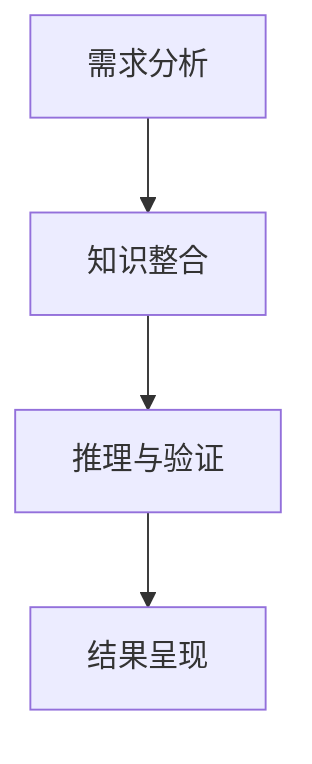

#### 2.3.3 综合能力的评估指标  
1. **准确率**：检索结果的准确性。  
2. **响应时间**：处理请求的时间。  
3. **用户满意度**：用户的反馈和满意度。  

---

## 第3章: AI Agent的动态知识检索算法原理

### 3.1 动态知识检索的核心算法

#### 3.1.1 向量空间模型  
向量空间模型通过将文本表示为向量，计算两个向量之间的相似度。以下是向量空间模型的公式：

$$ \text{余弦相似度} = \frac{\vec{A} \cdot \vec{B}}{|\vec{A}| |\vec{B}|} $$

#### 3.1.2 BM25算法  
BM25算法基于概率模型，公式如下：

$$ \text{BM25} = \frac{f_{t,d} \cdot (k_1 + 1)}{k_1 \cdot \text{avgdl} + f_{t,d}} \cdot \frac{f_{t,c}}{f_{t,c} + k_2} $$

#### 3.1.3 基于大模型的检索优化  
大模型通过微调和fine-tuning技术，对检索结果进行优化。以下是优化流程的示意图：

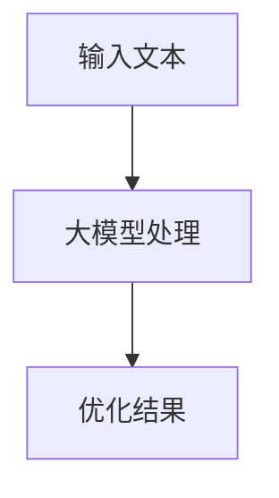

---

### 3.2 算法原理的数学模型

#### 3.2.1 向量空间模型的数学公式  
$$ \text{余弦相似度} = \frac{\vec{A} \cdot \vec{B}}{|\vec{A}| |\vec{B}|} $$

#### 3.2.2 BM25算法的公式  
$$ \text{BM25} = \frac{f_{t,d} \cdot (k_1 + 1)}{k_1 \cdot \text{avgdl} + f_{t,d}} \cdot \frac{f_{t,c}}{f_{t,c} + k_2} $$

#### 3.2.3 基于大模型的检索优化公式  
$$ \text{P@N =} \frac{\text{正确结果数}}{N} $$

---

### 3.3 算法实现的步骤与流程

#### 3.3.1 数据预处理  
数据预处理包括文本分词、去除停用词等步骤。以下是数据预处理的流程图：

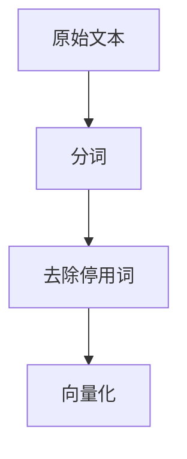

#### 3.3.2 特征提取  
特征提取是将文本转换为向量的过程。以下是特征提取的示意图：

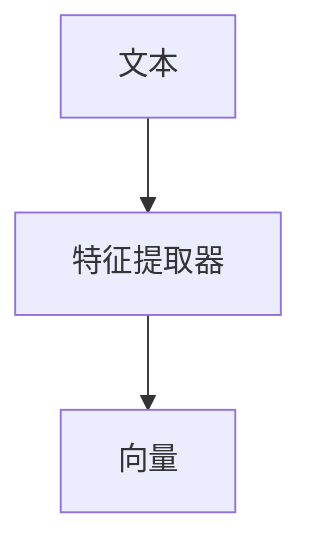

#### 3.3.3 检索与排序  
检索与排序是基于算法对向量进行检索和排序的过程。以下是检索与排序的流程图：

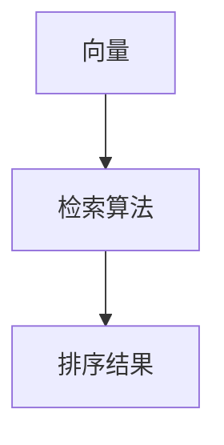

---

## 第4章: AI Agent的系统分析与架构设计

### 4.1 系统功能需求分析

#### 4.1.1 动态知识检索功能  
动态知识检索功能包括实时检索和结果优化。以下是动态知识检索功能的示意图：

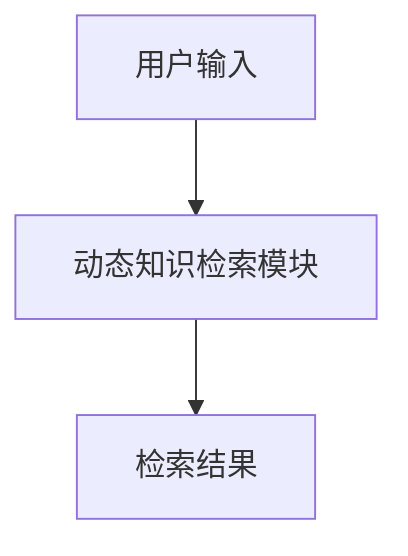

#### 4.1.2 综合能力模块  
综合能力模块包括知识整合、推理与验证。以下是综合能力模块的示意图：

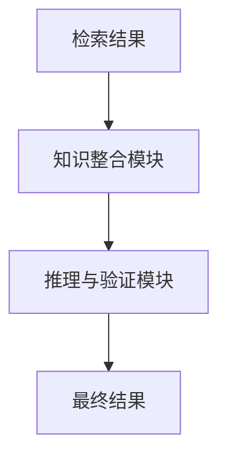

#### 4.1.3 用户交互界面  
用户交互界面是用户与AI Agent之间的桥梁。以下是用户交互界面的示意图：

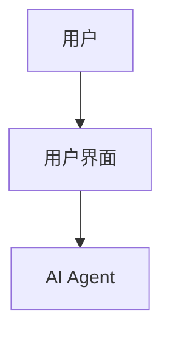

---

### 4.2 系统架构设计

#### 4.2.1 分层架构设计  
AI Agent的系统架构通常采用分层架构，包括感知层、推理层和执行层。以下是分层架构的示意图：

```mermaid
erDiagram
    层_感知层 {
        +模块1：感知模块
        +模块2：知识库
    }
    层_推理层 {
        +模块3：推理模块
        +模块4：综合能力模块
    }
    层_执行层 {
        +模块5：执行模块
        +模块6：用户界面
    }
```

#### 4.2.2 模块划分与职责  
1. **感知模块**：负责接收外部输入和环境信息。  
2. **知识库**：存储AI Agent所需的知识和数据。  
3. **推理模块**：基于知识库和输入信息进行推理和决策。  
4. **综合能力模块**：将推理结果整合成完整的解决方案。  
5. **执行模块**：根据推理结果执行具体操作。  

#### 4.2.3 系统架构的Mermaid图  
以下是系统架构的Mermaid图：

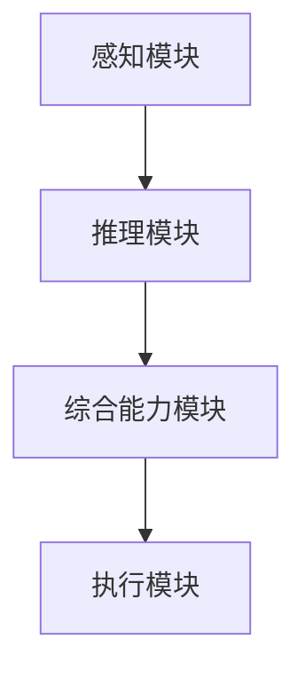

---

### 4.3 系统接口设计

#### 4.3.1 API接口定义  
以下是API接口的定义：

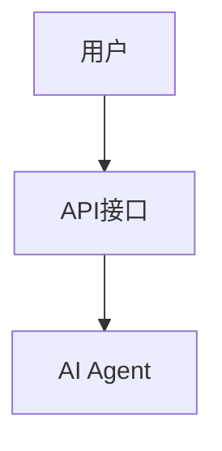

#### 4.3.2 接口交互流程  
以下是接口交互流程的示意图：

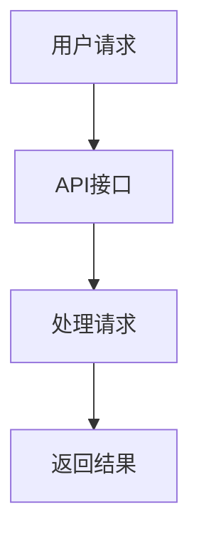

#### 4.3.3 接口设计的注意事项  
1. **安全性**：确保接口的安全性，防止数据泄露。  
2. **可扩展性**：接口设计应具有良好的扩展性。  
3. **性能优化**：优化接口的响应速度和处理能力。  

---

## 第5章: AI Agent的项目实战

### 5.1 环境搭建与配置

#### 5.1.1 开发环境的选择  
推荐使用Python作为开发语言，搭配以下工具：  
- **编程框架**：Django或Flask。  
- **自然语言处理库**：spaCy或jieba。  
- **大模型框架**：TensorFlow或PyTorch。  

#### 5.1.2 依赖库的安装  
以下是安装依赖库的命令：

```bash
pip install numpy
pip install scikit-learn
pip install spacy
pip install flask
```

#### 5.1.3 网络与数据源的配置  
确保网络连接正常，并配置合适的数据源，如API接口或本地数据库。

---

### 5.2 系统核心实现源代码

#### 5.2.1 动态知识检索模块的实现  
以下是动态知识检索模块的Python代码：

```python
def dynamic_search(query):
    # 数据预处理
    preprocessed = preprocess(query)
    # 特征提取
    features = extract_features(preprocessed)
    # BM25检索
    results = bm25_search(features)
    return results
```

#### 5.2.2 综合能力模块的实现  
以下是综合能力模块的Python代码：

```python
def integrate Knowledge(results):
    # 知识整合
    integrated = integrate(results)
    # 推理与验证
    validated = validate(integrated)
    return validated
```

---

### 5.3 代码应用解读与分析

#### 5.3.1 动态知识检索模块的代码解读  
动态知识检索模块的代码包括数据预处理、特征提取和BM25检索三个步骤。数据预处理主要是去除停用词和分词，特征提取是将文本转换为向量，BM25检索则是基于向量的相似度进行排序。

#### 5.3.2 综合能力模块的代码解读  
综合能力模块的代码包括知识整合和推理与验证两个步骤。知识整合是将检索结果整合成上下文信息，推理与验证是对整合后的信息进行逻辑推理和验证。

---

### 5.4 实际案例分析和详细讲解剖析

#### 5.4.1 案例分析  
假设用户查询“如何治疗高血压”，动态知识检索模块会从知识库中检索相关知识，并返回初步结果。综合能力模块会将这些结果整合成完整的解决方案，包括治疗方法、药物建议等。

#### 5.4.2 详细讲解剖析  
1. **需求分析**：明确用户的需求和检索范围。  
2. **知识整合**：将检索到的知识点整合成上下文信息。  
3. **推理与验证**：对整合后的信息进行逻辑推理和验证。  
4. **结果呈现**：以用户友好的方式呈现结果。  

---

### 5.5 项目小结

#### 5.5.1 项目总结  
通过本项目，我们实现了一个具备动态知识检索与综合能力的AI Agent。动态知识检索模块能够快速检索相关知识，综合能力模块能够将检索结果整合成完整的解决方案。

#### 5.5.2 经验与教训  
1. **经验**：动态知识检索和综合能力模块的实现需要大量的数据和算法支持。  
2. **教训**：在实际应用中，需要考虑数据的多样性和算法的鲁棒性。  

---

## 第6章: 最佳实践与注意事项

### 6.1 最佳实践

#### 6.1.1 数据质量管理  
确保数据的准确性和完整性，避免噪声数据的干扰。

#### 6.1.2 算法优化  
根据实际需求不断优化检索算法，提升检索准确率和响应速度。

#### 6.1.3 系统安全  
确保系统安全，防止数据泄露和攻击。

---

### 6.2 小结

通过本文的详细讲解，我们了解了AI Agent的动态知识检索与综合能力的实现方法。从核心概念到算法原理，再到系统设计和项目实战，我们逐步深入探讨了实现过程中的关键点。

---

### 6.3 注意事项

1. **数据隐私**：在处理用户数据时，必须遵守相关法律法规，保护用户隐私。  
2. **算法选择**：根据具体场景选择合适的算法，避免盲目追求复杂算法。  
3. **系统维护**：定期更新知识库和优化系统，确保系统的稳定性和高效性。  

---

## 第7章: 拓展阅读与进一步学习

### 7.1 拓展阅读

1. **向量空间模型**：深入理解向量空间模型的原理和应用。  
2. **BM25算法**：学习BM25算法的优化方法和应用场景。  
3. **大模型优化**：研究大模型在动态知识检索中的应用。  

### 7.2 进一步学习

1. **自然语言处理**：学习自然语言处理的前沿技术，如BERT、GPT等。  
2. **分布式系统**：研究分布式系统的实现方法，提升系统的扩展性和稳定性。  
3. **实时计算**：探索实时计算技术，如流处理和事件驱动架构。  

---

## 作者：AI天才研究院/AI Genius Institute & 禅与计算机程序设计艺术/Zen And The Art of Computer Programming

---

本文通过详细讲解AI Agent的动态知识检索与综合能力的实现方法，帮助读者从理论到实践全面掌握相关技术。希望本文对AI Agent的开发者和研究者提供有价值的参考和启发。

