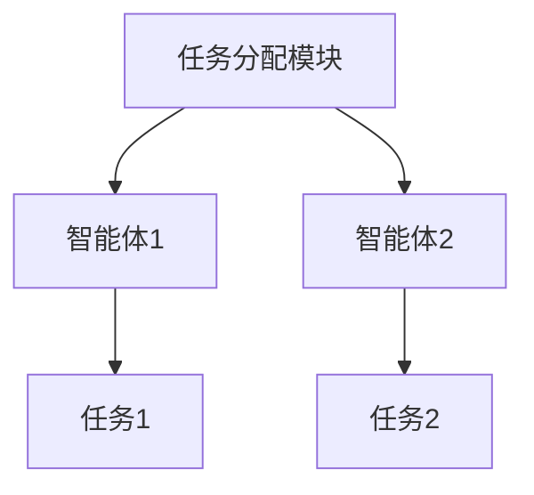
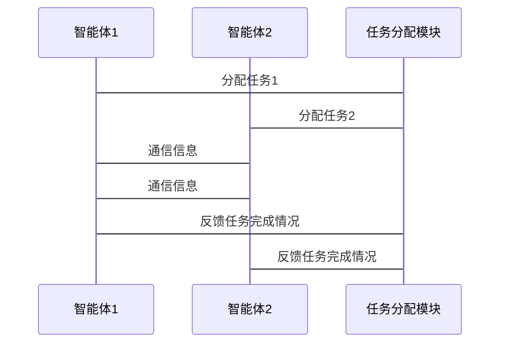

                 


# 实现AI Agent的多Agent协作能力

> 关键词：AI Agent, 多Agent协作, 分布式系统, 协作算法, 任务分配, 系统架构

> 摘要：本文旨在探讨如何实现AI Agent的多Agent协作能力。通过分析多Agent协作的核心概念、算法原理、系统架构及项目实战，深入讲解实现多Agent协作的关键技术与方法。从背景介绍到系统设计，从算法实现到实际应用，全面解析如何构建高效、智能的多Agent协作系统。

---

## 第1章: 多Agent协作概述

### 1.1 AI Agent的基本概念

AI Agent（智能体）是指能够感知环境、自主决策并执行任务的实体。它可以是一个软件程序、机器人或其他智能设备。根据功能和复杂度，AI Agent可以分为以下几类：

- **简单反射Agent**：基于当前输入做出简单反应，如PID控制器。
- **基于模型的反射Agent**：维护环境状态模型，能够预测未来状态。
- **目标驱动的Agent**：基于明确的目标进行决策和行动。
- **效用驱动的Agent**：通过最大化效用函数来优化决策。

多Agent系统由多个智能体组成，通过协作完成复杂任务。与单智能体相比，多Agent系统具有更高的灵活性和容错性，适用于分布式环境中的复杂问题。

### 1.2 多Agent协作的背景与问题背景

传统的单智能体系统在处理复杂任务时往往力不从心，例如分布式计算、机器人编队等领域需要多个智能体协同工作。多Agent协作能够通过任务分配、信息共享和协同决策，显著提高系统的整体性能。

然而，多Agent协作也面临诸多挑战，如通信延迟、任务冲突、决策协调等。如何设计高效的协作机制，成为实现多Agent协作的核心问题。

### 1.3 多Agent协作的核心问题

多Agent协作的核心问题包括任务分配、通信机制、决策协调等。任务分配需要确保每个智能体承担合适的任务，避免资源浪费；通信机制需要保证信息高效传递；决策协调需要避免冲突，确保协作顺利进行。

多Agent协作的应用场景广泛，例如无人机编队、分布式计算、智能交通系统等。每个场景都需要根据具体需求设计协作机制。

## 第2章: 多Agent协作的核心概念

### 2.1 多Agent协作的基本原理

多Agent协作需要智能体之间进行通信、协调和合作。通信机制是协作的基础，常用的通信方式包括发布-订阅模型和点对点通信。协调机制需要确保智能体之间目标一致，常用的方法包括协商和仲裁。

### 2.2 多Agent协作的核心算法

- **分布式协作算法**：基于分布式计算，通过局部信息实现全局协作。例如，基于一致性算法（如Paxos）实现分布式决策。
- **多Agent决策算法**：基于强化学习或规则系统，实现智能体的自主决策。
- **任务分配算法**：基于任务特性分配智能体，常用的方法包括贪心算法和优化算法。

### 2.3 多Agent协作的数学模型

多Agent协作的数学模型通常涉及任务分配和决策优化。例如，任务分配可以建模为一个优化问题，目标是最化整体效用。假设我们有n个智能体和m个任务，每个任务分配给一个智能体，目标函数可以表示为：

$$
\max \sum_{i=1}^{n} u_i(x_i)
$$

其中，$u_i(x_i)$表示智能体i在分配任务x_i时的效用。

## 第3章: 多Agent协作的算法原理与实现

### 3.1 分布式协作算法的实现

分布式协作算法通过局部信息实现全局协作，避免了集中式计算的单点故障。例如，分布式一致性算法（如Paxos）用于实现分布式系统中的共识。

代码示例：
```python
def paxos():
    proposer.propose()
    while not proposer.completed():
        proposer.send_ballot()
        for voter in voters:
            if voter.accept(proposer.ballot):
                voter.vote(proposer.proposal)
    proposer.commit()
```

### 3.2 多Agent决策算法的实现

基于强化学习的多Agent决策算法通过智能体之间的互动和奖励机制实现协作。例如，多智能体强化学习（MADRL）框架通过分布式决策优化实现协作。

代码示例：
```python
import numpy as np

class Agent:
    def __init__(self, state_space, action_space):
        self.state_space = state_space
        self.action_space = action_space
        self.model = self.build_model()

    def build_model(self):
        # 构建神经网络模型
        pass

    def act(self, state):
        # 根据状态选择动作
        pass

    def update(self, reward, next_state):
        # 更新模型参数
        pass
```

### 3.3 任务分配算法的实现

任务分配算法通过优化方法实现智能体之间的任务分配。例如，基于贪心算法的任务分配方法：

代码示例：
```python
def task_allocation(tasks, agents):
    for task in tasks:
        assign_to = -1
        max_utility = -float('inf')
        for agent in agents:
            utility = compute_utility(task, agent)
            if utility > max_utility:
                max_utility = utility
                assign_to = agent
        assign_task(task, assign_to)
```

## 第4章: 多Agent协作的系统架构设计

### 4.1 系统功能设计

系统功能包括任务分配、通信管理、决策协调等模块。例如，任务分配模块负责将任务分配给合适的智能体，通信管理模块负责信息传递，决策协调模块负责冲突解决。

### 4.2 系统架构图

使用Mermaid绘制系统架构图：



### 4.3 系统接口设计

系统接口包括通信接口、任务接口和决策接口。通信接口负责智能体之间的信息传递，任务接口负责任务分配，决策接口负责协调决策。

### 4.4 系统交互流程图

使用Mermaid绘制系统交互流程图：



## 第5章: 项目实战

### 5.1 环境安装

安装必要的库和工具，例如Python、TensorFlow、Keras等。例如：

```bash
pip install numpy
pip install matplotlib
pip install tensorflow
```

### 5.2 核心代码实现

实现多Agent协作的核心代码，例如基于强化学习的协作算法：

```python
import numpy as np
import tensorflow as tf

class Agent:
    def __init__(self, state_size, action_size):
        self.state_size = state_size
        self.action_size = action_size
        self.model = self.build_model()

    def build_model(self):
        model = tf.keras.Sequential([
            tf.keras.layers.Dense(64, activation='relu', input_dim=self.state_size),
            tf.keras.layers.Dense(self.action_size, activation='softmax')
        ])
        return model

    def act(self, state):
        state = tf.convert_to_tensor(state)
        return self.model(state).numpy()[0]

    def update(self, state, action, reward):
        # 实现模型更新
        pass
```

### 5.3 实际案例分析

通过实际案例分析，展示多Agent协作的应用效果。例如，无人机编队任务分配的实现：

```python
def allocate_drones(drones, tasks):
    # 使用贪心算法分配任务
    for task in tasks:
        assign_to = -1
        max_utility = -float('inf')
        for drone in drones:
            utility = compute_utility(task, drone)
            if utility > max_utility:
                max_utility = utility
                assign_to = drone
        assign_task(task, assign_to)
```

## 第6章: 最佳实践与注意事项

### 6.1 最佳实践

- **模块化设计**：将系统划分为任务分配、通信管理、决策协调等模块。
- **容错设计**：设计容错机制，确保单个智能体故障不影响整体系统。
- **性能优化**：优化通信和计算效率，减少延迟和资源消耗。

### 6.2 注意事项

- **通信延迟**：多Agent协作需要高效的通信机制，否则可能导致决策延迟。
- **任务冲突**：任务分配需要考虑冲突，避免资源争抢。
- **计算资源**：多Agent系统需要足够的计算资源支持协作。

### 6.3 拓展阅读

建议进一步阅读分布式系统、多智能体强化学习等领域的相关文献，深入了解多Agent协作的最新进展。

## 作者

作者：AI天才研究院/AI Genius Institute & 禅与计算机程序设计艺术 /Zen And The Art of Computer Programming

---

以上是实现AI Agent多Agent协作能力的完整文章内容，涵盖了从背景介绍到系统设计、项目实战的各个方面，结合了理论分析和实际代码实现，为读者提供了全面的知识和实践指导。

