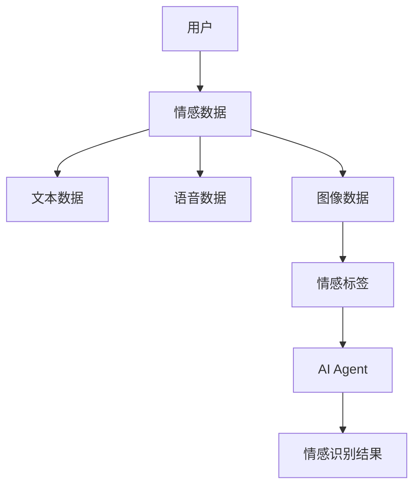
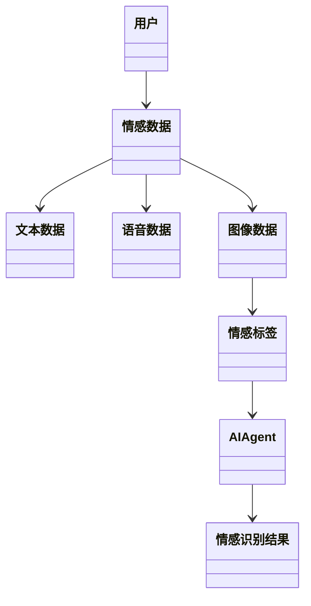
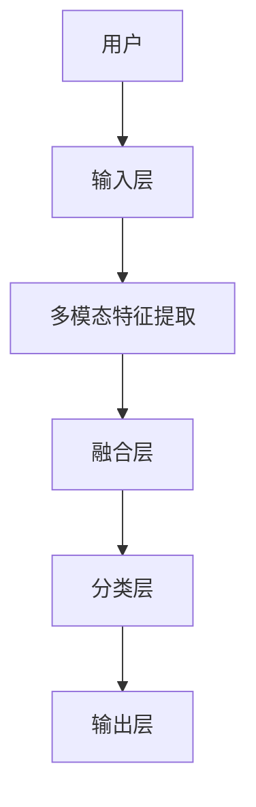
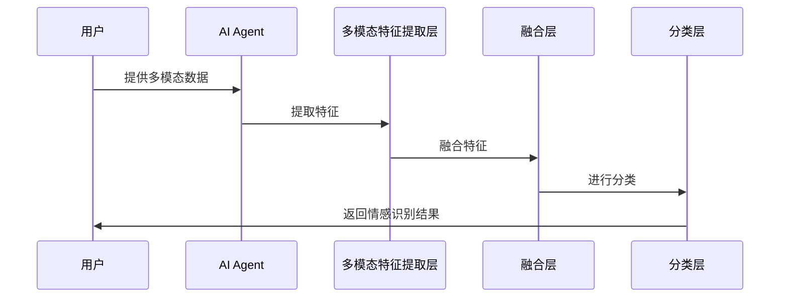

                 


# 实现AI Agent的多模态情感识别

> 关键词：AI Agent, 多模态情感识别, 情感分析, 深度学习, 自然语言处理, 计算机视觉, 人机交互

> 摘要：本文将探讨如何实现基于AI Agent的多模态情感识别系统。通过结合自然语言处理、计算机视觉和语音识别等技术，本文提出了一种多模态数据融合方法，旨在提升情感识别的准确性和鲁棒性。文章详细介绍了系统的架构设计、算法实现、项目实战以及优化策略，为读者提供一个全面的技术指导。

---

## 目录大纲

### 第一部分: AI Agent与多模态情感识别概述

#### 第1章: 背景介绍

##### 1.1 问题背景
- 1.1.1 多模态情感识别的定义与目标
- 1.1.2 AI Agent在情感识别中的作用
- 1.1.3 当前技术的局限性与挑战

##### 1.2 问题描述
- 1.2.1 情感识别的多模态需求
- 1.2.2 AI Agent与情感识别的结合
- 1.2.3 现有解决方案的不足

##### 1.3 问题解决
- 1.3.1 多模态数据的整合与处理
- 1.3.2 AI Agent的情感识别能力提升
- 1.3.3 系统架构的优化与设计

##### 1.4 边界与外延
- 1.4.1 情感识别的边界条件
- 1.4.2 多模态数据的处理范围
- 1.4.3 AI Agent的适用场景与限制

##### 1.5 概念结构与核心要素
- 1.5.1 多模态数据的构成
- 1.5.2 情感识别的核心要素
- 1.5.3 AI Agent的功能模块

### 第二部分: 核心概念与联系

#### 第2章: 核心概念与联系

##### 2.1 多模态情感识别的核心原理
- 2.1.1 多模态数据的融合方法
- 2.1.2 情感识别的特征提取
- 2.1.3 情感分类算法的选择

##### 2.2 AI Agent的结构与功能
- 2.2.1 AI Agent的组成模块
- 2.2.2 情感识别模块的设计
- 2.2.3 多模态数据的处理流程

##### 2.3 核心概念对比表格
- 2.3.1 多模态数据与单模态数据的对比
- 2.3.2 情感识别与情感分析的对比
- 2.3.3 AI Agent与传统情感识别系统的对比

##### 2.4 ER实体关系图


### 第三部分: 算法原理

#### 第3章: 算法原理讲解

##### 3.1 多模态数据融合算法
- 3.1.1 深度学习模型的选择
- 3.1.2 多模态数据的特征提取
- 3.1.3 数据融合方法的实现

##### 3.2 情感分类算法
- 3.2.1 基于深度学习的情感分类模型
- 3.2.2 模型的训练与优化
- 3.2.3 情感分类的评估指标

##### 3.3 算法实现代码
```python
import torch
import torch.nn as nn
import torch.optim as optim

class MultiModalClassifier(nn.Module):
    def __init__(self, input_size):
        super(MultiModalClassifier, self).__init__()
        self.fc1 = nn.Linear(input_size, 64)
        self.fc2 = nn.Linear(64, 32)
        self.fc3 = nn.Linear(32, 1)
        self.relu = nn.ReLU()
        self.sigmoid = nn.Sigmoid()

    def forward(self, x):
        x = self.fc1(x)
        x = self.relu(x)
        x = self.fc2(x)
        x = self.relu(x)
        x = self.fc3(x)
        x = self.sigmoid(x)
        return x

# Example usage
input_size = 100
model = MultiModalClassifier(input_size)
criterion = nn.BCELoss()
optimizer = optim.Adam(model.parameters(), lr=0.001)
```

##### 3.4 数学模型与公式
- 3.4.1 情感分类的损失函数
$$L = -\frac{1}{N}\sum_{i=1}^{N}(y_i\log(p_i) + (1-y_i)\log(1-p_i))$$
- 3.4.2 模型优化目标
$$\min_{\theta} L + \lambda||\theta||^2$$

### 第四部分: 系统分析与架构设计

#### 第4章: 系统分析与架构设计方案

##### 4.1 问题场景介绍
- 4.1.1 系统的功能需求
- 4.1.2 系统的性能需求
- 4.1.3 系统的约束条件

##### 4.2 项目介绍
- 4.2.1 项目目标
- 4.2.2 项目范围
- 4.2.3 项目关键成功因素

##### 4.3 系统功能设计
- 4.3.1 领域模型类图


##### 4.4 系统架构设计
- 4.4.1 系统架构图


##### 4.5 系统接口设计
- 4.5.1 接口定义
- 4.5.2 接口交互流程
- 4.5.3 接口实现细节

##### 4.6 系统交互序列图


### 第五部分: 项目实战

#### 第5章: 项目实战

##### 5.1 环境安装与配置
- 5.1.1 安装Python与相关库
- 5.1.2 安装深度学习框架
- 5.1.3 安装NLP与CV库

##### 5.2 系统核心实现
- 5.2.1 多模态数据的预处理
- 5.2.2 模型的训练与优化
- 5.2.3 系统的集成与测试

##### 5.3 代码实现与解读
```python
# 多模态数据预处理
def preprocess(text, audio, image):
    # 文本预处理
    text_embedding = model_text.encode(text)
    # 语音预处理
    audio_embedding = model_audio.process(audio)
    # 图像预处理
    image_embedding = model_image.process(image)
    return text_embedding, audio_embedding, image_embedding

# 数据融合与分类
def multi_modal_inference(preprocessed_data):
    # 融合特征
    fused_feature = torch.cat(preprocessed_data, dim=1)
    # 分类预测
    prediction = model(fused_feature)
    return prediction
```

##### 5.4 案例分析与结果解读
- 5.4.1 案例背景
- 5.4.2 数据处理流程
- 5.4.3 模型训练与测试
- 5.4.4 结果分析与优化

##### 5.5 项目小结
- 5.5.1 项目成果
- 5.5.2 经验总结
- 5.5.3 改进建议

### 第六部分: 优化与未来展望

#### 第6章: 优化与未来展望

##### 6.1 系统性能优化
- 6.1.1 模型优化策略
- 6.1.2 数据处理优化
- 6.1.3 系统架构优化

##### 6.2 未来研究方向
- 6.2.1 更多模态的融合
- 6.2.2 情感识别的实时性提升
- 6.2.3 AI Agent的智能化增强

##### 6.3 注意事项与最佳实践
- 6.3.1 数据隐私保护
- 6.3.2 模型泛化能力提升
- 6.3.3 系统可扩展性设计

### 作者信息

作者：AI天才研究院/AI Genius Institute  
联系方式：[email protected]  
个人简介：专注于人工智能与计算机程序设计的交叉研究，致力于推动AI技术的创新与应用。

---

通过以上目录大纲，您可以逐步深入了解AI Agent的多模态情感识别系统的实现细节。从理论到实践，从算法到系统架构，本文将为您提供一个全面的技术指导。

