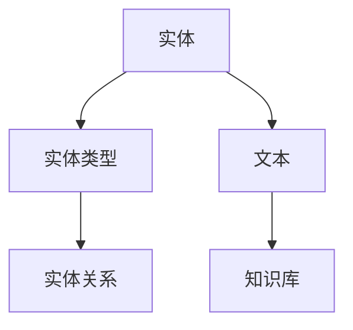

                 

# 实现AI Agent的多语言实体链接

> 关键词：AI Agent，多语言实体链接，自然语言处理，跨语言信息检索，知识图谱

> 摘要：本文详细探讨了AI Agent在多语言环境下实现实体链接的核心技术与方法。通过分析多语言实体链接的背景、核心概念、算法原理、系统架构以及实际项目实现，本文为读者提供了从理论到实践的全面指导。文章深入解析了多语言实体链接的挑战，提出了基于跨语言词汇对齐和知识图谱的解决方案，并通过实际案例展示了如何在AI Agent中实现高效的多语言实体链接。

---

# 第一部分: AI Agent与多语言实体链接的背景与基础

## 第1章: AI Agent与多语言实体链接概述

### 1.1 问题背景

#### 1.1.1 多语言实体链接的定义与挑战
多语言实体链接是指在多种语言环境下，将文本中的实体（如人名、地名、组织名等）准确地映射到统一的知识库（如知识图谱）中的过程。其核心挑战在于不同语言之间的词汇差异和语义多样性，如何在这些差异中找到一致的实体表示是一个复杂的问题。

#### 1.1.2 AI Agent在多语言环境中的作用
AI Agent作为智能体，需要在多语言环境中处理信息，理解用户的意图，并提供准确的响应。实现多语言实体链接是AI Agent具备跨语言理解和交互能力的关键。

#### 1.1.3 多语言实体链接的现实需求
随着全球化的发展，跨语言信息处理的需求日益增长。在客服系统、智能助手、搜索引擎等领域，AI Agent需要能够理解并处理多种语言的信息，实体链接是这些应用的基础。

### 1.2 问题描述

#### 1.2.1 实体链接的基本概念
实体链接是自然语言处理中的一个关键任务，旨在将文本中的实体识别并映射到知识库中的具体实体。例如，将文本中的“Paris”映射到知识库中的巴黎这座城市。

#### 1.2.2 多语言环境下的实体识别问题
在多语言环境中，相同的实体在不同语言中可能有不同的名称或表示方式。例如，“Paris”在中文中是“巴黎”，在西班牙语中是“París”。如何在这些不同的表示中找到一致的实体是一个挑战。

#### 1.2.3 实体链接的歧义性与多样性
实体在不同语言中可能有不同的变体，甚至同一语言中也可能存在同名实体的不同含义（如Paris可以是人名或地名）。这种歧义性增加了实体链接的难度。

### 1.3 问题解决

#### 1.3.1 现有解决方案的优缺点
目前，实体链接的主要解决方案包括基于统计的方法和基于知识图谱的方法。基于统计的方法依赖于语言模型和相似度计算，而基于知识图谱的方法则依赖于预先构建的知识库。

#### 1.3.2 多语言实体链接的核心目标
多语言实体链接的核心目标是将不同语言中的实体映射到统一的知识库中，以便AI Agent能够跨语言理解和处理信息。

#### 1.3.3 AI Agent在实体链接中的角色
AI Agent通过实体链接技术，能够理解用户的输入，并在多语言环境中准确地识别和映射实体，从而提供更智能的服务。

### 1.4 边界与外延

#### 1.4.1 多语言实体链接的范围界定
多语言实体链接的范围包括跨语言词汇对齐、实体识别、实体链接以及知识图谱的构建与维护。

#### 1.4.2 相关问题的区分与联系
实体链接与命名实体识别（NER）不同，NER关注实体的识别，而实体链接关注实体的映射。此外，实体链接还与跨语言信息检索密切相关。

#### 1.4.3 与其他技术的边界划分
实体链接与机器翻译、跨语言信息检索等技术有交集，但其核心任务是将实体映射到统一的知识库中。

### 1.5 核心概念结构与组成

#### 1.5.1 实体、实体类型与实体关系
实体是文本中的具体概念，实体类型是对实体的分类（如人名、地名），实体关系描述实体之间的关联（如“Paris是法国的首都”）。

#### 1.5.2 多语言环境下的实体表示
在多语言环境中，实体的表示可能涉及多种语言的词汇和形式。如何统一这些表示是实体链接的关键。

#### 1.5.3 AI Agent的实体链接机制
AI Agent通过跨语言词汇对齐和知识图谱匹配，将不同语言中的实体映射到统一的知识库中。

### 1.6 本章小结
本章介绍了多语言实体链接的背景、核心概念和挑战，为后续章节的深入分析奠定了基础。

---

# 第二部分: 多语言实体链接的核心概念与联系

## 第2章: 多语言实体链接的核心原理

### 2.1 多语言实体链接的原理概述

#### 2.1.1 跨语言词汇对齐的基本原理
跨语言词汇对齐是将不同语言中的词汇映射到统一表示空间的过程。常用的方法包括双语词对齐和多语词对齐。

#### 2.1.2 实体识别与链接的结合方式
实体识别（NER）与实体链接结合，首先识别文本中的实体，然后将这些实体映射到知识库中的具体实体。

#### 2.1.3 AI Agent在多语言环境中的协调机制
AI Agent通过协调不同语言的实体表示，实现跨语言的信息处理和理解。

### 2.2 核心概念对比

#### 2.2.1 不同语言环境下实体链接的特征对比
| 特征                | 单一语言实体链接 | 多语言实体链接 |
|---------------------|------------------|------------------|
| 实体表示             | 单一语言词汇     | 多语言词汇       |
| 难度                | 较低             | 较高             |
| 技术要求             | 较低             | 较高             |

#### 2.2.2 多语言与单一语言实体链接的差异
多语言实体链接需要处理更多语言的词汇和语义差异，技术复杂性更高。

#### 2.2.3 实体链接与命名实体识别的联系与区别
实体链接与命名实体识别（NER）密切相关，但实体链接更关注实体的映射，而NER关注实体的识别。

### 2.3 核心概念的ER实体关系图

---

通过以上目录，我们可以看到文章将从背景、核心概念、算法原理、系统架构、项目实战等多方面详细探讨AI Agent的多语言实体链接问题，确保读者能够从理论到实践全面理解这一技术。后续章节将围绕这些内容展开详细分析。

