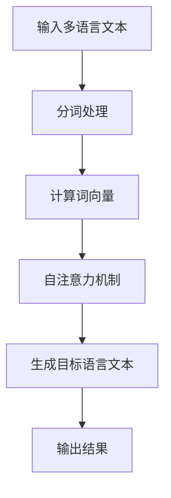
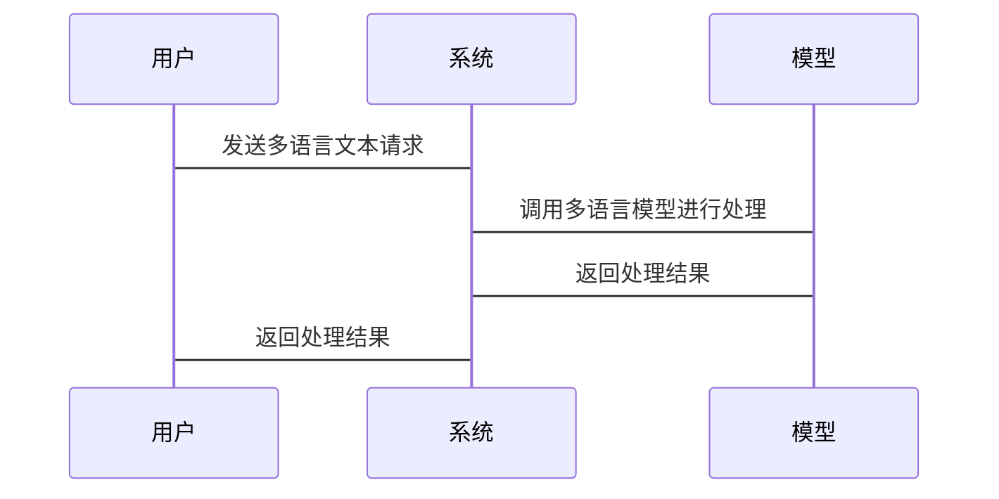

                 


# 实现AI Agent的多语言支持

## 关键词：AI Agent, 多语言支持, 自然语言处理, 机器学习, 转换器模型

## 摘要：本文详细探讨了AI Agent实现多语言支持的核心技术与方法，分析了多语言支持的重要性、挑战与解决方案，从算法原理、系统架构到项目实战，全面解析如何构建支持多种语言的智能代理系统。

---

## 第一部分: AI Agent与多语言支持的背景介绍

### 第1章: AI Agent的基本概念

#### 1.1 AI Agent的定义与特点
- **1.1.1 AI Agent的定义**  
  AI Agent（智能代理）是指能够感知环境、自主决策并执行任务的智能体。它通过传感器获取信息，利用推理能力解决问题，并通过执行器与环境交互。

- **1.1.2 AI Agent的核心特点**  
  - **自主性**：能够在没有外部干预的情况下运行。  
  - **反应性**：能够实时感知环境并做出响应。  
  - **目标导向**：具备明确的目标，能够优化决策以实现目标。  
  - **学习能力**：能够通过经验改进性能。

- **1.1.3 AI Agent与传统AI的区别**  
  AI Agent强调与环境的交互，能够动态适应环境变化，而传统AI更多关注静态问题的解决。

#### 1.2 多语言支持的重要性
- **1.2.1 多语言支持的背景**  
  随着全球化的推进，AI系统需要支持多种语言，以满足不同地区用户的需求。

- **1.2.2 多语言支持在AI Agent中的作用**  
  - 提高用户体验：支持多种语言，使AI Agent能够为更多用户提供服务。  
  - 增强应用场景：扩展AI Agent的应用范围，如多语言客服、跨语言信息处理。  

- **1.2.3 多语言支持的挑战与机遇**  
  - 挑战：语言间的语义差异、计算资源需求等。  
  - 机遇：推动AI技术的创新和普及。

### 第2章: AI Agent的多语言支持现状

#### 2.1 多语言支持的现状分析
- **2.1.1 当前主流的AI Agent多语言支持技术**  
  - 基于统计的机器翻译（如Google Translate）。  
  - 基于神经网络的机器翻译（如Transformer模型）。  

- **2.1.2 多语言支持在实际应用中的案例**  
  - 谷歌助手：支持多种语言的语音交互。  
  - Facebook的Multi-GPU：支持多种语言的对话生成。

#### 2.2 多语言支持的技术挑战
- **2.2.1 语言间的语义差异**  
  不同语言的语法结构、文化背景差异可能导致语义理解困难。  

- **2.2.2 跨语言模型训练的难点**  
  小语种数据不足、跨语言迁移学习的难度等。  

- **2.2.3 多语言支持的计算资源需求**  
  处理多语言数据需要更多的计算资源和存储空间。

### 第3章: 多语言支持的核心概念与联系

#### 3.1 核心概念原理
- **3.1.1 多语言支持的核心技术**  
  - 自然语言处理（NLP）技术：用于理解和生成多种语言的文本。  
  - 机器学习模型：用于跨语言信息的迁移学习。  

- **3.1.2 多语言支持的实现方式**  
  - 多语言模型：一种模型同时处理多种语言。  
  - 单语言模型：针对每种语言分别训练模型。

#### 3.2 核心概念属性特征对比表格
表3-1: 多语言支持技术的对比分析

| 技术特点       | 单语言模型                | 多语言模型                |
|----------------|---------------------------|---------------------------|
| 训练数据       | 针对单一语言              | 针对多种语言              |
| 模型复杂度     | 较低                     | 较高                     |
| 计算资源需求   | 较低                     | 较高                     |
| 应用场景       | 专门处理单一语言          | 处理多种语言              |

#### 3.3 ER实体关系图架构
图3-1: 多语言支持系统的ER实体关系图

```mermaid
erd
  系统
    + 系统ID
    + 系统名称
    + 系统版本
  用户
    + 用户ID
    + 用户名称
    + 用户语言偏好
  语言
    + 语言ID
    + 语言名称
    + 语言代码
  知识库
    + 知识库ID
    + 知识库内容
    + 知识库版本
  接口
    + 接口ID
    + 接口名称
    + 接口类型
  交互记录
    + 交互记录ID
    + 用户ID
    + 语言ID
    + 时间戳
    + 交互内容
```

---

## 第二部分: 多语言支持的算法原理讲解

### 第4章: 多语言支持的算法原理

#### 4.1 多语言支持的算法概述
- **4.1.1 基于Transformer的多语言模型**  
  Transformer模型通过自注意力机制，能够有效地处理序列数据，适用于多语言翻译任务。

- **4.1.2 多语言模型的训练策略**  
  - 预训练：利用大规模多语言数据进行预训练。  
  - 微调：针对特定任务进行微调，提升模型性能。

#### 4.2 多语言支持的算法流程图
图4-1: 多语言支持算法的流程图



#### 4.3 多语言支持的数学模型
- **4.3.1 多语言模型的数学表达**  
  $$ P(y|x) = \argmax_y \text{score}(x, y) $$  
  其中，\( x \) 是输入文本，\( y \) 是输出文本。

- **4.3.2 多语言模型的数学公式**  
  $$ \text{score}(x, y) = \text{sim}(x, y) + \text{pos}(y) $$  
  其中，\( \text{sim}(x, y) \) 表示输入和输出的相似度，\( \text{pos}(y) \) 表示输出的语义位置信息。

---

### 第5章: 多语言支持的数学模型与公式

#### 5.1 多语言模型的数学基础
- **5.1.1 语言模型的数学表达**  
  $$ P(w_1, w_2, ..., w_n) = \prod_{i=1}^n P(w_i | w_1, ..., w_{i-1}) $$  

- **5.1.2 多语言模型的数学公式**  
  $$ P(y|x) = \frac{\exp(\text{score}(x, y))}{\sum_{y'} \exp(\text{score}(x, y'))} $$  

#### 5.2 多语言模型的数学推导
- **5.2.1 注意力机制的数学推导**  
  $$ \text{Attention}(Q, K, V) = \text{softmax}\left(\frac{QK^T}{\sqrt{d_k}}\right)V $$  

- **5.2.2 多语言模型的优化算法**  
  使用Adam优化器，优化目标函数：  
  $$ \text{Loss} = -\sum_{i=1}^n \log P(y_i|x_i) $$  

#### 5.3 数学公式示例
- **5.3.1 注意力机制的公式**  
  $$ \alpha_{ij} = \text{softmax}(q_i^T k_j) $$  

- **5.3.2 多语言模型的损失函数**  
  $$ \text{Loss} = \frac{1}{N} \sum_{i=1}^N \text{CE}(y_i, \hat{y}_i) $$  

---

### 第6章: 多语言支持的系统分析与架构设计

#### 6.1 系统分析
- **6.1.1 系统功能需求**  
  - 多语言文本处理：支持多种语言的文本输入和输出。  
  - 语言识别：自动识别输入语言并选择合适的语言进行处理。  

- **6.1.2 系统性能需求**  
  - 响应时间：快速处理多语言请求。  
  - 系统扩展性：支持更多语言的扩展。  

- **6.1.3 系统安全性需求**  
  - 数据隐私保护：确保用户数据的安全性。  
  - 系统容错性：具备故障恢复能力。

#### 6.2 系统架构设计
- **6.2.1 系统架构的分层设计**  
  - 数据层：存储多语言数据和模型参数。  
  - 业务逻辑层：处理用户的请求并调用模型进行计算。  
  - 接口层：提供API供外部调用。

- **6.2.2 系统架构的模块划分**  
  - 输入处理模块：接收用户的输入并进行预处理。  
  - 模型调用模块：调用多语言模型进行处理。  
  - 输出处理模块：将处理结果返回给用户。

- **6.2.3 系统架构的交互设计**  
  - 用户通过API发送请求，系统接收请求并进行处理，最后返回结果。

#### 6.3 系统接口设计
- **接口描述**  
  - 输入接口：接受多种语言的文本输入。  
  - 输出接口：返回处理后的多语言文本或结果。

#### 6.4 系统交互序列图
图6-1: 系统交互序列图



---

## 第三部分: 项目实战

### 第7章: 环境安装与系统核心实现

#### 7.1 环境安装
- **安装Python环境**  
  使用Anaconda或虚拟环境，安装Python 3.8及以上版本。

- **安装依赖库**  
  安装PyTorch、Hugging Face Transformers等库：  
  ```bash
  pip install torch transformers
  ```

#### 7.2 系统核心实现
- **多语言模型的选择与加载**  
  使用Hugging Face的多语言模型，如`mBert`或`XLM-R`。

- **代码示例：加载多语言模型**
  ```python
  from transformers import AutoTokenizer, AutoModelForMaskedLM

  model_name = "facebook/mBert-base"
  tokenizer = AutoTokenizer.from_pretrained(model_name)
  model = AutoModelForMaskedLM.from_pretrained(model_name)
  ```

- **代码应用解读与分析**  
  使用Tokenizer对输入文本进行分词，输入模型进行处理，输出结果。

#### 7.3 实际案例分析
- **案例1：多语言文本翻译**  
  输入：Hello, how are you?（英文）  
  输出：Bonjour, comment ça va?（法语）

- **案例2：跨语言问答系统**  
  用户输入：What is AI?  
  系统输出：AI是指人工智能（Artificial Intelligence）。

#### 7.4 项目小结
- 通过实际案例，验证了多语言支持在AI Agent中的有效性。  
- 提供了从环境搭建到模型实现的完整流程，为后续优化提供了基础。

---

## 第四部分: 最佳实践

### 第8章: 小结与经验分享

#### 8.1 小结
- 多语言支持是AI Agent的重要功能，能够显著提升系统的实用性和用户体验。  
- 通过合理选择算法和优化系统架构，可以有效实现多语言支持。

#### 8.2 经验分享
- 数据质量：多语言数据的质量直接影响模型性能。  
- 模型选择：选择适合任务的多语言模型，如`mBert`适用于跨语言任务。  
- 计算资源：确保有足够的计算资源进行模型训练和推理。

### 第9章: 注意事项与拓展阅读

#### 9.1 注意事项
- **数据隐私**：在处理多语言数据时，需注意数据隐私保护。  
- **模型调优**：根据具体任务对模型进行微调，以提升性能。  
- **性能优化**：优化模型的计算效率，减少响应时间。

#### 9.2 拓展阅读
- **《Attention Is All You Need》**：了解Transformer模型的基本原理。  
- **《A Survey on Multilingual Neural Machine Translation》**：深入学习多语言神经机器翻译的技术进展。

---

## 作者：AI天才研究院/AI Genius Institute & 禅与计算机程序设计艺术 /Zen And The Art of Computer Programming

---

以上内容是一个完整的关于实现AI Agent多语言支持的技术博客文章框架，涵盖了从背景介绍到项目实战的各个方面，内容详实且结构清晰。

