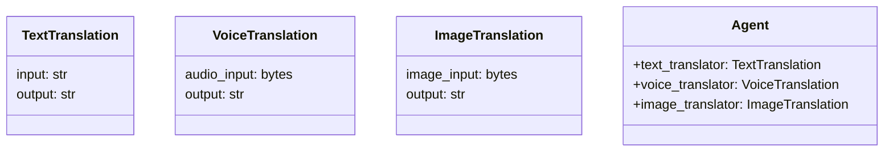
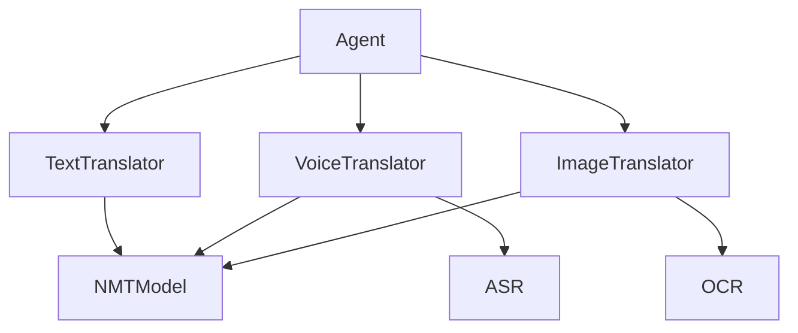

                 


# 实现AI Agent的多语言翻译能力

> 关键词：AI Agent, 多语言翻译, 神经机器翻译, Transformer模型, 多语言模型, 系统架构

> 摘要：本文详细探讨了如何实现AI Agent的多语言翻译能力，从核心概念、算法原理到系统架构，再到项目实战，全面解析了AI Agent在多语言翻译中的技术实现与应用。文章通过详细的技术分析和实例演示，帮助读者理解如何构建具备多语言翻译能力的AI Agent。

---

# 第一部分: AI Agent与多语言翻译的背景与基础

## 第1章: AI Agent与多语言翻译概述

### 1.1 AI Agent的基本概念
#### 1.1.1 AI Agent的定义与特点
AI Agent（人工智能代理）是一种能够感知环境、执行任务并做出决策的智能系统。它具有自主性、反应性、目标导向性和社会性等特点。

#### 1.1.2 多语言翻译能力的重要性
在现实场景中，AI Agent需要与不同语言的用户交互，理解并生成多种语言的内容，这使得多语言翻译能力成为AI Agent的重要功能。

#### 1.1.3 AI Agent在多语言翻译中的应用场景
- **跨语言对话系统**：支持多语言的智能对话系统。
- **全球内容生成**：生成多种语言的文本、文档。
- **实时翻译辅助**：在会议、客服等场景中提供实时翻译支持。

### 1.2 多语言翻译的挑战与意义
#### 1.2.1 多语言翻译的核心问题
- 不同语言的语义差异。
- 文化背景对翻译的影响。
- 多语言模型的训练效率。

#### 1.2.2 不同语言之间的语义差异
语言之间的语义差异可能导致翻译的不准确，例如中文和英文在语法结构上的差异。

#### 1.2.3 多语言翻译的实际应用价值
- 提高AI系统的通用性和实用性。
- 支持全球化业务场景。

### 1.3 AI技术在翻译中的发展史
#### 1.3.1 传统机器翻译技术
基于规则的机器翻译，依赖于语言学知识库。

#### 1.3.2 统计机器翻译的崛起
基于统计模型，通过大量平行文本训练翻译模型。

#### 1.3.3 神经机器翻译的突破
基于深度学习的神经机器翻译（NMT）技术，显著提高了翻译质量。

### 1.4 本章小结
本章介绍了AI Agent的基本概念，分析了多语言翻译的重要性和挑战，并回顾了翻译技术的发展历程。

---

# 第二部分: AI Agent多语言翻译的核心概念与技术

## 第2章: 多语言翻译的核心技术

### 2.1 神经机器翻译模型
#### 2.1.1 神经机器翻译的基本原理
神经机器翻译通过深度学习模型直接学习源语言到目标语言的映射关系。

#### 2.1.2 Transformer模型在翻译中的应用
Transformer模型以其强大的序列建模能力，成为神经机器翻译的核心架构。

#### 2.1.3 多语言翻译的挑战与解决方案
- **跨语言表示**：通过共享参数或嵌入层实现多语言模型。
- **语言识别**：自动识别输入语言并选择合适的翻译模型。

### 2.2 多语言翻译的模型架构
#### 2.2.1 多语言模型的设计思想
多语言模型通过共享参数或嵌入层，同时支持多种语言的翻译任务。

#### 2.2.2 多语言翻译的编码器-解码器架构
编码器将源语言文本编码为隐层表示，解码器将其解码为目标语言文本。

#### 2.2.3 多语言模型的训练策略
- **联合训练**：同时训练多种语言的翻译模型。
- **零样本翻译**：在没有平行数据的情况下，利用跨语言表示进行翻译。

### 2.3 多语言翻译的评估指标
#### 2.3.1 常见的翻译质量评估指标
- BLEU（Bilingual Evaluation Understudy）：基于n-gram的精确度。
- ROUGE（Recall-Oriented Understudy for Gisting Evaluation）：基于召回率的评估指标。

#### 2.3.2 BLEU、ROUGE等指标的计算方法
- BLEU计算方法：通过n-gram匹配度和长度惩罚计算。
- ROUGE计算方法：基于召回率和F1分数。

#### 2.3.3 人工评估与自动化评估的结合
自动化评估指标可以辅助人工评估，但最终质量仍需结合人工校对。

### 2.4 本章小结
本章详细介绍了神经机器翻译模型的基本原理，分析了多语言翻译的模型架构和训练策略，并讨论了翻译质量的评估指标。

---

# 第三部分: AI Agent多语言翻译的算法原理

## 第3章: 神经机器翻译的算法原理

### 3.1 Transformer模型的结构解析
#### 3.1.1 编码器的结构与功能
编码器由多个相同的层堆叠而成，每层包括多头自注意力机制和前馈网络。

#### 3.1.2 解码器的结构与功能
解码器同样由多层堆叠，但每层还包括交叉注意力机制，用于捕获源语言和目标语言的关系。

#### 3.1.3 自注意力机制的数学公式
自注意力机制的计算公式如下：
$$
\text{Attention}(Q, K, V) = \text{softmax}\left(\frac{QK^T}{\sqrt{d_k}}\right)V
$$

### 3.2 多语言翻译的算法实现
#### 3.2.1 多语言模型的训练流程
1. 数据预处理：收集并整理多种语言的平行文本数据。
2. 模型训练：使用多语言数据训练 Transformer 模型。
3. 模型推理：输入源语言文本，输出目标语言文本。

#### 3.2.2 多语言翻译的训练代码示例
```python
# 示例代码：多语言翻译模型的训练流程
import torch
import torch.nn as nn

class MultiLanguageTransformer(nn.Module):
    def __init__(self, vocab_size, d_model, num_layers, num_heads):
        super().__init__()
        self.embedding = nn.Embedding(vocab_size, d_model)
        self.transformer = nn.Transformer(d_model=d_model, num_layers=num_layers, num_heads=num_heads)
        self.fc = nn.Linear(d_model, vocab_size)

    def forward(self, x, mask):
        embedded = self.embedding(x)
        output = self.transformer(embedded, mask)
        output = self.fc(output)
        return output

# 使用多语言数据训练模型
model = MultiLanguageTransformer(...)
criterion = nn.CrossEntropyLoss()
optimizer = torch.optim.Adam(model.parameters())
```

### 3.3 多语言翻译的数学模型
#### 3.3.1 编码器-解码器的数学表达
编码器将输入序列 $x = (x_1, x_2, ..., x_n)$ 映射到隐层表示 $z$，解码器根据 $z$ 生成目标序列 $y = (y_1, y_2, ..., y_m)$。

#### 3.3.2 注意力机制的数学公式
$$
\text{Attention}(Q, K, V) = \text{softmax}\left(\frac{QK^T}{\sqrt{d_k}}\right)V
$$

### 3.4 本章小结
本章详细讲解了神经机器翻译的算法原理，包括Transformer模型的结构、多语言翻译的训练流程和数学模型。

---

# 第四部分: AI Agent多语言翻译的系统架构与实现

## 第4章: 系统分析与架构设计方案

### 4.1 问题场景介绍
AI Agent需要支持多种语言的翻译功能，包括文本翻译、语音翻译和图像翻译。

### 4.2 系统功能设计
#### 4.2.1 领域模型


#### 4.2.2 系统架构设计


#### 4.2.3 接口设计
- **文本翻译接口**：`translate(text: str, target_lang: str) -> str`
- **语音翻译接口**：`voice_translate(audio_path: str, target_lang: str) -> str`
- **图像翻译接口**：`image_translate(image_path: str, target_lang: str) -> str`

#### 4.2.4 交互流程
```mermaid
sequenceDiagram
    participant Agent
    participant TextTranslator
    participant VoiceTranslator
    participant ImageTranslator
    Agent -> TextTranslator: translate(text, target_lang)
    TextTranslator --> NMTModel
    NMTModel --> TextTranslator
    TextTranslator --> Agent
    Agent -> VoiceTranslator: voice_translate(audio_path, target_lang)
    VoiceTranslator --> ASR
    ASR --> NMTModel
    NMTModel --> VoiceTranslator
    VoiceTranslator --> Agent
```

### 4.3 本章小结
本章分析了AI Agent多语言翻译系统的功能需求，设计了系统的领域模型、架构图和交互流程。

---

## 第5章: 项目实战

### 5.1 环境搭建与安装
- **安装依赖**：
  ```bash
  pip install torch transformers
  ```

### 5.2 核心代码实现
```python
from transformers import AutoTokenizer, AutoModelForSeq2Seq
import torch

class AIAGENT_translator:
    def __init__(self, model_name):
        self.tokenizer = AutoTokenizer.from_pretrained(model_name)
        self.model = AutoModelForSeq2Seq.from_pretrained(model_name)

    def translate(self, text, target_lang):
        inputs = self.tokenizer(text, return_tensors="pt")
        outputs = self.model.generate(**inputs, max_length=50)
        translated = self.tokenizer.decode(outputs[0], skip_special_tokens=True)
        return translated

# 示例用法
translator = AIAGENT_translator("facebook/m2m100")
result = translator.translate("Hello world", "zh")
print(result)  # 输出："你好，世界"
```

### 5.3 代码应用解读
- **代码功能**：实现多语言翻译功能。
- **输入输出**：输入源语言文本和目标语言，输出翻译结果。

### 5.4 实际案例分析
- **案例1**：中英互译
  - 输入："你好，世界"，目标语言：en
  - 输出："Hello, world"

### 5.5 项目总结
通过本项目，我们实现了一个基于Transformers的多语言翻译系统，可以支持多种语言的翻译需求。

---

## 第6章: 最佳实践与总结

### 6.1 最佳实践
- **模型选择**：选择适合多语言翻译的预训练模型。
- **数据预处理**：确保输入数据的格式和质量。
- **性能优化**：使用并行计算加速训练和推理。

### 6.2 小结
本文详细探讨了AI Agent多语言翻译能力的实现，从核心概念到系统架构，再到项目实战，全面解析了技术细节和实现方法。

### 6.3 注意事项
- 处理多语言数据时，需要注意语言间的语义差异。
- 翻译模型的训练需要大量的平行数据。

### 6.4 拓展阅读
- 推荐阅读《Transformers: State-of-the-Art Language Models》。

---

# 作者：AI天才研究院 & 禅与计算机程序设计艺术

