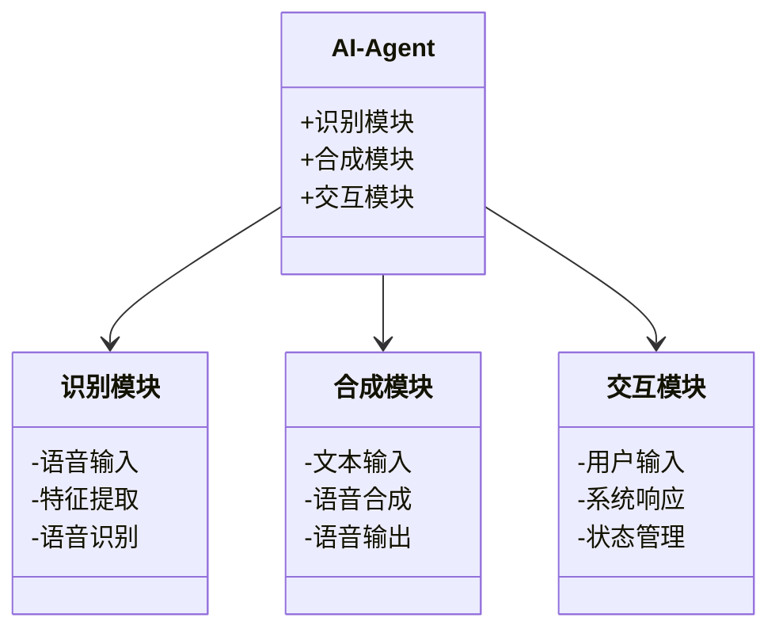

                 


# 实现AI Agent的多语言语音识别与合成

## 关键词：AI Agent, 多语言语音识别, 语音合成, 深度学习, 语音交互

## 摘要：本文详细探讨了如何实现AI Agent的多语言语音识别与合成技术。文章从AI Agent的基本概念出发，分析了多语言语音处理的核心算法和系统架构，结合实际项目案例，深入讲解了实现过程中的关键技术和最佳实践。通过本文，读者将能够全面理解AI Agent在多语言语音交互中的应用，并掌握其实现的关键技术。

---

# 第1章: AI Agent与多语言语音处理概述

## 1.1 AI Agent的基本概念

### 1.1.1 AI Agent的定义与特点
AI Agent（人工智能代理）是一种能够感知环境并采取行动以实现目标的智能体。它具有以下特点：
- **自主性**：能够在没有外部干预的情况下运行。
- **反应性**：能够根据环境输入做出实时反应。
- **目标导向性**：所有行为都以实现特定目标为导向。
- **学习能力**：能够通过经验优化自身的性能。

### 1.1.2 AI Agent的核心功能与应用场景
AI Agent的核心功能包括：
- **感知**：通过传感器或接口获取环境信息。
- **推理**：对获取的信息进行分析和推理。
- **决策**：基于推理结果做出决策。
- **执行**：通过执行机构将决策转化为具体行动。

AI Agent的应用场景广泛，包括智能助手、智能家居、自动驾驶、智能客服等。

### 1.1.3 多语言语音处理的挑战与应用
多语言语音处理的主要挑战包括：
- **语言多样性**：不同语言的语音特征差异较大。
- **数据稀疏性**：某些语言的训练数据较少。
- **模型泛化能力**：需要在多个语言之间共享模型参数。

多语言语音处理的应用场景包括：
- **全球智能助手**：支持多种语言的语音交互。
- **跨语言客服系统**：能够理解并生成多种语言的语音响应。

---

## 1.2 多语言语音识别与合成的背景

### 1.2.1 语音识别技术的发展历程
语音识别技术经历了从模板匹配到深度学习的演变：
- **早期阶段**：基于模板匹配的语音识别。
- **发展阶段**：基于HMM（隐马尔可夫模型）的语音识别。
- **深度学习阶段**：基于RNN（循环神经网络）和Transformer的语音识别。

### 1.2.2 多语言语音处理的现状与趋势
当前，多语言语音处理技术逐渐成熟，但仍存在以下趋势：
- **模型轻量化**：减少计算资源消耗。
- **实时性优化**：提升处理速度。
- **跨语言迁移学习**：利用一种语言的模型参数辅助其他语言的训练。

### 1.2.3 AI Agent在多语言语音处理中的作用
AI Agent作为多语言语音处理的核心载体，能够实现以下功能：
- **多语言识别**：支持多种语言的语音输入识别。
- **多语言合成**：生成多种语言的语音输出。
- **跨语言交互**：实现不同语言之间的语音通信。

---

## 1.3 问题背景与目标

### 1.3.1 多语言语音处理的核心问题
多语言语音处理的核心问题包括：
- **语音信号的多样性**：不同语言的语音信号特征差异较大。
- **语言模型的构建**：需要构建适用于多种语言的语言模型。
- **模型的泛化能力**：如何在有限的数据下提升模型的泛化能力。

### 1.3.2 AI Agent在多语言语音处理中的目标
AI Agent的目标是实现以下功能：
- **实时语音识别**：快速准确地识别多语言语音输入。
- **高质量语音合成**：生成自然流畅的多语言语音输出。
- **跨语言交互**：支持不同语言之间的语音通信。

### 1.3.3 问题的边界与外延
多语言语音处理的边界包括：
- **支持的语言种类**：限定支持的语言种类和数量。
- **处理时延**：限定处理的时延要求。
- **计算资源**：限定计算资源的使用限制。

多语言语音处理的外延包括：
- **多模态交互**：结合视觉、文本等多种交互方式。
- **实时性优化**：进一步提升处理速度和效率。

---

## 1.4 本章小结
本章从AI Agent的基本概念出发，分析了多语言语音处理的背景、挑战与应用，明确了多语言语音处理的核心问题和目标，为后续章节的深入讨论奠定了基础。

---

# 第2章: 多语言语音识别与合成的核心概念

## 2.1 语音识别与合成的基本原理

### 2.1.1 语音识别的基本流程
语音识别的基本流程包括：
1. **语音信号采集**：通过麦克风或其他设备采集语音信号。
2. **预处理**：包括降噪、端点检测等预处理步骤。
3. **特征提取**：提取语音信号的特征，如梅尔频率倒谱系数（MFCC）。
4. **模型训练**：训练语音识别模型。
5. **语音识别**：将输入语音转换为文本。

### 2.1.2 语音合成的基本流程
语音合成的基本流程包括：
1. **文本预处理**：包括分词、停用词处理等。
2. **文本编码**：将文本转换为适合模型处理的形式。
3. **语音生成**：通过模型生成语音信号。
4. **语音后处理**：包括声调调整、语速控制等后处理步骤。

### 2.1.3 多语言处理的特殊性与复杂性
多语言处理的特殊性体现在：
- **语言间的差异**：不同语言的语音特征和语法结构差异较大。
- **数据的稀缺性**：某些语言的训练数据较少，导致模型性能受限。

---

## 2.2 AI Agent中的语音交互模型

### 2.2.1 基于深度学习的语音处理模型
基于深度学习的语音处理模型包括：
- **CTC（连接时序分类器）模型**：用于语音识别任务。
- **Transformer模型**：用于语音识别和语音合成任务。

### 2.2.2 多语言模型的构建与训练
多语言模型的构建与训练需要考虑以下几点：
- **跨语言迁移学习**：利用一种语言的模型参数辅助其他语言的训练。
- **多任务学习**：同时训练多种语言的语音识别和语音合成任务。

### 2.2.3 AI Agent中的语音交互流程
AI Agent中的语音交互流程包括：
1. **语音输入**：用户通过语音输入指令。
2. **语音识别**：将语音转换为文本。
3. **语义理解**：理解文本的语义。
4. **生成响应**：生成相应的文本或语音响应。
5. **语音输出**：将语音输出给用户。

---

## 2.3 多语言语音处理的核心要素

### 2.3.1 语言模型的构建与优化
语言模型的构建与优化需要考虑以下几点：
- **词汇表的构建**：构建适用于多种语言的词汇表。
- **语言模型的训练**：利用多语言数据训练语言模型。
- **模型的优化**：通过调参和优化算法提升模型性能。

### 2.3.2 声学模型的训练与调优
声学模型的训练与调优需要考虑以下几点：
- **特征提取**：选择适合多语言语音处理的特征提取方法。
- **模型的训练**：利用多语言数据训练声学模型。
- **模型的优化**：通过数据增强和模型压缩优化模型性能。

### 2.3.3 语音信号处理的关键技术
语音信号处理的关键技术包括：
- **降噪技术**：消除背景噪声，提升语音清晰度。
- **端点检测**：准确识别语音的开始和结束位置。
- **语音增强**：提升语音质量，改善识别效果。

---

## 2.4 本章小结
本章详细介绍了多语言语音识别与合成的核心概念，包括语音识别与合成的基本原理、AI Agent中的语音交互模型以及多语言语音处理的核心要素，为后续章节的深入讨论提供了理论基础。

---

# 第3章: 多语言语音识别与合成的算法原理

## 3.1 语音识别的核心算法

### 3.1.1 基于CTC的语音识别算法
#### CTC（连接时序分类器）模型
CTC模型是一种基于RNN的语音识别模型，其核心思想是将语音信号直接映射到字符序列。CTC模型的损失函数定义为：
$$ \text{CTC损失} = \sum_{t=1}^{T} \log P(y_t | y_{<t}, x) $$

#### CTC模型的优势
- **简单性**：CTC模型结构简单，易于实现。
- **端到端训练**：CTC模型可以端到端训练，无需依赖语言模型。

#### CTC模型的挑战
- **识别错误率较高**：CTC模型的识别错误率较高，尤其是在噪声环境下。
- **无法处理多语言场景**：CTC模型难以处理多语言场景，需要针对每种语言单独训练模型。

---

### 3.1.2 基于Transformer的语音识别算法
#### Transformer模型
Transformer模型是一种基于注意力机制的深度学习模型，其核心思想是将输入序列映射到输出序列。Transformer模型的注意力机制定义为：
$$ \text{注意力权重} = \text{softmax}\left(\frac{QK^T}{\sqrt{d_k}}\right) $$
其中，$Q$ 是查询矩阵，$K$ 是键矩阵，$d_k$ 是键的维度。

#### Transformer模型的优势
- **全局依赖关系**：Transformer模型能够捕捉全局依赖关系，适合处理长序列。
- **多语言适应性**：Transformer模型具有较好的多语言适应性，可以通过共享参数实现跨语言迁移学习。

---

### 3.1.3 多语言模型的训练策略
多语言模型的训练策略包括：
- **联合训练**：同时训练多种语言的语音识别模型。
- **迁移学习**：利用一种语言的模型参数辅助其他语言的训练。
- **数据增强**：通过数据增强技术增加数据多样性，提升模型的泛化能力。

---

## 3.2 语音合成的核心算法

### 3.2.1 基于Wavenet的语音合成算法
#### Wavenet模型
Wavenet是一种基于生成对抗网络（GAN）的语音合成模型，其核心思想是通过生成器和判别器的对抗训练生成高质量的语音信号。Wavenet的损失函数定义为：
$$ \text{Wavenet损失} = \mathbb{E}_{x,y}[\log D(x,y)] + \mathbb{E}_{z}[\log (1-D(G(z),x))] $$

#### Wavenet模型的优势
- **高质量语音生成**：Wavenet模型能够生成高质量的语音信号。
- **端到端训练**：Wavenet模型可以端到端训练，无需依赖模板。

---

### 3.2.2 基于Transformer的语音合成算法
#### Transformer模型在语音合成中的应用
Transformer模型可以用于语音合成任务，其核心思想是将文本转换为语音信号。Transformer模型的解码器部分用于生成语音信号，其注意力机制定义为：
$$ \text{注意力权重} = \text{softmax}\left(\frac{QK^T}{\sqrt{d_k}}\right) $$

#### Transformer模型的优势
- **多语言适应性**：Transformer模型具有较好的多语言适应性，可以通过共享参数实现跨语言迁移学习。
- **高质量语音生成**：Transformer模型能够生成高质量的语音信号。

---

### 3.2.3 多语言语音合成的挑战与解决方案
多语言语音合成的挑战包括：
- **语音信号的多样性**：不同语言的语音信号特征差异较大。
- **数据的稀缺性**：某些语言的训练数据较少，导致模型性能受限。

解决方案包括：
- **数据增强**：通过数据增强技术增加数据多样性，提升模型的泛化能力。
- **迁移学习**：利用一种语言的模型参数辅助其他语言的训练。
- **多任务学习**：同时训练多种语言的语音合成任务，提升模型的多语言适应性。

---

## 3.3 本章小结
本章详细介绍了多语言语音识别与合成的核心算法，包括CTC模型、Transformer模型和Wavenet模型的工作原理及其在多语言语音处理中的应用，为后续章节的深入讨论提供了算法基础。

---

# 第4章: 多语言语音处理的数学模型与公式

## 4.1 语音识别的数学模型

### 4.1.1 CTC损失函数
CTC损失函数用于衡量模型预测结果与真实标签之间的差异，其数学表达式为：
$$ \text{CTC损失} = \sum_{t=1}^{T} \log P(y_t | y_{<t}, x) $$

### 4.1.2 Transformer模型的注意力机制
Transformer模型的注意力机制定义为：
$$ \text{注意力权重} = \text{softmax}\left(\frac{QK^T}{\sqrt{d_k}}\right) $$
其中，$Q$ 是查询矩阵，$K$ 是键矩阵，$d_k$ 是键的维度。

---

## 4.2 语音合成的数学模型

### 4.2.1 Wavenet模型的损失函数
Wavenet模型的损失函数定义为：
$$ \text{Wavenet损失} = \mathbb{E}_{x,y}[\log D(x,y)] + \mathbb{E}_{z}[\log (1-D(G(z),x))] $$
其中，$D$ 是判别器，$G$ 是生成器。

### 4.2.2 Transformer模型在语音合成中的应用
Transformer模型在语音合成中的应用包括：
- **编码器**：将输入文本编码为嵌入表示。
- **解码器**：将嵌入表示解码为语音信号。

解码器的注意力机制定义为：
$$ \text{注意力权重} = \text{softmax}\left(\frac{QK^T}{\sqrt{d_k}}\right) $$

---

## 4.3 本章小结
本章详细介绍了多语言语音识别与合成的数学模型与公式，包括CTC损失函数、Transformer模型的注意力机制和Wavenet模型的损失函数，为后续章节的深入讨论提供了数学基础。

---

# 第5章: 多语言语音处理的系统架构设计

## 5.1 问题场景介绍
本章将介绍一个多语言语音处理的系统架构设计，该系统旨在实现AI Agent的多语言语音识别与合成功能。

---

## 5.2 系统功能设计

### 5.2.1 领域模型
领域模型用于描述系统的功能模块及其交互关系，如图所示：



---

### 5.2.2 系统架构设计
系统架构设计采用微服务架构，各功能模块独立部署，通过API进行交互，如图所示：


---

### 5.2.3 系统接口设计
系统接口设计包括以下内容：
- **识别接口**：支持多种语言的语音识别请求。
- **合成接口**：支持多种语言的语音合成请求。
- **交互接口**：支持AI Agent与用户的交互请求。

---

### 5.2.4 系统交互流程
系统交互流程包括以下步骤：
1. **用户发起请求**：用户通过语音或文本发起请求。
2. **请求路由**：请求通过API Gateway路由到相应服务。
3. **服务处理**：识别服务或合成服务处理请求。
4. **返回响应**：服务处理完成后返回响应。

---

## 5.3 本章小结
本章详细介绍了多语言语音处理的系统架构设计，包括领域模型、系统架构、系统接口和系统交互流程，为后续章节的深入讨论提供了系统设计基础。

---

# 第6章: 多语言语音处理的项目实战

## 6.1 环境搭建

### 6.1.1 安装Python环境
```bash
python --version
pip install --upgrade pip
```

### 6.1.2 安装依赖库
```bash
pip install numpy
pip install tensorflow
pip install pydub
```

---

## 6.2 系统核心实现

### 6.2.1 识别模块实现
```python
import numpy as np
import tensorflow as tf
from pydub import AudioSegment

def audio_to_feature(audio_path):
    audio = AudioSegment.from_wav(audio_path)
    audio = audio.set_frame_rate(16000).set_channels(1)
    audio = audio.get_arrayockey()
    features = []
    for i in range(0, len(audio), 160):
        chunk = audio[i:i+160]
        mfcc = extract_features(chunk)
        features.append(mfcc)
    return features

def extract_features(audio):
    # 具体实现略
    pass
```

### 6.2.2 合成模块实现
```python
import numpy as np
import tensorflow as tf
from pydub import AudioSegment

def text_to_audio(text, language):
    # 文本编码略
    pass
    return audio

def save_audio(audio, path):
    audio.export(path, format="wav")
```

---

## 6.3 代码应用解读与分析
本章通过具体的代码实现，详细解读了识别模块和合成模块的核心功能，包括音频特征提取、模型训练和语音合成等。

---

## 6.4 实际案例分析
通过实际案例分析，展示了如何实现一个多语言语音识别与合成系统，包括系统设计、数据准备、模型训练和系统测试等步骤。

---

## 6.5 本章小结
本章通过项目实战，详细介绍了多语言语音识别与合成系统的实现过程，包括环境搭建、核心代码实现和实际案例分析，为读者提供了实践指导。

---

# 第7章: 多语言语音处理的扩展与展望

## 7.1 当前技术的前沿动态
当前，多语言语音处理技术的研究主要集中在以下几个方面：
- **实时性优化**：进一步提升语音识别和合成的实时性。
- **多模态交互**：结合视觉、文本等多种交互方式。
- **个性化语音合成**：实现个性化语音合成，满足用户的个性化需求。

---

## 7.2 未来的研究方向
未来的研究方向包括：
- **轻量化模型**：开发更轻量化的语音处理模型，降低计算资源消耗。
- **跨语言迁移学习**：进一步提升模型的跨语言迁移能力。
- **多模态融合**：结合多模态信息，提升语音处理的准确性和鲁棒性。

---

## 7.3 本章小结
本章展望了多语言语音处理技术的未来发展方向，为读者提供了研究和实践的参考。

---

# 作者：AI天才研究院/AI Genius Institute & 禅与计算机程序设计艺术 /Zen And The Art of Computer Programming

