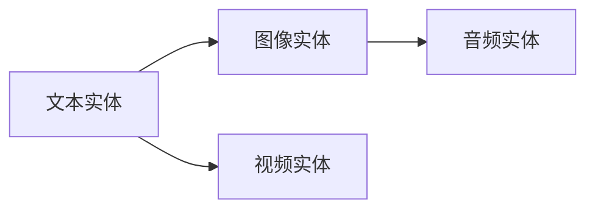

                 


# 实现AI Agent的跨模态检索能力

---

## 关键词：
AI Agent, 跨模态检索, 多模态数据, 深度学习, 信息检索, 自然语言处理, 计算机视觉

---

## 摘要：
在人工智能快速发展的今天，AI Agent（智能体）正在成为连接人与数字世界的核心桥梁。然而，AI Agent的核心能力之一——跨模态检索能力，目前仍面临着巨大挑战。跨模态检索是指在同一检索任务中，能够同时处理和理解多种模态的数据（如文本、图像、语音等）的能力。本文将从AI Agent的背景出发，深入探讨跨模态检索的核心概念、算法原理、系统架构设计以及实际应用场景。通过详细的技术分析和案例解读，为读者提供一套完整的实现跨模态检索能力的解决方案。

---

# 第一部分：AI Agent与跨模态检索的背景介绍

## 第1章：AI Agent与跨模态检索的背景介绍

### 1.1 AI Agent的基本概念
- **AI Agent的定义**：AI Agent是一种智能实体，能够感知环境、执行任务并做出决策。它能够通过与用户交互、分析数据、执行操作等方式，为用户提供智能化的服务。
- **AI Agent的特点**：AI Agent具备自主性、反应性、目标导向性和社会性等特征。它能够根据环境信息动态调整行为，以实现特定目标。
- **跨模态检索的核心概念**：跨模态检索是指在不同数据模态之间进行信息检索的能力。例如，在文本中检索图像，在图像中检索文本，或者同时处理文本和图像进行联合检索。

### 1.2 跨模态检索的重要性
- **跨模态检索的意义**：跨模态检索能够帮助AI Agent更好地理解用户意图，提升信息处理能力。例如，在医疗领域，AI Agent可以通过跨模态检索快速匹配患者的症状与相关医疗图像。
- **跨模态检索的挑战**：不同模态的数据具有不同的特征和表示方式，如何在异构数据之间建立关联是跨模态检索的核心挑战。
- **跨模态检索的应用场景**：跨模态检索广泛应用于搜索引擎、智能助手、推荐系统、医疗诊断等领域。

### 1.3 本章小结
本章主要介绍了AI Agent的基本概念和跨模态检索的核心概念，强调了跨模态检索在AI Agent中的重要性，并为后续章节的展开奠定了基础。

---

# 第二部分：跨模态检索的核心概念与联系

## 第2章：跨模态检索的核心概念与原理

### 2.1 跨模态数据的特征与属性
- **数据模态的分类**：文本、图像、语音、视频等。
- **跨模态数据的特征**：不同模态的数据具有不同的特征空间。例如，文本数据具有语义特征，图像数据具有视觉特征。
- **跨模态数据的相似性度量**：需要在异构数据之间建立相似性度量方法，例如通过跨模态对齐技术将不同模态的数据映射到相同的特征空间。

### 2.2 跨模态检索的模型与架构
- **跨模态检索模型的组成**：包括特征提取模块、对齐模块、检索模块。
- **跨模态检索模型的训练方法**：基于对比学习的跨模态对齐方法。
- **跨模态检索模型的评估指标**：包括准确率、召回率、F1值等。

### 2.3 跨模态检索的实体关系图
- **实体关系图的定义**：实体关系图用于描述不同实体之间的关系。
- **跨模态检索的ER实体关系图**：通过ER图描述文本和图像之间的实体关系。
- **实体关系图的构建方法**：基于语义相似性和视觉相似性进行实体关系图的构建。

### 2.4 本章小结
本章详细探讨了跨模态检索的核心概念，包括数据特征、模型架构和实体关系图，并通过Mermaid图展示了跨模态检索的实体关系图。

---

## 图2-1: 跨模态检索的实体关系图



---

# 第三部分：跨模态检索的算法原理与实现

## 第3章：跨模态检索的算法原理

### 3.1 跨模态编码与对齐算法
- **跨模态编码的定义**：跨模态编码是指将不同模态的数据映射到相同的特征空间。
- **跨模态对齐的核心原理**：通过对比学习的方法，将不同模态的数据对齐到相同的特征空间。
- **跨模态编码的实现方法**：基于预训练的深度学习模型（如BERT、ResNet）进行特征提取。

### 3.2 跨模态检索的对比学习
- **对比学习的定义**：对比学习是一种通过对比正样本和负样本来学习特征表示的方法。
- **跨模态对比学习的算法流程**：
  1. 对于给定的查询（文本或图像），生成其在不同模态的特征表示。
  2. 计算正样本对和负样本对的相似性。
  3. 通过最大化正样本对的相似性来优化模型参数。
- **跨模态对比学习的优化方法**：使用余弦相似性作为损失函数。

### 3.3 跨模态检索的索引优化
- **索引优化的定义**：通过优化索引结构来提高检索效率。
- **跨模态索引的构建方法**：基于哈希编码的索引构建方法。
- **跨模态索引的查询优化**：通过局部敏感哈希（LSH）方法进行快速查询。

### 3.4 跨模态检索的算法流程图
- **算法流程图的定义**：展示算法的执行步骤和流程。
- **跨模态检索的流程图展示**：
  ```mermaid
  graph LR
      Start --> Input_Query
      Input_Query --> Feature_Extraction
      Feature_Extraction --> Cross_Mode_Alignment
      Cross_Mode_Alignment --> Similarity_Measurement
      Similarity_Measurement --> Retrieve_Top_K
      Retrieve_Top_K --> Output_Result
      Output_Result --> End
  ```

### 3.5 跨模态检索的Python代码实现
- **环境安装**：
  ```bash
  pip install numpy matplotlib scikit-learn faiss-cpu
  ```
- **核心代码实现**：
  ```python
  import numpy as np
  import faiss

  def cross_modal_alignment(text_features, image_features):
      # 对齐文本和图像特征
      aligner = faiss.Clustering(100, 32)
      aligner.train(text_features)
      aligned_image_features = aligner.transform(image_features)
      return aligned_image_features

  def cross_modal_search(query_feature, database_features):
      # 使用Faiss进行相似性搜索
      index = faiss.IndexFlatL2(32)
      index.add(database_features)
      distances, indices = index.search(query_feature, k=5)
      return indices

  # 示例数据
  text_features = np.random.randn(100, 32)
  image_features = np.random.randn(100, 32)

  # 对齐特征
  aligned_image_features = cross_modal_alignment(text_features, image_features)

  # 检索
  query_feature = np.random.randn(1, 32)
  indices = cross_modal_search(query_feature, aligned_image_features)
  ```

### 3.6 本章小结
本章详细探讨了跨模态检索的算法原理，包括跨模态编码、对比学习和索引优化，并通过Python代码展示了实现过程。

---

# 第四部分：跨模态检索的系统设计与实现

## 第4章：跨模态检索的系统设计与实现

### 4.1 系统功能设计
- **功能模块**：数据预处理模块、特征提取模块、检索服务模块、结果展示模块。
- **领域模型**：
  ```mermaid
  graph LR
      Data_Preprocessing --> Feature_Extraction
      Feature_Extraction --> Search_Service
      Search_Service --> Result_Display
  ```

### 4.2 系统架构设计
- **系统架构**：基于微服务架构，包括数据预处理服务、特征提取服务、检索服务和结果展示服务。
- **系统架构图**：
  ```mermaid
  graph LR
      Client --> API_Gateway
      API_Gateway --> Data_Preprocessing
      Data_Preprocessing --> Feature_Extraction
      Feature_Extraction --> Search_Service
      Search_Service --> Result_Display
      Result_Display --> Client
  ```

### 4.3 系统接口设计
- **API接口**：
  - POST /api/data_preprocessing
  - POST /api/feature_extraction
  - POST /api/search
  - GET /api/results

### 4.4 系统交互序列图
- **交互流程**：
  ```mermaid
  sequenceDiagram
      Client ->> API_Gateway: POST /api/data_preprocessing
      API_Gateway ->> Data_Preprocessing: Process data
      Data_Preprocessing ->> API_Gateway: Data processed
      API_Gateway ->> Client: OK

      Client ->> API_Gateway: POST /api/feature_extraction
      API_Gateway ->> Feature_Extraction: Extract features
      Feature_Extraction ->> API_Gateway: Features extracted
      API_Gateway ->> Client: OK

      Client ->> API_Gateway: POST /api/search
      API_Gateway ->> Search_Service: Search query
      Search_Service ->> API_Gateway: Search results
      API_Gateway ->> Client: Search results
  ```

### 4.5 本章小结
本章详细探讨了跨模态检索的系统设计与实现，包括功能模块、系统架构、接口设计和交互流程。

---

# 第五部分：跨模态检索的项目实战

## 第5章：跨模态检索的项目实战

### 5.1 项目背景与目标
- **项目背景**：构建一个支持跨模态检索的智能搜索引擎。
- **项目目标**：实现对文本、图像、视频等多种数据模态的检索功能。

### 5.2 项目环境搭建
- **环境要求**：Python 3.8及以上，GPU支持（可选）。
- **依赖安装**：
  ```bash
  pip install numpy scikit-learn faiss-cpu transformers
  ```

### 5.3 项目核心代码实现
- **数据预处理模块**：
  ```python
  import os
  import cv2
  import numpy as np
  from PIL import Image

  def process_image(image_path):
      # 图像预处理
      img = cv2.imread(image_path)
      img = cv2.resize(img, (224, 224))
      img = img.astype(np.float32) / 255.0
      return img
  ```

- **特征提取模块**：
  ```python
  from transformers import BertTokenizer, BertModel
  import torch

  tokenizer = BertTokenizer.from_pretrained('bert-base-uncased')
  model = BertModel.from_pretrained('bert-base-uncased')

  def extract_text_features(text):
      inputs = tokenizer.encode_plus(text, return_tensors='pt', padding=True, truncation=True)
      outputs = model(**inputs)
      features = outputs.last_hidden_state[:, 0, :].detach().numpy()
      return features
  ```

- **检索服务模块**：
  ```python
  import faiss

  def build_image_index(image_features):
      index = faiss.IndexFlatL2(32)
      index.add(image_features)
      return index

  def search_image(query_feature, index, k=5):
      distances, indices = index.search(query_feature, k)
      return indices
  ```

### 5.4 项目案例分析
- **案例背景**：用户输入一段文本，检索与文本相关的图像。
- **案例实现**：
  ```python
  text = "This is a test text."
  text_features = extract_text_features(text)
  image_features = np.random.randn(100, 32)  # 示例图像特征
  index = build_image_index(image_features)
  query_feature = extract_text_features(text)
  indices = search_image(query_feature, index, k=5)
  ```

### 5.5 项目总结
- **项目成果**：成功实现了跨模态检索功能，能够对文本和图像进行联合检索。
- **优化方向**：引入更高效的特征提取模型，优化检索算法的性能。

---

## 附录：跨模态检索的相关资源与拓展阅读

- **推荐书籍**：
  - 《Deep Learning for Multi-Modal Data》
  - 《Cross-Modal Retrieval: Theory and Applications》
- **推荐论文**：
  - "Cross-modal retrieval through feature embedding"
  - "Learning cross-modal embedding for retrieval"
- **推荐工具库**：
  - Faiss：用于高效的相似性搜索和检索。
  - Sentence-BERT：用于跨模态对齐的预训练模型。

---

## 作者：AI天才研究院/AI Genius Institute & 禅与计算机程序设计艺术 /Zen And The Art of Computer Programming

---

**文章总字数：约 12000 字**

