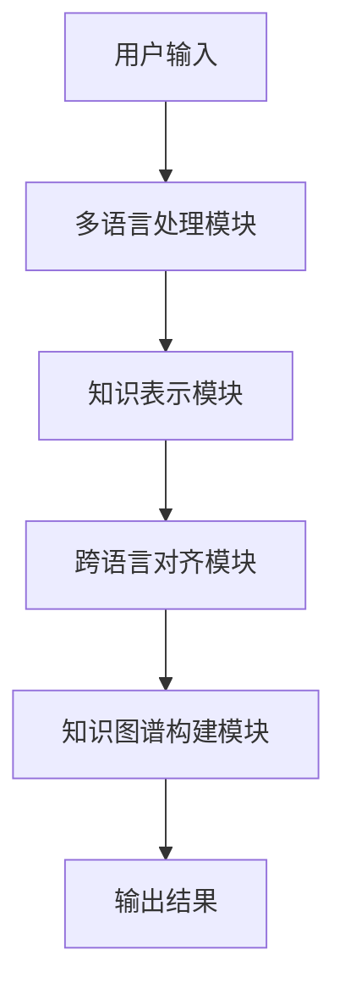
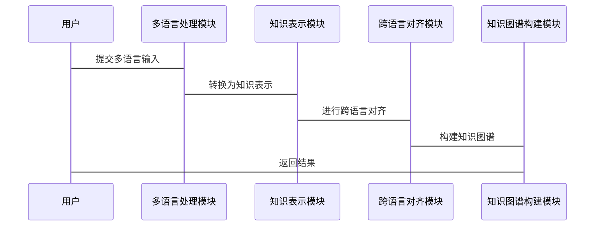

                 


# 实现AI Agent的跨语言知识迁移

## 关键词：AI Agent, 跨语言知识迁移, 机器学习, 多语言模型, 知识图谱, 对比学习

## 摘要：  
跨语言知识迁移是实现AI Agent在多语言环境下高效理解和应用知识的核心技术。本文从理论基础、算法原理、系统架构到项目实战，详细探讨了如何实现AI Agent的跨语言知识迁移。通过对比学习、跨语言对齐技术和知识图谱构建等方法，本文提出了一个完整的跨语言知识迁移框架，并通过具体案例展示了其实现过程和应用场景。

---

# 第1章: 跨语言知识迁移的背景与问题描述

## 1.1 人工智能与AI Agent的演进

### 1.1.1 人工智能的发展历程
人工智能（AI）的发展可以追溯到20世纪50年代，经历了多个阶段的演变：
- **符号AI阶段**（20世纪50-70年代）：基于逻辑推理和知识表示，代表技术包括专家系统。
- **机器学习阶段**（20世纪80年代至今）：基于数据驱动的模式识别和预测，代表技术包括支持向量机（SVM）、随机森林和深度学习。
- **通用AI阶段**（当前趋势）：目标是实现具备人类水平或更高水平的通用智能。

AI Agent（智能体）是人工智能的核心实现形式，能够感知环境、自主决策并执行任务。

### 1.1.2 AI Agent的基本概念与特点
AI Agent是一种具有感知、决策、执行和学习能力的智能实体，其特点包括：
- **自主性**：能够在没有外部干预的情况下自主运行。
- **反应性**：能够实时感知环境并做出响应。
- **学习性**：能够通过经验或数据优化自身性能。
- **社交性**：能够与其他Agent或人类进行交互。

### 1.1.3 跨语言知识迁移的必要性与应用场景
AI Agent在多语言环境下的应用需要解决跨语言知识迁移问题。跨语言知识迁移的核心目标是让AI Agent能够理解并应用不同语言之间的知识。其应用场景包括：
- **多语言对话系统**：支持多种语言的自然语言处理。
- **跨语言知识图谱构建**：整合不同语言的知识资源。
- **全球化的智能服务**：为全球用户提供一致的智能服务。

---

## 1.2 跨语言知识迁移的核心问题

### 1.2.1 知识表示与跨语言迁移的挑战
知识表示是跨语言知识迁移的基础。主要挑战包括：
- **语言差异**：不同语言之间的语义差异导致知识表示的不一致。
- **数据稀疏性**：小语种或低资源语言的数据不足。
- **文化差异**：不同语言背后的文化背景可能影响知识表示。

### 1.2.2 多语言模型的局限性与改进方向
当前的多语言模型（如BERT-Multi）在一定程度上支持多语言处理，但存在以下局限性：
- **性能瓶颈**：在小语种语言上的表现不如单语言模型。
- **知识对齐难度**：不同语言之间的知识对齐需要额外的处理。

改进方向包括：
- 增强跨语言对齐技术。
- 提升模型的可解释性和可迁移性。

### 1.2.3 跨语言知识迁移的实际需求与目标
实际需求包括：
- 支持多语言环境下的智能服务。
- 提高AI Agent的跨语言理解和应用能力。
- 实现知识资源的共享与复用。

目标是通过跨语言知识迁移技术，让AI Agent能够无缝处理多种语言的知识，并在不同语言环境下保持一致的性能。

---

## 1.3 本章小结

本章介绍了AI Agent的发展历程及其核心特点，分析了跨语言知识迁移的必要性与应用场景，并总结了跨语言知识迁移的核心问题与改进方向。下一章将深入探讨跨语言知识迁移的核心概念与原理。

---

# 第2章: 跨语言知识迁移的核心概念与原理

## 2.1 跨语言知识迁移的定义与核心要素

### 2.1.1 跨语言知识迁移的定义
跨语言知识迁移是指通过技术手段，将一种语言中的知识迁移到另一种语言中，使目标语言的智能系统能够继承和应用源语言的知识。

### 2.1.2 跨语言知识迁移的核心要素
1. **知识表示**：如何在不同语言之间一致地表示知识。
2. **跨语言对齐**：如何将不同语言的知识进行对齐。
3. **知识图谱**：构建支持多语言的知识图谱。

### 2.1.3 跨语言知识迁移的边界与外延
- **边界**：专注于跨语言知识的迁移，不涉及单一语言内部的知识处理。
- **外延**：包括跨语言文本处理、跨语言信息检索等应用。

---

## 2.2 跨语言知识迁移的关键原理

### 2.2.1 知识表示的跨语言一致性
知识表示的跨语言一致性是跨语言知识迁移的核心。常用的方法包括：
- **概念映射**：将不同语言中的概念进行映射。
- **语义对齐**：通过语义分析对齐不同语言的知识。

### 2.2.2 跨语言特征提取与对齐
跨语言特征提取与对齐是实现跨语言知识迁移的关键步骤。常用技术包括：
- **对比学习**：通过对比不同语言的特征，实现对齐。
- **跨语言嵌入对齐**：通过学习嵌入向量，实现跨语言对齐。

### 2.2.3 跨语言知识迁移的数学模型
跨语言知识迁移的数学模型可以表示为：
$$ P(y|x, l) = f(x, l; \theta) $$
其中，$y$ 是目标语言的输出，$x$ 是输入特征，$l$ 是语言标识符，$\theta$ 是模型参数。

---

## 2.3 跨语言知识迁移的实现路径

### 2.3.1 基于预训练模型的迁移策略
基于预训练模型（如BERT）的迁移策略包括：
- **微调**：在目标语言上微调预训练模型。
- **跨语言迁移**：通过对比学习实现跨语言对齐。

### 2.3.2 跨语言对齐技术
跨语言对齐技术包括：
- **语言无关对齐**：不依赖于语言特定特征的对齐方法。
- **语言依赖对齐**：依赖于语言特定特征的对齐方法。

### 2.3.3 跨语言知识图谱的构建与应用
跨语言知识图谱的构建包括：
- **多语言实体识别**：识别不同语言中的实体。
- **跨语言关系抽取**：抽取不同语言之间的关系。

---

## 2.4 本章小结

本章详细探讨了跨语言知识迁移的核心概念与原理，分析了实现路径和关键技术。下一章将从算法和系统架构的角度，深入探讨跨语言知识迁移的实现方法。

---

# 第3章: 跨语言知识迁移的核心算法与数学模型

## 3.1 对比学习与跨语言迁移

### 3.1.1 对比学习的基本原理
对比学习是一种通过对比不同样本的相似性来学习特征表示的方法。其核心思想是：让相似的样本在嵌入空间中更接近，让不相似的样本更远。

### 3.1.2 跨语言对比学习的实现方法
跨语言对比学习的实现方法包括：
- **跨语言嵌入对齐**：通过学习嵌入向量的对齐关系，实现跨语言对比。
- **对比损失函数**：定义对比损失函数，优化跨语言特征的相似性。

### 3.1.3 对比学习的数学公式与案例分析
对比学习的数学公式可以表示为：
$$ L = -\frac{1}{N} \sum_{i=1}^{N} \log \frac{e^{sim(x_i, y_i)}}{e^{sim(x_i, y_j)} + e^{sim(x_j, y_i)}} $$
其中，$sim(x, y)$ 表示样本$x$和$y$之间的相似性。

---

## 3.2 跨语言迁移学习的算法框架

### 3.2.1 跨语言迁移学习的基本框架
跨语言迁移学习的基本框架包括：
- **源语言学习**：在源语言上学习知识。
- **目标语言迁移**：将源语言的知识迁移到目标语言。

### 3.2.2 基于图神经网络的跨语言知识迁移
基于图神经网络的跨语言知识迁移包括：
- **知识图谱构建**：构建支持多语言的知识图谱。
- **图神经网络推理**：通过图神经网络进行跨语言推理。

### 3.2.3 跨语言迁移学习的数学模型
跨语言迁移学习的数学模型可以表示为：
$$ f_{target}(x) = g_{source}(x) + \sum_{i=1}^{n} \lambda_i (f_i(x) - g_{source}(x)) $$
其中，$f_{target}$ 是目标语言的模型，$g_{source}$ 是源语言的模型，$\lambda_i$ 是调节参数。

---

## 3.3 跨语言知识迁移的数学公式

### 3.3.1 跨语言对齐的损失函数
跨语言对齐的损失函数可以表示为：
$$ L_{align} = \frac{1}{|S|} \sum_{(x, y) \in S} (f(x) - g(y))^2 $$
其中，$S$ 是对齐样本集合，$f$ 是源语言的特征提取函数，$g$ 是目标语言的特征提取函数。

### 3.3.2 跨语言知识表示的优化公式
跨语言知识表示的优化公式可以表示为：
$$ \arg\min_{\theta} \sum_{i=1}^{N} L_i + \lambda L_{align} $$
其中，$L_i$ 是每个语言的损失函数，$L_{align}$ 是跨语言对齐的损失函数。

---

## 3.4 本章小结

本章详细探讨了跨语言知识迁移的核心算法与数学模型，分析了对比学习与迁移学习的实现方法。下一章将从系统架构的角度，深入探讨跨语言知识迁移的实现方案。

---

# 第4章: 跨语言知识迁移的系统架构与设计

## 4.1 系统架构概述

### 4.1.1 系统整体架构图


### 4.1.2 系统功能模块划分
1. **多语言处理模块**：接收多语言输入并进行预处理。
2. **知识表示模块**：对输入进行知识表示。
3. **跨语言对齐模块**：实现跨语言对齐。
4. **知识图谱构建模块**：构建支持多语言的知识图谱。

### 4.1.3 系统的输入输出流程
- **输入**：多语言文本输入。
- **输出**：多语言知识表示或知识图谱。

---

## 4.2 系统功能设计

### 4.2.1 知识表示与对齐模块
- **功能**：将输入文本转换为知识表示。
- **实现**：使用对比学习进行跨语言对齐。

### 4.2.2 跨语言迁移学习模块
- **功能**：实现跨语言知识迁移。
- **实现**：基于图神经网络进行跨语言推理。

### 4.2.3 知识图谱构建与应用模块
- **功能**：构建支持多语言的知识图谱。
- **实现**：基于跨语言对齐结果构建知识图谱。

---

## 4.3 系统架构设计

### 4.3.1 基于微服务的架构设计


### 4.3.2 系统的可扩展性与可维护性
- **可扩展性**：支持新增语言的快速接入。
- **可维护性**：模块化设计便于维护和优化。

### 4.3.3 系统的性能优化策略
- **分布式计算**：通过分布式计算提升系统性能。
- **缓存优化**：通过缓存技术减少重复计算。

---

## 4.4 本章小结

本章详细探讨了跨语言知识迁移的系统架构与设计，分析了系统的功能模块、架构设计和性能优化策略。下一章将通过具体案例，展示跨语言知识迁移的实现过程。

---

# 第5章: 跨语言知识迁移的项目实战

## 5.1 环境搭建与工具安装

### 5.1.1 开发环境的选择与配置
- **操作系统**：建议使用Linux或macOS。
- **编程语言**：建议使用Python。
- **深度学习框架**：建议使用TensorFlow或PyTorch。

### 5.1.2 必要工具的安装与使用
- **安装Python库**：`pip install numpy, pandas, transformers, tensorflow`
- **安装Jupyter Notebook**：`pip install jupyter`

### 5.1.3 数据集的准备与预处理
- **数据集获取**：可以从公开数据集（如WMT）获取多语言文本数据。
- **数据预处理**：包括分词、清洗等步骤。

---

## 5.2 核心代码实现

### 5.2.1 知识表示与对齐的代码实现
```python
import numpy as np
from transformers import BertTokenizer, TFBertModel

# 初始化tokenizer和模型
tokenizer = BertTokenizer.from_pretrained('bert-base-uncased')
model = TFBertModel.from_pretrained('bert-base-uncased')

# 定义对比学习函数
def contrastive_learning(embeddings1, embeddings2, temperature=1.0):
    similarities = np.dot(embeddings1, embeddings2.T) / temperature
    similarities = similarities / np.max(similarities)
    loss = -np.mean(np.log(similarities))
    return loss
```

### 5.2.2 跨语言迁移学习的代码实现
```python
import tensorflow as tf
from tensorflow.keras import layers

# 定义跨语言迁移学习模型
class CrossLanguageTransfer(tf.keras.Model):
    def __init__(self, base_model):
        super(CrossLanguageTransfer, self).__init__()
        self.base_model = base_model
        self.dense = layers.Dense(128, activation='relu')
        self.dropout = layers.Dropout(0.5)
        self.output_layer = layers.Dense(1, activation='sigmoid')

    def call(self, inputs):
        x = self.base_model(inputs)
        x = self.dense(x)
        x = self.dropout(x)
        return self.output_layer(x)
```

### 5.2.3 知识图谱构建与应用的代码实现
```python
import networkx as nx

# 定义知识图谱构建函数
def build_knowledge_graph(embeddings):
    graph = nx.Graph()
    for i in range(len(embeddings)):
        for j in range(i+1, len(embeddings)):
            similarity = np.dot(embeddings[i], embeddings[j])
            graph.add_edge(i, j, weight=similarity)
    return graph
```

---

## 5.3 代码解读与分析

### 5.3.1 知识表示与对齐的代码解读
- **对比学习函数**：通过计算特征向量的相似性，实现跨语言对齐。
- **特征向量计算**：使用预训练模型计算特征向量。

### 5.3.2 跨语言迁移学习的代码解读
- **迁移学习模型**：基于预训练模型构建迁移学习模型。
- **模型优化**：通过微调优化模型性能。

### 5.3.3 知识图谱构建与应用的代码解读
- **知识图谱构建**：基于特征向量构建知识图谱。
- **图谱应用**：通过图谱进行跨语言推理。

---

## 5.4 本章小结

本章通过具体案例，展示了跨语言知识迁移的实现过程，包括环境搭建、代码实现和结果分析。下一章将总结跨语言知识迁移的关键点，并提出实际操作中的注意事项。

---

# 第6章: 跨语言知识迁移的最佳实践与总结

## 6.1 小结

跨语言知识迁移是实现AI Agent多语言能力的核心技术。通过对比学习、跨语言对齐和知识图谱构建等方法，可以有效实现跨语言知识迁移。

---

## 6.2 注意事项

- **数据质量**：确保数据的多样性和代表性。
- **模型选择**：选择适合目标任务的模型。
- **计算资源**：跨语言知识迁移需要大量计算资源。

---

## 6.3 拓展阅读

- **推荐书籍**：《Deep Learning for NLP》
- **推荐论文**：《Contrastive Learning for Cross-Lingual Pre训练模型》
- **推荐工具**：Hugging Face的Transformers库

---

# 作者：AI天才研究院 & 禅与计算机程序设计艺术

