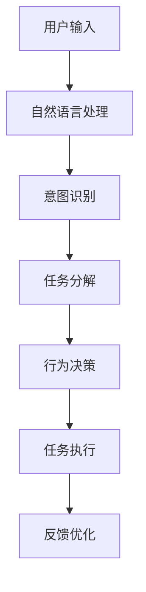
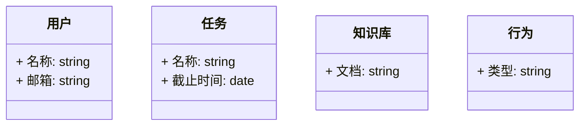
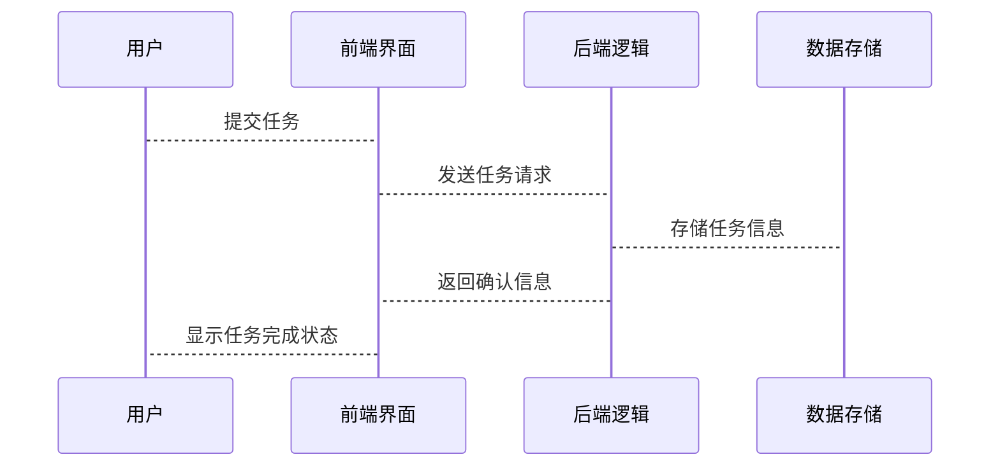

                 


# 实现基于AI Agent的个人助理系统

---

## 关键词：
AI Agent，个人助理系统，自然语言处理，强化学习，系统架构设计

---

## 摘要：
本文详细探讨了基于AI Agent的个人助理系统的实现过程，从核心概念、算法原理到系统架构设计，再到项目实战，系统地分析了AI Agent在个人助理中的应用价值和实现方法。文章通过Mermaid图和数学公式，结合实际案例，展示了如何利用强化学习和自然语言处理技术构建高效的个人助理系统。

---

# 第一部分: AI Agent与个人助理系统概述

# 第1章: 基础概念与背景介绍

## 1.1 AI Agent的基本概念
### 1.1.1 什么是AI Agent
AI Agent（人工智能代理）是指能够感知环境、自主决策并执行任务的智能实体。它通过与用户交互，理解需求并提供相应的服务。

### 1.1.2 AI Agent的核心要素
- **感知能力**：通过传感器或用户输入获取环境信息。
- **决策能力**：基于感知信息做出最优决策。
- **执行能力**：通过动作或输出实现决策的目标。
- **学习能力**：通过反馈优化自身的性能。

### 1.1.3 个人助理系统的定义与特点
个人助理系统是一种基于AI Agent的智能系统，旨在通过自然语言处理、强化学习等技术，为用户提供个性化、高效的服务。

---

## 1.2 问题背景与需求分析
### 1.2.1 当前个人助理系统的痛点
- **功能单一**：传统个人助理系统功能有限，难以应对复杂任务。
- **交互效率低**：用户需求理解不够准确，导致交互效率低下。
- **个性化不足**：缺乏深度学习用户习惯的能力，无法提供个性化服务。

### 1.2.2 AI Agent在个人助理中的应用价值
- **提升交互效率**：通过强化学习优化决策过程，提高任务执行效率。
- **增强个性化服务**：利用自然语言处理技术，精准理解用户需求。
- **扩展功能**：AI Agent能够处理多种任务，如日程管理、信息检索等。

### 1.2.3 问题解决的边界与外延
本文将重点解决AI Agent在个人助理中的核心算法和系统架构问题，边界包括任务分解、意图识别和行为决策，外延则涉及多模态交互和自适应学习。

---

## 1.3 本章小结
本章介绍了AI Agent的基本概念和其在个人助理系统中的应用价值，分析了当前系统的痛点和AI Agent的优势，为后续章节奠定了基础。

---

# 第二部分: AI Agent的核心概念与原理

# 第2章: AI Agent的核心原理

## 2.1 AI Agent的工作原理
### 2.1.1 状态感知与目标设定
AI Agent通过感知环境获取当前状态，并根据用户需求设定目标。

### 2.1.2 行为决策机制
AI Agent基于当前状态和历史经验，选择最优行为以实现目标。

### 2.1.3 任务执行与反馈优化
AI Agent执行任务并根据反馈优化自身的决策策略。

---

## 2.2 AI Agent的属性特征对比
| 属性         | 传统个人助理系统 | 基于AI Agent的个人助理系统 |
|--------------|------------------|-----------------------------|
| 感知能力     | 单一             | 多模态                       |
| 决策能力     | 简单             | 复杂                         |
| 学习能力     | 无               | 强化学习                     |

---

## 2.3 AI Agent的ER实体关系图
```mermaid
er
actor: 用户
agent: AI Agent
task: 任务
goal: 目标
action: 行为
knowledge: 知识库
interaction: 交互记录
```

---

## 2.4 本章小结
本章详细讲解了AI Agent的核心原理和其在个人助理系统中的优势，通过ER图展示了系统的核心实体关系。

---

# 第三部分: AI Agent的算法原理与数学模型

# 第3章: AI Agent的算法原理

## 3.1 基于强化学习的决策算法
### 3.1.1 强化学习的基本概念
强化学习是一种通过试错机制优化决策策略的方法，其核心是通过最大化奖励来优化行为。

### 3.1.2 状态转移矩阵与奖励机制
$$ R(s, a) = \text{奖励函数} $$
$$ V(s) = \max_a Q(s, a) $$

### 3.1.3 策略网络的实现
策略网络通过深度学习算法，实现从状态到动作的映射。

---

## 3.2 基于自然语言处理的交互算法
### 3.2.1 Transformer模型的简介
Transformer模型通过自注意力机制，实现了高效的自然语言处理。

### 3.2.2 感知机与意图识别
$$ P(y|x) = \text{条件概率} $$

### 3.2.3 对话生成的Seq2Seq模型
Seq2Seq模型通过编码器和解码器实现对话生成。

---

## 3.3 算法流程图


---

## 3.4 数学模型与公式
### 3.4.1 强化学习的数学模型
$$ R(s, a) = \text{奖励函数} $$
$$ V(s) = \max_a Q(s, a) $$

### 3.4.2 意图识别的概率模型
$$ P(y|x) = \text{条件概率} $$

---

## 3.5 本章小结
本章详细讲解了AI Agent的核心算法，包括强化学习和自然语言处理，并通过数学公式和流程图展示了算法的实现过程。

---

# 第四部分: 系统分析与架构设计

# 第4章: 系统分析与架构设计

## 4.1 问题场景介绍
本文设计的个人助理系统旨在为用户提供高效、个性化的服务，包括任务管理、信息查询等功能。

## 4.2 系统功能设计
### 4.2.1 领域模型


### 4.2.2 系统架构设计


---

## 4.3 系统接口设计
系统接口包括用户输入、任务执行和反馈优化三个部分。

---

## 4.4 系统交互序列图


---

## 4.5 本章小结
本章通过系统分析和架构设计，展示了如何实现基于AI Agent的个人助理系统，并通过类图和序列图详细描述了系统的实现过程。

---

# 第五部分: 项目实战

# 第5章: 项目实战

## 5.1 环境安装
安装Python和必要的库，如TensorFlow、Keras和NLTK。

## 5.2 系统核心实现源代码
### 5.2.1 强化学习部分
```python
class Agent:
    def __init__(self):
        self.model = self.build_model()

    def build_model(self):
        # 网络结构定义
        pass

    def act(self, state):
        # 根据状态选择动作
        pass
```

### 5.2.2 自然语言处理部分
```python
def intent_classification(text):
    # 意图识别算法
    pass
```

## 5.3 代码应用解读与分析
详细解读代码实现，分析其在系统中的作用。

## 5.4 实际案例分析
通过具体案例展示系统在实际应用中的表现和优化过程。

---

## 5.5 本章小结
本章通过项目实战，展示了如何将理论应用于实践，详细讲解了系统的实现过程和实际案例。

---

# 第六部分: 最佳实践与总结

# 第6章: 最佳实践与总结

## 6.1 小结
总结本文的主要内容，强调AI Agent在个人助理系统中的重要性。

## 6.2 注意事项
在实现过程中需要注意算法选择、数据处理和系统优化等问题。

## 6.3 拓展阅读
推荐相关领域的书籍和论文，供读者深入学习。

---

# 附录

## 附录A: 工具与库
- Python
- TensorFlow
- Keras
- NLTK

---

## 附录B: 参考文献
- [1] 维基百科：人工智能代理
- [2] Transformer模型论文

---

作者：AI天才研究院/AI Genius Institute & 禅与计算机程序设计艺术 /Zen And The Art of Computer Programming

