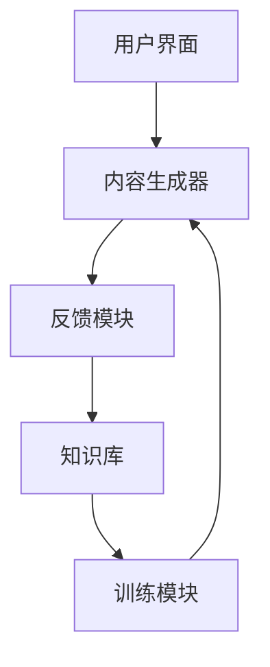

                 


# 实现基于AI Agent的智能写作助手

> 关键词：AI Agent, 智能写作助手, 自然语言处理, 机器学习, 算法原理, 系统架构

> 摘要：本文详细探讨了基于AI Agent的智能写作助手的实现过程，从AI Agent的基本概念到智能写作助手的核心问题与解决方案，再到算法原理、系统架构设计、项目实战及最佳实践，全面分析了基于AI Agent的智能写作助手的实现方法。

---

# 第一部分: 基于AI Agent的智能写作助手背景与概念

## 第1章: AI Agent与智能写作助手概述

### 1.1 AI Agent的基本概念

AI Agent（人工智能代理）是一种能够感知环境、自主决策并执行任务的智能实体。它通过感知外界信息，结合内部知识库和推理能力，做出最优决策以完成特定目标。AI Agent的核心特征包括能动性、智能性和交互性。与传统软件不同，AI Agent具备自主决策和学习能力，能够适应动态变化的环境。

### 1.2 智能写作助手的定义与应用场景

智能写作助手是一种基于AI技术的工具，旨在辅助用户完成文本创作。其主要功能包括文本生成、内容编辑、语法检查等。智能写作助手广泛应用于新闻报道、学术论文、商业文案等多种场景，用户群体覆盖作家、学生、记者等。

### 1.3 AI Agent在智能写作中的优势

AI Agent通过自然语言处理、知识表示与推理等技术，能够准确理解用户需求，生成高质量文本。其自主决策能力使其能够根据上下文调整生成内容，实时交互能力则保证了快速响应和流畅对话。

---

## 第2章: 智能写作助手的核心问题与解决方案

### 2.1 智能写作助手的核心问题

智能写作助手在实现过程中面临内容生成准确性、用户需求理解以及实时交互响应速度等关键问题。这些问题直接影响用户体验和生成内容的质量。

### 2.2 AI Agent在智能写作中的解决方案

通过基于AI Agent的文本生成模型、上下文理解的交互设计以及反馈机制的优化策略，可以有效解决上述问题。文本生成模型采用深度学习技术，上下文理解利用自然语言处理技术，反馈机制则通过用户输入优化生成内容。

---

## 第3章: AI Agent的智能写作助手核心概念与联系

### 3.1 AI Agent的核心概念原理

AI Agent通过知识表示与推理、行为决策与规划、自然语言处理与生成等核心概念，实现智能写作助手的功能。知识表示用于存储和组织信息，推理过程用于处理和分析信息，自然语言处理用于理解和生成文本。

### 3.2 核心概念属性特征对比表格

| 概念       | 能动性 | 智能性 | 交互性 | 生成性 |
|------------|--------|--------|--------|--------|
| AI Agent   | 高     | 高     | 高     | 无     |
| 智能写作助手 | 低     | 中     | 高     | 高     |

### 3.3 实体关系图

```mermaid
erd
  actor: 用户
  assistant: 智能写作助手
  model: 文本生成模型
  feedback: 反馈机制
  actor --> assistant: 请求写作帮助
  assistant --> model: 调用生成模型
  model --> assistant: 返回生成文本
  assistant --> feedback: 收集用户反馈
  feedback --> model: 优化生成策略
```

---

## 第4章: 算法原理

### 4.1 算法概述

智能写作助手的核心算法包括生成模型和反馈机制。生成模型基于深度学习技术，反馈机制通过用户输入优化生成内容。

### 4.2 生成模型的训练过程

生成模型采用循环神经网络（RNN）或变换器（Transformer）架构，训练目标是最小化生成文本与真实文本的差距。损失函数通常采用交叉熵损失，优化器使用Adam算法。

### 4.3 生成模型的数学公式

生成模型的训练过程可以用以下公式表示：

$$ L = -\frac{1}{N}\sum_{i=1}^{N} \sum_{t=1}^{T} \log p(y_t|x_{1..t-1}) $$

其中，$L$ 是损失函数，$N$ 是训练样本数量，$T$ 是每个样本的长度，$p(y_t|x_{1..t-1})$ 是生成概率。

### 4.4 反馈机制的优化策略

反馈机制通过收集用户输入优化生成内容，采用强化学习方法，通过奖励函数调整生成策略。

---

## 第5章: 系统架构设计

### 5.1 系统功能模块

智能写作助手系统主要由用户界面、内容生成器、反馈模块、知识库和训练模块组成。

### 5.2 系统架构图



### 5.3 系统交互流程

用户通过UI输入需求，内容生成器调用知识库和训练模块生成文本，用户反馈通过反馈模块优化生成策略。

---

## 第6章: 项目实战

### 6.1 环境安装

需要安装Python、TensorFlow、Keras等库，建议使用虚拟环境。

### 6.2 核心代码实现

以下是生成模型的实现代码：

```python
import tensorflow as tf
from tensorflow.keras.layers import Dense, Input, LSTM, Bidirectional
from tensorflow.keras.models import Model

# 定义模型
input_layer = Input(shape=(max_length,))
lstm_layer = Bidirectional(LSTM(128))(input_layer)
dense_layer = Dense(256, activation='relu')(lstm_layer)
output_layer = Dense(vocab_size, activation='softmax')(dense_layer)

model = Model(inputs=input_layer, outputs=output_layer)
model.compile(loss='categorical_crossentropy', optimizer='adam', metrics=['accuracy'])
```

### 6.3 代码解读与分析

代码实现了一个基于双向LSTM的文本生成模型，模型通过训练数据生成文本，训练过程不断优化模型参数，提高生成质量。

### 6.4 实际案例分析

通过实际案例分析，展示生成模型的应用效果，讨论如何优化生成内容。

---

## 第7章: 最佳实践与总结

### 7.1 最佳实践

包括性能优化技巧、模型训练策略、用户体验设计等方面。

### 7.2 小结

总结全文内容，强调基于AI Agent的智能写作助手的重要性及其未来发展趋势。

### 7.3 注意事项

提醒读者在实际应用中需要注意的问题，如数据隐私、模型训练时间等。

### 7.4 拓展阅读

推荐相关书籍和资源，帮助读者进一步深入学习。

---

作者：AI天才研究院/AI Genius Institute & 禅与计算机程序设计艺术/Zen And The Art of Computer Programming

