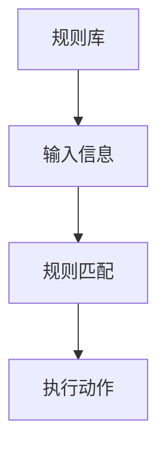
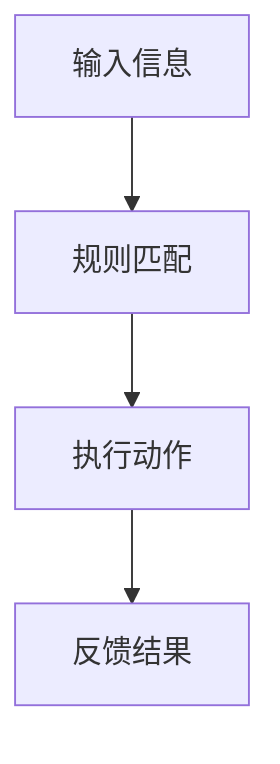

                 


# 实现基于AI Agent的智能家居控制系统

> 关键词：AI Agent，智能家居，智能控制系统，智能家居系统，人工智能，AI技术

> 摘要：随着人工智能技术的飞速发展，智能家居控制系统逐渐成为人们生活中不可或缺的一部分。本文将详细介绍如何基于AI Agent实现智能家居控制系统。首先，我们将从智能家居的发展历程和AI Agent的基本概念入手，分析两者结合的必要性和优势。接着，深入探讨AI Agent的核心原理与算法实现，包括知识表示、逻辑推理和行为规划等方面。随后，我们将从系统架构的角度，详细阐述智能家居控制系统的整体设计与实现方案。最后，通过具体的项目实战，展示如何在实际开发中应用这些理论，并总结最佳实践经验和未来发展方向。

---

# 第1章: 基于AI Agent的智能家居控制系统概述

## 1.1 智能家居的发展历程

### 1.1.1 从传统家居到智能时代的转变

智能家居的概念最早可以追溯到20世纪90年代，随着物联网技术的发展，智能家居逐步从概念走向现实。传统的家居设备通过简单的机械控制实现功能，而现代智能家居则通过AI Agent技术实现了设备之间的智能交互和协同工作。

### 1.1.2 智能家居的核心概念与特点

智能家居的核心在于设备的智能化和互联化。通过AI Agent技术，智能家居能够实时感知用户需求，自动调整设备状态，从而提供更便捷、舒适的生活体验。以下是智能家居的核心特点：

- **智能化**：设备能够通过AI技术实现自主决策和执行。
- **互联化**：设备之间能够通过网络实现信息共享和协同工作。
- **个性化**：根据用户习惯和偏好，提供定制化的服务。

### 1.1.3 当前智能家居的发展现状

目前，智能家居市场呈现出快速发展的态势。各种品牌和类型的智能家居设备层出不穷，如智能音箱、智能灯泡、智能门锁等。这些设备通过AI Agent技术实现了高度的智能化和互联化，为用户提供了更加便捷的生活方式。

---

## 1.2 AI Agent的基本概念与核心原理

### 1.2.1 AI Agent的定义与分类

AI Agent（人工智能代理）是指能够感知环境、理解用户需求，并采取相应行动以实现目标的智能体。根据功能和应用场景的不同，AI Agent可以分为多种类型，如下表所示：

| 类型          | 描述                                                         |
|---------------|--------------------------------------------------------------|
| 简单反射型代理 | 基于固定的规则进行反应，适用于简单任务                     |
| 基于模型的反射型代理 | 基于环境模型进行决策，适用于复杂任务                     |
| 目标驱动型代理 | 通过优化目标函数实现决策，适用于需要长期规划的任务       |
| 学习驱动型代理 | 通过机器学习技术不断优化自身行为，适用于需要自适应的任务 |

### 1.2.2 AI Agent的核心属性与特征对比表

以下是AI Agent的核心属性与特征对比表：

| 属性   | 描述                                                         |
|--------|--------------------------------------------------------------|
| 智能性 | 能够理解并执行复杂任务                                     |
| 反应性 | 能够实时感知环境并做出反应                                 |
| 学习性 | 能够通过数据优化自身行为                                   |

### 1.2.3 AI Agent与传统自动化的区别

AI Agent与传统自动化的区别主要体现在以下几个方面：

1. **智能性**：AI Agent具备学习和推理能力，能够根据环境变化动态调整行为；而传统自动化设备只能按照预设程序运行。
2. **适应性**：AI Agent能够通过数据优化自身行为，适应不同的使用场景；而传统自动化设备无法适应变化。
3. **交互性**：AI Agent能够与用户和其他设备进行实时交互，提供更加智能化的服务；而传统自动化设备仅能完成单一任务。

---

## 1.3 基于AI Agent的智能家居应用前景

### 1.3.1 智能家居中的AI Agent应用场景

在智能家居中，AI Agent主要应用于以下几个方面：

1. **设备控制**：通过AI Agent实现设备的智能控制，如智能音箱通过语音指令控制家中的灯光、空调等设备。
2. **用户行为分析**：通过分析用户的日常行为习惯，AI Agent可以预测用户的下一步需求，并提前做出响应。
3. **环境感知与优化**：AI Agent能够感知室内的温度、湿度、光照等环境参数，并根据用户偏好自动调节设备状态。

### 1.3.2 AI Agent在智能家居中的优势

AI Agent在智能家居中的优势主要体现在以下几个方面：

1. **智能化**：AI Agent能够通过学习和推理，提供更加智能化的服务。
2. **便捷性**：通过AI Agent，用户可以通过语音、手势等方式实现设备的智能控制，极大地方便了用户的生活。
3. **节能性**：AI Agent能够根据环境参数和用户习惯，优化设备的运行状态，从而实现节能减排。

### 1.3.3 当前技术挑战与未来发展方向

尽管AI Agent在智能家居中的应用前景广阔，但也面临着一些技术挑战：

1. **数据隐私问题**：AI Agent需要收集大量的用户数据，如何保护用户隐私是一个亟待解决的问题。
2. **设备兼容性问题**：不同品牌和类型的设备之间的兼容性问题，限制了AI Agent的广泛应用。
3. **算法优化问题**：如何提高AI Agent的推理和学习能力，使其能够更好地适应复杂的环境和用户需求。

未来，随着人工智能技术的不断进步，这些问题将逐步得到解决。AI Agent在智能家居中的应用将更加广泛，智能家居控制系统将更加智能化、便捷化和个性化。

---

## 1.4 本章小结

本章主要介绍了基于AI Agent的智能家居控制系统的背景和基本概念。通过分析智能家居的发展历程和AI Agent的基本原理，我们了解了AI Agent在智能家居中的应用前景和优势。同时，我们也认识到当前技术面临的挑战和未来的发展方向。

---

# 第2章: AI Agent的核心原理与算法实现

## 2.1 AI Agent的核心原理

### 2.1.1 知识表示与推理

知识表示是AI Agent实现智能决策的基础。常见的知识表示方法包括：

1. **规则表示法**：通过一系列预设的规则来描述知识，如“如果温度低于20度，则开启暖气”。
2. **语义网络表示法**：通过节点和边的方式表示知识，如“人”、“喜欢”、“书”等。

推理是AI Agent根据已有的知识和当前环境信息，推导出新的结论的过程。常见的推理方法包括：

1. **逻辑推理**：通过逻辑规则进行推理，如命题逻辑和谓词逻辑。
2. **基于案例推理**：通过匹配已有的案例，推导出新的结论。

### 2.1.2 行为规划与决策

行为规划是AI Agent根据当前环境和目标，制定出一系列行动步骤的过程。常见的行为规划方法包括：

1. **基于规则的规划**：通过预设的规则进行规划，适用于简单任务。
2. **基于逻辑的规划**：通过逻辑推理生成规划，适用于复杂任务。
3. **基于强化学习的规划**：通过强化学习优化规划，适用于动态环境。

### 2.1.3 多智能体协作机制

在智能家居中，通常需要多个AI Agent协作完成任务。多智能体协作机制主要包括：

1. **任务分配**：将任务分配给不同的AI Agent。
2. **通信与协调**：AI Agent之间通过通信和协调完成任务。
3. **冲突解决**：当多个AI Agent的目标发生冲突时，需要进行冲突解决。

---

## 2.2 AI Agent的数学模型与公式

### 2.2.1 知识表示的逻辑推理公式

逻辑推理是AI Agent实现智能决策的核心。以下是常见的逻辑推理公式：

1. **命题逻辑**：$$ P(A) \land P(B) \rightarrow P(A \land B) $$

2. **谓词逻辑**：$$ \forall x (P(x) \rightarrow Q(x)) $$

### 2.2.2 行为决策的优化模型

行为决策的优化模型通常采用强化学习的方法。以下是Q-learning算法的公式：

$$ Q(s, a) = Q(s, a) + \alpha [r + \max_{a'} Q(s', a') - Q(s, a)] $$

其中，$Q(s, a)$表示状态$s$下采取动作$a$的Q值，$\alpha$是学习率，$r$是奖励，$s'$是下一个状态。

---

## 2.3 基于规则的AI Agent实现

### 2.3.1 规则表示与匹配

基于规则的AI Agent通过预设的规则进行推理和决策。以下是规则表示与匹配的示意图：



### 2.3.2 规则库的构建与管理

规则库的构建与管理是基于规则的AI Agent实现的关键。以下是规则库的管理流程：

1. **规则收集**：收集所有相关的规则。
2. **规则整理**：对规则进行分类和整理。
3. **规则优化**：优化规则的表达方式，提高匹配效率。

### 2.3.3 规则推理的流程图

以下是基于规则的AI Agent推理流程图：



---

## 2.4 基于强化学习的AI Agent实现

### 2.4.1 强化学习的基本原理

强化学习是一种通过试错方法来优化决策策略的机器学习方法。以下是强化学习的基本流程：

1. **状态识别**：识别当前状态。
2. **动作选择**：根据当前状态选择一个动作。
3. **环境反馈**：执行动作并获得反馈。
4. **策略优化**：根据反馈优化策略。

### 2.4.2 Q-learning算法的实现

以下是Q-learning算法的Python实现代码：

```python
class QAgent:
    def __init__(self, state_space, action_space):
        self.state_space = state_space
        self.action_space = action_space
        self.Q = np.zeros((state_space, action_space))

    def act(self, state, epsilon=0.1):
        if np.random.random() < epsilon:
            return np.random.randint(self.action_space)
        else:
            return np.argmax(self.Q[state])

    def update(self, state, action, reward, next_state, gamma=0.99):
        self.Q[state, action] = self.Q[state, action] + 0.1 * (reward + gamma * np.max(self.Q[next_state]) - self.Q[state, action])
```

---

## 2.5 本章小结

本章主要介绍了AI Agent的核心原理与算法实现。通过分析知识表示、逻辑推理、行为规划和多智能体协作机制，我们了解了AI Agent实现智能决策的基本原理。同时，通过具体的算法实现，如基于规则的推理和基于强化学习的Q-learning算法，我们掌握了AI Agent的核心技术。

---

接下来，我将继续撰写后续章节，包括系统分析与架构设计、项目实战、最佳实践等内容。通过这些章节，我们将全面了解如何实现基于AI Agent的智能家居控制系统，并掌握相关的理论和实践知识。

---

作者：AI天才研究院/AI Genius Institute & 禅与计算机程序设计艺术 /Zen And The Art of Computer Programming

