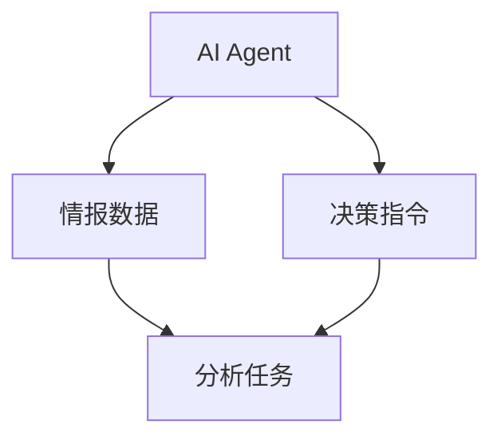
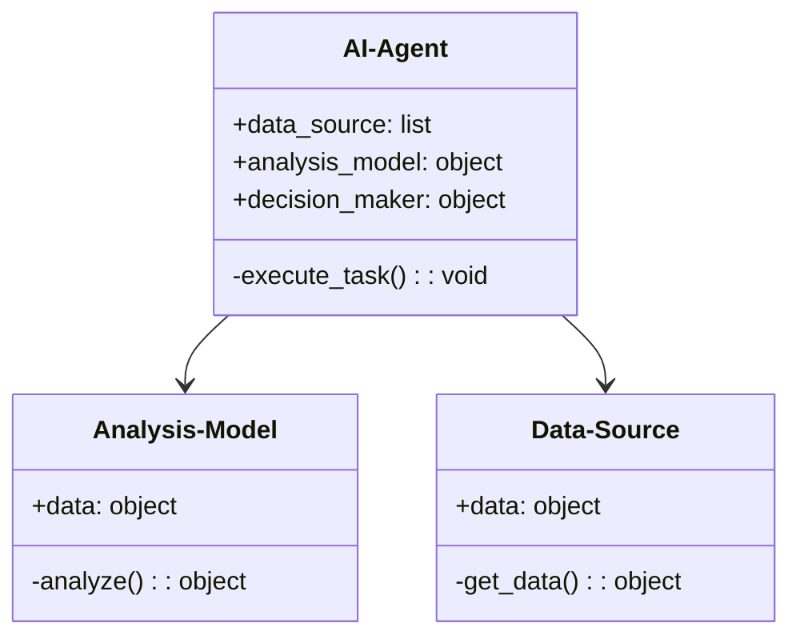
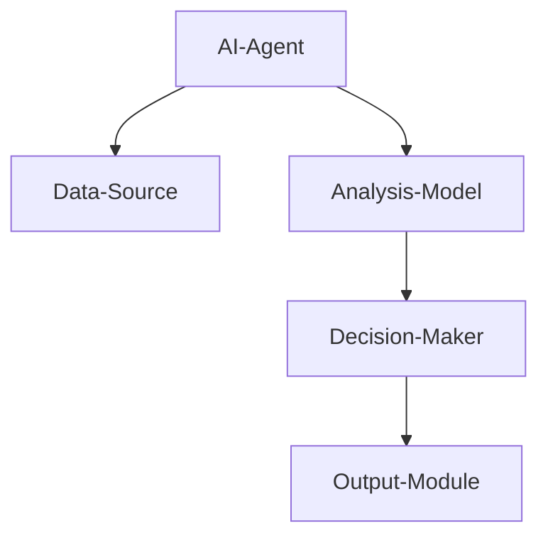

                 


# 实现基于AI Agent的智能情报分析系统

> 关键词：AI Agent，情报分析，系统架构，算法原理，项目实战

> 摘要：本文详细探讨了如何基于AI Agent构建智能情报分析系统。从系统背景、核心概念到算法原理、系统架构，再到项目实战，全面解析了系统的实现过程与关键点。通过案例分析和代码实现，展示了如何利用AI Agent提升情报分析的效率与准确性。

---

# 第一部分: 基于AI Agent的智能情报分析系统背景与概述

# 第1章: AI Agent与智能情报分析概述

## 1.1 问题背景与需求分析
### 1.1.1 情报分析的传统挑战
传统的情报分析依赖于人工处理和经验判断，存在效率低、误差大、覆盖范围有限等问题。特别是在面对海量数据时，人工分析难以快速提取关键信息，且容易遗漏重要线索。

### 1.1.2 AI Agent在情报分析中的应用价值
AI Agent（智能代理）具备自主学习、推理和决策能力，能够实时处理和分析大量数据，显著提升情报分析的效率和准确性。AI Agent可以自动识别模式、关联数据点，并提供智能化的分析结果。

### 1.1.3 当前情报分析系统的痛点与改进方向
当前系统主要依赖规则引擎和关键词匹配，缺乏深度学习和上下文理解能力。AI Agent的引入可以弥补这些不足，实现更智能的分析和预测。

### 1.1.4 系统的边界与外延
系统的边界包括数据输入、分析过程和结果输出，外延则涉及与其他系统的集成和扩展功能的开发。

### 1.1.5 核心要素组成
系统的构建需要结合数据源、分析模型、推理引擎和输出模块。

## 1.2 AI Agent的基本概念与特点
### 1.2.1 AI Agent的定义与分类
AI Agent是一种能够感知环境、自主决策并执行任务的智能实体，分为简单反射型、基于模型的反射型、目标驱动型和效用驱动型。

### 1.2.2 AI Agent的核心能力与优势
AI Agent具备自主性、反应性、学习性和社交能力，能够在复杂环境中独立完成任务。

### 1.2.3 AI Agent与传统自动化系统的区别
AI Agent具备自主决策和学习能力，而传统系统依赖预设规则。

## 1.3 智能情报分析系统的构建目标
### 1.3.1 系统的核心目标与功能定位
系统旨在通过AI Agent实现高效、智能的情报分析，提供实时监控、预测预警和决策支持。

### 1.3.2 系统的预期应用场景与用户群体
系统适用于金融、安全、医疗等领域，用户包括分析师、决策者和普通用户。

## 1.4 本章小结
本章介绍了AI Agent的基本概念和特点，并分析了其在情报分析中的应用价值和构建目标。

---

# 第二部分: AI Agent与智能情报分析系统的核心概念与联系

# 第2章: AI Agent与情报分析系统的概念结构

## 2.1 核心概念原理
### 2.1.1 AI Agent的决策机制
AI Agent通过感知环境、分析数据并基于预设目标做出决策。

### 2.1.2 情报分析的多维度特征
情报分析涉及文本、图像等多种数据类型，需要综合多种分析方法。

### 2.1.3 两者的结合方式与实现逻辑
AI Agent通过调用分析模块完成任务，并根据反馈优化决策策略。

## 2.2 核心概念属性特征对比
| 属性 | AI Agent | 情报分析系统 |
|------|----------|--------------|
| 输入 | 感知数据 | 结构化数据 |
| 输出 | 决策指令 | 分析报告 |
| 核心能力 | 自主决策 | 数据处理与分析 |

## 2.3 ER实体关系图架构


## 2.4 本章小结
本章分析了AI Agent与情报分析系统的结合方式，并通过对比和图表展示了两者的关系。

---

# 第三部分: 基于AI Agent的智能情报分析系统算法原理

# 第3章: 算法原理与实现细节

## 3.1 算法原理概述
### 3.1.1 自然语言处理算法
自然语言处理（NLP）用于文本分析和理解，常用算法包括词袋模型、TF-IDF和Word2Vec。

### 3.1.2 机器学习模型
机器学习模型如支持向量机（SVM）和随机森林用于分类和预测。

### 3.1.3 深度学习模型
深度学习模型如LSTM和BERT用于序列分析和上下文理解。

## 3.2 算法实现流程
### 3.2.1 数据预处理
包括数据清洗、特征提取和格式转换。

### 3.2.2 模型训练
使用训练数据调整模型参数，优化损失函数。

### 3.2.3 模型推理
将新数据输入训练好的模型，输出预测结果。

## 3.3 算法实现的数学模型与公式
### 3.3.1 损失函数
$$ L = \frac{1}{n}\sum_{i=1}^{n}(y_i - \hat{y}_i)^2 $$

### 3.3.2 优化算法
使用Adam优化器：
$$ \theta_{t+1} = \theta_t - \eta \frac{\partial L}{\partial \theta_t} $$

## 3.4 算法实现的代码示例
```python
import numpy as np
from sklearn.linear_model import LogisticRegression

# 示例数据
X = np.array([[1, 2], [3, 4], [5, 6]])
y = np.array([0, 1, 0])

# 训练模型
model = LogisticRegression()
model.fit(X, y)

# 预测
print(model.predict([[7, 8]]))
```

## 3.5 通俗易懂的例子
假设我们有一个简单的分类任务，训练一个模型判断数字的奇偶性：
- 输入：数字列表 `[1, 2, 3, 4]`
- 输出：分类结果 `[1, 0, 1, 0]`

训练模型后，可以快速判断新的数字是否为奇数。

## 3.6 本章小结
本章详细讲解了AI Agent系统中常用的算法原理和实现细节，并通过代码示例和通俗例子帮助读者理解。

---

# 第四部分: 系统分析与架构设计方案

# 第4章: 系统分析与架构设计

## 4.1 系统分析
### 4.1.1 问题场景介绍
系统需要处理多种类型的数据源，包括文本、图像和表格数据。

### 4.1.2 需求分析
系统需要具备数据采集、分析、推理和输出功能。

## 4.2 系统功能设计
### 4.2.1 领域模型类图


### 4.2.2 系统架构图


### 4.2.3 接口设计
- 数据采集接口：`get_data()`
- 分析接口：`analyze()`
- 决策接口：`make_decision()`

### 4.2.4 交互流程
1. AI Agent调用数据源获取数据。
2. 数据经过分析模型处理。
3. 分析结果传递给决策模块。
4. 决策模块生成指令并输出。

## 4.3 本章小结
本章通过类图和架构图详细设计了系统的功能模块和交互流程。

---

# 第五部分: 项目实战

# 第5章: 项目实战

## 5.1 环境安装
### 5.1.1 Python环境配置
安装Python 3.8及以上版本，安装必要的库如`scikit-learn`、`numpy`和`mermaid`。

### 5.1.2 开发工具配置
配置IDE如PyCharm或VS Code，并安装必要的插件。

## 5.2 核心代码实现
### 5.2.1 数据预处理代码
```python
import pandas as pd
data = pd.read_csv('input.csv')
print(data.head())
```

### 5.2.2 模型训练代码
```python
from sklearn.model import LogisticRegression
model = LogisticRegression()
model.fit(X_train, y_train)
```

### 5.2.3 推理代码
```python
predictions = model.predict(X_test)
print(predictions)
```

## 5.3 项目实战案例分析
### 5.3.1 数据来源
从CSV文件中读取数据，进行清洗和特征工程。

### 5.3.2 模型训练
使用训练数据训练逻辑回归模型。

### 5.3.3 结果分析
评估模型性能，调整参数优化结果。

## 5.4 项目小结
本章通过实际案例展示了系统的实现过程，从数据预处理到模型训练再到结果分析，详细讲解了每一步的操作。

---

# 第六部分: 最佳实践与小结

# 第6章: 最佳实践与小结

## 6.1 最佳实践
### 6.1.1 系统设计中的注意事项
模块化设计、代码复用和日志管理。

### 6.1.2 开发中的常见问题与解决方法
数据不足时可以使用数据增强，模型过拟合时可以尝试正则化。

## 6.2 小结
本文详细讲解了AI Agent智能情报分析系统的实现过程，从背景到架构设计，再到项目实战，帮助读者全面掌握系统的构建方法。

## 6.3 注意事项
确保数据安全和模型的可解释性，避免算法偏见。

## 6.4 拓展阅读
推荐阅读《机器学习实战》和《深度学习入门》等书籍，深入理解相关算法原理。

---

# 作者信息

作者：AI天才研究院/AI Genius Institute & 禅与计算机程序设计艺术 /Zen And The Art of Computer Programming

