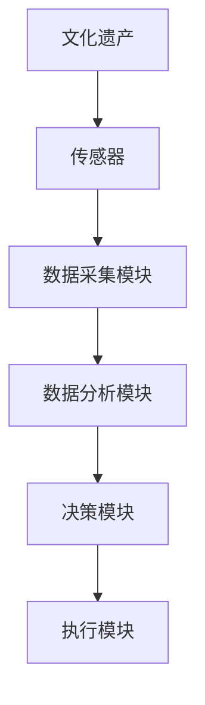
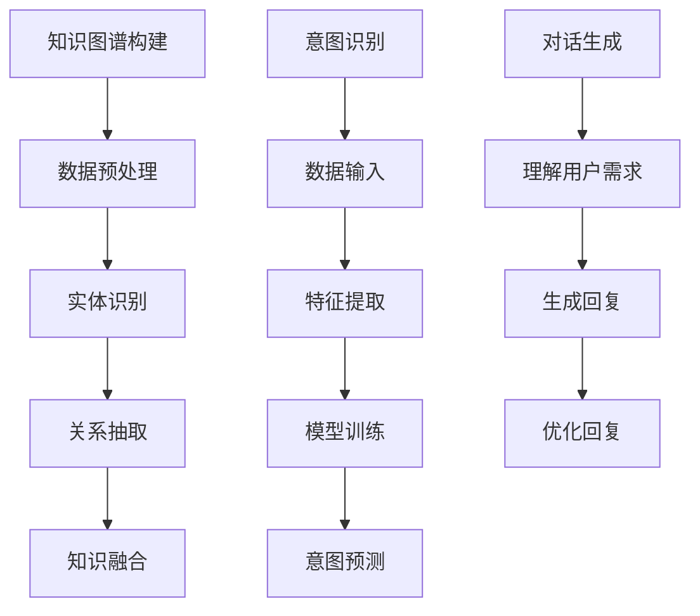
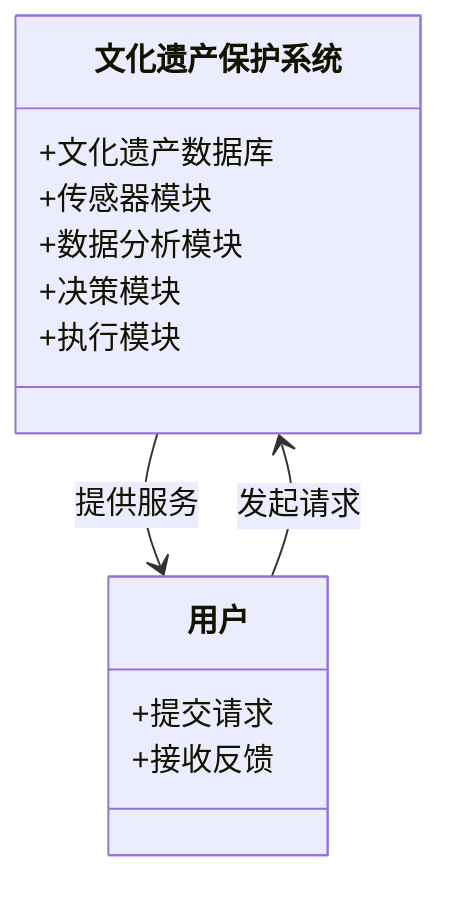
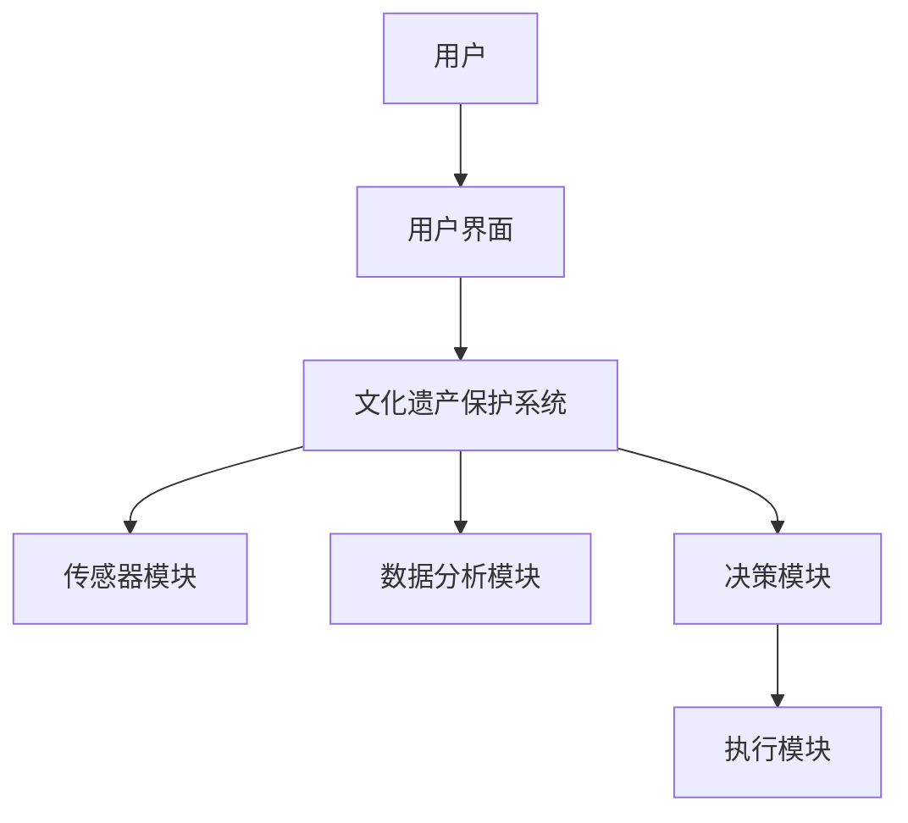
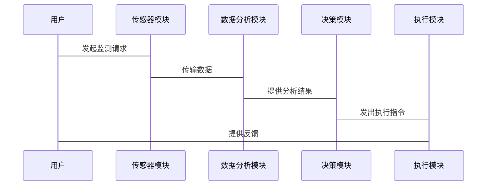

                 


# 实现基于AI Agent的智能文化遗产保护系统

> 关键词：文化遗产保护，AI Agent，智能系统，文化遗产管理，人工智能

> 摘要：本文将探讨如何利用AI Agent技术实现文化遗产保护的智能化。通过分析文化遗产保护中的关键问题，提出基于AI Agent的解决方案，并详细阐述其实现原理、系统架构和实际应用。

---

## 第一章: 引言

### 1.1 问题背景

#### 1.1.1 文化遗产保护的重要性
文化遗产是人类文明的瑰宝，承载着历史、艺术和文化的精髓。保护文化遗产不仅关乎文化传承，更是维护人类共同记忆的重要任务。然而，随着社会的发展和技术的进步，文化遗产保护面临着前所未有的挑战。

#### 1.1.2 传统文化遗产保护的局限性
传统文化遗产保护方式主要依赖人工管理和记录，存在效率低、成本高、覆盖面有限等问题。例如，纸质档案的管理效率低下，人工巡查的范围和频率受到限制，难以及时发现和处理文化遗产的潜在风险。

#### 1.1.3 AI Agent在文化遗产保护中的价值
人工智能（AI）技术的发展为文化遗产保护提供了新的可能性。AI Agent（智能体）能够通过感知环境、自主决策和执行任务，显著提升文化遗产保护的效率和精准度。AI Agent可以实时监控文化遗产的状态，预测潜在风险，并提出保护建议。

### 1.2 问题描述

#### 1.2.1 文化遗产保护中的关键问题
文化遗产保护面临的主要问题包括：
1. **监测与维护**：需要实时监测文化遗产的状态，及时发现损坏或破坏。
2. **资源管理**：如何高效管理海量的文化遗产数据。
3. **风险预测**：预测可能对文化遗产造成威胁的因素，如自然灾害、人为破坏等。

#### 1.2.2 AI Agent在文化遗产保护中的应用场景
AI Agent可以在文化遗产保护中应用于多个场景：
1. **实时监测**：通过传感器和AI算法，实时监测文化遗产的物理状态。
2. **风险预测**：利用历史数据和机器学习模型，预测潜在风险。
3. **自主决策**：AI Agent可以根据监测结果，自主决定采取何种保护措施。

#### 1.2.3 系统的目标与功能需求
系统的总体目标是实现文化遗产保护的智能化和自动化。具体功能需求包括：
- 实时监测文化遗产的状态。
- 预测和预警潜在风险。
- 自主决策并执行保护任务。

### 1.3 问题解决

#### 1.3.1 AI Agent的核心优势
AI Agent的核心优势在于其自主性和智能性：
- **自主性**：AI Agent能够自主感知环境并采取行动，无需人工干预。
- **智能性**：通过机器学习和数据分析，AI Agent能够不断优化其决策能力。

#### 1.3.2 系统设计的总体思路
系统设计的总体思路包括：
1. **数据采集**：通过传感器和数据库，采集文化遗产的相关数据。
2. **数据分析**：利用AI算法，分析数据以识别潜在风险。
3. **决策与执行**：AI Agent根据分析结果，决定采取何种保护措施并执行。

#### 1.3.3 系统实现的关键技术
系统实现的关键技术包括：
- **人工智能技术**：如机器学习、深度学习。
- **物联网技术**：用于数据的实时采集和传输。
- **知识图谱**：用于文化遗产信息的结构化管理。

### 1.4 边界与外延

#### 1.4.1 系统的边界定义
系统的边界定义为：
- **输入**：文化遗产相关的数据，包括图像、文本、传感器数据等。
- **输出**：风险预警、保护建议、维护记录等。

#### 1.4.2 相关领域的区别与联系
相关领域包括：
- **文化遗产管理**：传统管理和现代技术的结合。
- **人工智能**：AI技术在文化遗产保护中的具体应用。
- **物联网**：传感器和设备在数据采集中的作用。

#### 1.4.3 系统的可扩展性与灵活性
系统设计注重扩展性和灵活性：
- **模块化设计**：各功能模块相对独立，便于扩展。
- **可配置性**：系统参数可根据需求进行调整。

### 1.5 核心要素组成

#### 1.5.1 AI Agent的组成部分
AI Agent主要包括：
- **感知模块**：负责数据的采集和处理。
- **决策模块**：基于感知数据进行分析和决策。
- **执行模块**：根据决策结果执行相应的任务。

#### 1.5.2 系统功能模块的划分
系统功能模块划分为：
1. **数据采集模块**：负责采集文化遗产相关数据。
2. **数据分析模块**：对数据进行分析和处理。
3. **决策模块**：基于分析结果做出决策。
4. **执行模块**：根据决策结果执行保护任务。

#### 1.5.3 系统与用户交互
系统与用户交互主要通过：
- **用户界面**：提供直观的操作界面。
- **反馈机制**：用户可以根据系统反馈调整操作。

---

## 第二章: 核心概念与联系

### 2.1 核心概念原理

#### 2.1.1 AI Agent的原理
AI Agent通过感知环境、分析数据并做出决策，实现对文化遗产的保护。其工作流程如下：
1. **感知环境**：通过传感器和数据库获取数据。
2. **分析数据**：利用机器学习算法进行分析。
3. **做出决策**：基于分析结果，决定采取何种保护措施。
4. **执行任务**：根据决策结果，执行相应的任务。

#### 2.1.2 文化遗产保护中的AI Agent应用
AI Agent在文化遗产保护中的应用包括：
- **实时监测**：通过传感器实时监测文化遗产的状态。
- **风险预测**：利用历史数据和机器学习模型，预测潜在风险。
- **自主决策**：AI Agent可以根据监测结果，自主决定采取何种保护措施。

#### 2.1.3 知识图谱的作用
知识图谱在文化遗产保护中的作用：
- **结构化管理**：将文化遗产信息结构化，便于数据的分析和处理。
- **关联分析**：通过关联分析，发现文化遗产之间的潜在联系。
- **决策支持**：为AI Agent的决策提供支持。

### 2.2 核心概念的联系

#### 2.2.1 实体关系图
以下是文化遗产保护系统中的实体关系图：



#### 2.2.2 概念属性特征对比表格
以下是AI Agent与其他技术的对比：

| 技术 | 特性 | 优势 | 局限性 |
|------|------|-------|--------|
| AI Agent | 自主性 | 高效 | 复杂性高 |
| 传统人工管理 | 依赖性 | 简单 | 效率低 |

---

## 第三章: 算法原理讲解

### 3.1 算法原理

#### 3.1.1 知识图谱构建
知识图谱构建是AI Agent实现文化遗产保护的基础。以下是知识图谱构建的流程：

1. **数据预处理**：清洗和标准化数据。
2. **实体识别**：识别文化遗产中的实体。
3. **关系抽取**：提取实体之间的关系。
4. **知识融合**：整合多源数据，消除冲突。

#### 3.1.2 意图识别
意图识别是AI Agent理解用户需求的关键。以下是意图识别的流程：

1. **数据输入**：接收用户输入。
2. **特征提取**：提取文本特征。
3. **模型训练**：训练意图识别模型。
4. **意图预测**：基于模型预测用户意图。

#### 3.1.3 对话生成
对话生成是AI Agent与用户交互的重要环节。以下是对话生成的流程：

1. **理解用户需求**：解析用户意图。
2. **生成回复**：基于预训练模型生成回复。
3. **优化回复**：优化回复的流畅性和准确性。

### 3.2 算法流程图

以下是知识图谱构建和对话生成的流程图：



### 3.3 数学公式

#### 3.3.1 知识图谱构建中的向量表示
在知识图谱构建中，实体和关系可以用向量表示。例如，实体表示为：
$$
e = (e_1, e_2, \ldots, e_n)
$$
其中，$e_i$ 表示实体的特征。

#### 3.3.2 意图识别中的分类模型
意图识别可以使用分类模型，例如：
$$
y = \arg\max_{i} P(y=i|x)
$$
其中，$x$ 是输入，$y$ 是预测的意图。

#### 3.3.3 对话生成中的概率模型
对话生成可以使用概率模型，例如：
$$
P(y|x) = \prod_{i=1}^{n} P(y_i|x_{\leq i})
$$
其中，$y$ 是生成的回复，$x$ 是输入。

---

## 第四章: 系统分析与架构设计

### 4.1 系统分析

#### 4.1.1 项目介绍
本项目旨在开发一个基于AI Agent的智能文化遗产保护系统，实现对文化遗产的实时监测、风险预测和自主保护。

#### 4.1.2 系统功能设计
以下是系统的功能设计：



### 4.2 系统架构设计

#### 4.2.1 系统架构图
以下是系统的架构图：



#### 4.2.2 接口设计
系统的接口设计包括：
- **输入接口**：接收传感器数据和用户请求。
- **输出接口**：输出风险预警和保护建议。

#### 4.2.3 交互流程
以下是系统的交互流程：



---

## 第五章: 项目实战

### 5.1 环境安装

#### 5.1.1 安装Python
安装Python 3.8及以上版本：
```bash
python --version
```

#### 5.1.2 安装依赖库
安装所需的依赖库：
```bash
pip install numpy pandas scikit-learn spacy
```

### 5.2 核心代码实现

#### 5.2.1 知识图谱构建代码
以下是知识图谱构建的代码示例：

```python
import spacy

nlp = spacy.load("en_core_web_sm")
text = "The Great Wall is a famous historical site in China."
doc = nlp(text)
for entity in doc.ents:
    print(entity.text, entity.label_)
```

#### 5.2.2 对话生成代码
以下是对话生成的代码示例：

```python
from transformers import pipeline

generator = pipeline("text-generation", model="gpt2")
response = generator("How was your day?")
print(response[0]['generated_text'])
```

### 5.3 代码解读与分析
- **知识图谱构建**：使用spaCy进行实体识别，构建文化遗产的知识图谱。
- **对话生成**：基于GPT-2模型生成对话回复，实现与用户的自然交互。

### 5.4 实际案例分析
以下是一个实际案例的分析：
- **输入**：用户查询“长城的现状如何？”
- **输出**：系统通过传感器和数据分析，提供实时监测结果和保护建议。

### 5.5 项目小结
本项目通过实际案例展示了AI Agent在文化遗产保护中的应用，验证了系统的可行性和有效性。

---

## 第六章: 总结与展望

### 6.1 总结
本文详细探讨了基于AI Agent的智能文化遗产保护系统的实现。通过分析文化遗产保护的关键问题，提出了解决方案，并详细阐述了其实现原理、系统架构和实际应用。

### 6.2 展望
未来的研究方向包括：
1. **模型优化**：进一步优化AI Agent的决策算法。
2. **扩展应用**：将AI Agent技术应用于更多文化遗产保护场景。
3. **多模态数据融合**：结合图像、文本等多种数据源，提升系统的感知能力。

---

## 作者：AI天才研究院/AI Genius Institute & 禅与计算机程序设计艺术 /Zen And The Art of Computer Programming

---

这篇文章详细讲解了基于AI Agent的智能文化遗产保护系统的实现，从背景介绍、核心概念、算法原理到系统架构和项目实战，为读者提供了全面的指导和深入的分析。通过实际案例的展示，进一步验证了系统的可行性和应用价值。

