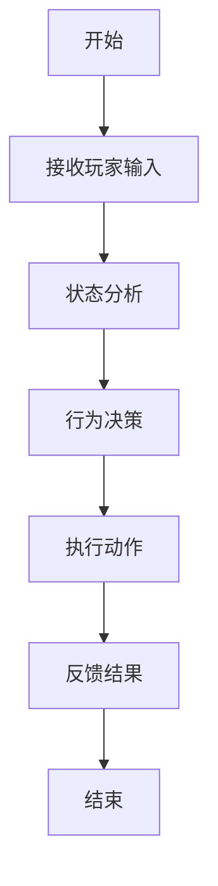
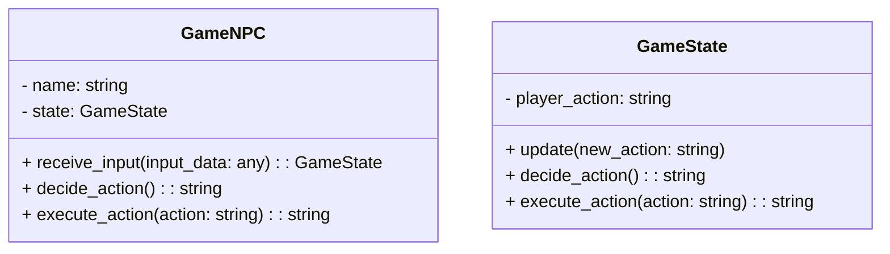
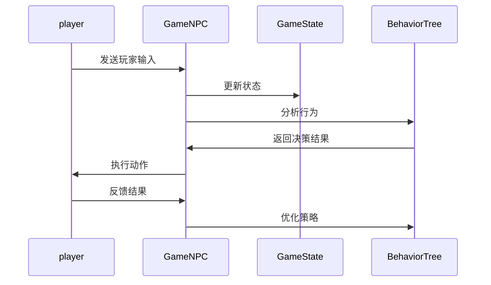

                 


# 实现基于AI Agent的智能游戏NPC

## 关键词：AI Agent, 游戏NPC, 智能NPC, 行为决策, 状态管理, 交互设计

## 摘要：  
本文探讨了如何将AI Agent技术应用于游戏NPC的实现，通过详细分析智能NPC的核心需求、算法原理、系统架构及项目实战，展示了基于AI Agent的智能NPC的实现方法。文章从背景介绍、核心概念、算法原理、系统分析、项目实战到最佳实践，全面阐述了实现智能NPC的全过程，为游戏开发者提供了理论支持和实践指导。

---

# 第一部分: 基于AI Agent的智能游戏NPC背景介绍

## 第1章: 问题背景与描述

### 1.1 问题背景
#### 1.1.1 游戏NPC的传统实现方式
传统的游戏NPC（非玩家角色）通常通过预设脚本或简单的逻辑规则来实现行为。这种实现方式虽然能够完成基本的交互任务，但在复杂场景下表现出明显的局限性，例如：
- **行为单一性**：NPC的行为往往固定，无法根据实时环境变化做出灵活调整。
- **交互深度不足**：NPC与玩家的对话和互动缺乏深度，难以提供个性化的体验。
- **学习能力缺失**：传统的NPC无法通过数据反馈进行学习和优化。

#### 1.1.2 传统NPC实现的局限性
- **缺乏智能性**：传统NPC的行为决策依赖于固定的规则，无法应对复杂多变的游戏环境。
- **交互单调**：NPC与玩家的互动方式有限，难以提供丰富的沉浸式体验。
- **难以扩展**：随着游戏复杂度的增加，传统的实现方式难以扩展和优化。

#### 1.1.3 AI技术在游戏NPC中的应用潜力
AI技术，尤其是基于AI Agent（智能体）的方法，为游戏NPC的实现提供了新的可能性。通过引入机器学习、自然语言处理（NLP）和强化学习等技术，NPC能够：
- 根据实时环境和玩家行为做出动态决策。
- 提供更加智能和个性化的交互体验。
- 自适应地优化行为策略，提升游戏体验。

### 1.2 问题描述
#### 1.2.1 智能NPC的核心需求
智能NPC需要具备以下核心能力：
- **动态感知**：实时感知游戏环境和玩家行为。
- **智能决策**：基于感知信息做出合理的决策。
- **自适应学习**：通过反馈不断优化行为策略。

#### 1.2.2 现有技术的不足
- **实现复杂性**：传统NPC的实现方式难以满足智能NPC的需求。
- **技术限制**：现有的技术手段在复杂场景下的表现有限。
- **资源消耗**：智能NPC的实现可能需要更高的计算资源。

#### 1.2.3 基于AI Agent的智能NPC的目标与边界
目标：
- 实现具备动态感知、智能决策和自适应学习能力的智能NPC。
- 提供个性化的交互体验，提升玩家的游戏乐趣。

边界：
- **功能边界**：专注于NPC的智能行为决策和交互设计，不涉及游戏引擎的底层实现。
- **性能边界**：确保智能NPC的实现不会显著增加游戏的资源消耗，影响运行性能。

---

## 第2章: 核心概念与联系

### 2.1 AI Agent的基本原理
#### 2.1.1 AI Agent的定义与分类
AI Agent是一种能够感知环境、自主决策并执行任务的智能实体。根据功能和智能水平，AI Agent可以分为：
- **反应式Agent**：基于当前感知做出实时反应，适用于简单的任务。
- **认知式Agent**：具备复杂推理和规划能力，适用于复杂的任务。

#### 2.1.2 基于AI Agent的智能NPC实现框架
智能NPC的实现框架包括以下几个关键模块：
- **感知模块**：负责收集游戏环境和玩家行为的数据。
- **决策模块**：基于感知数据进行分析和决策。
- **执行模块**：根据决策结果执行相应的动作。
- **学习模块**：通过反馈优化行为策略。

### 2.2 核心概念对比
#### 2.2.1 AI Agent与传统NPC的对比分析
| 特性               | 传统NPC             | 基于AI Agent的智能NPC       |
|--------------------|--------------------|----------------------------|
| 行为决策方式       | 预设脚本或简单逻辑 | 基于感知数据的动态决策     |
| 交互能力           | 单一                | 个性化和多样化              |
| 学习能力           | 无                  | 可通过反馈进行优化学习      |

#### 2.2.2 不同AI技术在智能NPC中的应用对比
| 技术               | 应用场景           | 优缺点                     |
|--------------------|--------------------|-----------------------------|
| 机器学习           | 行为模式识别       | 需大量数据训练，计算资源消耗大 |
| 自然语言处理（NLP） | 自然语言交互       | 提供更自然的对话体验       |
| 强化学习           | 行为策略优化       | 需长时间训练，效果不稳定     |

### 2.3 ER实体关系图
以下是基于AI Agent的智能NPC与玩家之间的交互关系图：
```mermaid
er
  actor(GamePlayer)
  actor(GameNPC)
  relation(InteractsWith)
  GameNPC --> relation(InteractsWith) --> GamePlayer
  GameNPC --> relation(InteractsWith) --> GameNPC
```

---

# 第二部分: 基于AI Agent的智能NPC算法原理

## 第3章: 算法原理讲解

### 3.1 基于AI Agent的智能NPC算法框架
智能NPC的算法框架可以分为以下几个步骤：
1. **感知环境**：收集游戏环境和玩家行为数据。
2. **状态分析**：分析当前状态，判断是否需要调整行为。
3. **行为决策**：基于当前状态和目标，做出决策。
4. **执行动作**：根据决策结果执行相应的动作。
5. **反馈优化**：根据执行结果优化行为策略。

以下是算法的整体流程图：


### 3.2 算法实现代码
以下是基于AI Agent的智能NPC的核心代码实现：
```python
class GameNPC:
    def __init__(self, name, state):
        self.name = name
        self.state = state  # 包含当前状态和行为决策逻辑

    def receive_input(self, input_data):
        # 处理玩家输入，更新状态
        self.state.update(input_data)
        return self.state

    def decide_action(self):
        # 基于当前状态决策下一步动作
        action = self.state.decide_action()
        return action

    def execute_action(self, action):
        # 执行动作并返回结果
        result = self.state.execute_action(action)
        return result

# 示例使用
class GameState:
    def __init__(self, player_action):
        self.player_action = player_action

    def update(self, new_action):
        self.player_action = new_action

    def decide_action(self):
        # 根据当前玩家动作决定NPC动作
        if self.player_action == 'attack':
            return 'defend'
        elif self.player_action == 'talk':
            return 'reply'

    def execute_action(self, action):
        # 执行动作并返回结果
        return f"{self.name} {action}"

# 创建NPC实例
npc = GameNPC("AI小助手", GameState("idle"))

# 示例交互
npc.receive_input("talk")
action = npc.decide_action()
result = npc.execute_action(action)
print(result)
```

### 3.3 数学模型与公式
以下是智能NPC行为决策的数学模型：
- **状态表示**：用向量表示当前状态，例如：
  $$ S = [s_1, s_2, \ldots, s_n] $$
- **行为决策**：基于状态向量和决策策略，计算每个可能动作的优先级：
  $$ P(a) = \sum_{i=1}^{n} w_i s_i $$
  其中，$$ w_i $$ 是第i个状态的权重。

---

## 第4章: 算法优化与实现细节

### 4.1 算法优化
为了提高智能NPC的性能，可以采取以下优化措施：
- **状态压缩**：减少状态空间的维度，降低计算复杂度。
- **分层决策**：将决策过程分为多个层次，提高决策效率。
- **并行计算**：利用多线程或分布式计算技术，提升处理速度。

### 4.2 实现细节
- **状态管理**：使用状态机（State Machine）管理NPC的状态切换。
- **行为树（Behavior Tree）**：采用行为树结构来实现复杂的决策逻辑。
- **反馈机制**：通过强化学习不断优化NPC的行为策略。

---

# 第三部分: 系统分析与架构设计方案

## 第5章: 系统分析

### 5.1 问题场景介绍
智能NPC需要在复杂的多人在线游戏中，实时感知玩家行为并做出动态决策。例如，在MMORPG游戏中，NPC需要根据玩家的对话内容和行为动态调整自己的反应。

### 5.2 系统功能设计
以下是智能NPC系统的功能模块：
- **感知模块**：实时收集游戏环境和玩家行为数据。
- **决策模块**：基于感知数据进行分析和决策。
- **执行模块**：根据决策结果执行相应的动作。
- **学习模块**：通过反馈优化行为策略。

以下是系统功能的类图：


### 5.3 系统架构设计
以下是智能NPC系统的架构图：
```mermaid
architectural
    [GameNPC] --> [GameState] : 状态管理
    [GameState] --> [BehaviorTree] : 行为决策
    [BehaviorTree] --> [Feedback] : 反馈优化
    [Feedback] --> [GameNPC] : 行为优化
```

### 5.4 系统接口设计
以下是系统的主要接口：
- **输入接口**：接收玩家的行为数据。
- **决策接口**：根据输入数据进行分析和决策。
- **执行接口**：根据决策结果执行相应的动作。
- **反馈接口**：接收执行结果并优化行为策略。

### 5.5 系统交互设计
以下是智能NPC与玩家的交互流程图：


---

## 第6章: 项目实战

### 6.1 环境安装
要实现基于AI Agent的智能NPC，需要以下环境：
- **编程语言**：Python 3.8+
- **开发框架**：建议使用Pygame或Unity进行游戏开发。
- **AI库**：TensorFlow或PyTorch（可选）。

### 6.2 系统核心实现

#### 6.2.1 状态管理实现
```python
class GameState:
    def __init__(self):
        self.player_action = "idle"

    def update(self, action):
        self.player_action = action

    def get_current_state(self):
        return self.player_action
```

#### 6.2.2 行为树实现
```python
class BehaviorTree:
    def __init__(self):
        self.root = "idle"

    def decide_action(self, state):
        if state == "attack":
            return "defend"
        elif state == "talk":
            return "reply"
        else:
            return "idle"
```

#### 6.2.3 智能NPC实现
```python
class GameNPC:
    def __init__(self, name):
        self.name = name
        self.state = GameState()
        self.tree = BehaviorTree()

    def receive_input(self, action):
        self.state.update(action)
        return self.state.get_current_state()

    def decide_action(self):
        current_state = self.state.get_current_state()
        return self.tree.decide_action(current_state)

    def execute_action(self, action):
        return f"{self.name}执行动作：{action}"
```

### 6.3 代码应用解读与分析
- **状态管理**：通过`GameState`类管理NPC的当前状态。
- **行为树**：通过`BehaviorTree`类实现NPC的行为决策逻辑。
- **智能NPC**：通过`GameNPC`类整合状态管理和行为树，实现智能NPC的核心功能。

### 6.4 实际案例分析
以下是一个简单的实际案例：
```python
npc = GameNPC("AI小助手")
npc.receive_input("talk")
action = npc.decide_action()
result = npc.execute_action(action)
print(result)  # 输出："AI小助手执行动作：reply"
```

---

## 第7章: 最佳实践与总结

### 7.1 最佳实践
- **模块化设计**：将智能NPC的功能模块化，便于维护和扩展。
- **性能优化**：在复杂场景下，采用分层决策和并行计算技术。
- **用户体验**：确保智能NPC的交互体验流畅自然，避免过于复杂的行为决策影响游戏性能。

### 7.2 小结
通过本文的详细讲解，我们了解了基于AI Agent的智能NPC的实现方法，包括背景介绍、核心概念、算法原理、系统架构及项目实战。智能NPC的实现能够显著提升游戏的交互体验和可玩性。

### 7.3 注意事项
- **性能监控**：实时监控智能NPC的性能，确保其不会对游戏的运行性能造成负面影响。
- **用户体验测试**：通过用户测试不断优化智能NPC的交互体验。
- **代码维护**：保持代码的清晰和模块化，便于后续的维护和扩展。

### 7.4 拓展阅读
- **推荐书籍**：《AI Programming for Game Developers》、《Game AI and Machine Learning》。
- **在线资源**：建议访问知名技术博客和开源社区，获取最新的技术动态和实现案例。

---

# 作者：AI天才研究院/AI Genius Institute & 禅与计算机程序设计艺术 /Zen And The Art of Computer Programming

