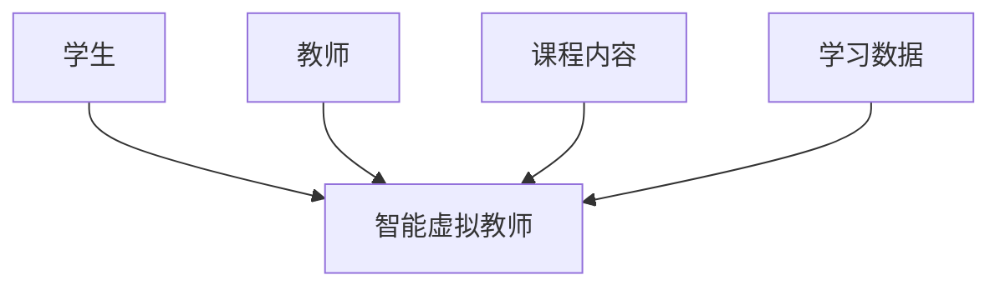
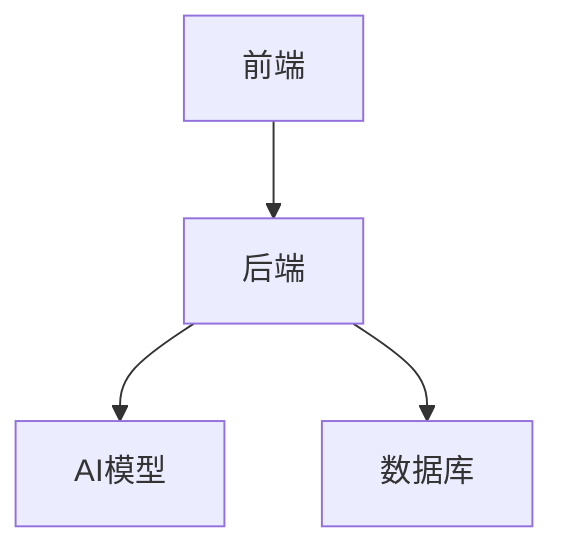

                 

<think>
好的，我现在需要撰写一篇关于《实现基于AI Agent的智能虚拟教师》的技术博客文章。首先，我需要理解文章的主题和结构，然后逐步展开每个部分的内容。

### 第一部分：背景介绍

#### 1.1 问题背景
- **传统教育的挑战**：传统教育中，教师需要面对大量的学生，难以满足每个学生的个性化学习需求。此外，教师的工作压力大，时间有限，难以高效管理教学资源。
- **AI技术的应用现状**：近年来，人工智能技术在教育领域的应用逐渐增多，例如智能推荐系统、语音识别、自然语言处理等技术被用于辅助教学。
- **智能虚拟教师的提出**：智能虚拟教师是一种结合AI技术的教育工具，能够模拟教师的行为，提供个性化的学习指导。

#### 1.2 问题描述
- **学生个性化需求**：每个学生的学习能力、兴趣和进度不同，传统教育难以满足所有学生的需求。
- **资源分配与管理**：教师需要花费大量时间在备课、批改作业和管理学生上，导致效率低下。
- **现有技术的局限性**：目前的教育技术在个性化和交互性方面仍有不足，难以真正实现智能化教学。

#### 1.3 解决方案与边界
- **解决方案**：通过AI Agent技术，智能虚拟教师可以实现个性化教学、自动化资源管理和实时互动。
- **功能边界**：智能虚拟教师主要专注于提供教学辅助功能，不涉及学校管理和行政事务。
- **限制**：在技术实现上，当前的自然语言处理和机器学习技术仍有提升空间，可能无法完全替代真人教师。

### 第二部分：核心概念与联系

#### 2.1 核心概念原理
- **AI Agent**：AI Agent是一种能够感知环境并采取行动以实现目标的智能体。在教育领域，AI Agent可以用于提供个性化学习建议、自动解答问题等。
- **智能虚拟教师**：智能虚拟教师结合了AI Agent和自然语言处理技术，能够与学生进行自然对话，提供个性化的学习支持。
- **人机交互**：通过自然语言处理和语音识别技术，智能虚拟教师能够理解和回应学生的输入，实现流畅的交互。

#### 2.2 核心概念属性对比
| 特性         | AI Agent                   | 智能虚拟教师               |
|--------------|-----------------------------|----------------------------|
| 功能         | 感知环境，执行任务         | 提供个性化教学支持           |
| 技术基础     | 机器学习，自然语言处理     | 人工智能，语音识别           |
| 应用场景     | 教育，医疗，金融           | 教育                        |

#### 2.3 实体关系图


### 第三部分：算法原理

#### 3.1 自然语言处理算法
- **Transformer模型**：基于自注意力机制的模型，能够处理长文本，广泛应用于机器翻译和文本生成。
- **BERT模型**：一种预训练的双向Transformer模型，能够理解上下文，适用于对话系统。
- **GPT系列**：基于Transformer的生成模型，能够生成连贯的文本，用于智能虚拟教师的对话生成。

#### 3.2 个性化推荐算法
- **协同过滤**：基于用户行为的推荐算法，常用于推荐系统。
- **内容推荐**：基于内容相似性进行推荐，适用于个性化学习资源推荐。
- **混合推荐**：结合协同过滤和内容推荐的优点，提升推荐准确率。

#### 3.3 人机交互算法
- **基于规则的对话系统**：通过预定义的规则进行对话，适用于简单的交互场景。
- **基于深度学习的对话系统**：利用神经网络进行对话生成，适用于复杂的对话场景。
- **对话上下文管理**：通过维护对话上下文，确保对话的连贯性和一致性。

### 第四部分：系统架构设计

#### 4.1 系统功能设计
- **领域模型**：学生、教师、课程内容、学习数据等实体及其关系。
- **系统架构**：分为前端和后端，前端负责用户交互，后端负责数据处理和AI模型调用。

#### 4.2 系统架构图


#### 4.3 接口设计
- **API接口**：用于前端和后端的数据交互，如获取学生信息、提交学习数据等。

### 第五部分：项目实战

#### 5.1 环境安装
- **Python 3.8+**
- **TensorFlow或PyTorch**
- **自然语言处理库（如spaCy）**

#### 5.2 核心代码实现
```python
import tensorflow as tf
from tensorflow.keras.layers import Input, Dense
from tensorflow.keras import Model

class AIAssistant:
    def __init__(self):
        self.model = self.build_model()

    def build_model(self):
        inputs = Input(shape=(input_dim,))
        outputs = Dense(1, activation='sigmoid')(inputs)
        model = Model(inputs=inputs, outputs=outputs)
        model.compile(optimizer='adam', loss='binary_crossentropy')
        return model

    def predict(self, input_data):
        return self.model.predict(input_data)
```

#### 5.3 案例分析
- **案例1**：学生在学习数学时遇到困难，智能虚拟教师根据学习数据推荐相关练习题。
- **案例2**：教师利用智能虚拟教师进行作业批改，节省时间并提高效率。

### 第六部分：最佳实践

#### 6.1 小结
- 智能虚拟教师通过AI Agent技术实现了个性化的教学支持，提高了教育效率。
- 系统架构设计和算法实现是关键，需要结合具体需求进行优化。

#### 6.2 注意事项
- 数据隐私保护：学生数据的处理需要遵循相关隐私法规。
- 系统稳定性：确保AI模型和系统架构的稳定性，避免因技术问题影响教学。

#### 6.3 拓展阅读
- 《深度学习入门》
- 《自然语言处理实战》
- 《人工智能在教育中的应用》

### 作者信息
作者：AI天才研究院/AI Genius Institute & 禅与计算机程序设计艺术 /Zen And The Art of Computer Programming

通过以上思考和分析，我可以逐步展开每个部分的内容，撰写一篇详细的技术博客文章。

