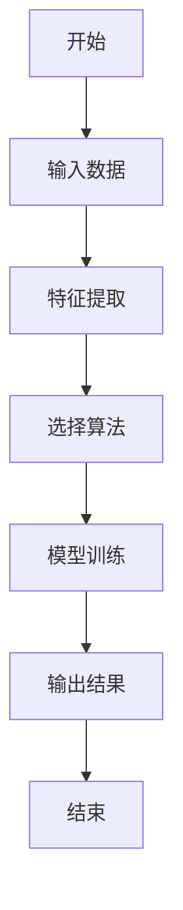

                 


# 实现基于AI Agent的智能质量控制系统

> 关键词：AI Agent, 智能质量控制, 质量检测, 实时监控, 系统架构

> 摘要：本文详细探讨了基于AI Agent的智能质量控制系统的设计与实现。通过分析AI Agent的核心概念、算法原理、系统架构，结合实际案例，展示了如何利用AI技术提升质量控制的效率和准确性。文章内容包括背景介绍、核心概念、算法原理、系统设计、项目实战、总结与展望，为读者提供全面的技术指导。

---

## 第一部分: 基于AI Agent的智能质量控制系统概述

### 第1章: AI Agent与智能质量控制系统的概述

#### 1.1 AI Agent的基本概念
- **1.1.1 AI Agent的定义**
  AI Agent（智能代理）是指能够感知环境、自主决策并执行任务的智能实体。它可以是一个软件程序，也可以是一个物理设备，通过传感器和执行器与环境交互。

- **1.1.2 AI Agent的核心特征**
  - **自主性**：能够在没有外部干预的情况下自主运行。
  - **反应性**：能够实时感知环境并做出反应。
  - **目标导向**：基于目标驱动行为，优化决策。
  - **学习能力**：通过数据和经验不断优化性能。

- **1.1.3 AI Agent的分类与应用场景**
  - **简单反射型Agent**：基于预定义规则做出反应。
  - **基于模型的反射型Agent**：利用内部模型分析环境并决策。
  - **目标驱动型Agent**：以目标为导向，主动规划行动。
  - **实用驱动型Agent**：以效用最大化为目标，权衡多任务优先级。

#### 1.2 智能质量控制系统的背景与意义
- **1.2.1 质量控制的传统模式与挑战**
  传统质量控制依赖人工检查或固定程序，存在效率低、成本高、精度不足等问题。随着工业自动化和智能化的需求，传统模式已无法满足现代生产的要求。

- **1.2.2 AI Agent在质量控制中的优势**
  - **高效性**：AI Agent能够快速处理大量数据，提高检测效率。
  - **准确性**：通过机器学习算法，显著提高检测精度。
  - **适应性**：能够动态调整策略，适应生产环境的变化。

- **1.2.3 智能质量控制系统的应用前景**
  在制造业、医疗、物流等领域，智能质量控制系统能够显著提升生产效率和产品质量，降低成本。

#### 1.3 本章小结
本章介绍了AI Agent的基本概念和分类，分析了智能质量控制系统的背景和意义，为后续章节奠定了基础。

---

### 第2章: 智能质量控制系统的核心概念与联系

#### 2.1 核心概念原理
- **2.1.1 AI Agent的决策机制**
  AI Agent通过感知输入数据，结合内部模型和决策算法，生成行动计划。

- **2.1.2 智能质量控制系统的功能模块**
  - 数据采集模块：负责收集产品质量的相关数据。
  - 数据处理模块：对数据进行清洗、转换和特征提取。
  - 模型训练模块：利用机器学习算法训练质量检测模型。
  - 决策执行模块：根据模型输出结果做出决策并执行。

#### 2.2 核心概念属性特征对比表
| 特性 | AI Agent | 传统自动化系统 |
|------|-----------|----------------|
| 自主性 | 高         | 低             |
| 反应性 | 高         | 低             |
| 学习能力 | 高         | 无             |
| 适应性 | 高         | 低             |

#### 2.3 ER实体关系图
```mermaid
er
    actor: 用户
    system: 智能质量控制系统
    agent: AI Agent
    product: 待检测产品
    relation: 用户 -> 系统, "启动质量检测"
    relation: 系统 -> agent, "分配检测任务"
    relation: agent -> 产品, "执行检测"
    relation: 产品 -> 系统, "反馈检测结果"
```

#### 2.4 本章小结
本章详细分析了智能质量控制系统的核心概念，通过对比和实体关系图，明确了各模块之间的关系和作用。

---

## 第二部分: AI Agent的算法原理与数学模型

### 第3章: AI Agent的算法原理与数学模型

#### 3.1 算法原理
- **3.1.1 监督学习算法**
  监督学习通过输入-输出对训练模型，使其能够预测新输入的标签。常用算法包括随机森林、支持向量机（SVM）和神经网络。

- **3.1.2 强化学习算法**
  强化学习通过智能体与环境的交互，学习最优策略。常用算法包括Q-Learning和Deep Q-Network（DQN）。

- **3.1.3 聚类算法**
  聚类算法用于将数据点分组，常用于异常检测和分类任务。

#### 3.2 算法流程图


#### 3.3 数学模型与公式
- **3.3.1 损失函数**
  常用的损失函数包括均方误差（MSE）和交叉熵损失。
  $$L = \frac{1}{n}\sum_{i=1}^{n}(y_i - \hat{y_i})^2$$

- **3.3.2 优化器**
  常用的优化器包括随机梯度下降（SGD）和Adam优化器。
  $$\theta_{new} = \theta_{old} - \eta \cdot \frac{\partial L}{\partial \theta}$$

#### 3.4 本章小结
本章详细讲解了AI Agent中常用的算法原理，并通过公式和流程图展示了算法的实现过程。

---

## 第三部分: 系统分析与架构设计方案

### 第4章: 系统分析与架构设计方案

#### 4.1 问题场景介绍
- **4.1.1 质量控制中的常见问题**
  传统质量控制依赖人工检查，效率低且容易出错。引入AI Agent能够显著提升检测效率和准确性。

- **4.1.2 AI Agent在质量控制中的应用案例**
  制造业中使用AI Agent进行实时质量检测，医疗领域用于医疗设备的质量监控。

#### 4.2 系统功能设计
- **4.2.1 领域模型**
  通过领域模型类图展示系统的主要功能模块。

#### 4.3 系统架构设计
- **4.3.1 系统架构图**
  ```mermaid
  architecture
      client: 用户
      system: 智能质量控制系统
      agent: AI Agent
      database: 数据库
      relation: 用户 --> 系统, "发起请求"
      relation: 系统 --> agent, "调用AI Agent"
      relation: agent --> database, "查询/存储数据"
      relation: 系统 --> database, "存储结果"
  ```

- **4.3.2 接口设计**
  - 输入接口：接收产品质量数据。
  - 输出接口：返回检测结果。

- **4.3.3 交互流程图**
  ```mermaid
  sequenceDiagram
      participant 用户
      participant 系统
      participant AI Agent
      用户->系统: 发起质量检测请求
      系统->AI Agent: 分配检测任务
      AI Agent->系统: 返回检测结果
      系统->用户: 反馈结果
  ```

#### 4.4 本章小结
本章通过系统分析和架构设计，展示了智能质量控制系统的整体结构和各模块的交互流程。

---

## 第四部分: 项目实战

### 第5章: 项目实战

#### 5.1 环境安装
- 安装Python、TensorFlow、Keras等工具。
  ```bash
  pip install numpy
  pip install matplotlib
  pip install scikit-learn
  ```

#### 5.2 系统核心实现源代码
```python
import numpy as np
from sklearn import datasets
from sklearn.model import SVC

# 数据加载
data = datasets.load_digits()
X = data['data']
y = data['target']

# 模型训练
model = SVC(gamma='auto')
model.fit(X, y)

# 预测
new_data = np.array([X[0]])
predict = model.predict(new_data)
print(f"预测结果：{predict[0]}")
```

#### 5.3 案例分析与结果展示
- 案例分析：以制造业中的零件检测为例，展示AI Agent如何实时检测零件的缺陷。
- 结果展示：通过可视化工具展示检测结果和错误率。

#### 5.4 本章小结
本章通过实际项目实战，展示了如何利用AI Agent实现智能质量控制系统，并对结果进行了详细分析。

---

## 第五部分: 总结与展望

### 第6章: 总结与展望

#### 6.1 总结
本文详细探讨了基于AI Agent的智能质量控制系统的设计与实现，分析了AI Agent的核心概念、算法原理和系统架构，结合实际案例展示了系统的实现过程。

#### 6.2 展望
未来，随着AI技术的不断发展，智能质量控制系统将更加智能化和高效。可以通过集成更多的传感器和数据源，进一步提升检测的准确性和效率。

#### 6.3 本章小结
本章总结了文章的主要内容，并展望了未来的发展方向。

---

## 附录

### 附录A: 工具安装指南
```bash
pip install numpy
pip install matplotlib
pip install scikit-learn
```

### 附录B: 系统接口协议
- 输入接口：REST API。
- 输出接口：JSON格式。

### 附录C: 数据预处理代码
```python
import pandas as pd
from sklearn.preprocessing import StandardScaler

data = pd.read_csv('data.csv')
scaler = StandardScaler()
data_scaled = scaler.fit_transform(data)
```

---

## 参考文献
1. Russell, S., & Norvig, P. (2010). *Artificial Intelligence: A Modern Approach*.
2. LeCun, Y., Bengio, Y., & Hinton, G. (2015). *Deep Learning*.
3. 周志华. (2016). *机器学习*.

---

作者：AI天才研究院/AI Genius Institute & 禅与计算机程序设计艺术 /Zen And The Art of Computer Programming

