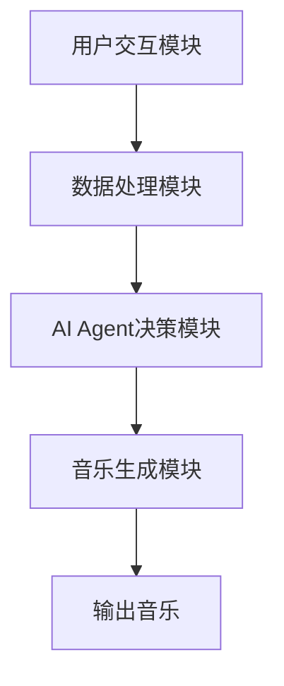

                 


# 实现基于AI Agent的智能音乐创作系统

## 关键词：AI Agent, 智能音乐创作, 人工智能, 音乐生成, 系统架构

## 摘要：  
本文详细探讨了基于AI Agent的智能音乐创作系统的实现过程。通过分析AI Agent的核心原理、音乐创作的基本要素以及系统架构设计，展示了如何利用人工智能技术实现智能音乐创作。文章从背景介绍到系统实现，逐步深入，结合具体案例和代码示例，全面阐述了该系统的构建方法和应用价值。

---

# 第1章: AI Agent与智能音乐创作概述

## 1.1 AI Agent的基本概念

### 1.1.1 什么是AI Agent  
AI Agent（人工智能代理）是指能够感知环境并采取行动以实现目标的智能实体。它可以是一个软件程序，也可以是一个物理设备，通过传感器和执行器与环境交互。AI Agent的核心目标是通过智能决策和行动来优化特定任务的执行效果。

### 1.1.2 AI Agent的核心特征  
AI Agent具有以下核心特征：  
1. **自主性**：能够在没有外部干预的情况下独立运行。  
2. **反应性**：能够感知环境并实时调整行为。  
3. **目标导向性**：通过目标驱动决策和行动。  
4. **学习能力**：能够通过经验改进自身的性能。  

### 1.1.3 AI Agent在音乐创作中的应用潜力  
AI Agent在音乐创作中的潜力巨大，它可以：  
- 分析音乐数据，提取风格特征。  
- 根据用户需求生成音乐片段。  
- 自动优化音乐结构，提升创作效率。  

---

## 1.2 智能音乐创作的背景与需求

### 1.2.1 音乐创作的现状与挑战  
传统的音乐创作依赖于人类音乐家的创造力和经验，但这种方式存在以下挑战：  
- 创作效率低下，灵感依赖偶然性。  
- 创作过程缺乏系统性，难以快速迭代和优化。  
- 对于非专业人员来说，创作门槛较高。  

### 1.2.2 AI技术在音乐创作中的优势  
AI技术的引入为音乐创作带来了以下优势：  
- 提供高效的创作工具，降低创作门槛。  
- 通过数据驱动的方式，快速生成音乐片段。  
- 基于机器学习模型，实现风格多样化的音乐创作。  

### 1.2.3 智能音乐创作系统的定义与目标  
智能音乐创作系统是一种结合AI技术的音乐创作工具，旨在通过AI Agent的智能决策和行动，辅助或替代人类完成音乐创作任务。其目标是：  
- 提供个性化的音乐创作体验。  
- 实现高效的音乐生成和优化。  
- 支持多种音乐风格和创作需求。  

---

## 1.3 本章小结  
本章介绍了AI Agent的基本概念及其在音乐创作中的应用潜力，并分析了智能音乐创作系统的背景与需求。下一章将深入探讨AI Agent与音乐创作的核心原理。

---

# 第2章: AI Agent与音乐创作的核心原理

## 2.1 AI Agent的基本原理

### 2.1.1 AI Agent的感知与决策机制  
AI Agent通过感知环境信息，利用内部模型进行决策，并采取行动以实现目标。感知可以是基于传感器的数据输入，也可以是基于用户输入的指令。决策过程通常涉及对多种可能性的评估和选择。

### 2.1.2 基于规则的AI Agent  
基于规则的AI Agent通过预定义的规则和逻辑进行决策。例如，可以设定规则：  
- 如果当前音符是C大调，下一个音符可以是D或E。  
这种方式简单易懂，但在处理复杂音乐结构时可能显得不够灵活。

### 2.1.3 基于学习的AI Agent  
基于学习的AI Agent通过机器学习算法（如深度学习）进行训练，从大量音乐数据中学习风格和模式。例如，使用循环神经网络（RNN）生成音乐序列。

---

## 2.2 音乐创作的核心原理

### 2.2.1 音乐生成的基本要素  
音乐生成的基本要素包括：  
- **音高**：音符的高低。  
- **节奏**：音符的长短。  
- **调式**：音乐的调性，如C大调、G小调等。  
- **和声**：音符的和声关系。  
- **旋律**：音符的排列方式。  

### 2.2.2 音乐风格的分类与特征  
音乐风格可以分为多种类型，如古典、流行、摇滚等。每种风格都有其独特的特征，例如：  
- 古典音乐注重复杂的变化和结构。  
- 流行音乐注重简单易记的旋律和节奏。  

### 2.2.3 音乐创作的流程与模式  
音乐创作通常包括以下几个步骤：  
1. 确定音乐风格和主题。  
2. 构建音乐结构（如verse、chorus）。  
3. 生成音符序列。  
4. 调整和优化音乐。  

---

## 2.3 AI Agent在音乐创作中的实现逻辑

### 2.3.1 数据输入与特征提取  
AI Agent需要输入音乐创作的相关数据，例如：  
- 用户指定的音乐风格。  
- 初始音符或旋律片段。  

特征提取过程包括：  
- 提取音符的频率和节奏特征。  
- 分析音乐的情感倾向（如悲伤、快乐）。  

### 2.3.2 AI Agent的创作决策过程  
AI Agent根据输入数据和训练好的模型，生成音乐创作的决策序列。例如：  
- 使用概率模型预测下一个音符的可能性。  
- 基于用户反馈调整创作方向。  

### 2.3.3 创作结果的输出与反馈  
生成的音乐片段通过合成器播放，并返回给用户。用户可以提供反馈，AI Agent根据反馈进一步优化创作结果。

---

## 2.4 本章小结  
本章详细讲解了AI Agent的基本原理及其在音乐创作中的应用逻辑。下一章将探讨基于AI Agent的音乐创作系统的具体架构设计。

---

# 第3章: 系统架构设计

## 3.1 系统功能模块划分

### 3.1.1 用户交互模块  
用户交互模块负责接收用户的输入，例如：  
- 选择音乐风格。  
- 输入初始音符。  

### 3.1.2 数据处理模块  
数据处理模块负责对输入数据进行预处理，例如：  
- 转换音符格式。  
- 提取特征信息。  

### 3.1.3 AI Agent决策模块  
AI Agent决策模块基于训练好的模型，生成音乐创作的决策序列。例如：  
- 使用深度学习模型生成音符序列。  

### 3.1.4 音乐生成模块  
音乐生成模块将决策序列转换为具体的音乐片段，并通过合成器播放。  

---

## 3.2 系统架构图  


---

## 3.3 系统接口设计

### 3.3.1 用户输入接口  
用户可以通过图形界面或命令行输入音乐创作的参数，例如：  
- 音乐风格：$ classical, pop, jazz $  
- 初始音符：$ C4, D4 $  

### 3.3.2 数据接口  
数据接口负责与AI模型进行交互，例如：  
- 提供音符序列：$ [C4, D4, E4] $  
- 返回生成的音乐片段：$ [F4, G4, A4] $  

### 3.3.3 AI Agent接口  
AI Agent接口负责接收特征信息并返回决策序列，例如：  
- 输入：$ [C4, D4, E4] $  
- 输出：$ [F4, G4, A4] $  

### 3.3.4 输出接口  
输出接口负责将生成的音乐片段传输到合成器，例如：  
- 输入：$ [F4, G4, A4] $  
- 输出：$ audio.wav $  

---

## 3.4 本章小结  
本章详细描述了基于AI Agent的音乐创作系统的架构设计，包括功能模块划分和接口设计。下一章将探讨系统的实现与算法原理。

---

# 第4章: 算法原理与实现

## 4.1 AI Agent的算法实现

### 4.1.1 基于规则的AI Agent算法  
基于规则的AI Agent算法通过预定义的规则生成音乐片段。例如：  
```python
def generate_note(current_note):
    if current_note == 'C4':
        return 'D4'
    elif current_note == 'D4':
        return 'E4'
    else:
        return 'F4'
```

### 4.1.2 基于机器学习的AI Agent算法  
基于机器学习的AI Agent算法通过训练好的模型生成音乐片段。例如：  
```python
import numpy as np
from tensorflow.keras.models import Model

def generate_sequence(model, input_sequence):
    prediction = model.predict(input_sequence)
    return np.argmax(prediction, axis=-1)
```

### 4.1.3 基于深度学习的AI Agent算法  
基于深度学习的AI Agent算法通过循环神经网络（RNN）生成音乐序列。例如：  
```python
import tensorflow as tf
from tensorflow.keras.layers import LSTM, Dense

def create_model(input_shape):
    model = tf.keras.Sequential()
    model.add(LSTM(64, input_shape=input_shape))
    model.add(Dense(256, activation='relu'))
    model.add(Dense(128, activation='sigmoid'))
    return model
```

---

## 4.2 音乐生成算法

### 4.2.1 基于马尔可夫链的音乐生成  
马尔可夫链是一种基于当前状态的转移概率生成序列的方法。例如：  
$$ P(next\_note) = \frac{count(next\_note)}{\sum count(current\_note)} $$  

### 4.2.2 基于循环神经网络的音乐生成  
循环神经网络（RNN）通过处理序列数据，生成音乐片段。例如：  
$$ output = \text{RNN}(input\_sequence) $$  

### 4.2.3 基于生成对抗网络的音乐生成  
生成对抗网络（GAN）通过生成器和判别器的对抗训练生成音乐片段。例如：  
- 生成器：$ G(x) $  
- 判别器：$ D(x) $  

---

## 4.3 算法实现  
（此处插入具体的Python代码示例和详细解释）

---

## 4.4 本章小结  
本章详细讲解了AI Agent和音乐生成的算法原理，并通过代码示例展示了实现过程。下一章将探讨系统的实现与项目实战。

---

# 第5章: 项目实战

## 5.1 环境安装与配置

### 5.1.1 安装Python环境  
使用Anaconda安装Python 3.8及以上版本。  

### 5.1.2 安装依赖库  
安装以下依赖库：  
```bash
pip install numpy tensorflow keras matplotlib
```

---

## 5.2 系统核心实现

### 5.2.1 数据预处理  
将 MIDI 文件转换为音符序列，例如：  
```python
def midi_to_notes(midi_file):
    notes = []
    # 处理 MIDI 文件并提取音符
    return notes
```

### 5.2.2 训练AI Agent模型  
训练基于深度学习的AI Agent模型，例如：  
```python
model = create_model((None, 128))
model.compile(loss='binary_crossentropy', optimizer='adam')
model.fit(X_train, y_train, epochs=100, batch_size=64)
```

### 5.2.3 生成音乐片段  
使用训练好的模型生成音乐片段，例如：  
```python
input_sequence = np.array([X_test[0]])
predicted_sequence = generate_sequence(model, input_sequence)
```

---

## 5.3 案例分析与详细解读  
（此处插入具体的案例分析和代码解读）

---

## 5.4 本章小结  
本章通过项目实战展示了基于AI Agent的音乐创作系统的实现过程，包括环境配置、数据预处理和模型训练等步骤。

---

# 第6章: 最佳实践与小结

## 6.1 最佳实践 tips  
- 数据质量是关键，确保输入数据的多样性和代表性。  
- 模型优化需要反复试验和调整参数。  
- 系统设计要注重模块化和可扩展性。  

## 6.2 小结  
本文详细探讨了基于AI Agent的智能音乐创作系统的实现过程，从理论到实践，全面阐述了系统的构建方法。通过本章的内容，读者可以掌握AI Agent在音乐创作中的核心原理和实际应用。

## 6.3 注意事项  
- 确保系统的安全性，防止数据泄露。  
- 定期更新模型，以适应新的音乐风格和用户需求。  

## 6.4 拓展阅读  
- 推荐阅读《生成对抗网络：方法与实践》。  
- 推荐阅读《深度学习在音乐生成中的应用》。

---

# 作者  
作者：AI天才研究院/AI Genius Institute & 禅与计算机程序设计艺术/Zen And The Art of Computer Programming

---

以上是《实现基于AI Agent的智能音乐创作系统》的完整文章结构，涵盖了从背景介绍到系统实现的各个方面。希望这篇文章能为读者提供清晰的指导和深入的见解。

