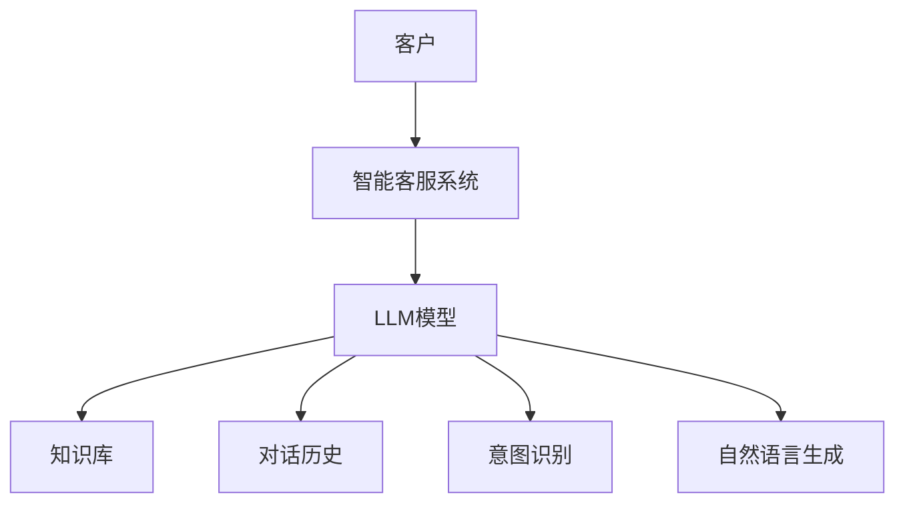
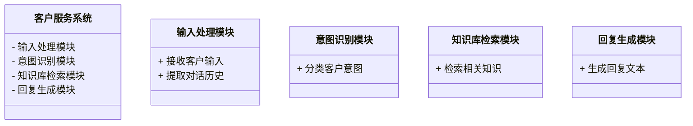
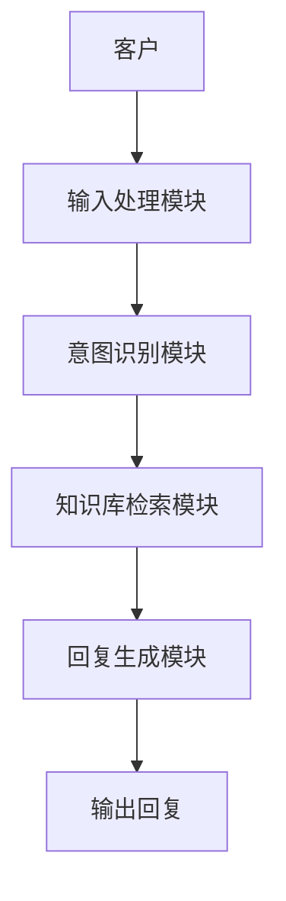
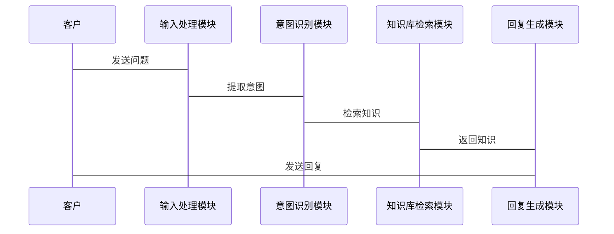

                 


# 客户服务 AI Agent：24/7 全天候的 LLM 驱动智能客服

> 关键词：LLM、智能客服、大语言模型、24/7 全天候、AI Agent

> 摘要：本文详细探讨了如何利用大语言模型（LLM）构建一个全天候的智能客户服务系统。文章从背景、概念、算法原理、系统架构设计、项目实战到最佳实践等方面展开，全面分析了LLM驱动的智能客服系统的核心技术与实现细节。

---

## 第一部分: 客户服务 AI Agent 的背景与概念

### 第1章: 客户服务 AI Agent 的背景介绍

#### 1.1 问题背景与现状
##### 1.1.1 传统客户服务的痛点
传统的客户服务系统存在以下问题：
- **人工成本高**：需要大量客服人员，运营成本高昂。
- **响应时间长**：在高峰时段，客户可能需要长时间等待。
- **服务质量不稳定**：依赖人工经验，服务质量参差不齐。
- **覆盖范围有限**：无法实现7×24小时的全天候服务。

##### 1.1.2 AI技术在客户服务中的应用现状
AI技术在客户服务中的应用已经取得了显著进展，但仍然存在以下挑战：
- **理解能力不足**：部分系统无法准确理解复杂的客户问题。
- **上下文处理能力有限**：在多轮对话中，系统的上下文理解能力不足。
- **知识更新滞后**：知识库的更新速度难以跟上业务变化。

##### 1.1.3 LLM驱动的智能客服的优势
LLM（大语言模型）驱动的智能客服系统具有以下优势：
- **高准确性**：通过大规模预训练，模型能够理解复杂的客户需求。
- **全天候服务**：支持7×24小时的实时响应。
- **快速迭代**：通过持续学习和优化，模型能够快速适应新的业务需求。

#### 1.2 问题描述与解决思路
##### 1.2.1 客户服务中的典型问题
- 客户问题复杂多样，难以快速准确识别。
- 客服系统无法实时更新知识库，导致信息滞后。
- 多轮对话中，系统难以保持上下文一致性。

##### 1.2.2 LLM如何解决这些问题
- **意图识别**：通过LLM的自然语言理解能力，准确识别客户意图。
- **知识检索**：利用LLM的强大检索能力，快速获取所需信息。
- **对话管理**：通过LLM的对话能力，保持多轮对话的连贯性。

##### 1.2.3 全天候服务的实现思路
- **实时响应**：通过LLM模型实时处理客户请求，实现秒级响应。
- **分布式架构**：采用分布式系统设计，确保高可用性和扩展性。
- **自动化监控**：通过自动化监控系统，实时检测系统运行状态。

#### 1.3 边界与外延
##### 1.3.1 客户服务 AI Agent 的边界
- **功能边界**：主要负责客户问题的接收、理解和响应，不涉及业务逻辑的执行。
- **数据边界**：仅处理客户的文本输入和生成的文本输出，不涉及其他数据源。
- **服务边界**：提供7×24小时的文本交互服务，不涉及语音或视频交互。

##### 1.3.2 相关领域的区别与联系
| 领域 | 定义 | 与客户服务 AI Agent 的联系 |
|------|------|--------------------------|
| NLP  | 自然语言处理技术 | 提供语言理解与生成的核心能力 |
| 传统客服 | 人工或自动化电话客服 | 提供基础的客户服务功能，无法处理复杂问题 |
| 语音识别 | 将语音转换为文本的技术 | 未来可能结合使用，扩展服务形式 |

##### 1.3.3 技术实现的范围与限制
- **范围**：基于LLM的文本生成与理解、意图识别、知识库检索。
- **限制**：不支持实时语音交互、不涉及业务逻辑的执行、仅限于文本交互。

---

### 第2章: LLM驱动的智能客服系统核心概念

#### 2.1 核心概念与原理
##### 2.1.1 大语言模型（LLM）的定义
大语言模型（LLM）是指基于Transformer架构的大规模预训练模型，具有强大的自然语言理解和生成能力。其核心原理包括：
- **自注意力机制**：通过计算输入文本中每个词与其他词的相关性，生成上下文相关的表示。
- **编码器-解码器结构**：编码器将输入文本编码为固定长度的向量，解码器根据编码结果生成输出文本。

##### 2.1.2 LLM在客服系统中的应用
LLM在智能客服中的主要应用包括：
- **意图识别**：通过分析客户输入的文本，识别客户的意图。
- **知识检索**：基于客户的意图，快速检索相关知识库内容。
- **对话生成**：根据检索结果生成自然流畅的回复。

##### 2.1.3 智能客服的核心机制
智能客服的核心机制包括：
- **实时对话**：支持多轮对话，保持上下文一致性。
- **意图识别**：准确识别客户的意图，提供针对性服务。
- **知识库管理**：动态更新知识库内容，确保信息准确性。

#### 2.2 核心概念对比分析
##### 2.2.1 LLM与传统NLP技术的对比
| 特性 | LLM | 传统NLP技术 |
|------|------|-------------|
| 模型规模 | 大规模（数十亿参数） | 小规模（数百或数千参数） |
| 任务能力 | 支持多种任务（分类、生成、摘要等） | 仅支持单一任务 |
| 训练数据 | 使用海量互联网数据 | 使用特定领域数据 |

##### 2.2.2 智能客服与传统客服的功能对比
| 功能 | 智能客服 | 传统客服 |
|------|---------|-----------|
| 响应时间 | 实时响应 | 可能延迟 |
| 覆盖范围 | 24/7 全天候 | 有限时间 |
| 服务效率 | 高效处理复杂问题 | 处理能力有限 |

##### 2.2.3 不同LLM模型的性能对比
| 模型 | 参数规模 | 性能特点 |
|------|----------|----------|
| GPT-3 | 175B     | 高准确率，强生成能力 |
| PAGLM | 70B      | 专为对话优化，效果接近GPT-3 |
| T5    | 220B     | 强调文本到文本的转换能力 |

#### 2.3 实体关系架构
##### 2.3.1 实体关系图


---

## 第二部分: LLM驱动的智能客服系统算法原理

### 第3章: 大语言模型的算法原理

#### 3.1 LLM的基本原理
##### 3.1.1 Transformer模型的结构
Transformer模型由编码器和解码器两部分组成，编码器负责将输入序列编码为固定长度的向量，解码器根据编码结果生成输出序列。其核心公式为：
$$
\text{Attention}(Q, K, V) = \text{softmax}\left(\frac{QK^T}{\sqrt{d_k}}\right)V
$$

##### 3.1.2 注意力机制的实现
注意力机制通过计算查询（Q）、键（K）和值（V）之间的关系，生成上下文相关的表示。注意力权重的计算公式为：
$$
\alpha_i = \frac{\exp(\text{score}(Q_i, K_j))}{\sum_{j=1}^{n} \exp(\text{score}(Q_i, K_j))}
$$

##### 3.1.3 编码器-解码器架构
编码器将输入文本转换为上下文向量，解码器根据这些向量生成输出文本。解码器在每一步生成一个词，并将其作为下一步的输入。

#### 3.2 智能客服中的LLM优化
##### 3.2.1 基于意图的文本生成
通过意图识别模块，系统确定客户的意图，然后根据意图生成相应的回复。意图识别的实现可以使用分类模型，其损失函数为：
$$
\text{Loss}_{\text{intent}} = -\sum_{i=1}^{n} \text{log}(P(y_i))
$$

##### 3.2.2 实时对话的上下文处理
通过维护对话历史，系统能够理解上下文关系。对话历史的表示可以使用序列编码器，编码后的向量用于生成回复。

##### 3.2.3 多轮对话的流畅性优化
通过引入记忆网络，系统能够记住之前的对话内容，保持对话的连贯性。记忆网络的更新公式为：
$$
M_{t} = \text{Update}(M_{t-1}, x_t)
$$

#### 3.3 算法实现流程
##### 3.3.1 输入处理
客户输入的问题经过预处理后，提取文本内容和对话历史。

##### 3.3.2 意图识别
通过分类模型确定客户意图，可能的意图包括“查询产品信息”、“投诉处理”等。

##### 3.3.3 知识库检索
根据意图检索相关知识库内容，检索结果可能包含多个候选答案。

##### 3.3.4 回复生成
根据检索结果生成回复文本，回复需要自然流畅，并符合客户意图。

#### 3.4 源代码实现
##### 3.4.1 环境安装
```bash
pip install transformers
pip install torch
pip install numpy
```

##### 3.4.2 核心代码
```python
import torch
import torch.nn as nn
from transformers import AutoTokenizer, AutoModelForSeq2SeqLM

# 初始化模型和tokenizer
tokenizer = AutoTokenizer.from_pretrained('t5-base')
model = AutoModelForSeq2SeqLM.from_pretrained('t5-base')

def generate_response(input_text):
    inputs = tokenizer(input_text, return_tensors='pt')
    outputs = model.generate(inputs.input_ids, max_length=50)
    response = tokenizer.decode(outputs[0], skip_special_tokens=True)
    return response
```

##### 3.4.3 数学模型与公式
在LLM的训练过程中，损失函数通常采用交叉熵损失：
$$
\text{Loss} = -\sum_{i=1}^{n} \text{log}(P(y_i|x_i))
$$
其中，$x_i$ 是输入序列，$y_i$ 是目标输出序列。

---

## 第三部分: 系统分析与架构设计方案

### 第4章: 系统架构设计

#### 4.1 项目介绍
本项目旨在构建一个基于LLM的智能客服系统，支持24/7的全天候服务。系统采用模块化设计，各模块协同工作，实现高效的客户问题处理。

#### 4.2 系统功能设计
##### 4.2.1 领域模型类图


#### 4.3 系统架构图


#### 4.4 系统接口设计
系统主要接口包括：
- **客户输入接口**：接收客户的问题和对话历史。
- **意图识别接口**：返回客户意图。
- **知识库检索接口**：返回相关知识。
- **回复生成接口**：生成回复文本。

#### 4.5 系统交互序列图


---

## 第四部分: 项目实战

### 第5章: 项目实战

#### 5.1 环境安装
```bash
pip install transformers torch
```

#### 5.2 核心代码实现
##### 5.2.1 输入处理模块
```python
def preprocess_input(input_text):
    return input_text.lower().strip()
```

##### 5.2.2 意图识别模块
```python
def identify_intent(input_text):
    # 假设使用预训练的分类模型
    model.predict(input_text)
```

##### 5.2.3 知识库检索模块
```python
def retrieve_from_knowledge_base(intent):
    # 假设知识库是结构化的数据
    return knowledge_base.query(intent)
```

##### 5.2.4 回复生成模块
```python
def generate_response(response):
    return response
```

#### 5.3 实际案例分析
##### 5.3.1 案例背景
客户输入：“我的订单在哪里？”

##### 5.3.2 处理流程
1. **输入处理**：将输入文本转换为小写并去除前后空格。
2. **意图识别**：识别出客户的意图是“查询订单状态”。
3. **知识库检索**：从知识库中检索与“查询订单状态”相关的内容。
4. **回复生成**：生成回复文本：“您的订单正在处理中，预计将在3个工作日内送达。”

#### 5.4 项目小结
通过本项目的实现，我们成功构建了一个基于LLM的智能客服系统，实现了24/7的全天候服务。系统具有高效性、准确性和可扩展性，能够满足客户的多样化需求。

---

## 第五部分: 最佳实践与总结

### 第6章: 最佳实践

#### 6.1 小结
本文详细探讨了基于LLM的智能客服系统的实现，从背景、概念、算法原理到系统设计和项目实战，全面分析了系统的各个部分。

#### 6.2 注意事项
- **数据安全**：确保客户数据的安全性和隐私性。
- **模型优化**：持续优化模型性能，提升准确率和生成质量。
- **系统维护**：定期更新知识库，确保信息的准确性。

#### 6.3 拓展阅读
- 推荐阅读《Large Language Models in AI》了解LLM的最新进展。
- 参考《Transformer in NLP》深入理解Transformer模型的原理。

---

## 作者

作者：AI天才研究院/AI Genius Institute & 禅与计算机程序设计艺术 /Zen And The Art of Computer Programming

