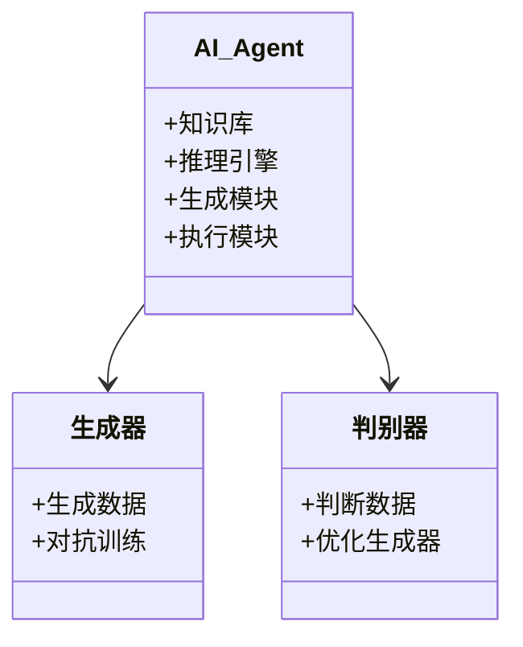

                 


# 对抗生成网络在AI Agent开发中的应用

## 关键词：生成对抗网络、AI Agent、机器学习、深度学习、强化学习

## 摘要：本文探讨了对抗生成网络（GANs）在AI Agent开发中的应用，分析了GANs的核心原理及其在AI Agent中的具体应用场景，结合实际案例，展示了如何通过GANs提升AI Agent的生成能力和交互能力，为未来的AI Agent开发提供了新的思路和方法。

---

## 第一部分：对抗生成网络与AI Agent的背景介绍

### 第1章：对抗生成网络与AI Agent概述

#### 1.1 对抗生成网络的基本概念

对抗生成网络（GANs）是一种生成模型，由生成器和判别器组成。生成器通过对抗训练生成逼真的数据，判别器则负责区分真实数据和生成数据。两者的对抗过程使得生成器不断优化生成能力，最终达到生成高质量数据的目的。

#### 1.2 AI Agent的基本概念与分类

AI Agent是一种能够感知环境、执行任务并做出决策的智能体。它可以分为基于规则的AI Agent、基于模型的AI Agent和基于学习的AI Agent。AI Agent广泛应用于自动驾驶、智能助手、游戏AI等领域。

#### 1.3 对抗生成网络与AI Agent的结合意义

将GANs应用于AI Agent，可以增强其生成能力和决策能力，使其在复杂环境中表现更佳。例如，在自动驾驶中，GANs可以生成大量虚拟交通场景，帮助模型更好地识别和应对各种情况。此外，GANs的对抗训练机制有助于AI Agent在对抗环境中做出更聪明的决策。

---

### 第2章：对抗生成网络的核心概念与原理

#### 2.1 对抗生成网络的基本架构

对抗生成网络由生成器和判别器组成。生成器通过生成数据来欺骗判别器，判别器则通过区分真实数据和生成数据来优化生成器的生成能力。两者的交替训练使得生成器能够生成越来越逼真的数据。

#### 2.2 对抗生成网络的关键特性

对抗生成网络具有对抗性、多样性和收敛性。对抗性使得生成器和判别器在对抗中不断优化，多样性使得生成的数据具有丰富的变化，收敛性则保证了生成器和判别器能够逐步趋近于平衡状态。

#### 2.3 对抗生成网络的变体与改进

对抗生成网络有许多变体，如Wasserstein GAN（WGAN）、Wasserstein GAN with Gradient Penalty（WGAN-GP）、StyleGAN等。这些变体在生成质量、训练稳定性和计算效率等方面都有不同的改进。

---

### 第3章：对抗生成网络的数学模型与算法原理

#### 3.1 对抗生成网络的数学模型

生成器的损失函数为：
$$ L_G = -\log(P(D(G(z)=1))) $$
判别器的损失函数为：
$$ L_D = -\log(D(x)) - \log(1 - D(G(z))) $$]

#### 3.2 对抗生成网络的优化过程

对抗生成网络的训练过程是一个交替优化的过程。首先优化判别器，使其能够更好地区分真实数据和生成数据；然后优化生成器，使其生成的数据能够欺骗判别器。这个过程不断交替进行，直到生成器和判别器达到平衡状态。

#### 3.3 对抗生成网络的改进算法

Wasserstein GAN（WGAN）使用Wasserstein距离作为损失函数，避免了传统GAN中梯度消失的问题。WGAN-GP通过引入梯度惩罚项，进一步提高了生成数据的质量。

---

### 第4章：AI Agent的系统分析与架构设计

#### 4.1 AI Agent的系统功能设计

AI Agent的功能模块包括知识库、推理引擎、生成模块和执行模块。知识库存储任务相关的知识和数据；推理引擎根据当前状态和目标，推理出可能的动作；生成模块负责生成多样化的策略或数据；执行模块根据推理结果执行具体动作。

#### 4.2 对抗生成网络在AI Agent中的应用

对抗生成网络可以作为AI Agent的生成模块，帮助其生成多样化的策略或数据。通过GANs，AI Agent能够更好地应对不确定性，提高其灵活性和适应能力。例如，在自动驾驶中，GANs可以生成大量虚拟交通场景，帮助模型更好地识别和应对各种情况。

#### 4.3 AI Agent的系统架构图



---

### 第5章：对抗生成网络在AI Agent中的项目实战

#### 5.1 项目环境配置

安装必要的库：
- TensorFlow或Keras
- OpenAI Gym
- Matplotlib

#### 5.2 项目核心实现代码

```python
import numpy as np
import tensorflow as tf
from tensorflow.keras import layers

# 定义生成器
def make_generator():
    model = tf.keras.Sequential()
    model.add(layers.Dense(256, activation='relu', input_dim=100))
    model.add(layers.Dense(784, activation='sigmoid'))
    return model

# 定义判别器
def make_discriminator():
    model = tf.keras.Sequential()
    model.add(layers.Dense(256, activation='relu', input_dim=784))
    model.add(layers.Dense(1, activation='sigmoid'))
    return model

# 定义损失函数和优化器
cross_entropy = tf.keras.losses.BinaryCrossentropy()

# 训练过程
def train_step(generator, discriminator, x_train, generator_optimizer, discriminator_optimizer):
    noise = tf.random.normal([batch_size, 100])
    generated_images = generator(noise)
    real_output = discriminator(x_train)
    generated_output = discriminator(generated_images)

    generator_loss = cross_entropy(tf.ones_like(real_output), generated_output)
    discriminator_loss = cross_entropy(tf.ones_like(real_output), real_output) + cross_entropy(tf.zeros_like(generated_output), generated_output)

    generator_loss = generator_loss
    discriminator_loss = discriminator_loss

    generator_gradients = tape.gradient(generator_loss, generator.trainable_weights)
    discriminator_gradients = tape.gradient(discriminator_loss, discriminator.trainable_weights)

    generator_optimizer.apply_gradients(generator_gradients)
    discriminator_optimizer.apply_gradients(discriminator_gradients)

# 训练循环
for epoch in range(num_epochs):
    for i in range(len(x_train) // batch_size):
        train_step(generator, discriminator, x_train[i*batch_size:(i+1)*batch_size], generator_optimizer, discriminator_optimizer)
```

#### 5.3 项目案例分析

在MNIST数据集上的训练：
- 生成器生成手写数字图像
- 判别器判断图像是否为真实数据
- 训练后，生成器能够生成逼真的数字图像

#### 5.4 项目总结

通过项目实战，展示了对抗生成网络在AI Agent中的实际应用，验证了其有效性和优势。

---

## 第六部分：最佳实践与小结

### 第6章：最佳实践与小结

#### 6.1 实践建议

- 选择合适的GANs变体，如WGAN-GP，以提高生成质量
- 在AI Agent中，合理设计生成模块和判别模块的接口
- 定期监控模型训练过程，防止生成器和判别器的不平衡

#### 6.2 小结

本文详细探讨了对抗生成网络在AI Agent中的应用，从理论到实践，展示了如何利用对抗生成网络提升AI Agent的生成能力和决策能力。

#### 6.3 注意事项

- 注意生成数据的质量和多样性
- 防止生成器和判别器训练的不平衡
- 保护生成数据的安全性

#### 6.4 拓展阅读

推荐阅读关于对抗生成网络的最新研究和AI Agent在不同领域的应用案例。

---

## 作者信息

作者：AI天才研究院 & 禅与计算机程序设计艺术

---

通过以上内容，您可以系统地了解对抗生成网络在AI Agent开发中的应用，从基本概念到实际应用，逐步深入理解其原理和实现方法。

