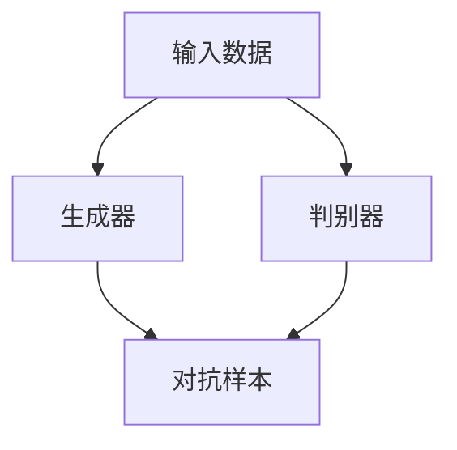
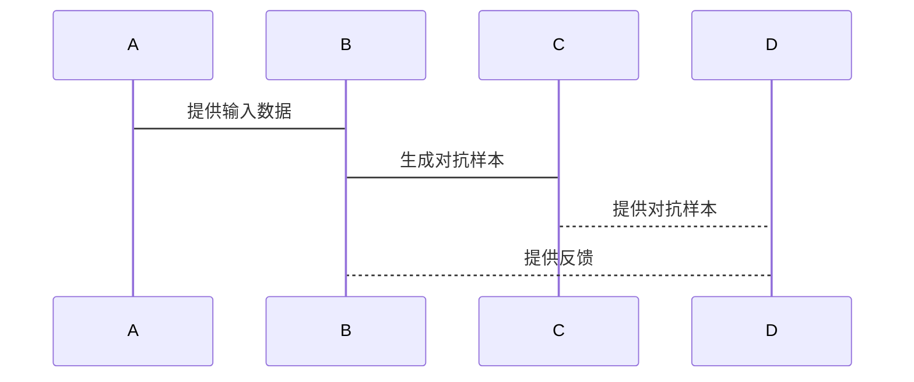

                 


# 对抗训练：提高AI Agent对噪声和攻击的鲁棒性

## 关键词：对抗训练, AI Agent, 鲁棒性, 噪声, 攻击

## 摘要：  
对抗训练是一种通过模拟对抗场景来提升AI Agent在复杂环境下的鲁棒性的重要技术。本文详细探讨了对抗训练的核心概念、算法原理、系统架构、项目实战以及最佳实践，帮助读者全面理解如何通过对抗训练提高AI Agent对噪声和攻击的鲁棒性。

---

## 第一部分：对抗训练的背景与概念

### 第1章：对抗训练的背景与概念

#### 1.1 对抗训练的定义与背景

##### 1.1.1 对抗训练的定义  
对抗训练是一种通过模拟“对抗者”与“防御者”之间的博弈过程，训练模型在复杂环境中保持稳定性和鲁棒性的技术。其核心思想是通过引入对抗性样本，迫使模型在不断被攻击的情况下提升自身的防御能力。

##### 1.1.2 对抗训练的背景与问题背景  
随着AI技术的广泛应用，AI系统面临的攻击手段日益多样化。例如，在自然语言处理领域，攻击者可能会通过在输入中添加噪声或恶意干扰，降低模型的性能。对抗训练正是为了解决这一问题而提出的技术。

##### 1.1.3 对抗训练的核心目标  
对抗训练的核心目标是提升AI Agent在面对噪声和攻击时的鲁棒性。通过模拟对抗场景，AI Agent能够在复杂的环境中保持稳定性和准确性。

#### 1.2 对抗训练与AI Agent的关系

##### 1.2.1 AI Agent的基本概念与功能  
AI Agent是一种能够感知环境、自主决策并执行任务的智能体。它广泛应用于自然语言处理、计算机视觉、机器人控制等领域。

##### 1.2.2 对抗训练在AI Agent中的作用  
对抗训练通过引入对抗性样本，帮助AI Agent在面对攻击时保持性能，从而提升其鲁棒性和安全性。

##### 1.2.3 对抗训练的挑战与机遇  
对抗训练的挑战在于如何在保证模型性能的同时，提升其对噪声和攻击的鲁棒性。而机遇则在于通过对抗训练，AI Agent能够更好地适应复杂的现实环境。

### 1.3 对抗训练的核心概念

#### 1.3.1 对抗样本的定义与特征  
对抗样本是指通过在输入中添加小幅度的扰动，使得模型输出错误的结果。这些扰动通常是人类不可感知的，但会对模型造成显著影响。

#### 1.3.2 对抗训练的分类与应用场景  
对抗训练可以分为生成式对抗训练和判别式对抗训练。生成式对抗训练主要用于生成对抗样本，而判别式对抗训练则用于检测和抵御对抗样本。

#### 1.3.3 对抗训练的边界与外延  
对抗训练的边界在于其仅针对对抗样本的生成和防御，而其外延则涉及如何将对抗训练应用于不同的AI场景。

---

## 第二部分：对抗训练的核心概念与原理

### 第2章：对抗训练的核心概念

#### 2.1 对抗训练的数学模型

##### 2.1.1 对抗训练的损失函数  
对抗训练的损失函数通常由生成器和判别器的损失函数组成。生成器的目标是最小化判别器的损失，而判别器的目标是区分真实样本和生成样本。

$$ \text{生成器损失} = -\log(D(G(z))) $$  
$$ \text{判别器损失} = -[\log(D(x)) + \log(1 - D(G(z)))] $$  

##### 2.1.2 对抗训练的目标函数  
目标函数是生成器和判别器的联合优化目标。

$$ \mathcal{L} = \mathcal{L}_G + \mathcal{L}_D $$  

##### 2.1.3 对抗训练的数学公式  
对抗训练的核心公式是生成器和判别器的对抗过程。

$$ G \rightarrow \arg \min \mathbb{E}_{z \sim p(z)}[\log(1 - D(G(z)))] $$  
$$ D \rightarrow \arg \min \mathbb{E}_{x \sim p_{\text{data}}(x)}[\log D(x)] + \mathbb{E}_{z \sim p(z)}[\log(1 - D(G(z)))] $$  

#### 2.2 对抗训练的核心要素

##### 2.2.1 生成器与判别器的角色与关系  
生成器负责生成对抗样本，判别器负责区分真实样本和生成样本。两者通过交替优化，形成对抗关系。

##### 2.2.2 对抗训练的均衡点  
对抗训练的均衡点是指生成器和判别器的损失达到平衡的状态，此时模型具有较强的鲁棒性。

##### 2.2.3 对抗训练的收敛性分析  
对抗训练的收敛性分析是研究模型在训练过程中是否能够达到均衡点。

#### 2.3 对抗训练的核心原理

##### 2.3.1 对抗训练的梯度下降过程  
生成器和判别器通过梯度下降交替优化，逐步提升模型的鲁棒性。

##### 2.3.2 对抗训练的均衡性与稳定性  
对抗训练的均衡性是指生成器和判别器的损失达到平衡，而稳定性则是指模型在面对对抗样本时的性能稳定性。

##### 2.3.3 对抗训练的鲁棒性提升机制  
对抗训练通过引入对抗样本，迫使模型在复杂环境中提升其鲁棒性和稳定性。

#### 2.4 对抗训练的核心概念对比表

| 概念         | 描述                                                                 |
|--------------|----------------------------------------------------------------------|
| 生成器       | 负责生成对抗样本，通过对抗过程提升模型的鲁棒性                   |
| 判别器       | 负责区分真实样本和生成样本，帮助生成器优化生成样本                |
| 对抗样本     | 通过小幅度扰动生成的对抗性输入，迫使模型在复杂环境中保持性能     |
| 均衡点       | 生成器和判别器的损失达到平衡的状态，模型具有较强的鲁棒性           |
| 收敛性       | 模型在训练过程中是否能够达到均衡点                               |

---

## 第三部分：对抗训练的系统分析与架构设计

### 第3章：对抗训练的系统分析与架构设计

#### 3.1 问题场景介绍

##### 3.1.1 对抗训练的应用场景  
对抗训练广泛应用于自然语言处理、图像处理、机器人控制等领域。

##### 3.1.2 对抗训练的系统功能设计  
系统功能包括对抗样本生成、对抗样本检测、模型训练与优化等。

#### 3.2 系统功能设计

##### 3.2.1 对抗样本生成  
生成器通过生成对抗样本，迫使模型在复杂环境中保持性能。

##### 3.2.2 对抗样本检测  
判别器负责区分真实样本和生成样本，帮助生成器优化生成样本。

##### 3.2.3 模型训练与优化  
通过交替优化生成器和判别器，提升模型的鲁棒性和稳定性。

#### 3.3 系统架构设计

##### 3.3.1 对抗训练的系统架构图  


##### 3.3.2 系统交互序列图  


---

## 第四部分：对抗训练的项目实战

### 第4章：对抗训练的项目实战

#### 4.1 环境安装与配置

##### 4.1.1 安装Python与相关库  
安装Python和TensorFlow、Keras等深度学习库。

##### 4.1.2 安装对抗训练所需的库  
安装必要的库，例如`tensorflow`、`numpy`等。

#### 4.2 系统核心实现

##### 4.2.1 生成器实现  
```python
def generator(z):
    # 生成器网络结构
    with tf.variable_scope('generator'):
        # 网络层
        pass
```

##### 4.2.2 判别器实现  
```python
def discriminator(x):
    # 判别器网络结构
    with tf.variable_scope('discriminator'):
        # 网络层
        pass
```

##### 4.2.3 对抗训练过程  
```python
# 生成器和判别器的交替优化
for step in range(train_steps):
    # 生成对抗样本
    z = sample_z(batch_size, z_dim)
    G_sample = generator(z)
    D_real = discriminator(real_x)
    D_fake = discriminator(G_sample)
    # 计算损失
    G_loss = tf.reduce_mean(-tf.log(D_fake))
    D_loss = - (tf.reduce_mean(tf.log(D_real)) + tf.reduce_mean(tf.log(1 - D_fake)))
    # 优化
    G_optimizer = tf.train.AdamOptimizer(g_lr).minimize(G_loss, var_list=G_vars)
    D_optimizer = tf.train.AdamOptimizer(d_lr).minimize(D_loss, var_list=D_vars)
    sess.run([G_optimizer, D_optimizer], feed_dict={real_x: real_x_batch, z: z_batch})
```

#### 4.3 代码解读与分析

##### 4.3.1 生成器的作用  
生成器通过生成对抗样本，迫使模型在复杂环境中保持性能。

##### 4.3.2 判别器的作用  
判别器负责区分真实样本和生成样本，帮助生成器优化生成样本。

##### 4.3.3 训练过程  
通过交替优化生成器和判别器，提升模型的鲁棒性和稳定性。

#### 4.4 案例分析与详细讲解

##### 4.4.1 对抗训练在自然语言处理中的应用  
通过对抗训练提升自然语言处理模型的鲁棒性。

##### 4.4.2 对抗训练在图像处理中的应用  
通过对抗训练提升图像处理模型的鲁棒性。

##### 4.4.3 对抗训练在机器人控制中的应用  
通过对抗训练提升机器人控制模型的鲁棒性。

#### 4.5 项目小结

---

## 第五部分：对抗训练的最佳实践与总结

### 第5章：对抗训练的最佳实践

#### 5.1 对抗训练的核心要点

##### 5.1.1 对抗训练的鲁棒性提升  
通过对抗训练提升模型的鲁棒性和稳定性。

##### 5.1.2 对抗训练的收敛性优化  
通过优化生成器和判别器的损失函数，提升模型的收敛性。

#### 5.2 对抗训练的注意事项

##### 5.2.1 对抗训练的参数设置  
生成器和判别器的学习率设置对模型的收敛性影响较大。

##### 5.2.2 对抗训练的训练数据  
训练数据的质量直接影响模型的鲁棒性。

##### 5.2.3 对抗训练的模型复杂度  
模型复杂度对对抗训练的收敛性有重要影响。

#### 5.3 对抗训练的未来研究方向

##### 5.3.1 对抗训练的算法优化  
研究更高效的对抗训练算法。

##### 5.3.2 对抗训练的应用扩展  
将对抗训练应用于更多领域，如自动驾驶、医疗AI等。

##### 5.3.3 对抗训练的安全性提升  
研究如何进一步提升对抗训练的安全性和鲁棒性。

#### 5.4 对抗训练的总结与展望

##### 5.4.1 对抗训练的总结  
对抗训练是一种有效的提升AI Agent鲁棒性的技术。

##### 5.4.2 对抗训练的展望  
对抗训练在未来将有更广泛的应用和更深入的研究。

---

## 附录

### 附录A：对抗训练的工具与资源

#### 附录A.1 对抗训练的开源库  
推荐一些对抗训练的开源库，如TensorFlow、Keras等。

#### 附录A.2 对抗训练的代码仓库  
推荐一些对抗训练的代码仓库，供读者参考。

#### 附录A.3 对抗训练的参考文献  
列出一些对抗训练相关的参考文献。

---

## 作者：AI天才研究院/AI Genius Institute & 禅与计算机程序设计艺术 /Zen And The Art of Computer Programming

