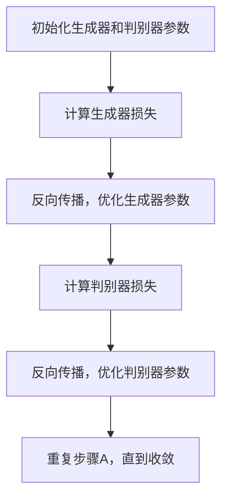
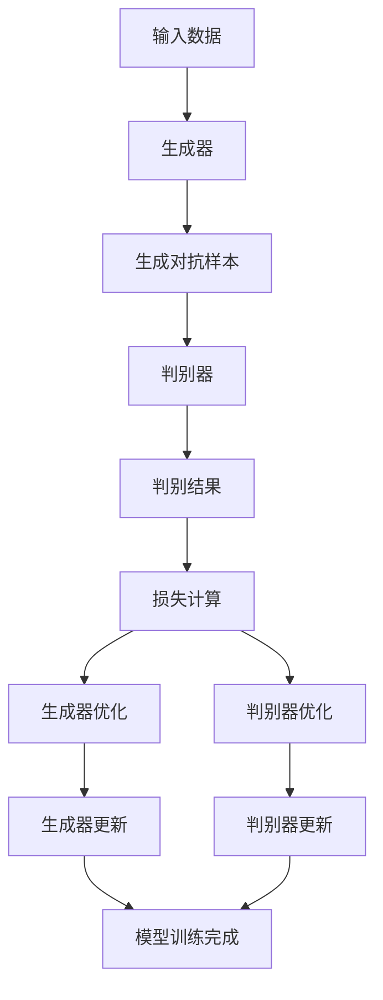
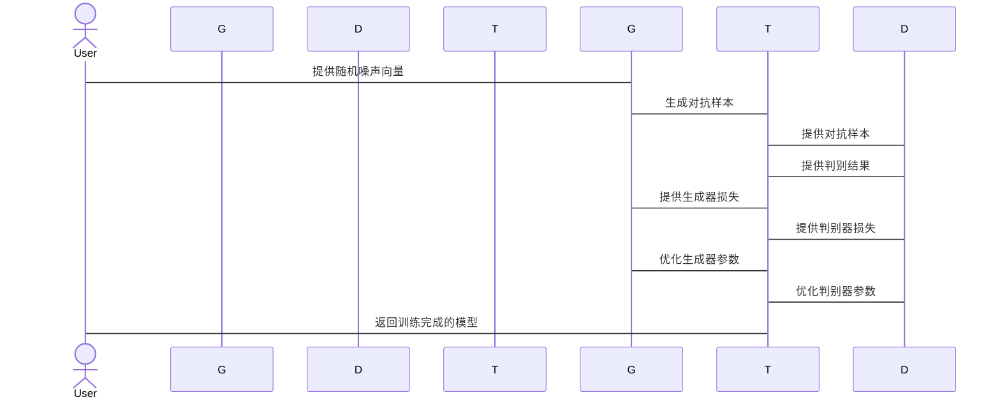

                 


# 对抗训练：提高AI Agent的鲁棒性

> 关键词：对抗训练，AI Agent，鲁棒性，生成对抗网络，强化学习，机器学习

> 摘要：本文详细探讨了对抗训练在提高AI Agent鲁棒性中的应用。通过分析对抗训练的核心概念、算法原理、系统架构设计以及项目实战，本文为读者提供了一套全面理解和应用对抗训练的方法论。文章从基础理论到实际案例，逐步引导读者掌握对抗训练的精髓，并通过最佳实践总结了对抗训练在AI Agent开发中的关键注意事项和未来发展趋势。

---

## # 引言：对抗训练的重要性

在AI Agent开发中，鲁棒性是确保其在复杂、动态和对抗性环境中稳定运行的关键。传统的机器学习方法虽然在许多任务上表现出色，但它们往往假设训练数据分布与实际应用环境中的数据分布是相同的。然而，在现实世界中，这种情况很少成立，尤其是在对抗性环境中，AI Agent需要面对故意干扰或欺骗的输入，这使得传统方法显得力不从心。

对抗训练（Adversarial Training）正是为了解决这一问题而提出的。它通过引入“对抗者”（adversary）的概念，模拟AI Agent在面对敌对输入时的表现，从而提升其鲁棒性和防御能力。对抗训练的核心思想是通过让模型在与“敌人”的博弈中不断优化，最终达到在各种可能输入下都能表现良好的目标。

---

## # 第一部分：对抗训练的核心概念与联系

### ## 第1章：对抗训练的核心概念

#### ### 1.1 对抗训练的基本概念

对抗训练是一种基于博弈论的机器学习方法，它通过引入两个或多个对抗模型（生成器和判别器）来优化目标函数。生成器的目标是生成能够欺骗判别器的样本，而判别器的目标是区分真实样本和生成样本。通过对两者进行交替优化，对抗训练能够生成更具鲁棒性的模型。

对抗训练的核心概念可以用以下几点来总结：

1. **生成器（Generator）**：负责生成对抗样本，目标是欺骗判别器。
2. **判别器（Discriminator）**：负责区分真实样本和生成样本。
3. **损失函数**：生成器和判别器通过损失函数进行优化，最终达到均衡点。

#### ### 1.2 对抗训练的核心问题

对抗训练的核心问题可以归结为以下几点：

1. **均衡点**：生成器和判别器的优化目标存在冲突，需要找到一个平衡点。
2. **梯度稳定性**：对抗训练过程中可能存在梯度消失或爆炸的问题，导致模型难以收敛。
3. **样本多样性**：生成器需要生成多样化的样本，以覆盖所有可能的输入情况。

#### ### 1.3 对抗训练的分类与特点

对抗训练可以根据不同的应用场景和算法实现方式进行分类：

1. **基于生成对抗网络（GAN）的对抗训练**：这是最常见的对抗训练形式，通过生成器和判别器的博弈优化生成样本的质量。
2. **基于强化学习的对抗训练**：通过强化学习框架，将对抗训练转化为一种博弈过程，模型通过奖励机制进行优化。
3. **基于判别式对抗网络（DAN）的对抗训练**：通过在判别器中引入对抗网络，增强模型的判别能力。

---

### ## 第2章：对抗训练的核心原理

#### ### 2.1 对抗训练的数学模型

对抗训练的核心数学模型可以表示为一个博弈问题。假设生成器的目标是最小化判别器的损失函数，而判别器的目标是最大化生成器的损失函数。通过交替优化生成器和判别器的参数，模型能够达到均衡点。

生成器的损失函数可以表示为：
$$ L_G = -\log(P(G(z))) $$
其中，$$ z $$ 是生成器的输入，$$ P(G(z)) $$ 是判别器对生成样本的判别概率。

判别器的损失函数可以表示为：
$$ L_D = -(\log(P(x)) + \log(1-P(G(z)))) $$ 
其中，$$ x $$ 是真实样本，$$ P(x) $$ 是判别器对真实样本的判别概率。

#### ### 2.2 对抗训练的核心概念对比

以下是生成对抗网络（GAN）与其他对抗训练方法的对比表格：

| 对比维度          | GAN                            | DAN                            | 强化学习对抗训练 |
|-------------------|--------------------------------|--------------------------------|------------------|
| 核心目标          | 最小化判别器的损失函数          | 最大化判别器的判别能力          | 最大化奖励函数    |
| 模型结构          | 生成器和判别器                 | 判别器和对抗网络                | 强化学习代理和环境 |
| 应用场景          | 生成高质量样本                 | 提高判别能力                    | 智能体决策优化    |

#### ### 2.3 对抗训练的ER实体关系图

以下是对抗训练的ER实体关系图：

```mermaid
erDiagram
    actor Adversarial_Training {
        <属性>
        id
        generator_model
        discriminator_model
        training_data
        adversarial_samples
    }
    actor GAN {
        <属性>
        generator
        discriminator
        loss_functions
    }
    actor Training_Process {
        <属性>
        forward_propagation
        backpropagation
        optimization
    }
    Adversarial_Training --> GAN : 实现
    GAN --> Training_Process : 过程
```

---

## # 第二部分：对抗训练的算法原理

### ## 第3章：对抗训练的数学模型与公式

#### ### 3.1 对抗训练的数学模型

对抗训练的数学模型可以通过博弈论中的纳什均衡概念来理解。生成器和判别器的目标函数可以表示为一个零和博弈，最终达到纳什均衡点。

纳什均衡的定义是：对于任意一个参与者，单方面改变策略无法改善其收益，即在均衡点上，每个参与者的策略都是最优的。

对抗训练的目标函数可以表示为：
$$ \min_{G} \max_{D} L(G, D) $$
其中，$$ G $$ 是生成器的参数，$$ D $$ 是判别器的参数，$$ L(G, D) $$ 是目标函数。

#### ### 3.2 对抗训练的算法流程图

以下是对抗训练的算法流程图：



#### ### 3.3 对抗训练的代码实现

以下是一个简单的生成对抗网络（GAN）的Python代码实现：

```python
import torch
import torch.nn as nn
import torch.optim as optim

# 定义生成器
class Generator(nn.Module):
    def __init__(self, latent_dim, img_size):
        super(Generator, self).__init__()
        self.latent_dim = latent_dim
        self.img_size = img_size
        self.model = nn.Sequential(
            nn.Linear(latent_dim, 256),
            nn.LeakyReLU(0.2),
            nn.Linear(256, 512),
            nn.LeakyReLU(0.2),
            nn.Linear(512, img_size)
        )
    
    def forward(self, z):
        return self.model(z)

# 定义判别器
class Discriminator(nn.Module):
    def __init__(self, img_size):
        super(Discriminator, self).__init__()
        self.model = nn.Sequential(
            nn.Linear(img_size, 512),
            nn.LeakyReLU(0.2),
            nn.Linear(512, 256),
            nn.LeakyReLU(0.2),
            nn.Linear(256, 1),
            nn.Sigmoid()
        )
    
    def forward(self, x):
        return self.model(x)

# 初始化模型
latent_dim = 100
img_size = 784  # 28x28图像

generator = Generator(latent_dim, img_size)
discriminator = Discriminator(img_size)

# 定义损失函数和优化器
criterion = nn.BCELoss()
g_optim = optim.Adam(generator.parameters(), lr=0.0002)
d_optim = optim.Adam(discriminator.parameters(), lr=0.0002)

# 训练过程
for epoch in range(num_epochs):
    for _ in range(iterations):
        # 生成对抗样本
        z = torch.randn(batch_size, latent_dim)
        gen_imgs = generator(z)
        
        # 判别器的训练
        d_labels_real = torch.ones(batch_size, 1)
        d_labels_fake = torch.zeros(batch_size, 1)
        
        d_outputs_real = discriminator(real_imgs)
        d_outputs_fake = discriminator(gen_imgs)
        
        d_loss = criterion(d_outputs_real, d_labels_real) + criterion(d_outputs_fake, d_labels_fake)
        
        # 反向传播和优化
        d_optim.zero_grad()
        d_loss.backward()
        d_optim.step()
        
        # 生成器的训练
        g_labels = torch.ones(batch_size, 1)
        g_outputs = discriminator(gen_imgs)
        g_loss = criterion(g_outputs, g_labels)
        
        g_optim.zero_grad()
        g_loss.backward()
        g_optim.step()
```

---

## # 第三部分：对抗训练的系统分析与架构设计

### ## 第4章：系统分析与架构设计

#### ### 4.1 系统分析

在设计基于对抗训练的AI Agent系统时，需要考虑以下关键因素：

1. **输入数据**：系统需要处理多类型和多模态的输入数据，包括文本、图像和语音等。
2. **模型训练**：需要设计高效的训练策略，包括生成器和判别器的交替优化。
3. **性能评估**：需要定义合适的评估指标，以衡量AI Agent在对抗环境中的表现。

#### ### 4.2 系统架构设计

以下是基于对抗训练的AI Agent系统架构设计：



#### ### 4.3 系统接口设计

1. **生成器接口**：
   - 输入：随机噪声向量
   - 输出：生成对抗样本
2. **判别器接口**：
   - 输入：真实样本或生成样本
   - 输出：样本的判别结果
3. **训练接口**：
   - 输入：训练数据和对抗样本
   - 输出：优化后的生成器和判别器参数

#### ### 4.4 系统交互流程图



---

## # 第四部分：项目实战：基于对抗训练的AI Agent开发

### ## 第5章：项目实战

#### ### 5.1 环境安装与配置

要开发基于对抗训练的AI Agent，需要以下环境：

1. **Python**：建议使用3.6及以上版本。
2. **深度学习框架**：推荐使用PyTorch。
3. **GPU支持**：建议使用NVIDIA GPU加速训练。

#### ### 5.2 系统核心实现

以下是基于对抗训练的AI Agent核心代码实现：

```python
import torch
import torch.nn as nn
import torch.optim as optim

# 定义生成器
class Generator(nn.Module):
    def __init__(self, latent_dim, output_dim):
        super(Generator, self).__init__()
        self.model = nn.Sequential(
            nn.Linear(latent_dim, 256),
            nn.LeakyReLU(0.2),
            nn.Linear(256, 512),
            nn.LeakyReLU(0.2),
            nn.Linear(512, output_dim)
        )
    
    def forward(self, z):
        return self.model(z)

# 定义判别器
class Discriminator(nn.Module):
    def __init__(self, input_dim):
        super(Discriminator, self).__init__()
        self.model = nn.Sequential(
            nn.Linear(input_dim, 512),
            nn.LeakyReLU(0.2),
            nn.Linear(512, 256),
            nn.LeakyReLU(0.2),
            nn.Linear(256, 1),
            nn.Sigmoid()
        )
    
    def forward(self, x):
        return self.model(x)

# 初始化模型
latent_dim = 100
output_dim = 784  # 28x28图像

generator = Generator(latent_dim, output_dim)
discriminator = Discriminator(output_dim)

# 定义损失函数和优化器
criterion = nn.BCELoss()
g_optim = optim.Adam(generator.parameters(), lr=0.0002)
d_optim = optim.Adam(discriminator.parameters(), lr=0.0002)

# 训练过程
num_epochs = 100
batch_size = 128

for epoch in range(num_epochs):
    for _ in range(100):
        # 生成对抗样本
        z = torch.randn(batch_size, latent_dim)
        gen_imgs = generator(z)
        
        # 判别器的训练
        d_labels_real = torch.ones(batch_size, 1)
        d_labels_fake = torch.zeros(batch_size, 1)
        
        d_outputs_real = discriminator(real_imgs)
        d_outputs_fake = discriminator(gen_imgs)
        
        d_loss = criterion(d_outputs_real, d_labels_real) + criterion(d_outputs_fake, d_labels_fake)
        
        # 反向传播和优化
        d_optim.zero_grad()
        d_loss.backward()
        d_optim.step()
        
        # 生成器的训练
        g_labels = torch.ones(batch_size, 1)
        g_outputs = discriminator(gen_imgs)
        g_loss = criterion(g_outputs, g_labels)
        
        g_optim.zero_grad()
        g_loss.backward()
        g_optim.step()
```

#### ### 5.3 项目总结与案例分析

通过上述代码实现，我们可以看到对抗训练在AI Agent开发中的实际应用。生成器和判别器的交替优化使得模型能够生成高质量的对抗样本，从而提升AI Agent在复杂环境中的鲁棒性。

---

## # 第五部分：对抗训练的最佳实践与未来展望

### ## 第6章：对抗训练的最佳实践

#### ### 6.1 对抗训练的注意事项

1. **训练稳定性**：对抗训练过程中可能会出现模型不收敛或生成样本质量下降的问题，需要通过调整学习率和优化策略来解决。
2. **计算资源**：对抗训练需要大量的计算资源，建议使用GPU加速训练。
3. **模型选择**：根据具体任务选择合适的对抗训练方法，如GAN、DAN或强化学习对抗训练。

#### ### 6.2 对抗训练的技巧

1. **梯度惩罚**：通过引入梯度惩罚项，可以提高生成器和判别器的训练稳定性。
2. **标签平滑**：在判别器的训练中，使用平滑标签可以提高模型的泛化能力。
3. **数据增强**：通过数据增强技术，可以增加训练数据的多样性，提高模型的鲁棒性。

#### ### 6.3 未来展望

对抗训练在AI Agent开发中的应用前景广阔。随着深度学习技术的不断发展，对抗训练将更加智能化和自动化。未来的研究方向包括：

1. **多目标对抗训练**：在多目标对抗环境中，提升AI Agent的多任务处理能力。
2. **自适应对抗训练**：通过自适应策略，动态调整生成器和判别器的优化目标。
3. **强化学习与对抗训练的结合**：将强化学习与对抗训练相结合，进一步提升AI Agent的决策能力和鲁棒性。

---

## # 结语

对抗训练作为提升AI Agent鲁棒性的重要方法，其核心在于通过生成器和判别器的博弈优化，生成高质量的对抗样本，从而提升模型在复杂环境中的稳定性和可靠性。通过本文的详细讲解，读者可以深入了解对抗训练的理论基础、算法实现和系统设计，并通过实际案例掌握对抗训练在AI Agent开发中的应用技巧。未来，对抗训练将继续在AI领域发挥重要作用，为构建更加智能和可靠的AI系统提供坚实的技术支持。

---

## # 作者

作者：AI天才研究院/AI Genius Institute & 禅与计算机程序设计艺术 /Zen And The Art of Computer Programming

