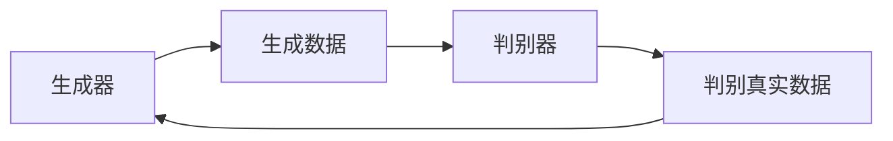
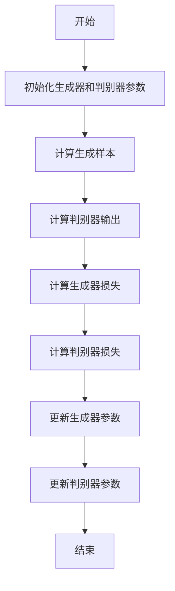
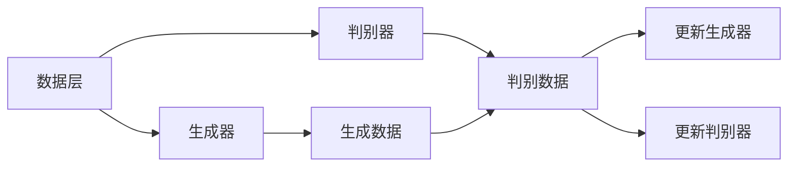
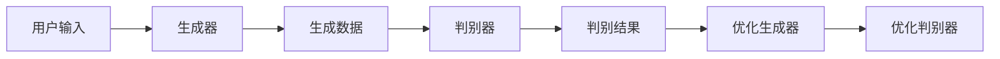

                 


# 对抗训练：提高AI Agent的鲁棒性

**关键词：对抗训练, AI Agent, 鲁棒性, 生成对抗网络, 深度学习, 对抗学习**

**摘要**：  
对抗训练是一种通过生成器和判别器的对抗过程来提高模型鲁棒性的技术，尤其在AI Agent领域，对抗训练能够有效增强模型的泛化能力和应对复杂环境的能力。本文从对抗训练的基本概念出发，详细分析其核心原理、系统架构设计、算法实现，并通过实际案例展示对抗训练在提高AI Agent鲁棒性中的应用。文章最后总结了对抗训练的优势、挑战及未来发展方向，为读者提供全面而深入的见解。

---

## 第一章: 对抗训练的基本概念

### 1.1 对抗训练的背景与问题背景

#### 1.1.1 AI Agent的定义与应用场景
AI Agent（智能体）是指在特定环境中能够感知环境、自主决策并采取行动以实现目标的智能系统。AI Agent广泛应用于自动驾驶、机器人控制、自然语言处理、游戏AI等领域。例如，自动驾驶AI Agent需要在复杂的城市交通环境中实时做出决策，这对AI Agent的鲁棒性和适应性提出了极高的要求。

#### 1.1.2 对抗训练的起源与核心问题
对抗训练的概念起源于博弈论中的“零和博弈”，即两个玩家在竞争中互相对抗，试图通过优化自己的策略来击败对手。在AI领域，对抗训练的概念最早由Goodfellow等人提出，生成对抗网络（GAN）的出现标志着对抗训练成为一种重要的机器学习方法。对抗训练的核心问题是通过生成器和判别器的对抗过程，训练出更强大的生成模型或判别模型。

#### 1.1.3 鲁棒性在AI Agent中的重要性
鲁棒性是指AI Agent在面对未知或异常输入时仍能保持正常功能的能力。在现实环境中，AI Agent可能面临数据分布偏移、对抗攻击等挑战，这些都会影响模型的性能和安全性。通过对抗训练，AI Agent能够更好地适应这些挑战，从而提高其鲁棒性。

---

### 1.2 对抗训练的核心概念与问题描述

#### 1.2.1 对抗训练的基本原理
对抗训练的核心是通过生成器和判别器的对抗过程来优化模型。生成器的目标是生成逼真的数据，而判别器的目标是区分真实数据和生成数据。两者的对抗过程使得生成器不断改进生成能力，判别器不断提升判别能力，最终达到一种均衡状态。

#### 1.2.2 对抗训练的核心问题
- 生成器和判别器的协调与平衡
- 对抗训练的收敛性问题
- 对抗训练的训练稳定性

#### 1.2.3 鲁棒性与对抗训练的关系
通过对抗训练，生成器和判别器的对抗过程使得模型具有更强的泛化能力和鲁棒性。例如，在图像分类任务中，通过对抗训练生成的图像具有更强的对抗性，从而提高了模型的鲁棒性。

---

### 1.3 对抗训练的边界与外延

#### 1.3.1 对抗训练的适用范围
对抗训练适用于需要生成数据或需要进行分类的场景，例如图像生成、语音合成、文本生成等。

#### 1.3.2 对抗训练与其他AI技术的区别
对抗训练的核心在于生成器和判别器的对抗过程，与其他技术如监督学习、无监督学习的区别在于其内在的对抗性。

#### 1.3.3 对抗训练的潜在挑战与限制
- 训练过程中的不稳定性
- 模型的易陷入局部最优
- 计算资源需求较高

---

### 1.4 对抗训练的核心要素与概念结构

#### 1.4.1 对抗训练的核心要素分析
- 生成器
- 判别器
- 损失函数
- 优化算法

#### 1.4.2 对抗训练的概念结构图


#### 1.4.3 对抗训练与AI Agent的结合方式
通过对抗训练，AI Agent可以更好地适应复杂环境，提高其鲁棒性和决策能力。

---

### 1.5 本章小结
本章从对抗训练的基本概念出发，详细介绍了对抗训练的背景、核心概念、问题描述及其在AI Agent中的重要性。通过对抗训练的核心要素和概念结构图，读者可以更好地理解对抗训练的基本原理和实现方式。

---

## 第二章: 对抗训练的核心原理与算法

### 2.1 对抗训练的原理与机制

#### 2.1.1 生成器与判别器的互动
生成器通过生成数据来欺骗判别器，判别器通过区分真实数据和生成数据来对抗生成器。两者交替优化，最终达到一种平衡状态。

#### 2.1.2 对抗训练的博弈论视角
对抗训练可以看作是一种零和博弈，生成器和判别器的目标是通过优化自己的策略来击败对方。

#### 2.1.3 对抗训练的优化目标
生成器的目标是最小化判别器对生成数据的区分能力，判别器的目标是最大化其对生成数据的区分能力。

---

### 2.2 对抗训练的核心算法

#### 2.2.1 GAN（生成对抗网络）的基本算法
GAN由生成器和判别器组成，通过交替优化生成器和判别器的参数来实现数据生成。

#### 2.2.2 WGAN（Wasserstein GAN）的改进算法
WGAN通过引入Wasserstein距离来优化判别器和生成器，从而提高生成数据的质量。

#### 2.2.3 其他对敌对训练算法的对比分析
- DCGAN：基于深度卷积神经网络的GAN
- LSGAN：最小化生成器和判别器的损失函数
- WGAN-GP：结合Wasserstein距离和梯度惩罚的GAN

---

### 2.3 对抗训练的数学模型与公式

#### 2.3.1 GAN的损失函数
生成器的损失函数为：
$$ \mathcal{L}_{G} = \mathbb{E}_{z \sim p_z}[\log D(G(z))] $$

判别器的损失函数为：
$$ \mathcal{L}_{D} = \mathbb{E}_{x \sim p_x}[\log D(x)] + \mathbb{E}_{z \sim p_z}[\log(1 - D(G(z)))] $$

#### 2.3.2 WGAN的Wasserstein距离
Wasserstein距离定义为：
$$ W(p, q) = \inf_{\gamma \in \Gamma(p, q)} \mathbb{E}_{(x,y)\sim \gamma} [ \|x - y\| ] $$

#### 2.3.3 对抗训练的优化过程
$$ \min_{G} \max_{D} \mathcal{L}_{\text{GAN}} $$

---

### 2.4 对抗训练的算法流程图



---

### 2.5 本章小结
本章详细介绍了对抗训练的核心原理和算法，包括生成器和判别器的互动、对抗训练的博弈论视角、各种对抗训练算法的对比分析，以及对抗训练的数学模型和公式。通过这些内容，读者可以更好地理解对抗训练的实现过程和优化策略。

---

## 第三章: 对抗训练的系统分析与架构设计

### 3.1 系统功能设计

#### 3.1.1 系统目标
通过对抗训练，提高AI Agent的鲁棒性和决策能力。

#### 3.1.2 核心功能模块
- 数据生成模块
- 判别器模块
- 生成器模块
- 对抗训练模块

#### 3.1.3 输入输出分析
- 输入：训练数据、模型参数
- 输出：优化后的生成器和判别器模型

---

### 3.2 系统架构设计

#### 3.2.1 系统架构的层次划分
- 数据层：存储和管理训练数据
- 模型层：生成器和判别器的模型定义
- 训练层：对抗训练的优化过程
- 应用层：AI Agent的应用场景

#### 3.2.2 对抗训练的组件交互关系


---

### 3.3 系统交互设计

#### 3.3.1 系统交互流程图


---

### 3.4 本章小结
本章从系统功能设计和架构设计的角度，详细分析了对抗训练的实现过程。通过对系统的层次划分和组件交互关系的描述，读者可以更好地理解对抗训练在AI Agent中的应用。

---

## 第四章: 对抗训练的项目实战

### 4.1 环境安装与配置

#### 4.1.1 安装依赖
```bash
pip install numpy matplotlib tensorflow-gpu
```

#### 4.1.2 环境配置
- Python 3.7及以上版本
- TensorFlow 2.0及以上版本

---

### 4.2 系统核心实现源代码

#### 4.2.1 生成器代码
```python
import tensorflow as tf
from tensorflow.keras import layers

def make_generator_model():
    model = tf.keras.Sequential()
    model.add(layers.Dense(256, activation='relu', input_shape=(100,)))
    model.add(layers.Dense(512, activation='relu'))
    model.add(layers.Dense(784, activation='sigmoid'))
    return model
```

#### 4.2.2 判别器代码
```python
def make_discriminator_model():
    model = tf.keras.Sequential()
    model.add(layers.Dense(256, activation='relu', input_shape=(784,)))
    model.add(layers.Dense(128, activation='relu'))
    model.add(layers.Dense(1, activation='sigmoid'))
    return model
```

#### 4.2.3 对抗训练代码
```python
import numpy as np
import tensorflow as tf
from tensorflow.keras import losses
from tensorflow.keras import optimizers

def train_gan(generator, discriminator, batch_size, epochs):
    generator_optimizer = optimizers.Adam(0.0002)
    discriminator_optimizer = optimizers.Adam(0.0002)
    
    for epoch in range(epochs):
        for _ in range(2):
            noise = tf.random.normal([batch_size, 100])
            generated_images = generator(noise, training=True)
            real_images = np.random.random((batch_size, 784)) * 2 - 1
            
            with tf.GradientTape() as gen_tape, tf.GradientTape() as disc_tape:
                generated_output = discriminator(generated_images, training=True)
                real_output = discriminator(real_images, training=True)
                
                gen_loss = tf.keras.losses.binary_crossentropy(generated_output, tf.ones_like(generated_output))
                disc_loss = tf.keras.losses.binary_crossentropy(real_output, tf.ones_like(real_output)) + \
                            tf.keras.losses.binary_crossentropy(generated_output, tf.zeros_like(generated_output))
                
            gradients_of_generator = gen_tape.gradient(gen_loss, generator.trainable_weights)
            gradients_of_discriminator = disc_tape.gradient(disc_loss, discriminator.trainable_weights)
            
            generator_optimizer.apply_gradients(zip(gradients_of_generator, generator.trainable_weights))
            discriminator_optimizer.apply_gradients(zip(gradients_of_discriminator, discriminator.trainable_weights))
```

---

### 4.3 实际案例分析

#### 4.3.1 训练过程
通过上述代码，我们可以训练一个简单的GAN模型。训练过程中，生成器和判别器的损失函数会逐渐趋近于均衡状态。

#### 4.3.2 模型评估
通过生成图像的质量和判别器的分类准确率来评估模型的性能。

---

### 4.4 本章小结
本章通过实际案例分析，详细展示了对抗训练的实现过程。通过对生成器和判别器的代码实现，读者可以更好地理解对抗训练的原理和应用。

---

## 第五章: 总结与展望

### 5.1 本章总结

对抗训练通过生成器和判别器的对抗过程，有效提高了AI Agent的鲁棒性和决策能力。通过对对抗训练的核心原理、系统架构设计和项目实战的分析，我们可以更好地理解对抗训练的应用场景和实现过程。

---

### 5.2 未来展望

随着对抗训练技术的不断发展，其在AI Agent中的应用将更加广泛。未来的研究方向包括：
- 提高对抗训练的稳定性
- 优化生成器和判别器的结构
- 提升对抗训练的计算效率

---

### 5.3 最佳实践 tips

- 在对抗训练中，生成器和判别器的参数初始化非常重要，建议采用合理的初始化策略。
- 对抗训练的训练过程可能不稳定，建议采用标签平滑、梯度惩罚等方法来提高训练的稳定性。
- 在实际应用中，对抗训练需要大量的计算资源，建议使用GPU加速训练过程。

---

### 5.4 作者信息

**作者：AI天才研究院/AI Genius Institute & 禅与计算机程序设计艺术 /Zen And The Art of Computer Programming**

---

通过本文的详细分析，读者可以全面了解对抗训练的核心原理和实现过程，并能够将其应用到实际的AI Agent开发中。

