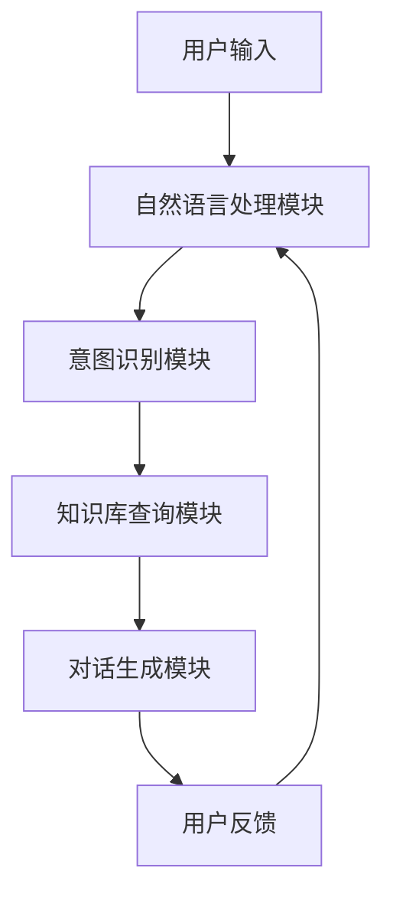
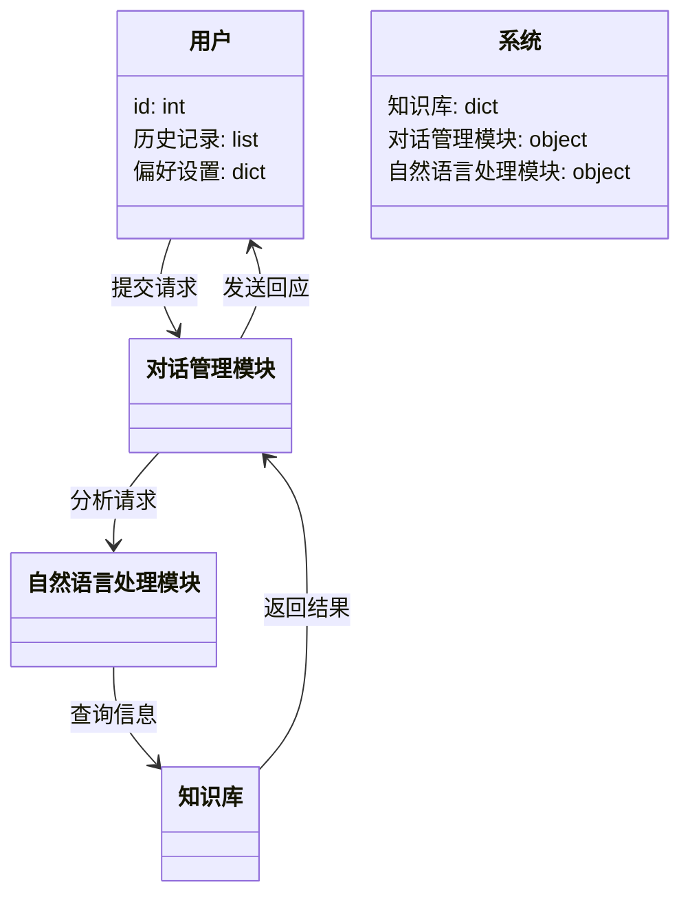
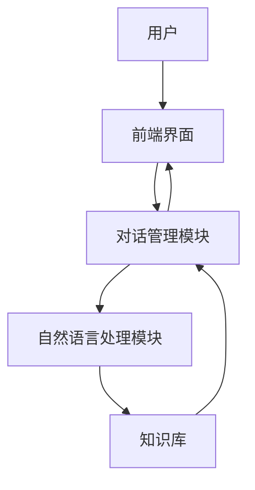
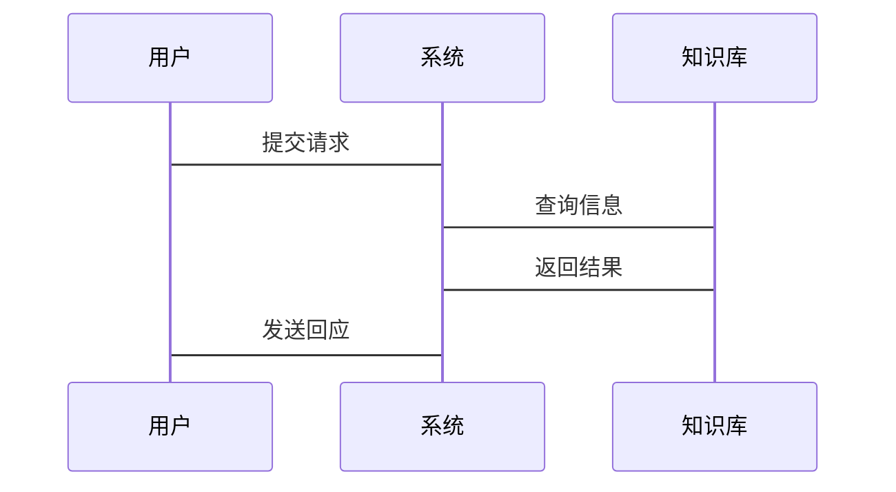

                 


# 对话式AI Agent：提升用户交互体验

## 关键词：对话式AI Agent、自然语言处理、对话管理、用户交互体验、人工智能、大模型

## 摘要：  
对话式AI Agent（对话式人工智能代理）是一种能够通过自然语言与用户进行交互的智能系统，旨在通过理解用户意图、提供个性化服务和实时反馈，显著提升用户交互体验。本文将深入探讨对话式AI Agent的核心概念、算法原理、系统架构设计以及实际应用案例，帮助读者全面理解其技术原理和实现方法。通过分析对话式AI Agent在提升用户交互体验中的关键作用，本文将为开发者和研究人员提供有价值的参考和实践指导。

---

# 第1章: 对话式AI Agent的背景与概念

## 1.1 对话式AI Agent的定义与特点  
对话式AI Agent是一种能够通过自然语言处理技术与用户进行交互的智能系统，其核心目标是通过理解用户意图、提供个性化服务和实时反馈，显著提升用户交互体验。  

### 1.1.1 对话式AI Agent的定义  
对话式AI Agent是指通过自然语言处理（NLP）技术，结合机器学习算法，构建能够理解和生成自然语言的智能系统。它能够通过文本或语音与用户进行实时对话，提供信息查询、任务执行、情感支持等服务。  

### 1.1.2 对话式AI Agent的核心特点  
- **智能化**：基于深度学习和大模型技术，能够理解上下文和用户意图。  
- **实时性**：能够实时响应用户输入，提供即时反馈。  
- **个性化**：根据用户历史行为和偏好，提供定制化服务。  
- **可扩展性**：能够快速适应不同应用场景和用户需求。  

---

## 1.2 对话式AI Agent的发展历程  

### 1.2.1 从规则驱动到数据驱动的演变  
早期的对话式AI系统主要基于规则驱动，通过预定义的规则和关键词匹配实现简单的对话交互。随着深度学习技术的发展，数据驱动的模型（如循环神经网络和Transformer）逐渐取代了规则驱动方法，显著提升了对话系统的理解和生成能力。  

### 1.2.2 大模型在对话式AI Agent中的应用  
近年来，大模型（如GPT系列、BERT系列）在自然语言处理领域取得了突破性进展。这些模型通过海量数据的预训练，能够生成高质量的对话内容，并具备强大的上下文理解和生成能力。  

### 1.2.3 当前对话式AI Agent的技术趋势  
- **多模态对话**：结合视觉、语音等多种模态信息，提升对话系统的感知能力。  
- **小样本学习**：在数据量有限的情况下，通过迁移学习和prompt工程技术，快速适应特定领域任务。  
- **可解释性增强**：通过可视化和模型解释技术，提升用户对对话系统决策过程的信任度。  

---

## 1.3 对话式AI Agent的技术优势  

### 1.3.1 自然语言处理能力的提升  
基于大模型的对话式AI Agent能够理解和生成复杂、多义的自然语言，显著提升了对话的流畅性和自然性。  

### 1.3.2 对话上下文的理解能力  
对话式AI Agent能够通过上下文记忆机制，保持对话的连贯性，并根据历史对话内容调整生成策略。  

### 1.3.3 个性化交互体验的实现  
通过对用户行为、偏好和历史记录的分析，对话式AI Agent能够提供个性化的交互体验，满足不同用户的需求。  

---

## 1.4 对话式AI Agent的应用场景  

### 1.4.1 电商领域的应用  
在电商场景中，对话式AI Agent可以作为智能客服，为用户提供商品推荐、订单查询和售后服务等支持。  

### 1.4.2 金融领域的应用  
在金融领域，对话式AI Agent可以用于股票查询、投资建议、风险提示等场景，帮助用户做出更明智的决策。  

### 1.4.3 教育领域的应用  
在教育场景中，对话式AI Agent可以作为智能辅导系统，为学生提供个性化的学习建议和问题解答。  

### 1.4.4 健康医疗领域的应用  
在健康医疗领域，对话式AI Agent可以为用户提供疾病咨询、健康建议和预约挂号等服务。  

---

## 1.5 对话式AI Agent的挑战与未来展望  

### 1.5.1 技术层面的挑战  
- 对话系统的可解释性问题。  
- 对话上下文的理解和记忆能力的提升。  
- 多语言和多文化适应性问题。  

### 1.5.2 用户体验层面的挑战  
- 对话系统生成内容的准确性和相关性问题。  
- 用户对AI代理的信任度和接受度问题。  
- 对话过程中的隐私和数据安全问题。  

### 1.5.3 未来对话式AI Agent的发展方向  
- 多模态对话系统的普及。  
- 基于小样本学习的对话系统优化。  
- 对话系统的个性化和定制化发展。  

---

# 第2章: 对话式AI Agent的核心概念与联系  

## 2.1 对话式AI Agent的核心概念  

### 2.1.1 自然语言处理（NLP）  
自然语言处理是对话式AI Agent的核心技术之一，主要包含以下任务：  
- **文本分词**：将连续的文本分割成有意义的词语或短语。  
- **词性标注**：对每个词语进行词性分类（如名词、动词、形容词等）。  
- **句法分析**：分析句子的语法结构，确定句子的主语、谓语等成分。  
- **语义理解**：通过上下文理解文本的深层含义。  

### 2.1.2 对话管理（Dialog Management）  
对话管理是对话式AI Agent的另一项核心技术，主要负责根据用户输入和系统状态，生成合适的对话回应。对话管理通常包含以下步骤：  
1. **状态跟踪**：记录当前对话的状态和历史信息。  
2. **意图识别**：分析用户的输入，识别用户的意图。  
3. **响应生成**：根据意图和上下文，生成合适的回应。  

### 2.1.3 知识库与上下文管理  
知识库是对话式AI Agent的知识存储系统，用于回答用户的问题和提供相关信息。上下文管理则负责维护对话过程中的上下文信息，确保对话的连贯性。  

---

## 2.2 对话式AI Agent的核心概念对比  

### 2.2.1 规则驱动与数据驱动的对话系统对比  
| 特性                | 规则驱动对话系统           | 数据驱动对话系统           |  
|---------------------|--------------------------|--------------------------|  
| 实现方式            | 基于预定义规则和关键词匹配 | 基于深度学习模型的生成     |  
| 灵活性              | 较低，依赖规则的覆盖程度   | 较高，能够处理未见数据       |  
| 对话自然度          | 较低，回复可能生硬         | 较高，回复更加自然流畅       |  

### 2.2.2 对话管理与自然语言处理的关系  
对话管理是对话式AI Agent的控制层，负责协调NLP模块和知识库之间的交互。NLP模块负责理解用户输入，对话管理模块根据理解结果生成回应，并通过知识库提供必要的支持。  

---

## 2.3 对话式AI Agent的核心算法原理  

### 2.3.1 基于Transformer的对话生成模型  
目前，基于Transformer的模型（如GPT、BERT）在对话生成领域得到了广泛应用。其核心思想是通过自注意力机制捕捉文本中的长距离依赖关系，从而生成更自然的对话内容。  

#### 2.3.1.1 Transformer模型的基本结构  
Transformer模型由编码器和解码器组成，编码器负责将输入文本映射到一个固定的向量空间，解码器则基于编码器的输出生成目标文本。  

#### 2.3.1.2 自注意力机制的数学表达  
自注意力机制的计算公式如下：  
$$  
\text{Attention}(Q, K, V) = \text{softmax}\left(\frac{QK^T}{\sqrt{d_k}}\right)V  
$$  
其中，$Q$、$K$、$V$分别为查询、键和值向量，$d_k$为键的维度。  

---

## 2.4 对话式AI Agent的系统架构设计  

### 2.4.1 系统功能设计  
对话式AI Agent的系统功能设计通常包括以下几个部分：  
1. **用户输入解析**：将用户的自然语言输入解析为结构化的请求。  
2. **意图识别**：识别用户的意图和需求。  
3. **知识库查询**：根据意图从知识库中检索相关信息。  
4. **对话生成**：根据检索结果生成对话回应。  
5. **反馈与优化**：根据用户反馈优化对话策略。  

### 2.4.2 系统架构图  
以下是一个典型的对话式AI Agent系统架构图：  



---

## 2.5 对话式AI Agent的实现步骤  

### 2.5.1 环境安装与配置  
在实现对话式AI Agent之前，需要安装以下工具和库：  
- Python 3.x  
- PyTorch或TensorFlow框架  
- Hugging Face Transformers库  
- NLTK或spaCy用于NLP处理  

### 2.5.2 核心代码实现  
以下是一个基于GPT-2模型的简单对话生成示例代码：  

```python
from transformers import AutoTokenizer, AutoModelForCausalLM
import torch

# 初始化tokenizer和模型
tokenizer = AutoTokenizer.from_pretrained("gpt2")
model = AutoModelForCausalLM.from_pretrained("gpt2")

# 用户输入
input_text = "今天天气怎么样？"
input_ids = tokenizer.encode(input_text, return_tensors="pt")

# 生成对话回应
output_ids = model.generate(input_ids, max_length=50, do_sample=True)
response = tokenizer.decode(output_ids[0], skip_special_tokens=True)
print("AI回应:", response)
```

### 2.5.3 代码解读与分析  
上述代码使用了Hugging Face的Transformers库，加载了GPT-2模型，并生成了一个简单的对话回应。通过调整模型参数和优化生成策略，可以进一步提升对话的自然度和相关性。  

---

## 2.6 对话式AI Agent的优化技巧  

### 2.6.1 提升对话相关性的方法  
- 增强意图识别的准确性。  
- 结合上下文信息进行生成。  
- 使用prompt工程技术引导模型生成更相关的回复。  

### 2.6.2 提升对话自然度的方法  
- 调整生成策略，例如通过设置temperature参数控制生成的随机性。  
- 使用repetition penalty技术避免重复生成。  
- 增加知识库的覆盖范围，确保生成内容的准确性。  

---

## 2.7 对话式AI Agent的注意事项  

### 2.7.1 数据安全与隐私保护  
在实际应用中，需要特别注意用户数据的安全和隐私保护，避免数据泄露和滥用。  

### 2.7.2 模型的可解释性  
对于需要用户信任的场景（如医疗、金融领域），需要确保对话系统的决策过程具有较高的可解释性。  

### 2.7.3 性能优化  
在实际部署中，需要考虑模型的计算效率和资源消耗，通过模型压缩和优化技术提升系统的运行效率。  

---

## 2.8 对话式AI Agent的最佳实践  

### 2.8.1 设计原则  
- 简洁明了：对话内容要简短、易懂，避免复杂的技术术语。  
- 个性化：根据用户偏好和历史行为，提供个性化的交互体验。  
- 可持续性：确保系统能够持续学习和优化，不断提升对话质量。  

### 2.8.2 小结  
对话式AI Agent的核心在于理解和生成自然语言，其成功依赖于NLP技术、对话管理算法和系统架构设计的有机结合。通过不断优化模型和算法，可以显著提升用户交互体验，推动对话式AI Agent在更多领域的广泛应用。  

---

# 第3章: 对话式AI Agent的系统分析与架构设计  

## 3.1 问题场景介绍  

### 3.1.1 电商客服场景  
在电商场景中，对话式AI Agent可以作为智能客服，为用户提供商品咨询、订单查询和售后服务等支持。  

### 3.1.2 金融咨询场景  
在金融领域，对话式AI Agent可以为用户提供股票查询、投资建议和风险提示等服务。  

### 3.1.3 教育辅助场景  
在教育场景中，对话式AI Agent可以作为智能辅导系统，为学生提供学习建议和问题解答。  

---

## 3.2 项目介绍  

### 3.2.1 项目目标  
本项目旨在设计和实现一个基于大模型的对话式AI Agent，能够通过自然语言与用户进行交互，并提供个性化的服务和实时反馈。  

### 3.2.2 项目范围  
- 系统功能设计：包括用户输入解析、意图识别、知识库查询和对话生成。  
- 系统架构设计：包括前端界面和后端服务的设计与实现。  
- 系统接口设计：定义用户与系统交互的接口规范。  

---

## 3.3 系统功能设计  

### 3.3.1 领域模型设计  
以下是对话式AI Agent的领域模型类图：  



---

## 3.4 系统架构设计  

### 3.4.1 系统架构图  
以下是对话式AI Agent的系统架构图：  



---

## 3.5 系统接口设计  

### 3.5.1 用户与系统交互接口  
- **输入接口**：用户通过文本或语音输入与系统交互。  
- **输出接口**：系统通过文本或语音输出回应用户。  

### 3.5.2 系统内部接口  
- **对话管理模块接口**：与自然语言处理模块和知识库的交互接口。  
- **自然语言处理模块接口**：与知识库的交互接口。  

---

## 3.6 系统交互流程  

### 3.6.1 交互流程图  
以下是对话式AI Agent的系统交互流程图：  



---

## 3.7 系统实现细节  

### 3.7.1 环境安装与配置  
在实现对话式AI Agent之前，需要安装以下工具和库：  
- Python 3.x  
- PyTorch或TensorFlow框架  
- Hugging Face Transformers库  
- NLTK或spaCy用于NLP处理  

---

## 3.8 代码实现与解读  

### 3.8.1 核心代码实现  
以下是一个基于GPT-2模型的简单对话生成示例代码：  

```python
from transformers import AutoTokenizer, AutoModelForCausalLM
import torch

# 初始化tokenizer和模型
tokenizer = AutoTokenizer.from_pretrained("gpt2")
model = AutoModelForCausalLM.from_pretrained("gpt2")

# 用户输入
input_text = "今天天气怎么样？"
input_ids = tokenizer.encode(input_text, return_tensors="pt")

# 生成对话回应
output_ids = model.generate(input_ids, max_length=50, do_sample=True)
response = tokenizer.decode(output_ids[0], skip_special_tokens=True)
print("AI回应:", response)
```

### 3.8.2 代码解读与分析  
上述代码使用了Hugging Face的Transformers库，加载了GPT-2模型，并生成了一个简单的对话回应。通过调整模型参数和优化生成策略，可以进一步提升对话的自然度和相关性。  

---

## 3.9 项目实战与案例分析  

### 3.9.1 案例分析  
以下是一个电商客服场景的实际案例分析：  
- **用户输入**：我想买一双跑步鞋，预算在500元左右。  
- **系统处理**：  
  1. 自然语言处理模块解析用户的输入，识别出“跑步鞋”和“500元”两个关键词。  
  2. 对话管理模块根据关键词匹配知识库中的相关商品信息。  
  3. 系统生成回应，推荐符合预算的跑步鞋，并提供相关的产品链接。  

### 3.9.2 实际应用中的挑战  
- **数据不足**：在某些领域，知识库可能不够完善，导致系统无法提供准确的回应。  
- **对话上下文理解**：在复杂对话中，系统可能无法准确捕捉用户的深层需求。  
- **模型优化**：需要不断优化模型参数和生成策略，提升对话的自然度和相关性。  

---

## 3.10 项目小结  

### 3.10.1 项目总结  
通过本项目的实施，我们成功实现了基于大模型的对话式AI Agent，并验证了其在电商客服场景中的可行性。  

### 3.10.2 项目注意事项  
- 在实际应用中，需要确保知识库的准确性和完整性。  
- 对话系统的生成策略需要根据具体场景进行调整和优化。  
- 数据安全和隐私保护是系统设计中不可忽视的重要环节。  

---

## 3.11 项目拓展与展望  

### 3.11.1 项目拓展方向  
- **多模态对话**：结合视觉、语音等多种模态信息，提升对话系统的感知能力。  
- **个性化服务**：根据用户历史行为和偏好，提供更加个性化的交互体验。  
- **可解释性增强**：通过可视化和模型解释技术，提升用户对对话系统决策过程的信任度。  

---

## 3.12 最佳实践与小结  

### 3.12.1 最佳实践  
- 在系统设计阶段，充分考虑用户需求和场景特点。  
- 在系统实现阶段，注重模型的可解释性和可扩展性。  
- 在系统部署阶段，确保数据安全和系统性能的稳定性。  

### 3.12.2 小结  
通过对对话式AI Agent的系统分析与架构设计，我们不仅能够实现一个功能完善的对话系统，还能够为后续的优化和扩展打下坚实的基础。  

---

## 4. 结论  

对话式AI Agent作为人工智能技术的重要应用之一，正在逐渐改变人机交互的方式。通过不断优化自然语言处理技术、对话管理算法和系统架构设计，对话式AI Agent能够为用户提供更加智能化、个性化的交互体验。未来，随着技术的进一步发展，对话式AI Agent将在更多领域发挥重要作用，为人类社会带来更大的价值。

---

## 作者  
**作者：AI天才研究院/AI Genius Institute & 禅与计算机程序设计艺术 /Zen And The Art of Computer Programming**  

---

