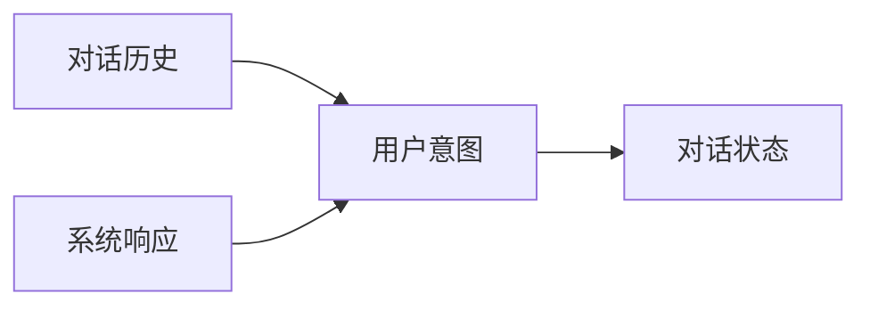
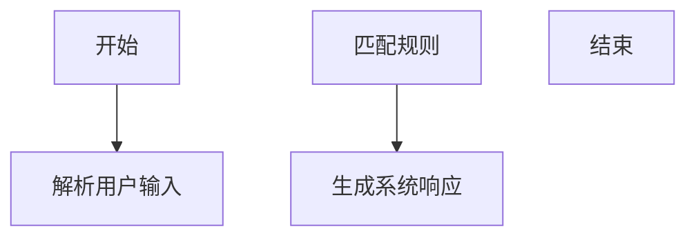
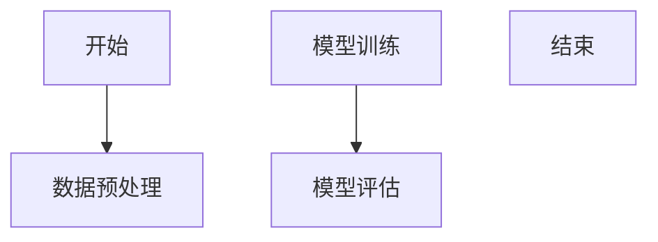
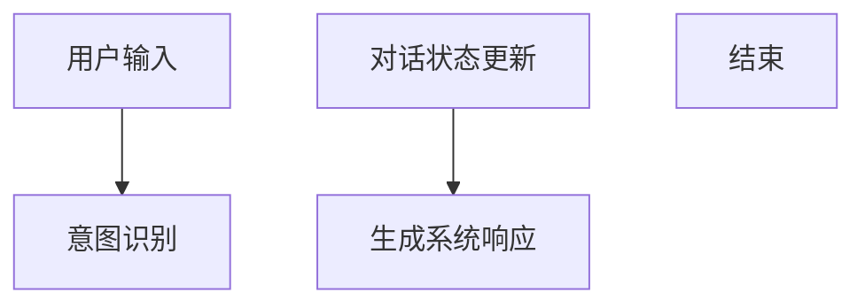
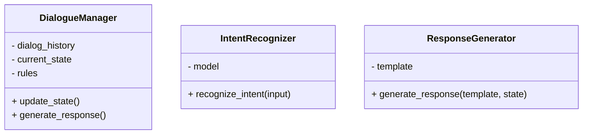

                 


# 对话管理系统：构建流畅自然的人机交互

## 关键词：对话管理系统、人机交互、自然语言处理、深度学习、系统架构设计

## 摘要：对话管理系统是实现流畅自然人机交互的核心技术，本文从对话管理系统的背景、核心概念、算法原理、系统架构设计、项目实战到最佳实践等方面进行详细讲解，旨在帮助读者全面理解并掌握对话管理系统的构建方法。

---

# 第一部分: 对话管理系统的背景与概念

# 第1章: 对话管理系统的概述

## 1.1 对话管理系统的概念与背景

### 1.1.1 人机交互的发展历程

从简单的命令行输入，到今天的智能对话交互，人机交互技术经历了多个阶段的发展。早期的交互方式以命令行为主，用户需要输入特定的命令来完成操作。随着技术的进步，图形用户界面（GUI）逐渐普及，人机交互变得更加直观。然而，真正的智能化交互还需要依赖自然语言处理（NLP）和对话管理技术的支持。

### 1.1.2 对话管理系统的定义与特点

对话管理系统（Dialogue Management System，DMS）是一种能够理解和生成自然语言对话的系统，其核心目标是通过分析用户的输入，理解其意图，并生成符合上下文的响应。对话管理系统的特点包括：

- **智能性**：能够理解用户的意图并生成自然的回复。
- **上下文依赖性**：对话的生成依赖于对话历史和当前上下文。
- **动态性**：对话过程是动态的，需要根据用户的反馈不断调整系统的行为。

### 1.1.3 当前对话管理系统的应用现状

目前，对话管理系统已经在多个领域得到了广泛应用，包括智能客服、语音助手（如Siri、Alexa）、智能音箱、在线教育辅助系统等。随着自然语言处理技术的不断进步，对话管理系统的性能和用户体验也在不断提升。

## 1.2 对话管理系统的核心问题

### 1.2.1 对话流畅性问题

对话的流畅性是指系统能够生成连贯、自然的回复，避免重复或不相关的内容。这是对话管理系统需要解决的核心问题之一。

### 1.2.2 对话准确性问题

对话的准确性是指系统能够准确理解用户的意图，并生成符合用户需求的回复。准确性是对话管理系统的重要指标，直接影响用户体验。

### 1.2.3 对话上下文管理问题

对话的上下文管理是指系统能够记忆和理解对话的上下文信息，包括对话历史、用户意图、系统状态等。上下文管理是对话管理系统实现流畅交互的基础。

## 1.3 对话管理系统的挑战与机遇

### 1.3.1 技术挑战

- **复杂性**：对话管理需要综合考虑语言理解、上下文记忆、意图识别等多个方面。
- **不确定性**：用户的输入可能存在歧义，系统需要能够处理多种可能性。
- **实时性**：对话交互需要实时响应，这对系统的性能提出了更高的要求。

### 1.3.2 应用场景的多样性

对话管理系统可以应用于多个领域，如智能客服、医疗咨询、教育辅助等。不同应用场景对对话管理系统的具体需求有所不同，这也为技术的发展提供了多样化的方向。

### 1.3.3 未来发展趋势

随着人工智能技术的不断进步，对话管理系统将更加智能化和个性化。未来的对话管理系统将能够更好地理解用户的情感、意图，并提供更加自然和个性化的交互体验。

## 1.4 本章小结

通过对对话管理系统的背景、核心问题和挑战的介绍，我们可以看到，对话管理系统是实现人机交互智能化的关键技术。接下来，我们将深入探讨对话管理系统的原理和核心概念。

---

# 第二部分: 对话管理系统的核心概念与联系

# 第2章: 对话管理系统的原理与模型

## 2.1 对话管理系统的原理

### 2.1.1 对话状态表示

对话状态表示是指将对话的当前状态以某种形式表示出来。常见的对话状态表示方法包括基于规则的表示和基于向量的表示。基于规则的表示通常采用状态机的方式，而基于向量的表示则利用深度学习技术提取对话的语义特征。

### 2.1.2 对话策略选择

对话策略选择是指在给定的对话状态下，选择一个合适的回复策略。常见的对话策略包括基于规则的策略和基于模型的策略。基于规则的策略依赖于预定义的规则，而基于模型的策略则利用机器学习模型进行预测。

### 2.1.3 对话生成机制

对话生成机制是指系统如何根据对话状态和策略生成回复。常见的对话生成方法包括基于模板的生成和基于生成模型的生成。基于模板的生成方法利用预定义的模板生成回复，而基于生成模型的生成方法则利用自然语言生成模型（如GPT）生成回复。

## 2.2 对话管理系统的模型

### 2.2.1 基于规则的对话模型

基于规则的对话模型通过预定义的规则来处理对话。规则通常包括意图识别、槽位填充和回复生成等部分。这种方法的优点是实现简单，但灵活性较差，难以应对复杂的对话场景。

### 2.2.2 基于统计的对话模型

基于统计的对话模型通过统计学方法分析对话数据，提取对话模式和规律。这种方法能够处理大量的对话数据，但需要依赖大量的训练数据。

### 2.2.3 基于深度学习的对话模型

基于深度学习的对话模型利用神经网络进行对话分析和生成。这种方法能够处理复杂的对话场景，生成更加自然的回复，但实现复杂度较高。

## 2.3 对话管理系统的实体关系图

以下是一个对话管理系统的实体关系图：



从图中可以看出，对话历史和用户意图是对话状态的重要输入，而对话状态又影响系统响应的生成。

## 2.4 本章小结

通过对对话管理系统的原理和模型的分析，我们可以更好地理解对话管理系统的实现机制。接下来，我们将深入探讨对话管理系统的算法原理。

---

# 第三部分: 对话管理系统的算法原理

# 第3章: 对话管理算法的核心原理

## 3.1 基于规则的对话管理算法

### 3.1.1 算法流程图

以下是一个基于规则的对话管理算法的流程图：



流程图显示了基于规则的对话管理算法的基本流程：解析用户输入，匹配预定义的规则，生成系统响应。

### 3.1.2 算法实现

以下是一个简单的基于规则的对话管理算法的Python代码示例：

```python
def match_rules(user_input, rules):
    for rule in rules:
        if re.match(rule['pattern'], user_input):
            return rule['response']
    return "抱歉，我还没有学会回答这个问题。"
```

### 3.1.3 优缺点分析

基于规则的对话管理算法的优点是实现简单，易于理解和维护。缺点是灵活性较差，难以应对复杂的对话场景。

## 3.2 基于深度学习的对话管理算法

### 3.2.1 算法流程图

以下是一个基于深度学习的对话管理算法的流程图：



流程图显示了基于深度学习的对话管理算法的基本流程：数据预处理，模型训练，模型评估。

### 3.2.2 模型训练流程

以下是一个基于深度学习的对话管理算法的Python代码示例：

```python
import torch
import torch.nn as nn

class DialogueModel(nn.Module):
    def __init__(self, input_size, hidden_size, output_size):
        super(DialogueModel, self).__init__()
        self.hidden_size = hidden_size
        self.embedding = nn.Embedding(input_size, hidden_size)
        self.gru = nn.GRU(hidden_size, hidden_size)
        self.fc = nn.Linear(hidden_size, output_size)

    def forward(self, input, hidden):
        embedded = self.embedding(input)
        output, hidden = self.gru(embedded, hidden)
        output = self.fc(output.view(-1, hidden_size))
        return output, hidden

# 初始化模型
input_size = 100
hidden_size = 128
output_size = 5
model = DialogueModel(input_size, hidden_size, output_size)

# 定义损失函数和优化器
criterion = nn.CrossEntropyLoss()
optimizer = torch.optim.Adam(model.parameters(), lr=0.001)

# 训练过程
for epoch in range(num_epochs):
    for inputs, labels in dataloader:
        outputs, _ = model(inputs, hidden)
        loss = criterion(outputs, labels)
        optimizer.zero_grad()
        loss.backward()
        optimizer.step()
```

### 3.2.3 优缺点分析

基于深度学习的对话管理算法的优点是能够处理复杂的对话场景，生成更加自然的回复。缺点是实现复杂度较高，需要大量的训练数据和计算资源。

## 3.3 对话管理算法的数学模型

### 3.3.1 基于马尔可夫链的状态转移模型

马尔可夫链是一种描述系统状态转移的数学模型，其核心公式为：

$$ P(s_t | s_{t-1}) $$

其中，\( P(s_t | s_{t-1}) \) 表示在状态 \( s_{t-1} \) 下，系统转移到状态 \( s_t \) 的概率。

### 3.3.2 基于注意力机制的对话生成模型

注意力机制是一种用于序列生成的模型，其核心公式为：

$$ \alpha_i = \frac{e^{score_i}}{\sum_j e^{score_j}} $$

其中，\( \alpha_i \) 表示第 \( i \) 个位置的注意力权重，\( score_i \) 表示第 \( i \) 个位置的得分。

## 3.4 本章小结

通过对基于规则和基于深度学习的对话管理算法的分析，我们可以看到，对话管理算法的选择和实现需要综合考虑多种因素。接下来，我们将探讨对话管理系统的系统分析与架构设计。

---

# 第四部分: 对话管理系统的系统分析与架构设计

# 第4章: 对话管理系统的功能设计

## 4.1 系统功能模块

### 4.1.1 意图识别模块

意图识别模块负责理解用户的输入，提取用户的意图。常见的意图识别方法包括基于规则的意图识别和基于模型的意图识别。

### 4.1.2 对话状态管理模块

对话状态管理模块负责维护对话的当前状态，包括对话历史、用户意图、系统状态等。

### 4.1.3 系统响应生成模块

系统响应生成模块负责根据对话状态和对话策略生成系统的回复。常见的生成方法包括基于模板的生成和基于模型的生成。

## 4.2 系统功能流程图

以下是一个对话管理系统的功能流程图：



流程图显示了对话管理系统的功能流程：用户输入经过意图识别后，更新对话状态，生成系统响应。

## 4.3 系统功能模块的类图

以下是一个对话管理系统的类图：



类图展示了对话管理系统的三个主要模块：对话管理器、意图识别器和响应生成器。

## 4.4 本章小结

通过对对话管理系统的功能设计和类图的分析，我们可以更好地理解对话管理系统的整体架构。接下来，我们将深入探讨对话管理系统的架构设计。

---

# 第五部分: 对话管理系统的项目实战

# 第5章: 对话管理系统的实现

## 5.1 环境安装

以下是对话管理系统实现所需的环境安装步骤：

1. 安装Python和必要的库：
   ```bash
   pip install torch numpy matplotlib
   ```

2. 安装对话管理系统的依赖：
   ```bash
   pip install transformers
   ```

## 5.2 对话管理系统核心代码实现

以下是一个简单的对话管理系统的Python代码实现：

```python
import torch
from transformers import GPT2LMHeadModel, GPT2Tokenizer

# 初始化模型
model_name = "gpt2-medium"
tokenizer = GPT2Tokenizer.from_pretrained(model_name)
model = GPT2LMHeadModel.from_pretrained(model_name)

# 定义对话管理器
class DialogueManager:
    def __init__(self):
        self.dialog_history = []
        self.current_state = "init"

    def update_state(self, user_input):
        self.dialog_history.append(user_input)
        # 更新当前状态
        self.current_state = "active"

    def generate_response(self):
        # 生成回复
        inputs = tokenizer.encode(" ".join(self.dialog_history), return_tensors="pt")
        outputs = model.generate(inputs, max_length=50, temperature=0.7)
        response = tokenizer.decode(outputs[0], skip_special_tokens=True)
        return response

# 初始化对话管理器
manager = DialogueManager()

# 模拟对话
while True:
    user_input = input("用户：")
    manager.update_state(user_input)
    response = manager.generate_response()
    print("系统：" + response)
```

### 5.2.1 代码解读

上述代码实现了基于GPT-2模型的对话管理系统。对话管理器负责维护对话历史和当前状态，并生成系统的回复。

### 5.2.2 代码分析

对话管理器的实现分为两部分：更新状态和生成回复。更新状态时，对话管理器将用户的输入添加到对话历史中，并更新当前状态。生成回复时，对话管理器利用预训练的GPT-2模型生成系统的回复。

## 5.3 项目实战案例分析

以下是对话管理系统的实际应用案例：智能客服系统。

### 5.3.1 案例背景

智能客服系统是一种常见的对话管理系统应用，用于处理用户的咨询和服务请求。

### 5.3.2 系统实现

以下是智能客服系统的实现：

```python
class CustomerServiceAgent:
    def __init__(self):
        self.dialog_history = []
        self.current_state = "idle"

    def handle_user_input(self, user_input):
        self.dialog_history.append(user_input)
        # 根据用户输入生成回复
        response = self.generate_response(user_input)
        return response

    def generate_response(self, user_input):
        # 简单的基于规则的回复生成
        if "帮助" in user_input:
            return "请问您需要什么帮助？"
        elif "感谢" in user_input:
            return "不客气，有什么我可以帮您的吗？"
        else:
            return "抱歉，我还没有学会回答这个问题。"
```

### 5.3.3 代码解读与分析

上述代码实现了一个简单的智能客服系统。系统能够处理用户的输入，并生成相应的回复。回复生成基于预定义的规则，适用于简单的对话场景。

## 5.4 项目小结

通过对对话管理系统的实现和实际应用案例的分析，我们可以看到，对话管理系统在实际应用中具有广泛的应用前景。接下来，我们将总结对话管理系统的最佳实践。

---

# 第六部分: 对话管理系统的最佳实践

# 第6章: 对话管理系统的最佳实践

## 6.1 小结

对话管理系统是实现流畅自然人机交互的核心技术。通过对对话管理系统的背景、核心概念、算法原理、系统架构设计和项目实战的分析，我们可以看到，对话管理系统是一个复杂的系统工程，需要综合考虑多个方面的因素。

## 6.2 注意事项

在实现对话管理系统时，需要注意以下几点：

1. **数据质量**：对话管理系统的性能依赖于数据质量，需要确保训练数据的多样性和代表性。
2. **模型选择**：根据具体应用场景选择合适的对话管理算法，避免过度复杂化。
3. **用户体验**：对话系统的用户体验是关键，需要设计流畅的对话流程，确保系统的回复准确、自然。

## 6.3 拓展阅读

以下是一些关于对话管理系统的拓展阅读资料：

- **书籍**：《自然语言处理实战：基于深度学习的Python实现》
- **论文**："A Neural Conversational Model"（ArXiv论文）
- **在线课程**：Coursera上的《自然语言处理专项课程》

## 6.4 本章小结

通过对对话管理系统的最佳实践的总结，我们可以更好地理解和应用对话管理系统的相关技术。希望本文对读者在对话管理系统的构建和应用中提供有价值的参考。

---

# 作者：AI天才研究院/AI Genius Institute & 禅与计算机程序设计艺术/Zen And The Art of Computer Programming

---

以上是对话管理系统技术博客文章的完整目录大纲，每个章节都详细展开了核心内容，结合理论与实践，为读者提供了一个全面的视角来理解和构建流畅自然的人机交互系统。

