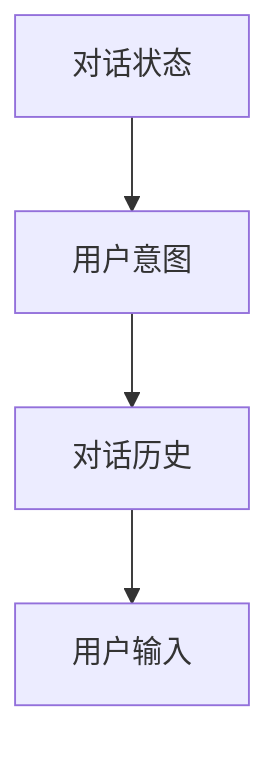
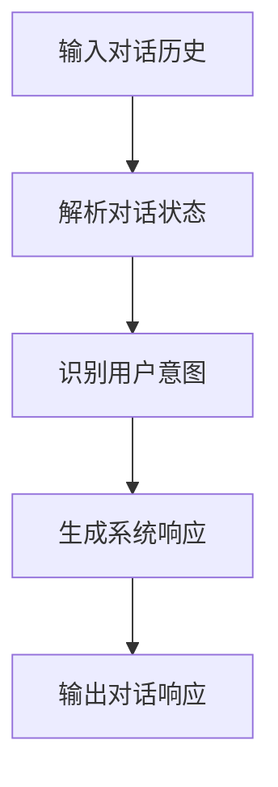
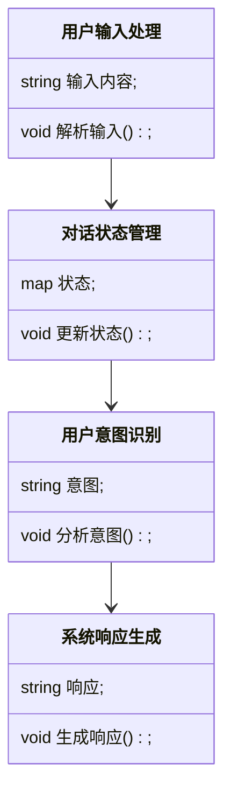
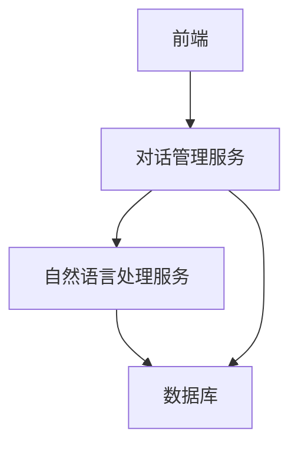
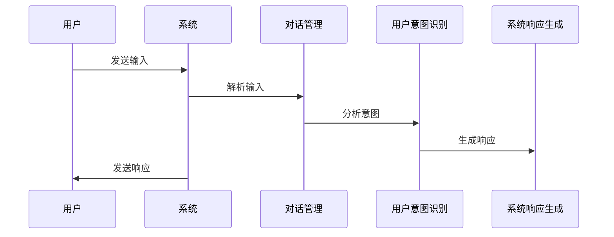

                 


# 对话管理：设计流畅的人机交互体验

> 关键词：对话管理，人机交互，自然语言处理，对话系统，用户体验

> 摘要：对话管理是实现流畅人机交互的核心技术，本文从背景、概念、算法、架构、实战到最佳实践，全面解析对话管理的设计与实现，帮助读者构建高效、自然的对话系统。

---

## 第1章 对话管理概述

### 1.1 对话管理的基本概念

#### 1.1.1 对话管理的定义
对话管理是自然语言处理（NLP）的重要分支，负责理解和生成人类语言，通过对话系统实现与用户的有效沟通。其核心目标是确保对话的流畅性、准确性和自然性。

#### 1.1.2 对话管理的核心要素
- **对话状态**：记录对话历史、当前输入和系统响应，是对话管理的基础。
- **用户意图**：识别用户的实际需求，是对话管理的核心任务。
- **对话策略**：根据对话状态和用户意图，生成合适的系统响应。

#### 1.1.3 对话管理的应用场景
- 智能客服
- 智能助手（如Siri、Alexa）
- 联网设备交互
- 游戏NPC对话

### 1.2 对话系统的演变历程

#### 1.2.1 从规则驱动到数据驱动的转变
早期对话系统基于固定的规则，无法处理复杂场景。随着深度学习的发展，数据驱动的方法成为主流。

#### 1.2.2 基于自然语言处理的对话系统发展
- 基于规则的系统：简单场景，依赖预设规则。
- 数据驱动的系统：利用NLP技术，处理复杂对话。

#### 1.2.3 当前对话系统的挑战与趋势
- 挑战：对话的连贯性、多轮对话处理、模糊意图识别。
- 趋势：结合强化学习和生成模型，提升对话质量。

### 1.3 对话管理的目标与价值

#### 1.3.1 提升用户体验的核心目标
- 提供自然流畅的对话体验。
- 理解用户真实需求，提供精准服务。

#### 1.3.2 对话管理在人机交互中的价值
- 减少用户操作步骤，提高效率。
- 降低学习成本，增强可用性。

#### 1.3.3 对话管理对业务的影响
- 提高用户满意度。
- 增强品牌形象。

### 1.4 本章小结
本章介绍了对话管理的基本概念、发展历程及核心价值，为后续章节奠定了基础。

---

## 第2章 对话状态与用户意图

### 2.1 对话状态的核心原理

#### 2.1.1 对话状态的定义与特征
对话状态记录对话历史、用户输入和系统响应，是对话管理的基础。

#### 2.1.2 对话状态的表示方法
- 基于规则的表示：使用状态机。
- 基于数据的表示：使用向量或序列。

#### 2.1.3 对话状态的更新机制
- 基于用户输入更新。
- 基于系统响应更新。

### 2.2 用户意图识别的关键技术

#### 2.2.1 基于规则的意图识别
- 通过预设关键词匹配用户意图。
- 适用于简单场景，如关键词搜索。

#### 2.2.2 基于机器学习的意图识别
- 使用分类算法（如SVM、随机森林）训练意图识别模型。
- 特征提取：词袋模型、TF-IDF。

#### 2.2.3 深度学习在意图识别中的应用
- 使用RNN、LSTM处理序列数据。
- Transformer模型（如BERT）在意图识别中的应用。

### 2.3 对话状态与用户意图的关系

#### 2.3.1 对话状态对用户意图的影响
- 对话状态提供上下文，帮助准确识别意图。
- 例如：在客服系统中，用户输入“我遇到了问题”，结合对话历史，系统能更准确理解意图。

#### 2.3.2 用户意图对对话状态的驱动
- 用户意图指导对话流程，更新对话状态。
- 例如：用户选择“支付订单”，系统更新订单状态。

#### 2.3.3 对话状态与用户意图的动态调整
- 动态更新对话状态，适应用户意图变化。
- 例如：用户中途修改需求，系统实时调整对话流程。

### 2.4 核心概念对比表
| 概念 | 定义 | 特征 | 关系 |
|------|------|------|------|
| 对话状态 | 当前对话的上下文信息 | 包含用户输入、系统响应、历史记录 | 驱动用户意图识别 |
| 用户意图 | 用户在对话中的目标 | 显式或隐式 | 由对话状态推断 |

### 2.5 ER实体关系图


### 2.6 本章小结
本章详细探讨了对话状态和用户意图的核心概念、技术实现及其关系，为后续章节奠定了基础。

---

## 第3章 对话管理算法概述

### 3.1 基于规则的对话管理

#### 3.1.1 规则驱动的对话管理
- 使用预设规则处理特定场景。
- 适用于简单任务，如FAQ回答。

#### 3.1.2 优缺点分析
- 优点：实现简单，易于维护。
- 缺点：无法处理复杂场景，缺乏灵活性。

### 3.2 基于模型的对话管理

#### 3.2.1 基于强化学习的对话管理
- 使用策略网络，通过奖励机制优化对话策略。
- 例如：使用Deep Q-Learning算法。

#### 3.2.2 基于生成模型的对话管理
- 使用生成模型（如GPT）生成对话响应。
- 优点：生成自然流畅的回复。

### 3.3 对话管理算法流程

#### 3.3.1 算法流程图


#### 3.3.2 数学模型
- 对话管理的目标是最大化用户满意度，可以用以下公式表示：
  $$ \text{目标} = \max_{\theta} \sum_{i=1}^{n} \text{奖励}(s_i, a_i) $$
  其中，\( s_i \) 是状态，\( a_i \) 是动作，奖励函数衡量对话质量。

### 3.4 实例分析

#### 3.4.1 案例一：简单对话
- 用户输入：“你好”。
- 系统响应：“你好！有什么可以帮助你的吗？”

#### 3.4.2 案例二：复杂对话
- 用户输入：“我想预订一张去北京的机票，周五的早晨。”
- 系统解析意图：预订机票。
- 系统响应：“好的，请问您是需要经济舱还是商务舱？”

### 3.5 本章小结
本章介绍了对话管理的算法原理，重点分析了基于规则和基于模型的对话管理方法，并通过实例展示了算法的应用。

---

## 第4章 系统分析与架构设计

### 4.1 问题场景介绍

#### 4.1.1 项目背景
以智能客服系统为例，设计一个基于对话管理的客服系统。

### 4.2 系统功能设计

#### 4.2.1 功能模块划分
- 用户输入处理模块。
- 对话状态管理模块。
- 用户意图识别模块。
- 系统响应生成模块。

#### 4.2.2 领域模型类图


### 4.3 系统架构设计

#### 4.3.1 系统架构图


#### 4.3.2 接口设计
- 用户输入接口：`POST /api/input`
- 系统响应接口：`GET /api/response`

### 4.4 系统交互流程图

#### 4.4.1 交互流程图


### 4.5 本章小结
本章从系统架构的角度，详细设计了对话管理系统的各个模块及其交互流程，为后续的项目实现提供了指导。

---

## 第5章 项目实战

### 5.1 环境安装

#### 5.1.1 安装Python
```bash
python --version
pip install --upgrade pip
```

#### 5.1.2 安装依赖库
```bash
pip install numpy
pip install transformers
pip install scikit-learn
```

### 5.2 系统核心实现源代码

#### 5.2.1 对话状态管理类
```python
class DialogStateManager:
    def __init__(self):
        self.states = {}

    def update_state(self, dialog_id, state):
        self.states[dialog_id] = state

    def get_state(self, dialog_id):
        return self.states.get(dialog_id, {})
```

#### 5.2.2 用户意图识别类
```python
from sklearn.feature_extraction.text import TfidfVectorizer
from sklearn.svm import SVC

class IntentRecognizer:
    def __init__(self, train_data, labels):
        self.vectorizer = TfidfVectorizer()
        self.model = SVC()
        self.model.fit(self.vectorizer.fit_transform(train_data), labels)

    def predict(self, text):
        return self.model.predict(self.vectorizer.transform([text]))[0]
```

#### 5.2.3 系统响应生成类
```python
from transformers import pipeline

class ResponseGenerator:
    def __init__(self):
        self.generator = pipeline('text-generation')

    def generate_response(self, input_text):
        return self.generator(input_text)[0]['generated_text']
```

### 5.3 代码应用解读与分析

#### 5.3.1 对话状态管理
- 使用字典存储对话状态，支持增删改查操作。

#### 5.3.2 用户意图识别
- 使用TF-IDF和SVM进行意图分类。
- 适用于简单的意图识别任务。

#### 5.3.3 系统响应生成
- 使用预训练的生成模型生成自然语言回复。

### 5.4 实际案例分析

#### 5.4.1 案例分析
- 用户输入：“我的订单在哪里？”
- 对话状态更新：`order Inquiry`
- 用户意图识别：`order tracking`
- 系统响应生成：“您可以在我的账户中查看订单状态。”

### 5.5 项目小结
本章通过实际项目，详细讲解了对话管理系统的实现过程，包括环境搭建、核心代码编写和案例分析。

---

## 第6章 最佳实践与小结

### 6.1 小结

#### 6.1.1 核心概念总结
- 对话状态和用户意图是对话管理的核心。
- 算法选择影响系统性能。

#### 6.1.2 关键技术总结
- 基于规则和基于模型的对话管理各有优劣。
- 深度学习在对话管理中发挥重要作用。

### 6.2 注意事项

#### 6.2.1 实际应用中的注意事项
- 数据质量影响系统性能。
- 对话系统的可解释性需考虑。
- 安全性和隐私保护不可忽视。

### 6.3 拓展阅读

#### 6.3.1 推荐书籍
- 《对话系统实践指南》
- 《自然语言处理入门》

#### 6.3.2 推荐博客和资源
- [对话系统开源项目](https://github.com/microsoft/Dialog-RTE)
- [自然语言处理教程](https://huggingface.co/transformers)

### 6.4 本章小结
本章总结了对话管理的关键点，并提出了实际应用中的注意事项和拓展阅读方向。

---

## 作者信息

作者：AI天才研究院/AI Genius Institute & 禅与计算机程序设计艺术/Zen And The Art of Computer Programming

---

# 结语

对话管理是实现流畅人机交互的关键技术。通过本文的系统讲解和实战分析，读者可以深入了解对话管理的核心概念、算法原理和系统架构。希望本文能为读者在设计和实现对话系统时提供有价值的指导和启发。

--- 

感谢您的阅读！如需进一步交流或获取更多资料，请随时联系。

