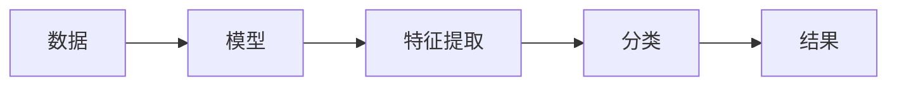
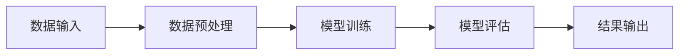

                 


# 少样本学习：在有限数据下快速适应

> 关键词：少样本学习，小样本学习，零样本学习，迁移学习，数据增强，模型压缩

> 摘要：在现实应用中，数据获取往往面临成本和时间的限制，导致数据量不足。少样本学习作为一种新兴的学习范式，能够在有限数据下实现高效的模型训练。本文深入探讨少样本学习的核心概念、算法原理、系统设计以及项目实战，为读者提供全面的指导。

---

## 第一部分: 少样本学习的背景与核心概念

### 第1章: 少样本学习的定义与问题背景

#### 1.1 少样本学习的定义
少样本学习（Few-shot Learning）是指在仅使用少量训练样本的情况下，仍然能够完成学习任务的范式。与传统的大样本学习不同，少样本学习特别关注数据稀缺场景下的模型泛化能力。

- **定义**：给定少量样本，通过特定的算法或模型，实现对新样本的准确分类或预测。
- **核心问题**：如何在数据稀少的情况下，提升模型的泛化能力，降低过拟合风险。
- **应用场景**：适用于数据获取成本高、时间长的领域，如医学图像分析、小语种自然语言处理等。

#### 1.2 少样本学习的背景与挑战
随着人工智能技术的快速发展，数据成为模型训练的核心资源。然而，数据获取往往面临以下挑战：
- **数据获取成本高**：某些领域数据标注需要专业人员，如医学影像分析。
- **数据获取时间长**：实时场景中，无法获取大量数据用于训练。
- **数据分布不均衡**：某些类别数据量远小于其他类别。

少样本学习通过优化算法和数据利用，解决了这些问题，成为当前研究的热点。

#### 1.3 少样本学习与相关概念的对比
- **小样本学习（Semi-supervised Learning）**：结合少量标注数据和大量无标注数据进行学习，与少样本学习不同，它依赖无标注数据。
- **零样本学习（Zero-shot Learning）**：基于零训练样本，利用外部知识库进行推理。少样本学习则需要少量样本。
- **迁移学习（Transfer Learning）**：将一个领域学到的知识迁移到另一个领域，少样本学习可以在数据不足时结合迁移学习。

### 第2章: 少样本学习的核心概念与联系

#### 2.1 少样本学习的核心原理
少样本学习的核心在于高效利用有限数据，通过以下技术实现：
- **数据增强**：通过变换数据（如旋转、缩放）增加训练样本数量。
- **迁移学习**：利用预训练模型提取特征，减少对新数据的依赖。
- **知识蒸馏**：将复杂模型的知识迁移到简单模型，提升小样本下的性能。

#### 2.2 少样本学习的核心概念对比
通过对比分析，明确少样本学习的关键特性：

| 概念 | 描述 | 区别 |
|------|------|------|
| 少样本学习 | 需要少量样本 | 强调高效利用有限数据 |
| 迁移学习 | 利用已有知识 | 强调跨任务知识迁移 |
| 数据增强 | 增加数据多样性 | 主要用于提升数据量 |

#### 2.3 少样本学习的实体关系图


---

## 第二部分: 少样本学习的算法原理

### 第3章: 常见少样本学习算法

#### 3.1 支持向量数据（SVM）
- **基本原理**：通过构建超平面，将数据分为不同类别。
- **数学模型**：目标函数为最小化权重平方和，同时最大化分类间隔。
  $$ \text{目标函数: } \min_{w,b,\xi} \frac{1}{2}\|w\|^2 + C\sum_{i=1}^n \xi_i $$
- **Kernel技巧**：通过核函数将低维数据映射到高维空间，提升分类能力。

#### 3.2 决策树与随机森林
- **决策树**：通过特征分裂构建树状结构，实现分类。
- **随机森林**：集成多个决策树，减少过拟合，提升泛化能力。
  $$ \text{集成预测: } f(x) = \sum_{i=1}^n f_i(x) $$

#### 3.3 K-近邻算法（KNN）
- **基本原理**：基于距离度量，寻找最邻近的样本进行分类。
- **距离度量**：使用欧氏距离计算样本间的相似性。
  $$ \text{距离度量: } d(x_i, x_j) = \sqrt{\sum_{p=1}^d (x_{i,p} - x_{j,p})^2} $$

### 第4章: 少样本学习的算法实现

#### 4.1 算法实现的步骤
- **数据预处理**：清洗、归一化、特征选择。
- **模型训练**：使用少量样本训练模型，结合数据增强。
- **模型评估**：通过交叉验证评估模型性能。

#### 4.2 算法实现的代码示例
以下是一个简单的KNN算法实现：
```python
from sklearn.neighbors import KNeighborsClassifier
from sklearn.metrics import accuracy_score

# 数据准备
X_train, y_train, X_test, y_test = prepare_data()

# 模型训练
knn = KNeighborsClassifier(n_neighbors=3)
knn.fit(X_train, y_train)

# 预测与评估
y_pred = knn.predict(X_test)
print("准确率:", accuracy_score(y_test, y_pred))
```

---

## 第三部分: 少样本学习的系统设计

### 第5章: 系统分析与架构设计

#### 5.1 系统功能设计
- **数据输入**：接收少量样本数据。
- **模型训练**：利用少样本数据进行训练。
- **结果输出**：返回分类结果或预测值。

#### 5.2 系统架构设计


---

## 第四部分: 少样本学习的项目实战

### 第6章: 项目实战

#### 6.1 环境安装
- 安装必要的库：`scikit-learn`, `numpy`, `matplotlib`。

#### 6.2 核心代码实现
以下是一个少样本学习的实战代码：
```python
from sklearn.svm import SVC
from sklearn.metrics import classification_report

# 数据准备
X_train, y_train, X_test, y_test = load_data()

# 模型训练
svm = SVC(kernel='rbf', gamma=0.1, C=10)
svm.fit(X_train, y_train)

# 预测与评估
y_pred = svm.predict(X_test)
print(classification_report(y_test, y_pred))
```

#### 6.3 实际案例分析
以图像分类为例，展示如何在少量样本下训练模型并进行预测。

---

## 第五部分: 最佳实践与总结

### 第7章: 最佳实践

#### 7.1 小结
- 少样本学习在数据稀缺场景下具有重要价值。
- 数据增强、迁移学习是提升性能的关键技术。

#### 7.2 注意事项
- 数据预处理至关重要，需仔细清洗和归一化。
- 模型选择需结合具体任务，避免盲目使用复杂模型。

#### 7.3 拓展阅读
- 参考文献：《Few-shot Learning via Instance Discrimination》。

---

## 作者

作者：AI天才研究院/AI Genius Institute  
禅与计算机程序设计艺术 /Zen And The Art of Computer Programming

