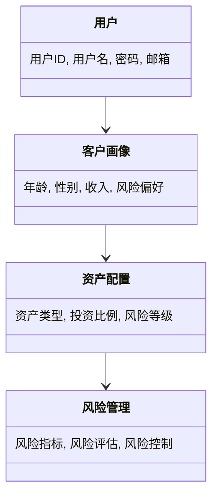
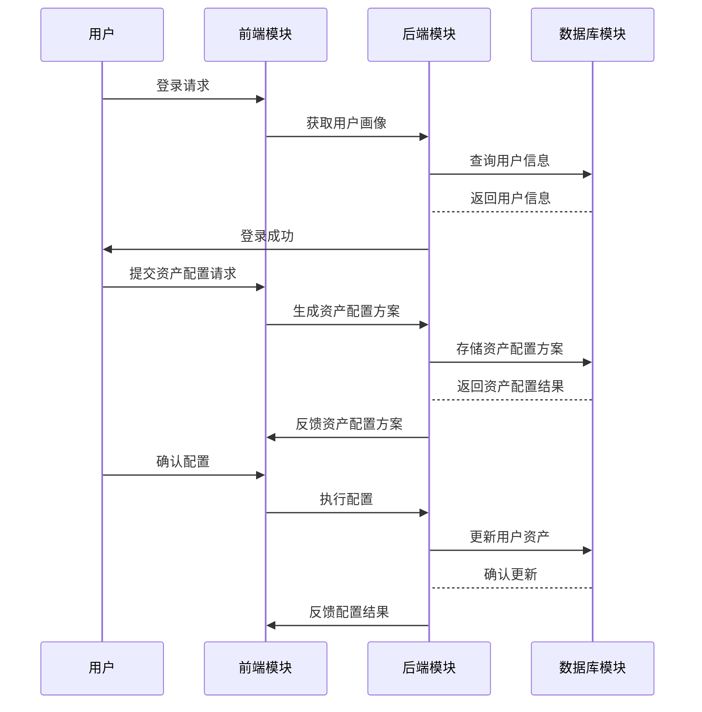

                 


# 展望金融AI应用的未来发展趋势与挑战

> **关键词**：人工智能、金融科技、金融创新、风险管理、智能投顾

> **摘要**：随着人工智能技术的飞速发展，金融行业正经历着前所未有的变革。本文将深入探讨AI技术在金融领域的应用现状，分析其核心技术与实现原理，并展望未来的发展趋势与挑战。通过具体案例分析，结合系统架构设计与项目实战，本文将为读者提供一个全面的视角，帮助其理解金融AI的应用前景与发展方向。

---

# 第一部分：金融行业数字化转型与AI应用背景

## 第1章：金融行业数字化转型概述

### 1.1 金融行业数字化转型的背景

#### 1.1.1 数字化转型的定义与内涵
数字化转型是指通过现代信息技术手段（如人工智能、大数据、云计算等）对传统金融业务进行重构和优化，以提升效率、降低成本并创造新的价值。数字化转型不仅仅是技术的升级，更是商业模式和业务流程的深刻变革。

#### 1.1.2 金融行业数字化转型的驱动因素
- **技术驱动**：AI、大数据、区块链等技术的快速发展为金融行业提供了新的工具和方法。
- **需求驱动**：客户对个性化、智能化金融服务的需求日益增长。
- **竞争驱动**：传统金融机构面临 fintech 公司的激烈竞争，数字化转型成为必然选择。

#### 1.1.3 数字化转型对金融行业的影响
- **效率提升**：通过自动化技术减少人工操作，提高业务处理效率。
- **成本降低**：智能化系统能够显著降低运营成本。
- **创新业务模式**：数字化转型催生了智能投顾、区块链金融等新兴业务。

### 1.2 AI技术在金融行业的应用现状

#### 1.2.1 人工智能技术的发展历程
人工智能技术经历了从专家系统到深度学习的演变，近年来，随着计算能力的提升和数据量的增加，深度学习技术在金融领域的应用越来越广泛。

#### 1.2.2 AI在金融行业的典型应用场景
- **风险管理**：利用AI技术进行信用评估、市场风险预测。
- **智能投顾**：通过AI算法为客户提供个性化的投资建议。
- **金融交易**：高频交易和算法交易中广泛运用AI技术。

#### 1.2.3 当前AI技术在金融行业的应用水平
- **技术成熟度**：部分领域（如智能投顾）已较为成熟，但仍有较大提升空间。
- **普及程度**：AI技术在大型金融机构中应用较为广泛，中小机构仍在探索阶段。

### 1.3 金融AI应用的未来发展趋势

#### 1.3.1 全球金融AI应用的发展趋势
- **技术融合**：AI、大数据、区块链等技术的融合将进一步推动金融创新。
- **智能化升级**：从自动化向智能化迈进，实现更复杂的业务场景。
- **生态化发展**：金融机构与科技公司合作将成为主流模式。

#### 1.3.2 中国金融AI应用的未来方向
- **政策支持**：中国政府大力支持金融科技发展，未来AI在金融领域的应用将更加广泛。
- **场景深化**：AI技术将更加深入地应用于具体业务场景，如智能风控、智能营销等。
- **数据驱动**：数据的价值将进一步被挖掘，推动AI技术在金融领域的深度应用。

#### 1.3.3 技术与业务结合的创新模式
- **技术创新**：AI技术将持续创新，推动金融业务模式变革。
- **业务创新**：金融机构将通过AI技术实现业务流程优化和产品创新。

### 1.4 本章小结

#### 1.4.1 本章核心观点回顾
本章从数字化转型的背景出发，分析了AI技术在金融行业的应用现状，并展望了未来的发展趋势。

#### 1.4.2 下一章内容预告
下一章将深入探讨AI技术在金融行业的核心应用领域，包括风险管理、智能投顾和金融交易等。

---

## 第2章：AI技术在金融行业的核心应用领域

### 2.1 金融风险管理中的AI应用

#### 2.1.1 风险管理的定义与重要性
风险管理是指通过识别、评估和应对各种风险，以确保金融业务的稳定运行。在数字化时代，AI技术为风险管理提供了新的解决方案。

#### 2.1.2 AI在信用评估中的应用
- **信用评分**：通过机器学习模型对客户信用进行评估。
- **风险预警**：利用深度学习技术预测客户违约风险。

#### 2.1.3 AI在市场风险中的应用
- **市场波动预测**：通过AI技术分析市场数据，预测市场波动。
- **投资组合优化**：利用AI算法优化投资组合，降低市场风险。

### 2.2 AI在智能投顾中的应用

#### 2.2.1 智能投顾的定义与特点
智能投顾是一种基于AI技术的自动化投资服务，能够根据客户需求提供个性化的投资建议。

#### 2.2.2 AI在资产配置中的应用
- **资产配置模型**：通过机器学习算法构建资产配置模型，实现最优投资组合。
- **动态调整**：根据市场变化实时调整投资策略。

#### 2.2.3 AI在客户行为分析中的应用
- **客户画像**：通过AI技术分析客户行为数据，构建客户画像。
- **个性化服务**：基于客户画像提供个性化投资建议。

### 2.3 AI在金融交易中的应用

#### 2.3.1 高频交易中的AI应用
- **高频交易算法**：通过AI技术实现毫秒级交易决策。
- **市场数据处理**：利用机器学习技术处理海量市场数据，提升交易效率。

#### 2.3.2 AI在算法交易中的应用
- **算法交易策略**：通过AI技术设计复杂的交易策略，实现自动化交易。
- **风险管理**：利用AI技术实时监控交易风险，确保交易安全。

#### 2.3.3 AI在交易策略优化中的应用
- **策略优化模型**：通过深度学习技术优化交易策略，提升交易收益。
- **市场预测**：利用AI技术预测市场趋势，指导交易决策。

### 2.4 本章小结

#### 2.4.1 本章核心内容总结
本章详细探讨了AI技术在金融风险管理、智能投顾和金融交易中的应用，分析了AI技术如何提升金融业务的效率和效果。

#### 2.4.2 下一章内容预告
下一章将深入分析金融AI应用的核心技术与实现原理，包括机器学习、深度学习和自然语言处理等技术在金融中的具体应用。

---

## 第3章：金融AI应用的核心技术与实现原理

### 3.1 机器学习在金融中的应用

#### 3.1.1 机器学习的定义与分类
机器学习是一种通过数据训练模型，使其能够从数据中学习并做出预测的技术。常见的机器学习算法包括监督学习、无监督学习和强化学习。

#### 3.1.2 监督学习在金融中的应用
- **回归分析**：用于预测股票价格、基金净值等连续型数据。
- **分类算法**：用于客户信用评分、欺诈检测等分类问题。

#### 3.1.3 无监督学习在金融中的应用
- **聚类分析**：用于客户分群、市场细分等场景。
- **异常检测**：用于识别异常交易行为、风险预警等。

### 3.2 深度学习在金融中的应用

#### 3.2.1 深度学习的定义与特点
深度学习是一种基于人工神经网络的机器学习技术，具有强大的特征提取能力和非线性建模能力。

#### 3.2.2 卷积神经网络在金融图像识别中的应用
- **图像识别**：用于识别金融文档中的文字、图表等信息。
- **模式识别**：用于识别交易模式、市场趋势等。

#### 3.2.3 循环神经网络在金融时间序列分析中的应用
- **时间序列预测**：用于预测股票价格、汇率波动等时间序列数据。
- **自然语言处理**：用于分析金融新闻、财报等文本数据。

### 3.3 自然语言处理在金融中的应用

#### 3.3.1 自然语言处理的定义与特点
自然语言处理（NLP）是一种使计算机能够理解、处理和生成人类语言的技术，广泛应用于金融文本分析、情感分析等领域。

#### 3.3.2 金融文本分析中的NLP应用
- **文本挖掘**：用于从金融新闻、财报中提取关键信息。
- **情感分析**：用于分析市场情绪，指导投资决策。

#### 3.3.3 金融对话系统中的NLP应用
- **智能客服**：通过NLP技术实现智能客服，提供个性化的金融服务。
- **语音识别**：用于金融交易中的语音指令识别。

### 3.4 本章小结

#### 3.4.1 本章核心内容总结
本章详细介绍了机器学习、深度学习和自然语言处理等核心技术在金融中的具体应用，分析了这些技术如何提升金融业务的智能化水平。

#### 3.4.2 下一章内容预告
下一章将从系统架构和项目实战的角度，探讨金融AI应用的实现过程和注意事项。

---

## 第4章：金融AI应用的系统分析与架构设计

### 4.1 问题场景介绍
本章将以一个智能投顾系统为例，探讨金融AI应用的系统架构设计。

#### 4.1.1 项目介绍
智能投顾系统旨在为客户提供个性化的投资建议，通过AI技术实现自动化资产配置和风险评估。

#### 4.1.2 系统功能设计
- **客户画像**：收集和分析客户信息，构建客户画像。
- **资产配置**：基于客户画像，生成个性化的资产配置方案。
- **风险管理**：实时监控市场风险，调整投资策略。

#### 4.1.3 系统架构设计
- **前端架构**：Web端和移动端界面设计。
- **后端架构**：API设计、服务调用流程。
- **数据存储**：数据库设计、数据交互流程。

#### 4.1.4 系统接口设计
- **API接口**：定义系统与其他模块的交互接口。
- **数据接口**：定义数据存储和传输的格式。

#### 4.1.5 系统交互设计
- **用户交互流程**：用户登录、注册、资产配置等流程。
- **系统反馈机制**：实时反馈用户操作结果。

### 4.2 系统架构设计

#### 4.2.1 领域模型类图


#### 4.2.2 系统架构图
```mermaid
serviceDiagram
    service 智能投顾系统 {
        service 前端模块 {
            operation 用户登录
            operation 资产配置请求
        }
        service 后端模块 {
            operation 获取客户画像
            operation 生成资产配置方案
        }
        service 数据库模块 {
            database 用户表
            database 资产配置表
        }
    }
```

#### 4.2.3 系统接口设计
- **API接口**：
  ```python
  def get_customer_profile(customer_id):
      # 获取客户画像
  def generate_asset_allocation(profile):
      # 生成资产配置方案
  ```

- **数据接口**：
  ```python
  # 数据格式
  {
      "customer_id": "123",
      "profile": {
          "age": 30,
          "income": 100000,
          "risk_preference": "moderate"
      }
  }
  ```

#### 4.2.4 系统交互流程


### 4.3 本章小结

#### 4.3.1 本章核心内容总结
本章通过智能投顾系统的案例，详细探讨了金融AI应用的系统架构设计，包括功能设计、接口设计和交互设计。

#### 4.3.2 下一章内容预告
下一章将通过项目实战，详细介绍金融AI应用的实现过程，包括环境安装、核心功能开发和案例分析。

---

## 第5章：金融AI应用的项目实战

### 5.1 环境安装与配置

#### 5.1.1 安装Python环境
```bash
python --version
pip install --upgrade pip
```

#### 5.1.2 安装必要的Python库
```bash
pip install numpy pandas scikit-learn tensorflow transformers
```

### 5.2 系统核心功能实现

#### 5.2.1 客户画像构建
```python
import pandas as pd
from sklearn.model

